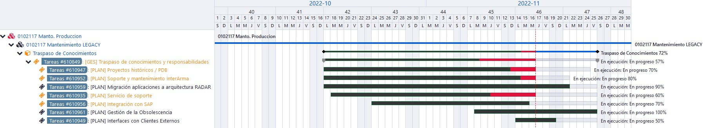

<!--
---
source: 20221115_TraspasoConocimientos.md
doc_source: 20221115_TraspasoConocimientos.docx
inserted: 2025-06-19T08:07:59.779234
---
-->

source: 20221115_TraspasoConocimientos.md | doc: 20221115_TraspasoConocimientos.docx | inserted: 2025-06-19T08:07:59.779234

# Seccion sin titulo 1
<!-- Fallback: sin correspondencia -->
> NOVIEMBRE 2022

PLAN DE TRANSFERENCIA DE

CONOCIMIENTOS

/[/*(

Confidencial Navantia

)/*/]

/[/*(

Navantia Confidential

)/*/]

**CONFIDENCIAL NAVANTIA**

ESTE DOCUMENTO Y LA INFORMACIÓN QUE CONTIENE SON PROPIEDAD DE NAVANTIA.

NO PUEDE SER REPRODUCIDO PARCIAL O TOTALMENTE NI DIVULGADO A TERCEROS

SIN AUTORIZACIÓN ESCRITA DE NAVANTIA. UNA VEZ FINALIZADA LA RAZÓN DE SU

TRANSFERENCIA, DEBERÁ SER DEVUELTO A NAVANTIA.

**NAVANTIA CONFIDENTIAL**

THIS DOCUMENT AND THE INFORMATION HEREIN IS PROPERTY OF NAVANTIA.

IT CANNOT BE PARTIALLY OR TOTALLY REPRODUCED NOR DISCLOSED TO THIRD

PARTIES WITHOUT WRITTEN PERMISSION FROM NAVANTIA. ONCE THE REASON FOR

WHICH IT WAS TRANSFERED IS OVER, IT MUST BE RETURNED TO NAVANTIA.

**INFORMACIÓN CLASIFICADA POR NAVANTIA**

### Objetivos del documento

> Con el siguiente documento se pretende reflejar, en rasgos generales,
> el traspaso de conocimientos que se está realizando hacia el actual
> equipo de trabajo.
>
> Siguiendo, como punto de partida, la reunión de informe de seguimiento
> de Mayo 2022, en la que se desglosaban las necesidades surgidas en el
> marco de los proyectos en curso, en relación a la salvaguarda de los
> activos, las necesidades de los clientes del programa Turco y a la
> tropicalización del programa Noruego, sumado a los nuevos
> requerimientos surgidos por efectos de la pandemia y las propuestas de
> modernización de los sistemas existentes, se han identificado diversos
> puntos que pasaremos a comentar a lo largo del presente documento.

### Servicio de soporte general

#### Descripción general

> Actualmente se está prestando servicio de soporte y mantenimiento a
> los usuarios que contactan con nosotros, debemos estar pendientes de
> las siguientes vías de comunicación:

- Service Desk

- Correo ⮚Teams

#### Situación actual

> La vía principal de soporte es el Service Desk de Navantia, pero
> algunas de las incidencias/solicitudes no quedan registradas en el
> sistema debido a que en algunos casos, las herramientas como el correo
> o el uso de Teams, hacen más fluida la comunicación y finalmente la
> resolución del incidente. Véase InterArma, solicitudes Información GD
> Históricos, servicios de correo e Interfaces con SAP, además de
> soporte propio a la DTI y terceros (Plexus/Accenture)

##### Necor@V6

- Resolviendo SD en cuanto a la solicitud constate de nuevos accesos al
  aplicativo. El uso es mayor por la necesidad de consulta de
  documentación base para los desarrollos de programas (buques) nuevos.

- Resolución de SD relacionadas con incidencias genéricas por
  obsolescencia de componentes para Visual Basic 6.

- Resolución de SD derivados del uso extendido de los módulos Taquillas
  y Pases de Vehículos críticos debido a la situación excepcional de
  covid.

- Alta de Personal para asignación de Taquillas. Nueva petición para
  integración SAP.

- Renovación constante de pases de vehículos. Alta demanda a finales de
  mes (pases mensuales) y a finales de año (pases anuales)

##### PDB

- Apoyo en la gestión de solicitudes de accesos a PDB

- Cargas a PDB de proyectos históricos

##### Clientes Externos

- Colapso por modificación masivas de Materiales desde SAP. Modificado
  de característica que afectó a los servicios de SAP y Nécora.

- Carga de Hojas Catálogo y Materiales con familias no tipadas aún en
  PDB. (tipo M)

- Revisión de procesos de carga diaria y por petición de usuarios tanto
  finales como de la DTI.

#### Transferencia de conocimientos

> Explicación de las herramientas actuales, como contactar y editar
> Service Desk, usuarios más frecuentes y sus tiempos de respuesta, se
> está realizando el soporte en conjunto.
>
> Se ha elaborado, y se está manteniendo, una lista de peticiones
> frecuentes y resolución de incidencias para disponer de una guía de
> solución y respuesta para cada uno de los casos más habituales o con
> previsión de que puedan surgir.

#### Responsables

- José Manuel Lago Varela

- BCK - Adrián García Riera

### Proyectos históricos / PDB

#### Descripción general

Servicio de apoyo a proyectos históricos de datos a PDB, a día de hoy
una serie de aplicaciones Legacy siguen en activo y necesitan de nuestra
atención para su mantenimiento y supervisión.

#### Situación actual

En consonancia con las solicitudes constantes de acceso a Necor@, desde
PDB se requiere del acceso a toda la documentación de programas como es
el Noruego, Australiano, F100, etc, ….

Además de la consulta de información, en algunos casos es necesaria la
revisión de información (Planos) debido a garantías aún vigentes (5º
BAM - 0537) o modernización de Programas (Tropicalización F310)

##### Necor@V6

- Garantizamos el correcto funcionamiento de las aplicaciones a través
  Citrix y desde equipos cliente.

- Actualmente se está dando soporte a las funcionalidades más en uso
  como son Taquillas, Pases de Vehículo y Gestión Herramental.

- La herramienta da accesibilidad a la información de consulta de datos
  históricos de cualquiera de las otras entidades (OOTT, Pedidos, etc)

#### Transferencia de conocimientos

##### Necor@V6

Parte del equipo actual ya ha desempañado mantenimiento y análisis de
esta aplicación y sus entidades, igualmente se hace una revisión, para
completar documentación, de la arquitectura actual (cliente servidor
Citrix), infraestructura (BBDD) o cómo realizar despliegues.

##### PDB

Conocimiento de la información histórica actual y revisión de la
información disponible en la aplicación, así como la infraestructura y
el negocio (BBDD DB2)

Traspaso de información del nuevo modelo de datos. (NecoraNet) Formación
y soporte en la utilidad de gestión de usuarios de PDB.

#### Responsables

- José Manuel Lago Varela

- BCK - Adrián García Riera

### Interfaces con Clientes Externos

#### Descripción general

Servicio de mantenimiento de los interfaces con clientes externos,
incluye el mantenimiento de programas activos, programas en
mantenimiento (F310 // Tropicalización) y programa base para nuevos
buques (F110).

#### Situación actual

Atendiendo procesos de carga masiva a través de JOBs y revisión de
notificaciones automáticas.

##### Ecadat

- Revisión de aplicativo, extracción, transformación y carga de
  información entre distintos sistemas JOBs y entornos (ETL).

**4.2.2 ETLs**

- Procesos de traspaso de información e PDB a cliente externo.
  (Australia, Noruega y Turquía)

##### Procesos manuales

> ⮚La carga de información conlleva la carga de Datos Maestros que, en
> algunos casos, requiere la intervención manual para este tipo de
> carga. Además de esto, se requiere también de un análisis para adaptar
> la información que tiene origen distinto a Necora como es el caso de
> WindChill/ProjectWise (Astillero San Fernando)

#### Transferencia de conocimientos

Se traslada la información necesaria con respecto a los componentes que
se desencadenan en la migración. Revisión de aplicativo, extracción,
transformación y carga de información entre distintos sistemas JOBs y
entornos (ETL).

Aprendizaje de los distintos flujos de negocio de la carga masiva de
Planos y de todas sus subentidades.

Servidores y bases de datos actuales, entornos de Test y Producción,
revisión de logs, etc, …

Revisión de proyecto de TFS con los componentes de carga (ETLs) de
información histórica.

Conocimientos en el traspaso de información de Gestión Documental tanto
de Necor@ como sistemas externos (WindChill/ProjectWise)

#### Responsables

- José Manuel Lago Varela

- BCK - Adrián García Riera

### Soporte y mantenimiento InterArma – Galia

#### Descripción general

Servicio de soporte y mantenimiento de los interfaces de comunicación de
InterArma - Galia Armada.

Este aplicativo sirve para la gestión de Varadas Programadas o
Reparaciones puntuales en los Buques (Cádiz, Ferrol, San Fernando,
Cartagena).

Aunque la aplicación tiene previsión de quedar obsoleta a corto plazo,
es posible que la carga de información se deba llevar a cabo, así como
la revisión o comprobación de información histórica.

Anexo a este aplicativo existe otro servicio Windows que se encarga de
gestionar de manera automática la comunicación entre la Armada y
Navantia (Galia)

#### Situación actual

##### InterArma

Tras la realización de todas las tareas adquiridas y desarrolladas a día
de hoy sólo se está dando soporte.

- Resolución de incidencias debido a desincronización de comunicaciones
  Armada-Navantia.

- Resolución de incidencias propias del aplicativo.

- Peticiones solicitadas por usuarios finales, como son, nuevas tarifas.

> Está previsto que InterArma deje de tener funcionalidad a día
> 31/12/2022

##### Comunicación sistema Armada – Galia

Se puede definir como un sistema de registro y notificación
complementario a InterArma para el registro automático de Presupuestos y
notificaciones a los actores, acorde al estado de estos presupuestos.

- Notificación en los cambios de estado de estos o incluso en el avance
  de los trabajos de reparaciones realizados ⮚Control y Monitorización
  en el envío/recepción.

- Resolución de incidencias en el envío/recepción. En comunicación
  constante con Navantia/Armada.

##### Línea de desarrollo

En proceso de desarrollo de mejora de funcionalidad, línea de desarrollo
Galia en la que se está realizando el traslado de toda la lógica actual
a un sistema de microservicios que mejore y facilite la trazabilidad y
mantenimiento de la herramienta.

La idea actual que se está siguiendo en la línea de desarrollo es la
creación de dos servicios independientes:

- Uno de ellos se encargará de revisar el correo y guardarlo con la
  posibilidad de escalarlo a más comunicaciones, no sólo la actual.

- Otro se encargaría de procesar la información registrada, pudiendo
  tener una mejor trazabilidad y escalabilidad.

#### Transferencia de conocimientos

Transferencia de conocimientos sobre incidencias // comunicaciones
comunes, se crea y mantiene una guía de solución a estas tareas.

Parte del equipo de trabajo ha colaborado estrechamente en el análisis
de lo que hay a día de hoy en funcionamiento para trasladar las
funcionalidades al nuevo desarrollo, por lo que ya se partía de un
amplio conocimiento de lo que hay a día de hoy.

#### Responsables

- Roberto Sanchís Martínez

- BCK - Sofía Casas López

### Integración con SAP

#### Descripción general

Servicio de mantenimiento de los interfaces con SAP de Necor@, PDB y
resto de aplicaciones del departamento como GOPYP

Sistema desarrollado a medida que funciona como un Message Broker (MQ)
que contiene una funcionalidad de entrada y otra de salida, guardado de
log, asegurado de información y reproceso de mensajes en caso de ser
necesario.

#### Situación actual

- Asegurar la comunicación de la información entre sistemas SAP y
  Necora/PDB.

- En contina comunicación con Navantia/Accenture para asegurar la
  confirmación de Integración y resolución a errores.

- Posibilidad de añadir a corto plazo más sistemas a la comunicación
  (Gopyp)

- Actualmente Gopyp requiere información concerniente a los
  Proyectos/Grafos por lo que se requiere de nuevos mantenimientos.

- Añadir más datos maestros de SAP como son las Hojas de Catálogo o
  Personal (Empleados)

- El uso de Datos Maestros en PDB y Gopyp hace necesario que cada vez se
  tenga más entidades actualizadas.

##### Línea de desarrollo

Para mejorar los mantenimientos, pruebas, resolución de errores; el
código actual de T-SQL (procedures) será migrado a C# para mantener una
única fuente de codificación, por lo que se migrará código de .Net FK
4.8 a .Net 5/6 con arquitectura de Microservicios

Estos microservicios contarán con la posibilidad de Dockerizar. Esto
abstraería estas app del SO con lo que los despliegues o cambios de
versión serían más sencillos, además de la posibilidad de despliegues en
servidores Linux. Además de esto, posibilita la traza de errores,
depuración de código y despliegues con menor impacto. Arquitectura
Microservicios es un tipo de metodología de desarrollo en la que muchas
empresa TIC desarrollo sus productos.

Se está iniciando un desarrollo de microservicio por entidad
(Materiales, Proveedores y Proyecto) que integre la mensajería, abriendo
la posibilidad de añadir un gestor de colas para que se consuma a través
de NecoraNet (sistema actual), GOPYP 4.0 u otros aplicativos.

Este planteamiento de arquitectura sería un siguiente paso en la mejora
de trazabilidad y escalabilidad de la aplicación, con esto queremos
decir que, si existen nuevas entidades para integrar en SAP, como
Empleados y Hojas de Catálogo, se podría dar una rápida respuesta y
además facilitaría el integrar otras aplicaciones que consuman esta
información.

#### Transferencia de conocimientos

El equipo de trabajo actual ya colaboró en parte del análisis de las
funcionalidades anteriores para la realización de esta migración
independientemente de eso se ha realizado un repaso a:

- Herramientas actuales, cómo contactar y editar Service Desk

- Traspaso de conocimientos del sistema actual, arquitectura BBDD,
  tablas, código fuente y herramientas usadas ⮚Funcionalidades de
  entornos de Test y Producción y realización de despliegues

#### Responsables

- Sofía Casas López

- BCK - Roberto Sanchís Martínez

### Migración de aplicaciones a arquitectura RADAR

**7.1 Descripción general**

Servicio de modernización de las aplicaciones Necor@ para migrarlas a
arquitectura RADAR asegurando su mantenibilidad.

#### Situación actual

Con el fin de unificar en una única app la gestión de procesos se está
realizando un análisis de esta arquitectura Radar para la posibilidad de
nuevos desarrollos. Actualmente PDB y EOLO están en uso de este tipo de
arquitectura.

Elaboración y mantenimiento de un manual y guía rápida para la creación
de proyectos en PDB usando Radar. Esta guía contiene una explicación
para poder crear y ejecutar proyectos en Radar, así como pasos a seguir
para integrar, depurar y testear.

Contribuir a dar un mejor soporte a usuarios finales y DTI en cuanto a
resolución de problemas tanto técnicos como lógicos (pe: ciclos de vida
de un plano)

Se están manteniendo reuniones frecuentes con DTI Navantia para la
presentación de proyecto en Test, pendiente de feedback por Navantia y
usuarios finales para mejora de procesos

##### Línea de desarrollo

Se está trasladando las funcionalidades más activas de Necor@V6 al
aplicativo NecoraNet con arquitectura Radar. Este traslado exige también
un modelo de datos nuevos y la migración de la información a NecoraNet.

Actualizando para Radar 3.0 con Entity Framework 6 y guía de despliegue
de aplicaciones, Script de BBDD y carga de información

A día de hoy se está en fase de entrega de Gestión de Taquillas y
Vestuarios y a futuro se pretende migrar las funcionalidades de Pases de
vehículo y Gestión Herramental

Junto a los puntos anteriores se actualizará la documentación ya
existente para que esté disponible tanto para Navantia como terceros.

#### Transferencia de conocimientos

Se comparten los conocimientos obtenidos sobre la aplicación de Radar
para poder seguir con las líneas de desarrollo de integración en esta
aplicación.

Conocimiento de la arquitectura y de los componentes cliente, servidor y
base de datos así como pasos para la realización de despliegues y
resolución de posibles incidentes relacionados con la aplicación.

Estudio de soluciones NecoraNet, código fuente TFS y lógica de negocio.

Se ha recibido formación impartida para Radar por Inetum para el
aprendizaje a nivel teórico/práctico de los desarrollos de
Radar/NecoraNet.

Se da una formación a mayores, con todo lo aprendido antes de la
formación oficial, y sobre cómo adaptar lo ya realizado a la
arquitectura y estructura común del código ya existente.

Con este base se comienza a modificar algunos desarrollos que se
enfocaron de forma distinta por no tener conocimiento completo de la
arquitectura.

Elaboración de guías rápidas y primeros pasos para los futuros correctos
desarrollos de cualquier funcionalidad necesaria.

#### Responsables

- Adrián García Riera

- BCK - José Manuel Lago Varela

### Gestión de la obsolescencia

#### Descripción general

Hay que estar pendientes de las actualizaciones y que no quede ningún
proyecto sin funcionalidad o con posibles brechas de seguridad por
caducidad en su soporte oficial.

#### Situación actual

##### Migración de Bases de Datos SQL Server

> Reducir el número de Motores SQL Server obsoletos o con riesgos de
> seguridad.
>
> Mínima versión SQL Server />= 2012.
>
> Base de datos de test para Proyectos con Clientes Externos (Australia,
> Noruega y Turquía).
>
> Base de datos de Producción para aplicativos como InterArma o Gestor
> de Notificaciones Galia.

##### Migración de aplicaciones para ejecutar en W10

> Evitar uso de SO con obsolescencia o sin soporte estableciendo
> versiones mínimas como son Windows 10 y Windows Server 2008.
>
> En proceso de migración de código existente en VSS (Visual Source
> Safe) a TFS y posibilidad de ejecutar aplicaciones desarrolladas en
> VB6 en equipos W10. Pendiente InterArma.

#### Transferencia de conocimientos

Estamos al tanto de estas situaciones y nos mantenemos muy pendientes de
las necesidades de migración o propuestas de soluciones actualizadas.

#### Responsables

- José Manuel Lago Varela

- BCK - Adrián García Riera

### Progreso actual en el ciclo de traspaso de conocimientos

**Plan de transferencia de conocimientos**

**Ref. TC_202211**

> 16
>
> **ANEXO I – Service Desk atendidos por los grupos relacionados con
> Necora/PDB desde enero del 2022**

**Plan de transferencia de conocimientos**

**Ref. TC_202211**

<table>
<colgroup>
<col style="width: 16%" />
<col style="width: 5%" />
<col style="width: 6%" />
<col style="width: 5%" />
<col style="width: 6%" />
<col style="width: 6%" />
<col style="width: 6%" />
<col style="width: 6%" />
<col style="width: 8%" />
<col style="width: 6%" />
<col style="width: 6%" />
<col style="width: 5%" />
<col style="width: 10%" />
</colgroup>
<thead>
<tr>
<th rowspan="2" style="text-align: left;"></th>
<th colspan="2" style="text-align: left;"><blockquote>

<strong>2022</strong>

</blockquote></th>
<th style="text-align: left;"></th>
<th style="text-align: left;"></th>
<th style="text-align: left;"></th>
<th style="text-align: left;"></th>
<th style="text-align: left;"></th>
<th style="text-align: left;"></th>
<th style="text-align: left;"></th>
<th style="text-align: left;"></th>
<th style="text-align: left;"></th>
<th rowspan="2" style="text-align: center;"><strong>Cuenta
2022</strong></th>
</tr>
<tr>
<th style="text-align: left;"><blockquote>

<strong>Ene</strong>

</blockquote></th>
<th style="text-align: left;"><strong>Feb</strong></th>
<th style="text-align: left;"><blockquote>

<strong>Mar</strong>

</blockquote></th>
<th style="text-align: left;"><strong>Abr</strong></th>
<th style="text-align: left;"><strong>May</strong></th>
<th style="text-align: left;"><strong>Jun</strong></th>
<th style="text-align: left;"><blockquote>

<strong>Jul</strong>

</blockquote></th>
<th style="text-align: left;"><strong>Ago</strong></th>
<th style="text-align: left;"><blockquote>

<strong>Sep</strong>

</blockquote></th>
<th style="text-align: left;"><strong>Oct</strong></th>
<th style="text-align: left;"><strong>Nov</strong></th>
</tr>
</thead>
<tbody>
<tr>
<td style="text-align: left;"><strong>Incidencia</strong></td>
<td style="text-align: left;"><blockquote>

<strong>29</strong>

</blockquote></td>
<td style="text-align: center;"><blockquote>

<strong>37</strong>

</blockquote></td>
<td style="text-align: left;"><blockquote>

<strong>35</strong>

</blockquote></td>
<td style="text-align: center;"><blockquote>

<strong>13</strong>

</blockquote></td>
<td style="text-align: center;"><blockquote>

<strong>15</strong>

</blockquote></td>
<td style="text-align: center;"><blockquote>

<strong>19</strong>

</blockquote></td>
<td style="text-align: center;"><blockquote>

<strong>7</strong>

</blockquote></td>
<td style="text-align: center;"><blockquote>

<strong>9</strong>

</blockquote></td>
<td style="text-align: center;"><blockquote>

<strong>19</strong>

</blockquote></td>
<td style="text-align: center;"><blockquote>

<strong>16</strong>

</blockquote></td>
<td style="text-align: left;"><blockquote>

<strong>11</strong>

</blockquote></td>
<td style="text-align: center;"><strong>210</strong></td>
</tr>
<tr>
<td style="text-align: left;"><strong>Solicitud</strong></td>
<td style="text-align: left;"><blockquote>

<strong>41</strong>

</blockquote></td>
<td style="text-align: center;"><blockquote>

<strong>29</strong>

</blockquote></td>
<td style="text-align: left;"><blockquote>

<strong>24</strong>

</blockquote></td>
<td style="text-align: center;"><blockquote>

<strong>26</strong>

</blockquote></td>
<td style="text-align: center;"><blockquote>

<strong>13</strong>

</blockquote></td>
<td style="text-align: center;"><blockquote>

<strong>32</strong>

</blockquote></td>
<td style="text-align: center;"><blockquote>

<strong>9</strong>

</blockquote></td>
<td style="text-align: center;"><blockquote>

<strong>11</strong>

</blockquote></td>
<td style="text-align: center;"><blockquote>

<strong>40</strong>

</blockquote></td>
<td style="text-align: center;"><blockquote>

<strong>36</strong>

</blockquote></td>
<td style="text-align: left;"><blockquote>

<strong>18</strong>

</blockquote></td>
<td style="text-align: center;"><strong>279</strong></td>
</tr>
<tr>
<td style="text-align: left;"><strong>Total general</strong></td>
<td style="text-align: left;"><blockquote>

<strong>70</strong>

</blockquote></td>
<td style="text-align: left;"><blockquote>

<strong>66</strong>

</blockquote></td>
<td style="text-align: left;"><blockquote>

<strong>59</strong>

</blockquote></td>
<td style="text-align: left;"><blockquote>

<strong>39</strong>

</blockquote></td>
<td style="text-align: left;"><blockquote>

<strong>28</strong>

</blockquote></td>
<td style="text-align: left;"><blockquote>

<strong>51</strong>

</blockquote></td>
<td style="text-align: left;"><blockquote>

<strong>16</strong>

</blockquote></td>
<td style="text-align: center;"><blockquote>

<strong>20</strong>

</blockquote></td>
<td style="text-align: left;"><blockquote>

<strong>59</strong>

</blockquote></td>
<td style="text-align: left;"><blockquote>

<strong>52</strong>

</blockquote></td>
<td style="text-align: left;"><blockquote>

<strong>29</strong>

</blockquote></td>
<td style="text-align: left;"><blockquote>

<strong>489</strong>

</blockquote></td>
</tr>
</tbody>
</table>

> 17
# Seccion sin titulo 1
<!-- Fallback: sin correspondencia -->

**Estado actuAL PLATAFORMA BBDD**

MAYO 2025

[1. Objeto del documento [5](#_Toc199209672)](#_Toc199209672)

[2. Descripción del sistema actual [6](#_Toc199209673)](#_Toc199209673)

[2.1. Núcleo HOSTDB2 (MASQL20171/HOSTDB2)
[7](#_Toc199209674)](#_Toc199209674)

[2.2. Plataforma Necor@ clásica (MASQL20142/SQL20142)
[7](#_Toc199209675)](#_Toc199209675)

[2.3. Plataforma Necor@ extendida (MASQL20142/NECORANET)
[7](#_Toc199209676)](#_Toc199209676)

[2.4. Clientes internacionales (SQL Server 2022)
[8](#_Toc199209677)](#_Toc199209677)

[2.5. Servicios intermedios (MASERVF9)
[8](#_Toc199209678)](#_Toc199209678)

[2.6. Flujos de carga y extracción [9](#_Toc199209679)](#_Toc199209679)

[3. Detalle técnico por servidor/instancia
[10](#_Toc199209680)](#_Toc199209680)

[3.1. MASQL20171/HOSTDB2 [10](#_Toc199209681)](#_Toc199209681)

[3.1.1. Características generales [10](#_Toc199209682)](#_Toc199209682)

[3.1.3. V6 y creación de V6_2 [11](#_Toc199209684)](#_Toc199209684)

[3.1.4. Antecedentes del proyecto HOST
[12](#_Toc199209685)](#_Toc199209685)

[3.1.5. Interfaces SSIS en entorno HOST consolidado (AWD/ALHD)
[14](#_Toc199209686)](#_Toc199209686)

[(a) Funciones de los Paquetes SSIS
[14](#funciones-de-los-paquetes-ssis)](#funciones-de-los-paquetes-ssis)

[(b) Características Técnicas
[14](#características-técnicas)](#características-técnicas)

[3.2. MASQL20142/SQL20142 – (MASQL20222)
[15](#_Toc199209689)](#_Toc199209689)

[3.2.1. Características generales [15](#_Toc199209690)](#_Toc199209690)

[3.2.2. Contexto y dependencias [15](#_Toc199209691)](#_Toc199209691)

[3.3. MASQL20142/NECORANET – (MASQL20222)
[17](#_Toc198809881)](#_Toc198809881)

[3.3.1. Características generales [17](#_Toc199209693)](#_Toc199209693)

[3.3.2. Contexto y dependencias [17](#_Toc199209694)](#_Toc199209694)

[3.4. MASQL20221/SQLTURK [19](#_Toc198809882)](#_Toc198809882)

[3.4.1. Características generales [19](#_Toc199209696)](#_Toc199209696)

[3.4.2. Contexto y dependencias [19](#_Toc199209697)](#_Toc199209697)

[3.5. MASQL20221/SQLNORWAY [20](#_Toc198809883)](#_Toc198809883)

[3.5.1. Características generales [20](#_Toc199209699)](#_Toc199209699)

[3.5.2. Contexto y dependencias [20](#_Toc199209700)](#_Toc199209700)

[3.6. MASERVF9 – (Antiguo MANECNET)
[22](#_Toc199209701)](#_Toc199209701)

[3.6.1. Características generales [22](#_Toc199209702)](#_Toc199209702)

[3.6.2. Funciones y contexto [23](#_Toc199209703)](#_Toc199209703)

[3.6.3. Cronología de migración y normalización
[23](#_Toc199209704)](#_Toc199209704)

[3.6.4. Incidencias y acciones correctivas principales
[23](#_Toc199209705)](#_Toc199209705)

[3.6.5. Lecciones aprendidas y recomendaciones
[24](#_Toc199209706)](#_Toc199209706)

[4. Arquitectura funcional del flujo F100
[25](#_Toc199209707)](#_Toc199209707)

[4.1. Origen de datos [26](#_Toc199209708)](#_Toc199209708)

[4.2. Interfaces de carga principales
[26](#_Toc199209709)](#_Toc199209709)

[4.3. Reglas de negocio y transformación
[27](#_Toc199209710)](#_Toc199209710)

[4.4. Consolidación y publicación de datos
[27](#_Toc199209711)](#_Toc199209711)

[4.4.1. Integración ampliada del modelo funcional – Foran /<-/>
Windchill /<-/> SAP [28](#_Toc199209712)](#_Toc199209712)

[4.5. Validación de calidad y revisión
[29](#_Toc199209713)](#_Toc199209713)

[4.6. Escenarios operativos [29](#_Toc199209714)](#_Toc199209714)

[4.7. Supervisión operativa y alertado
[30](#_Toc199209715)](#_Toc199209715)

[4.8. Consideraciones de mejora [30](#_Toc199209716)](#_Toc199209716)

[5. Calidad y riesgos actuales [31](#_Toc199209717)](#_Toc199209717)

[6. Próximos pasos recomendados [31](#_Toc199209718)](#_Toc199209718)

[7. Referencias internas y fuentes consultadas
[33](#_Toc199209719)](#_Toc199209719)

[**I.** Instancia: MASQL20142/NECORANET
[35](#_Toc199209720)](#_Toc199209720)

[**II.** Instancia: MASQL20142/SQL20142
[36](#_Toc199209721)](#_Toc199209721)

[**III.** Instancia: MASQL20171/HOSTDB2
[37](#_Toc199209722)](#_Toc199209722)

[**I.** Instancia: MASQL20171/HOSTDB2
[39](#instancia-masql20171hostdb2)](#instancia-masql20171hostdb2)

[**II.** Instancia: MASQL20142/NECORANET
[41](#instancia-masql20142necoranet)](#instancia-masql20142necoranet)

[**III.** Instancia: MASQL20221/SQLNORWAY
[42](#instancia-masql20221sqlnorway)](#instancia-masql20221sqlnorway)

[**IV.** Instancia: MASQL20221/SQLTURK
[42](#instancia-masql20221sqlturk)](#instancia-masql20221sqlturk)

1.  Objeto del documento

El presente documento tiene como objetivo describir el estado
tecnológico actual de la plataforma de bases de datos de Navantia. Esto
incluye un análisis detallado de componentes clave como NecoraNet, PRYC,
las instancias de SQL Server 2017-2022, los servicios IIS (MASERVF9) y
sus integraciones con SAP. Para ello, se llevará a cabo un inventario
exhaustivo que abarque servidores, instancias, bases de datos, enlaces y
flujos ETL.

La información recopilada se consolidará a partir de actas de proyecto,
tickets GLPI y seguimientos de dedicación hasta mayo de 2025,
proporcionando así una visión única, trazable y homologada que será de
utilidad para los equipos de DBA y la auditoría interna.

El resultado de este análisis servirá como línea base para el soporte
operativo diario y para la planificación de futuras optimizaciones o
migraciones, incluyendo Azure SQL MI, RISE with SAP, nuevos flujos ETL,
así como la migración progresiva a SQL Server 2022 y versiones
posteriores.

# 
<!-- Fallback: sin correspondencia -->

2.  Descripción del
    sistema actual

La arquitectura actual de bases de datos de Navantia, ilustrada en el
esquema proporcionado, presenta un ecosistema estructurado en instancias
de SQL Server. Estas instancias están distribuidas según su función y
ámbito geográfico, formando agrupaciones que representan entornos
lógicos orientados a servicios específicos, tales como producción,
catálogo, integración y almacenamiento histórico.

Los principales elementos son:

1.  Núcleo HOSTDB2
    (MASQL20171/HOSTDB2)

Esta instancia alberga las bases de datos **V6**, **V6_2** y **DB2P**,
herederas del entorno z/OS. HOSTDB2 centraliza información histórica
migrada desde el sistema HOST, actuando como fuente para múltiples
réplicas hacia otras instancias. Se alimenta mediante copias de
seguridad y mantiene relaciones directas con bases de datos de catálogo
y explotación, asegurando la integridad y disponibilidad de la
información histórica crítica.

2.  Plataforma Necor@
    clásica (MASQL20142/SQL20142)

Esta plataforma agrupa la base de datos **Necor@NC**, utilizada por
aplicaciones legadas como ECADAT y para la integración con **SAP** en la
gestión de hojas de catálogo y materiales. Su función principal es
servir como punto de entrada para datos técnicos (materiales,
ingeniería), que posteriormente se redistribuyen a otras instancias,
facilitando la interoperabilidad y el flujo de información entre
sistemas.

3.  Plataforma Necor@
    extendida (MASQL20142/NECORANET)

Este entorno funcional de AWD incluye bases de datos como
**NecoraDocAWD**, **InterfacesAWD_PEC**, **Necor@AWD** y
**NAI_InterfacesAWD**. Además, incorpora el servidor de informes
**REPORTSERVERSNECORANET**, que explota datos de todas las bases
anteriores e integra herramientas como Power BI y otras soluciones
internas. Desde esta instancia, se consolidan datos provenientes de
otras instancias a través del objeto **PDB**, que actúa como origen
común para clientes satélites y operaciones cruzadas, optimizando la
gestión y análisis de datos.

4.  Clientes
    internacionales (SQL Server 2022)

Las instancias **MASQL20221/SQLTURK** y **MASQL20221/SQLNORWAY** están
diseñadas específicamente para los contratos de Turquía y Noruega,
respectivamente, y albergan la base de datos **Necor@AWD**. Ambas
instancias consumen datos del objeto **PDB** y cuentan con procesos ETL
para la replicación, validación y extracción específica por proyecto.
Cada una de estas instancias opera de manera sincronizada gracias a
enlaces definidos, que incluyen copias de seguridad, servicios ETL y
replicaciones manuales, lo que permite mantener la consistencia y
trazabilidad de los datos. Este diseño modular refleja una arquitectura
evolutiva orientada a clientes distribuidos, aislando entornos según su
uso y país, y asegurando la adaptabilidad a requisitos locales.

5.  Servicios intermedios
    (MASERVF9)

## El servidor IIS 10, configurado como pasarela de integración entre SAP PO y SQL Server, actúa como intermediario en la comunicación de datos. Expone Web Services REST/SOAP que permiten a SAP consultar datos de materiales y recibir confirmaciones de manera segura. Se comunica directamente con HOSTDB2.V6 a través de ODBC y opera en un puerto fijo (58898), controlado por un firewall y validado por el departamento de Ciberseguridad.

## MASERVF9 es el host Windows Server 2019 (10.100.161.76) que reemplaza al antiguo MANECNET como punto único de integración SOAP entre SAP PO y Necor@. Desde noviembre de 2024, aloja:

# Seccion sin titulo 1
<!-- Fallback: sin correspondencia -->
**NAVANTIA**

Interfaces AWD-AHLD

<table>
<colgroup>
<col style="width: 19%" />
<col style="width: 52%" />
<col style="width: 10%" />
<col style="width: 2%" />
<col style="width: 15%" />
</colgroup>
<tbody>
<tr>
<td colspan="5" style="text-align: center;"><strong>CONTROL DE VERSIÓNS
E DISTRIBUCIÓN</strong></td>
</tr>
<tr>
<td style="text-align: center;">Nome do 
documento:</td>
<td style="text-align: center;">Navantia-Interfaces_AWD_AHLD.docx</td>
<td colspan="2" style="text-align: center;">Versión:</td>
<td style="text-align: center;">01.00</td>
</tr>
<tr>
<td style="text-align: center;">Codificación do documento:</td>
<td colspan="4" style="text-align: center;">DT-Documento de Trabajo</td>
</tr>
<tr>
<td style="text-align: center;">Elaborado por:</td>
<td style="text-align: center;">ALTIA</td>
<td style="text-align: center;">Data:</td>
<td colspan="2" style="text-align: center;">19/11/2019</td>
</tr>
<tr>
<td style="text-align: center;">Validado por:</td>
<td style="text-align: center;"></td>
<td style="text-align: center;">Data:</td>
<td colspan="2" style="text-align: center;"></td>
</tr>
<tr>
<td style="text-align: center;">Aprobado por:</td>
<td style="text-align: center;"></td>
<td style="text-align: center;">Data:</td>
<td colspan="2" style="text-align: center;"></td>
</tr>
</tbody>
</table>

|             |                           |                        |
|:-----------:|:-------------------------:|:----------------------:|
|             |  **REXISTRO DE CAMBIOS**  |                        |
| **Versión** | **Causa da nova versión** | **Data de aprobación** |
|    1.00     |      Versión inicial      |       19/11/2019       |
|             |                           |                        |
|             |                           |                        |
|             |                           |                        |
|             |                           |                        |
|             |                           |                        |

<table>
<colgroup>
<col style="width: 44%" />
<col style="width: 18%" />
<col style="width: 36%" />
</colgroup>
<tbody>
<tr>
<td colspan="3" style="text-align: center;"><strong>LISTA DE
DISTRIBUCIÓN <em>(opcional)</em></strong></td>
</tr>
<tr>
<td style="text-align: center;"><strong>Nome</strong></td>
<td style="text-align: center;"><strong>Número de copia</strong></td>
<td
style="text-align: center;"><strong>Área/Centro/Ubicación</strong></td>
</tr>
<tr>
<td style="text-align: center;"></td>
<td style="text-align: center;"></td>
<td style="text-align: center;"></td>
</tr>
<tr>
<td style="text-align: center;"></td>
<td style="text-align: center;"></td>
<td style="text-align: center;"></td>
</tr>
<tr>
<td style="text-align: center;"></td>
<td style="text-align: center;"></td>
<td style="text-align: center;"></td>
</tr>
<tr>
<td style="text-align: center;"></td>
<td style="text-align: center;"></td>
<td style="text-align: center;"></td>
</tr>
<tr>
<td style="text-align: center;"></td>
<td style="text-align: center;"></td>
<td style="text-align: center;"></td>
</tr>
<tr>
<td style="text-align: center;"></td>
<td style="text-align: center;"></td>
<td style="text-align: center;"></td>
</tr>
</tbody>
</table>

[1 PAQUETES 2005 - INTERFACES_AWD_ALHD_SSIS
[10](#paquetes-2005---interfaces_awd_alhd_ssis)](#paquetes-2005---interfaces_awd_alhd_ssis)

[1.1 Paquetes comunes [10](#paquetes-comunes)](#paquetes-comunes)

[1.1.1 /_AtributosConfig.dtsx
[10](#atributosconfig.dtsx)](#atributosconfig.dtsx)

[1.1.2 /_CompAtributosConfig.dtsx
[10](#compatributosconfig.dtsx)](#compatributosconfig.dtsx)

[1.1.3 /_LimpiarLogs.dtsx [10](#limpiarlogs.dtsx)](#limpiarlogs.dtsx)

[1.1.4 /_LimpiarLogs_EEA5.dtsx
[10](#limpiarlogs_eea5.dtsx)](#limpiarlogs_eea5.dtsx)

[1.1.5 /_StatusDeleted.dtsx
[10](#statusdeleted.dtsx)](#statusdeleted.dtsx)

[1.2 Anexos [16](#anexos)](#anexos)

[1.2.1 Anexos.dtsx [16](#anexos.dtsx)](#anexos.dtsx)

[1.3 Avisos [16](#avisos)](#avisos)

[1.3.1 Avisos_Rev_BO18SQ.dtsx
[16](#avisos_rev_bo18sq.dtsx)](#avisos_rev_bo18sq.dtsx)

[1.3.2 Avisos_Rev_NC17SQ.dtsx
[17](#avisos_rev_nc17sq.dtsx)](#avisos_rev_nc17sq.dtsx)

[1.3.3 Avisos_Rev_NC18SQ.dtsx
[17](#avisos_rev_nc18sq.dtsx)](#avisos_rev_nc18sq.dtsx)

[1.3.4 AWD1.TareasNuevosCOPIC.dtsx
[17](#awd1.tareasnuevoscopic.dtsx)](#awd1.tareasnuevoscopic.dtsx)

[1.3.5 Deshabilitar_Index.dtsx
[17](#deshabilitar_index.dtsx)](#deshabilitar_index.dtsx)

[1.4 Documentos_tecnicos
[18](#documentos_tecnicos)](#documentos_tecnicos)

[1.4.1 Documentos_tecnicos_NC10SQ.dtsx
[18](#documentos_tecnicos_nc10sq.dtsx)](#documentos_tecnicos_nc10sq.dtsx)

[1.4.2 Documentos_tecnicos_NC11SQ.dtsx
[21](#documentos_tecnicos_nc11sq.dtsx)](#documentos_tecnicos_nc11sq.dtsx)

[1.4.3 Documentos_tecnicos_NC12SQ.dtsx
[22](#documentos_tecnicos_nc12sq.dtsx)](#documentos_tecnicos_nc12sq.dtsx)

[1.4.4 Documentos_tecnicos_NC13SQ.dtsx
[23](#documentos_tecnicos_nc13sq.dtsx)](#documentos_tecnicos_nc13sq.dtsx)

[1.4.5 Documentos_tecnicos_NC14SQ.dtsx (origen es FESRV030)
[26](#documentos_tecnicos_nc14sq.dtsx-origen-es-fesrv030)](#documentos_tecnicos_nc14sq.dtsx-origen-es-fesrv030)

[1.4.6 Documentos_tecnicos_NC15SQ.dtsx
[26](#documentos_tecnicos_nc15sq.dtsx)](#documentos_tecnicos_nc15sq.dtsx)

[1.4.7 Documentos_tecnicos_NC16SQ.dtsx
[27](#documentos_tecnicos_nc16sq.dtsx)](#documentos_tecnicos_nc16sq.dtsx)

[1.4.8 Documentos_tecnicos_NC68SQ.dtsx (apunta a FESRV030)
[28](#documentos_tecnicos_nc68sq.dtsx-apunta-a-fesrv030)](#documentos_tecnicos_nc68sq.dtsx-apunta-a-fesrv030)

[1.5 Documentos_tecnicos_Prod
[29](#documentos_tecnicos_prod)](#documentos_tecnicos_prod)

[1.5.1 Documentos_tecnicos_Prod_NC30SQ.dtsx
[29](#documentos_tecnicos_prod_nc30sq.dtsx)](#documentos_tecnicos_prod_nc30sq.dtsx)

[1.5.2 Documentos_tecnicos_Prod_NC31SQ.dtsx
[30](#documentos_tecnicos_prod_nc31sq.dtsx)](#documentos_tecnicos_prod_nc31sq.dtsx)

[1.5.3 Documentos_tecnicos_Prod_NC32SQ.dtsx
[31](#documentos_tecnicos_prod_nc32sq.dtsx)](#documentos_tecnicos_prod_nc32sq.dtsx)

[1.5.4 Documentos_tecnicos_Prod_NC33SQ.dtsx
[32](#documentos_tecnicos_prod_nc33sq.dtsx)](#documentos_tecnicos_prod_nc33sq.dtsx)

[1.5.5 Documentos_tecnicos_Prod_NC34SQ.dtsx
[33](#documentos_tecnicos_prod_nc34sq.dtsx)](#documentos_tecnicos_prod_nc34sq.dtsx)

[1.5.6 Documentos_tecnicos_Prod_NC35SQ.dtsx
[34](#documentos_tecnicos_prod_nc35sq.dtsx)](#documentos_tecnicos_prod_nc35sq.dtsx)

[1.5.7 Documentos_tecnicos_Prod_NC36SQ.dtsx
[35](#documentos_tecnicos_prod_nc36sq.dtsx)](#documentos_tecnicos_prod_nc36sq.dtsx)

[1.5.8 Documentos_tecnicos_Prod_NC37SQ.dtsx
[36](#documentos_tecnicos_prod_nc37sq.dtsx)](#documentos_tecnicos_prod_nc37sq.dtsx)

[1.5.9 Documentos_tecnicos_Prod_NC38SQ.dtsx
[37](#documentos_tecnicos_prod_nc38sq.dtsx)](#documentos_tecnicos_prod_nc38sq.dtsx)

[1.5.10 Documentos_tecnicos_Prod_NC74SQ.dtsx
[39](#documentos_tecnicos_prod_nc74sq.dtsx)](#documentos_tecnicos_prod_nc74sq.dtsx)

[1.5.11 Documentos_tecnicos_Prod_NC75SQ.dtsx
[40](#documentos_tecnicos_prod_nc75sq.dtsx)](#documentos_tecnicos_prod_nc75sq.dtsx)

[1.6 Paquetes E [40](#paquetes-e)](#paquetes-e)

[1.6.1 EEA5.dtsx [40](#eea5.dtsx)](#eea5.dtsx)

[1.6.2 EEA5_DB2.dtsx [41](#eea5_db2.dtsx)](#eea5_db2.dtsx)

[1.6.3 Eliminar_deleted.dtsx
[41](#eliminar_deleted.dtsx)](#eliminar_deleted.dtsx)

[1.6.4 EXTRACT_ARBOL_MARCAS.dtsx
[41](#extract_arbol_marcas.dtsx)](#extract_arbol_marcas.dtsx)

[1.6.5 EXTRACT_CI_MF.dtsx
[41](#extract_ci_mf.dtsx)](#extract_ci_mf.dtsx)

[1.6.6 FinUpdatenotice.dtsx
[41](#finupdatenotice.dtsx)](#finupdatenotice.dtsx)

[1.7 Gestion_Documental [42](#gestion_documental)](#gestion_documental)

[1.7.1 Gestion_Documental_Documentos.dtsx
[42](#gestion_documental_documentos.dtsx)](#gestion_documental_documentos.dtsx)

[1.7.2 Gestion_Documental_Ficheros.dtsx
[42](#gestion_documental_ficheros.dtsx)](#gestion_documental_ficheros.dtsx)

[1.7.3 Gestion_Documental_RevisionesDocumento.dtsx
[47](#gestion_documental_revisionesdocumento.dtsx)](#gestion_documental_revisionesdocumento.dtsx)

[1.7.4 Gestion_Documental_RevisionesSeccion.dtsx
[48](#gestion_documental_revisionesseccion.dtsx)](#gestion_documental_revisionesseccion.dtsx)

[1.7.5 Gestion_Documental_SeccionesDocumento.dtsx
[49](#gestion_documental_seccionesdocumento.dtsx)](#gestion_documental_seccionesdocumento.dtsx)

[1.7.6 Gestion_Documental_tcAvisosRevision_Documentos.dtsx
[49](#gestion_documental_tcavisosrevision_documentos.dtsx)](#gestion_documental_tcavisosrevision_documentos.dtsx)

[1.7.7 Gestion_Documental_tcCodigos_Documentos.dtsx
[50](#gestion_documental_tccodigos_documentos.dtsx)](#gestion_documental_tccodigos_documentos.dtsx)

[1.7.8 Gestion_Documental_tcDocsOT_Documentos.dtsx
[50](#gestion_documental_tcdocsot_documentos.dtsx)](#gestion_documental_tcdocsot_documentos.dtsx)

[1.7.9 Gestion_Documental_tcOOTT_Documentos.dtsx
[50](#gestion_documental_tcoott_documentos.dtsx)](#gestion_documental_tcoott_documentos.dtsx)

[1.7.10 Gestion_Documental_trRevisionDocFichero.dtsx
[51](#gestion_documental_trrevisiondocfichero.dtsx)](#gestion_documental_trrevisiondocfichero.dtsx)

[1.7.11 Gestion_Documental_trRevisionDocRevisionSec.dtsx
[52](#gestion_documental_trrevisiondocrevisionsec.dtsx)](#gestion_documental_trrevisiondocrevisionsec.dtsx)

[1.7.12 Gestion_Documental_trRevisionSecFichero.dtsx
[53](#gestion_documental_trrevisionsecfichero.dtsx)](#gestion_documental_trrevisionsecfichero.dtsx)

[1.7.13 Gestion_Documental_Ubicaciones.dtsx
[54](#gestion_documental_ubicaciones.dtsx)](#gestion_documental_ubicaciones.dtsx)

[1.7.14 GestionDocumental_SituacionesRevisionDocumento.dtsx
[55](#gestiondocumental_situacionesrevisiondocumento.dtsx)](#gestiondocumental_situacionesrevisiondocumento.dtsx)

[1.7.15 GestionDocumental_SituacionesRevisionSeccion.dtsx
[55](#gestiondocumental_situacionesrevisionseccion.dtsx)](#gestiondocumental_situacionesrevisionseccion.dtsx)

[1.7.16 GestionDocumental_tcHojasCatalogo_Documentos.dtsx
[56](#gestiondocumental_tchojascatalogo_documentos.dtsx)](#gestiondocumental_tchojascatalogo_documentos.dtsx)

[1.7.17 Habilitar_Index.dtsx
[57](#habilitar_index.dtsx)](#habilitar_index.dtsx)

[1.7.18 InicioUpdatenotice.dtsx
[57](#inicioupdatenotice.dtsx)](#inicioupdatenotice.dtsx)

[1.7.19 INTERFACES_PRINCIPAL_EEA5.dtsx
[57](#interfaces_principal_eea5.dtsx)](#interfaces_principal_eea5.dtsx)

[1.8 Interfaces MEL [58](#interfaces-mel)](#interfaces-mel)

[1.8.1 MEL_LME_CATALOGO.dtsx
[58](#mel_lme_catalogo.dtsx)](#mel_lme_catalogo.dtsx)

[1.8.2 MEL_LME_EQUIPO_ELECTRICO.dtsx
[59](#mel_lme_equipo_electrico.dtsx)](#mel_lme_equipo_electrico.dtsx)

[1.8.3 MEL_LME_IDENTIFICADORES.dtsx
[59](#mel_lme_identificadores.dtsx)](#mel_lme_identificadores.dtsx)

[1.8.4 MEL_LME_LOCALES.dtsx
[59](#mel_lme_locales.dtsx)](#mel_lme_locales.dtsx)

[1.8.5 MEL_LME_PIEZAS.dtsx
[59](#mel_lme_piezas.dtsx)](#mel_lme_piezas.dtsx)

[1.8.6 MEL_LME_UBICACIONES.dtsx
[60](#mel_lme_ubicaciones.dtsx)](#mel_lme_ubicaciones.dtsx)

[1.9 Notas [60](#notas)](#notas)

[1.9.1 Notas.dtsx [60](#notas.dtsx)](#notas.dtsx)

[1.10 Ordenes [60](#ordenes)](#ordenes)

[1.10.1 Ordenes_BO10SQ.dtsx
[61](#ordenes_bo10sq.dtsx)](#ordenes_bo10sq.dtsx)

[1.10.2 Ordenes_BO11SQ.dtsx
[62](#ordenes_bo11sq.dtsx)](#ordenes_bo11sq.dtsx)

[1.10.3 Ordenes_BO12SQ.dtsx
[62](#ordenes_bo12sq.dtsx)](#ordenes_bo12sq.dtsx)

[1.10.4 Ordenes_BO13SQ.dtsx
[62](#ordenes_bo13sq.dtsx)](#ordenes_bo13sq.dtsx)

[1.10.5 Ordenes_BO14SQ.dtsx
[63](#ordenes_bo14sq.dtsx)](#ordenes_bo14sq.dtsx)

[1.10.6 Ordenes_BO15SQ.dtsx
[63](#ordenes_bo15sq.dtsx)](#ordenes_bo15sq.dtsx)

[1.10.7 Ordenes_BO16SQ.dtsx
[64](#ordenes_bo16sq.dtsx)](#ordenes_bo16sq.dtsx)

[1.10.8 Ordenes_BO40SQ.dtsx
[64](#ordenes_bo40sq.dtsx)](#ordenes_bo40sq.dtsx)

[1.10.9 Ordenes_BO41SQ.dtsx
[64](#ordenes_bo41sq.dtsx)](#ordenes_bo41sq.dtsx)

[1.10.10 Ordenes_BO42SQ.dtsx
[65](#ordenes_bo42sq.dtsx)](#ordenes_bo42sq.dtsx)

[1.10.11 Ordenes_BO43SQ.dtsx
[65](#ordenes_bo43sq.dtsx)](#ordenes_bo43sq.dtsx)

[1.10.12 Ordenes_BO47SQ.dtsx
[66](#ordenes_bo47sq.dtsx)](#ordenes_bo47sq.dtsx)

[1.10.13 Ordenes_BO59SQ.dtsx
[66](#ordenes_bo59sq.dtsx)](#ordenes_bo59sq.dtsx)

[1.10.14 Ordenes_BO61SQ.dtsx
[66](#ordenes_bo61sq.dtsx)](#ordenes_bo61sq.dtsx)

[1.10.15 Ordenes_BO67SQ.dtsx
[67](#ordenes_bo67sq.dtsx)](#ordenes_bo67sq.dtsx)

[1.11 Tablas_Apoyo [67](#tablas_apoyo)](#tablas_apoyo)

[1.11.1 Tablas_Apoyo_NC20SQ.dtsx
[67](#tablas_apoyo_nc20sq.dtsx)](#tablas_apoyo_nc20sq.dtsx)

[1.11.2 Tablas_Apoyo_NC20SQA.dtsx
[68](#tablas_apoyo_nc20sqa.dtsx)](#tablas_apoyo_nc20sqa.dtsx)

[1.11.3 Tablas_Apoyo_Tactividad.dtsx
[68](#tablas_apoyo_tactividad.dtsx)](#tablas_apoyo_tactividad.dtsx)

[1.11.4 Tablas_Apoyo_taIdiomas.dtsx
[68](#tablas_apoyo_taidiomas.dtsx)](#tablas_apoyo_taidiomas.dtsx)

[1.11.5 Tablas_Apoyo_taOrigenes.dtsx
[69](#tablas_apoyo_taorigenes.dtsx)](#tablas_apoyo_taorigenes.dtsx)

[1.11.6 Tablas_Apoyo_taTiposDocumento.dtsx
[69](#tablas_apoyo_tatiposdocumento.dtsx)](#tablas_apoyo_tatiposdocumento.dtsx)

[1.11.7 Tablas_Apoyo_taTiposEntidad.dtsx
[69](#tablas_apoyo_tatiposentidad.dtsx)](#tablas_apoyo_tatiposentidad.dtsx)

[1.11.8 Tablas_Apoyo_taTiposSeccion.dtsx
[69](#tablas_apoyo_tatiposseccion.dtsx)](#tablas_apoyo_tatiposseccion.dtsx)

[1.11.9 Tablas_Apoyo_TDESPRO.dtsx
[69](#tablas_apoyo_tdespro.dtsx)](#tablas_apoyo_tdespro.dtsx)

[1.11.10 Tablas_Apoyo_Tobras.dtsx
[69](#tablas_apoyo_tobras.dtsx)](#tablas_apoyo_tobras.dtsx)

[1.12 TBL [70](#tbl)](#tbl)

[1.12.1 TBL_B1_CONFIGURATION_ITEM.dtsx
[70](#tbl_b1_configuration_item.dtsx)](#tbl_b1_configuration_item.dtsx)

[1.12.2 TBL_B2_CI_CI.dtsx [71](#tbl_b2_ci_ci.dtsx)](#tbl_b2_ci_ci.dtsx)

[1.12.3 TBL_B3_CI_CI_APPLICABLITY.dtsx
[72](#tbl_b3_ci_ci_applicablity.dtsx)](#tbl_b3_ci_ci_applicablity.dtsx)

[1.12.4 TBL_B4_CI_COMPONENT.dtsx
[72](#tbl_b4_ci_component.dtsx)](#tbl_b4_ci_component.dtsx)

[1.12.5 TBL_B5_CI_DOCUMENT.dtsx
[73](#tbl_b5_ci_document.dtsx)](#tbl_b5_ci_document.dtsx)

[1.12.6 TBL_B6_CI_SA_SCHEDULED_AT.dtsx
[74](#tbl_b6_ci_sa_scheduled_at.dtsx)](#tbl_b6_ci_sa_scheduled_at.dtsx)

[1.12.7 TBL_B7_CI_COURSE.dtsx
[74](#tbl_b7_ci_course.dtsx)](#tbl_b7_ci_course.dtsx)

[1.12.8 TBL_B8_CI_OCCURRENCE.dtsx
[75](#tbl_b8_ci_occurrence.dtsx)](#tbl_b8_ci_occurrence.dtsx)

[1.12.9 TBL_B11_SERIAL_NO_DOCUMENT.dtsx
[76](#tbl_b11_serial_no_document.dtsx)](#tbl_b11_serial_no_document.dtsx)

[1.12.10 TBL_C1_COMPONENT.dtsx
[77](#tbl_c1_component.dtsx)](#tbl_c1_component.dtsx)

[1.12.11 TBL_C4_PART_NUMBER.dtsx
[77](#tbl_c4_part_number.dtsx)](#tbl_c4_part_number.dtsx)

[1.12.12 TBL_C5_COMPONENT_PART_NUMBER.dtsx
[78](#tbl_c5_component_part_number.dtsx)](#tbl_c5_component_part_number.dtsx)

[1.12.13 TBL_C8_HRMI_TD.dtsx
[78](#tbl_c8_hrmi_td.dtsx)](#tbl_c8_hrmi_td.dtsx)

[1.12.14 TBL_C9_HRMI_OCCURRENCE_CBD.dtsx
[79](#tbl_c9_hrmi_occurrence_cbd.dtsx)](#tbl_c9_hrmi_occurrence_cbd.dtsx)

[1.12.15 TBL_D1_DOCUMENT.dtsx
[80](#tbl_d1_document.dtsx)](#tbl_d1_document.dtsx)

[1.12.16 TBL_D2_DOCUMENT_IMAGES.dtsx
[81](#tbl_d2_document_images.dtsx)](#tbl_d2_document_images.dtsx)

[1.12.17 TBL_D3_TBL_DOCUMENT_APPLICABLITY.dtsx
[82](#tbl_d3_tbl_document_applicablity.dtsx)](#tbl_d3_tbl_document_applicablity.dtsx)

[1.12.18 TBL_E1_STANDARD_ACTIVITY.dtsx
[83](#tbl_e1_standard_activity.dtsx)](#tbl_e1_standard_activity.dtsx)

[1.12.19 TBL_E10_SA_INSTRUCTIONS.dtsx
[83](#tbl_e10_sa_instructions.dtsx)](#tbl_e10_sa_instructions.dtsx)

[1.12.20 TBL_E2_SA_APPLICABLITY.dtsx
[83](#tbl_e2_sa_applicablity.dtsx)](#tbl_e2_sa_applicablity.dtsx)

[1.12.21 TBL_E3_SA_SA.dtsx [84](#tbl_e3_sa_sa.dtsx)](#tbl_e3_sa_sa.dtsx)

[1.12.22 TBL_E4_SA_CI_AFFECTED.dtsx
[84](#tbl_e4_sa_ci_affected.dtsx)](#tbl_e4_sa_ci_affected.dtsx)

[1.12.23 TBL_E5_SA_COMPONENT.dtsx
[84](#tbl_e5_sa_component.dtsx)](#tbl_e5_sa_component.dtsx)

[1.12.24 TBL_E6_SA_REFERENCE_DOCUMENT.dtsx
[85](#tbl_e6_sa_reference_document.dtsx)](#tbl_e6_sa_reference_document.dtsx)

[1.12.25 TBL_E7_SA_CHECKLIST_STATEMENT.dtsx
[85](#tbl_e7_sa_checklist_statement.dtsx)](#tbl_e7_sa_checklist_statement.dtsx)

[1.12.26 TBL_E8_SCHEDULED_MAINTENANCE_TRIGGERS.dtsx
[85](#tbl_e8_scheduled_maintenance_triggers.dtsx)](#tbl_e8_scheduled_maintenance_triggers.dtsx)

[1.12.27 TBL_E9_SCHEDULED_MAINTENANCE_APPLICABLITY.dtsx
[86](#tbl_e9_scheduled_maintenance_applicablity.dtsx)](#tbl_e9_scheduled_maintenance_applicablity.dtsx)

[1.12.28 TBL_F1_COURSE.dtsx
[86](#tbl_f1_course.dtsx)](#tbl_f1_course.dtsx)

[1.12.29 TBL_F2_COURSE_COMPONENT.dtsx
[87](#tbl_f2_course_component.dtsx)](#tbl_f2_course_component.dtsx)

[1.12.30 TBL_F3_COURSE_DOCUMENT.dtsx
[88](#tbl_f3_course_document.dtsx)](#tbl_f3_course_document.dtsx)

[1.13 T_DB [89](#t_db)](#t_db)

[1.13.1 T_BD_CABADD [89](#t_bd_cabadd)](#t_bd_cabadd)

[1.13.2 T_BD_CABBORR [89](#t_bd_cabborr)](#t_bd_cabborr)

[1.13.3 T_BD_CABLES [89](#t_bd_cables)](#t_bd_cables)

[1.13.4 T_BD_CONEXIONADO [89](#t_bd_conexionado)](#t_bd_conexionado)

[1.13.5 T_BD_EQUIPOS [90](#t_bd_equipos)](#t_bd_equipos)

[1.13.6 T_BD_INDICCAB [90](#t_bd_indiccab)](#t_bd_indiccab)

[1.13.7 T_BD_NOTAS_CONEX [90](#t_bd_notas_conex)](#t_bd_notas_conex)

[1.13.8 T_BD_PCONTROL [90](#t_bd_pcontrol)](#t_bd_pcontrol)

[1.13.9 T_BD_RUTA [91](#t_bd_ruta)](#t_bd_ruta)

[1.13.10 T_BD_RUTBLOQ [91](#t_bd_rutbloq)](#t_bd_rutbloq)

[1.13.11 T_DB_C_E_CabAdd [91](#t_db_c_e_cabadd)](#t_db_c_e_cabadd)

[1.13.12 T_DB_C_E_CabDel [91](#t_db_c_e_cabdel)](#t_db_c_e_cabdel)

[1.13.13 T_DB_C_E_Cables [92](#t_db_c_e_cables)](#t_db_c_e_cables)

[1.13.14 T_DB_C_E_Connections
[92](#t_db_c_e_connections)](#t_db_c_e_connections)

[1.13.15 T_DB_C_E_Equipment
[93](#t_db_c_e_equipment)](#t_db_c_e_equipment)

[1.13.16 T_DB_C_E_Notes [93](#t_db_c_e_notes)](#t_db_c_e_notes)

[1.13.17 T_DB_C_SC_CabAdd [93](#t_db_c_sc_cabadd)](#t_db_c_sc_cabadd)

[1.13.18 T_DB_C_SC_CabDel [93](#t_db_c_sc_cabdel)](#t_db_c_sc_cabdel)

[1.13.19 T_DB_C_SC_Cables [94](#t_db_c_sc_cables)](#t_db_c_sc_cables)

[1.13.20 T_DB_C_SC_Connections
[95](#t_db_c_sc_connections)](#t_db_c_sc_connections)

[1.13.21 T_DB_C_SC_Equipment
[95](#t_db_c_sc_equipment)](#t_db_c_sc_equipment)

[1.13.22 T_DB_C_SC_Notes [96](#t_db_c_sc_notes)](#t_db_c_sc_notes)

[1.13.23 T_DB_R_E_CabAdd [96](#t_db_r_e_cabadd)](#t_db_r_e_cabadd)

[1.13.24 T_DB_R_E_CabDel [96](#t_db_r_e_cabdel)](#t_db_r_e_cabdel)

[1.13.25 T_DB_R_E_Cables [97](#t_db_r_e_cables)](#t_db_r_e_cables)

[1.13.26 T_DB_R_E_Equipment
[97](#t_db_r_e_equipment)](#t_db_r_e_equipment)

[1.13.27 T_DB_R_E_Route [98](#t_db_r_e_route)](#t_db_r_e_route)

[1.13.28 T_DB_R_E_ROUTEBLOCK
[98](#t_db_r_e_routeblock)](#t_db_r_e_routeblock)

[1.13.29 T_DB_R_SC_CabAdd [98](#t_db_r_sc_cabadd)](#t_db_r_sc_cabadd)

[1.13.30 T_DB_R_SC_CabDel [99](#t_db_r_sc_cabdel)](#t_db_r_sc_cabdel)

[1.13.31 T_DB_R_SC_Cables [99](#t_db_r_sc_cables)](#t_db_r_sc_cables)

[1.13.32 T_DB_R_SC_Equipment
[99](#t_db_r_sc_equipment)](#t_db_r_sc_equipment)

[1.13.33 T_DB_R_SC_Route [100](#t_db_r_sc_route)](#t_db_r_sc_route)

[1.13.34 T_DB_R_SC_ROUTEBLOCK
[100](#t_db_r_sc_routeblock)](#t_db_r_sc_routeblock)

[1.13.35 T_DBCatal [100](#t_dbcatal)](#t_dbcatal)

[1.13.36 T_DBDesign [101](#t_dbdesign)](#t_dbdesign)

[1.13.37 T_DBLme [101](#t_dblme)](#t_dblme)

[1.13.38 T_DBLocal [101](#t_dblocal)](#t_dblocal)

[1.13.39 T_DBPcontrol [101](#t_dbpcontrol)](#t_dbpcontrol)

