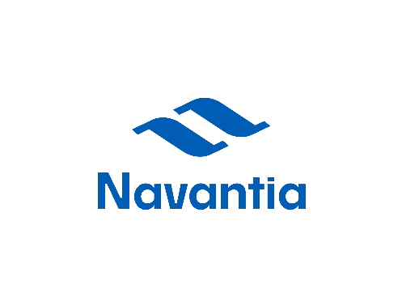
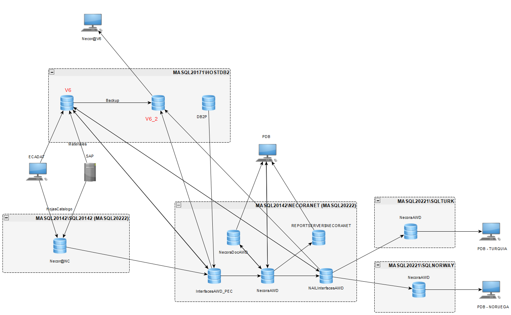

<!--
---
source: EstadoActualPlataformaBBD_V27_3_42.md
doc_source: EstadoActualPlataformaBBD_V27_3_42.docx
inserted: 2025-06-18T23:14:04.907866
---
-->

source: EstadoActualPlataformaBBD_V27_3_42.md | doc: EstadoActualPlataformaBBD_V27_3_42.docx | inserted: 2025-06-18T23:14:04.907866

# Seccion sin titulo 1
<!-- Fallback: sin correspondencia -->

**Estado actuAL PLATAFORMA BBDD**

MAYO 2025

# 
<!-- Fallback: sin correspondencia -->

2.  Descripción del
    sistema actual

La arquitectura actual de bases de datos de Navantia, ilustrada en el
esquema proporcionado, presenta un ecosistema estructurado en instancias
de SQL Server. Estas instancias están distribuidas según su función y
ámbito geográfico, formando agrupaciones que representan entornos
lógicos orientados a servicios específicos, tales como producción,
catálogo, integración y almacenamiento histórico.

Los principales elementos son:

1.  Núcleo HOSTDB2
    (MASQL20171/HOSTDB2)

Esta instancia alberga las bases de datos **V6**, **V6_2** y **DB2P**,
herederas del entorno z/OS. HOSTDB2 centraliza información histórica
migrada desde el sistema HOST, actuando como fuente para múltiples
réplicas hacia otras instancias. Se alimenta mediante copias de
seguridad y mantiene relaciones directas con bases de datos de catálogo
y explotación, asegurando la integridad y disponibilidad de la
información histórica crítica.

2.  Plataforma Necor@
    clásica (MASQL20142/SQL20142)

Esta plataforma agrupa la base de datos **Necor@NC**, utilizada por
aplicaciones legadas como ECADAT y para la integración con **SAP** en la
gestión de hojas de catálogo y materiales. Su función principal es
servir como punto de entrada para datos técnicos (materiales,
ingeniería), que posteriormente se redistribuyen a otras instancias,
facilitando la interoperabilidad y el flujo de información entre
sistemas.

3.  Plataforma Necor@
    extendida (MASQL20142/NECORANET)

Este entorno funcional de AWD incluye bases de datos como
**NecoraDocAWD**, **InterfacesAWD_PEC**, **Necor@AWD** y
**NAI_InterfacesAWD**. Además, incorpora el servidor de informes
**REPORTSERVERSNECORANET**, que explota datos de todas las bases
anteriores e integra herramientas como Power BI y otras soluciones
internas. Desde esta instancia, se consolidan datos provenientes de
otras instancias a través del objeto **PDB**, que actúa como origen
común para clientes satélites y operaciones cruzadas, optimizando la
gestión y análisis de datos.

4.  Clientes
    internacionales (SQL Server 2022)

Las instancias **MASQL20221/SQLTURK** y **MASQL20221/SQLNORWAY** están
diseñadas específicamente para los contratos de Turquía y Noruega,
respectivamente, y albergan la base de datos **Necor@AWD**. Ambas
instancias consumen datos del objeto **PDB** y cuentan con procesos ETL
para la replicación, validación y extracción específica por proyecto.
Cada una de estas instancias opera de manera sincronizada gracias a
enlaces definidos, que incluyen copias de seguridad, servicios ETL y
replicaciones manuales, lo que permite mantener la consistencia y
trazabilidad de los datos. Este diseño modular refleja una arquitectura
evolutiva orientada a clientes distribuidos, aislando entornos según su
uso y país, y asegurando la adaptabilidad a requisitos locales.

5.  Servicios intermedios
    (MASERVF9)

## El servidor IIS 10, configurado como pasarela de integración entre SAP PO y SQL Server, actúa como intermediario en la comunicación de datos. Expone Web Services REST/SOAP que permiten a SAP consultar datos de materiales y recibir confirmaciones de manera segura. Se comunica directamente con HOSTDB2.V6 a través de ODBC y opera en un puerto fijo (58898), controlado por un firewall y validado por el departamento de Ciberseguridad.

## MASERVF9 es el host Windows Server 2019 (10.100.161.76) que reemplaza al antiguo MANECNET como punto único de integración SOAP entre SAP PO y Necor@. Desde noviembre de 2024, aloja:

## Web Service NecoraWebIntegrator.svc — expuesto en IIS 10, puerto 80.

## Carpetas de intercambio NecoraSAP/Request/|Response con permisos NTFS equivalentes a los de MANECNET.

## Cliente SQL Native 11 para conectividad con MASQL20171/HOSTDB2 .

- Agente de monitorización Centreon (plantilla *IIS 10*).

- Repositorio de archivos de ingeniería y producción.

Este servidor concentra ahora los flujos M-AT (*SetInfoMateriales*) y
Login, que sincronizan el material maestro entre SAP y la base **V6**.
Su consolidación elimina dependencias de hardware obsoleto y simplifica
la matriz del firewall corporativo, mejorando la eficiencia operativa y
la seguridad de las comunicaciones.

.

1.  Flujos de carga y
    extracción

El sistema de bases de datos de Navantia incorpora una serie de
**paquetes SSIS** (SQL Server Integration Services), **planificaciones
de SQL Server Agent** y validaciones CRC (Control de Redundancia
Cíclica) que aseguran la integridad en cada operación de lectura, carga
o replicación de datos. Estos flujos están cuidadosamente definidos
según el país, cliente y uso funcional, abarcando tareas como la
generación de informes, procesos ETL nocturnos y la sincronización de
catálogos.

Cada flujo es auditado mediante registros detallados (logs) y
comprobaciones periódicas, lo que permite una supervisión continua y la
capacidad de identificar y resolver rápidamente cualquier anomalía que
pueda surgir.

## El modelo de datos actual se caracteriza por su arquitectura modular, desacoplada y orientada al cliente . Esta estructura permite la existencia de instancias dedicadas por función, país o sistema fuente, lo que garantiza una trazabilidad completa desde el origen en SAP hasta la entrega final en Necor@. Esta orientación modular no solo facilita la gestión y el mantenimiento del sistema, sino que también asegura que las necesidades específicas de cada cliente y región sean atendidas de manera eficiente y efectiva.

3.  Detalle técnico por
    servidor/instancia

    1.  MASQL20171/HOSTDB2

La instancia MASQL20171/HOSTDB2 funciona como el **nodo central de
consolidación** tras el apagado del entorno HOST (DB2/VSAM).
Implementada sobre SQL Server 2017 CU31, concentra todas las bases de
datos migradas desde el ecosistema mainframe, así como los esquemas
técnicos heredados de instancias auxiliares como FESRV014 y MAHOST.

1.  Características
    generales

**Rol:** Nodo central de consolidación tras el apagado del entorno HOST
(DB2/VSAM)  
**Versión:** SQL Server 2017 CU31.  
**Bases de datos:** V6, V6_2, DB2T, DB2P  
**Conexiones entrantes:**

- MASERVF9 (vía ODBC desde IIS/WebService)

- MASQL20142/NECORANET (lectura cruzada)

- Objeto PDB (consulta y consolidación de datos)

**Conexiones salientes:** Réplicas parciales y flujos ETL hacia
NecoraNet, SQLTURK y SQLNORWAY.  
**Parámetros relevantes:**

- Puerto TCP fijo 58898 (asignado en nov. 2024, validado por
  Ciberseguridad)

- Compresión de datos tipo ROW

- Collation: SQL_Latin1_General_CP1_CI_AS

**Cambios recientes:** Generación de la copia V6_2.

Esta instancia proporciona datos operativos y documentales a múltiples
servicios de negocio, incluyendo SAP, Necor@NET y reporting externo. Los
procesos de carga, validación e indexado están diseñados para garantizar
estabilidad, trazabilidad y rendimiento.

1.  Contenido migrado

MASQL20171/HOSTDB2 almacena la información consolidada desde tres
orígenes principales:

| **Origen** | **Destino en SQL Server** | **Descripción** |
|:---|:---|:---|
| HOST DB2 | DB2T / DB2P | Copia exacta de tablas fuente dentro del alcance. Carga vía paquete MoveDataDB2ToSQLServer. |
| FESRV014 | HOSTDB2 (diversos esquemas) | Bases de datos ControlDoc, ControlAsuntos, etc. Job: MoveAppAuxToNewNecor@. |
| MAHOST | HOSTDB2.DB2T (esquema a esquema) | Bases DBFERR, DBCART, DBMADR, DBSFER. Job: PackageMAHOST_a_DB2T.dtsx. |

2.  V6 y creación de V6_2

La base de datos V6 contiene los datos de **Necor@V6** tras la
migración. Durante el proceso, se detectó que algunas vistas aplicaban
filtros que impedían consultar el histórico completo desde Necor@. Para
solucionarlo:

- Se creó la base V6_2, réplica exacta de V6 sin filtros de migración.

- Se generaron nuevas vistas /_V sobre V6_2.

- Se reemplazaron los sinónimos en V6 para que apunten a estas vistas no
  filtradas.

- Las vistas originales se renombraron como /_BKP para permitir
  comparativas de rendimiento.

- Se reforzaron índices en tablas clave (BO12SQ, BO59SQ, BO80SQ, etc.) y
  se revisaron procedimientos (PR_NC_CONSULTA_OPERACIONES, etc.).

Esta estrategia permite que **Necor@V6 acceda al histórico completo sin
afectar al código existente**, manteniendo la trazabilidad y cumpliendo
requerimientos funcionales de Ingeniería y Auditoría.

.

1.  Antecedentes del
    proyecto HOST

El proyecto HOST se concibió como una iniciativa de migración y
mantenimiento de los sistemas legacy (DB2/VSAM), gestionándose bajo un
modelo mixto que combina soporte y transferencia de conocimiento. En
colaboración con Altia Consultores, se llevaron a cabo tareas de
mantenimiento correctivo y adaptativo, así como procesos de migración
escalonada.

Esta colaboración se alineó con las prácticas ITIL y los estándares
ISO/IEC 20000, estableciendo una infraestructura de servicio que incluyó
indicadores de calidad (SLA), herramientas de gestión, dedicación de
recursos y mecanismos de seguimiento tanto semanal como mensual. Además,
se garantizó una cobertura integral sobre aplicaciones críticas (Necora,
Coral, ControlDoc, Brion, entre otras) mediante soporte de tercer nivel
y supervisión de procesos en explotación.

El acuerdo contemplaba una planificación detallada de proyectos,
atención 24x7 para casos críticos y controles de calidad periódicos. Se
documentaron procedimientos para el análisis y resolución de incidentes,
gestión de problemas y planificación de desarrollos, lo que permitió
asegurar la continuidad del servicio durante la migración al entorno SQL
Server (MASQL20171/HOSTDB2) sin pérdida de operatividad.

El proyecto de migración HOST se inició el **12 de septiembre de 2019**
y se estructuró en dos fases:

- **Fase I – Migración técnica:** de septiembre de 2019 a julio de 2020.

- **Fase II – Soporte y cierre definitivo:** de julio a diciembre de
  2020.

