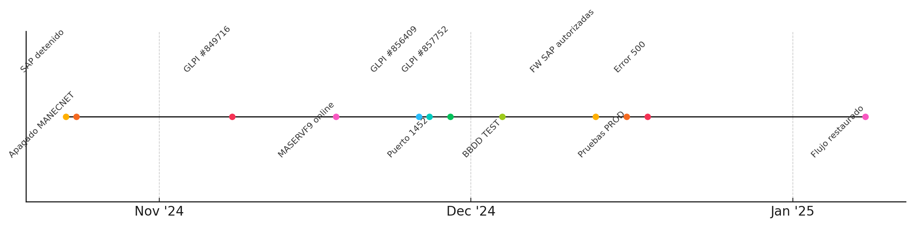
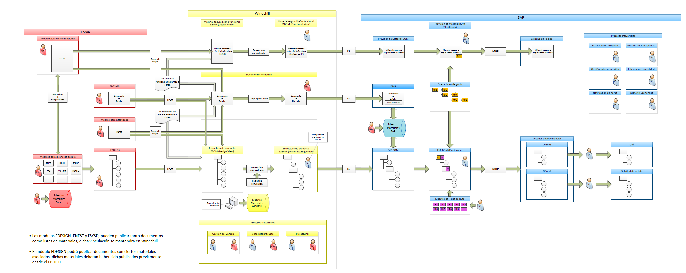

<!--
---
source: EstadoActualPlataformaBBD_V27_3_42.md
doc_source: EstadoActualPlataformaBBD_V27_3_42.docx
inserted: 2025-06-18T23:14:04.898870
---
-->

source: EstadoActualPlataformaBBD_V27_3_42.md | doc: EstadoActualPlataformaBBD_V27_3_42.docx | inserted: 2025-06-18T23:14:04.898870

# InterfacesAWD_PEC: Utilizada como puente para el traspaso de información entre sistemas.

- **NAI_InterfacesAWD:** Base de datos intermedia que centraliza datos
  de origen para su derivación hacia instancias externas.

  1.  MASQL20221/SQLTURK

Instancia SQL Server 2022 CU8 dedicada a la gestión de contratos
específicos para Turquía, operando de forma autónoma dentro del
ecosistema Necor@AWD para garantizar segregación funcional y geográfica.

1.  Características
    generales

- **Rol:** Instancia internacional dedicada a contratos Turquía.

- **Versión:** SQL Server 2022 CU8.

- **Bases de datos:** Necor@AWD.

- **Conexiones entrantes:** Réplicas desde PDB (NECORANET).

- **Conexiones salientes:** Flujos ETL hacia cliente, reporting
  específico.

- **Parámetros relevantes:** Compresión de columnas, alertas
  personalizadas SQL Agent.

- **Cambios recientes:**

  - Despliegue inicial y validación funcional completada (2025Q1).

  - Implementación de ETL segregado por región.

  - Control de errores y lógica de CRC en flujos nocturnos.

    1.  Contexto y
        dependencias

Esta instancia está destinada exclusivamente a la gestión y explotación
de datos relacionados con contratos de Turquía, integrando su propia
copia de Necor@AWD para operar con independencia y garantizar la
seguridad y el aislamiento requerido.

La alimentación de datos se realiza mediante flujos ETL diarios que
replican información desde el objeto PDB alojado en NECORANET. Los
procesos incorporan validaciones de integridad basadas en CRC (Control
de Redundancia Cíclica), junto con mecanismos personalizados de
trazabilidad y notificación para la detección y gestión de errores.

El diseño de esta instancia persigue asegurar la segregación funcional y
geográfica, respondiendo a los requerimientos contractuales en materia
de aislamiento de datos, soporte técnico y control de accesos.

Actualmente, la base de datos que alimenta el PDB de Turquía está en
fase de migración, con vistas al apagado progresivo de la instancia
legacy MASQL2014/SQLTURK.

1.  MASQL20221/SQLNORWAY

Instancia SQL Server 2022 CU8 orientada a la gestión y soporte de
proyectos en Noruega, diseñada para operar con independencia mediante
réplicas desde el PDB general.

1.  Características
    generales

- **Rol:** Instancia internacional para proyectos Noruega.

- **Versión:** SQL Server 2022 CU8.

- **Bases de datos:** Necor@AWD.

- **Conexiones entrantes:** Réplicas desde PDB.

- **Conexiones salientes:** Power BI Service, validación en Azure VDI.

- **Parámetros relevantes:** Configuración híbrida con prevalidación CRC
  y staging.

- **Cambios recientes:**

  - Flujo ETL activo desde abril 2024, con carga de 2.1 millones de
    registros en 35 minutos.

  - Estrategia de validación cruzada de claves y agrupadores desde
    Coral.

  - Consola de trazabilidad de cargas entregada a Reporting/Navantia en
    mayo 2025.

    1.  Contexto y
        dependencias

Esta instancia, basada en SQL Server 2022, da soporte a proyectos
desplegados en Noruega y contiene su propia versión de Necor@AWD.
Replica los datos de forma independiente desde el PDB general,
asegurando autonomía y seguridad en la gestión de información.

El flujo ETL, pionero en validación completa, incorpora trazabilidad
end-to-end desde las fuentes Coral hasta la explotación en Power BI,
pasando por etapas de staging, validación y carga incremental.

Los procesos diarios están optimizados para manejar grandes volúmenes de
datos —más de 2 millones de registros por carga— con tiempos inferiores
a 40 minutos. El entorno dispone de alertas y logs que permiten
monitorizar el estado de sincronización, errores y métricas clave.

Esta instancia es un referente técnico para futuros despliegues en
entornos similares, demostrando la viabilidad de operaciones con
réplicas distribuidas, controladas y auditables.

Actualmente, la base de datos que alimenta el PDB de Noruega está en
fase de migración, en preparación para el apagado gradual de la
instancia legacy MASQL2014/SQLNORWAY.

1.  MASERVF9 – (Antiguo
    MANECNET)

Servidor Windows Server 2019 con IIS 10 y .NET Framework 4.8 que cumple
una doble función crítica dentro del ecosistema Necor@: actúa como
pasarela de integración entre SAP PO y las bases de datos de Navantia, y
como servidor documental que almacena los ficheros físicos del sistema
de Gestión Documental.

1.  Características
    generales

| **Elemento** | **Valor** |
|----|----|
| **FQDN / IP** | maservf9.izar.es / 10.100.161.76 |
| **OS / Build** | Windows Server 2019 Std 10.0.17763 |
| **IIS / .NET** | IIS 10 + .NET Framework 4.8 |
| **Aplicación** | NecoraWebIntegrator.svc (SOAP 1.2 & REST: Login + SetInfoMateriales) |
| **Entrantes** | SAP PO → HTTPS + BasicAuth |
| **Salientes** | ODBC fijo → MASQL20171/HOSTDB2 (puerto 1452) |
| **Seguridad** | TLS 1.2 activo · Certificado Let’s Encrypt · Token BasicAuth anual |
| **Timeouts** | HTTP 90 s · ODBC 30 s |
| **Backups** | Veeam Agent diarios (02:30 UTC) → NAS-P9 |
| **Migración** | Clonado MANECNET → go-live 08-ene-2025 |

2.  Funciones y contexto

- **Integración:** Hospeda el WebService NecoraMQ
  (NecoraWebIntegrator.svc), que expone operaciones SOAP y REST para
  consulta y validación de materiales, órdenes y hojas de catálogo. Las
  peticiones se comunican con HOSTDB2 vía ODBC configurado con puerto
  TCP fijo 1452, garantizando seguridad mediante TLS 1.2 y autenticación
  por token renovable anualmente.

- **Gestión documental:** Mantiene el almacén físico de documentos
  digitales (PDFs, hojas técnicas, planos) usados por aplicaciones
  Necor@AWD, Necor@NC y otras, compartidos vía SMB para acceso interno.

- **Migración:** Resultado de la migración parcial desde el antiguo
  servidor MANECNET, apagado en octubre de 2024. Se trasladaron
  únicamente componentes documentales y servicios de integración,
  descartando la migración completa de Necor@V6.

  1.  Cronología de
      migración y normalización

  
Figura 3.6-2 presenta la cronología del proceso de migración desde
MANECNET a MASERVF9 y la estabilización del flujo de materiales, que se
desarrolló entre el 23 de octubre de 2024 y el 8 de enero de 2025.

2.  Incidencias y
    acciones correctivas principales

| **Ticket / Fecha** | **Descripción** | **Acción ejecutada** | **Resultado** |
|:---|:---|:---|:---|
| GLPI /#849716 – 08-nov-2024 | SAP deja de notificar cambios de materiales | Análisis raíz: parada de MANECNET | Migración decidida a MASERVF9 |
| GLPI /#856409 – 26-nov-2024 | Timeout MASERVF9 → HOSTDB2 | Fijar puerto SQL en 1452 y reiniciar DSN | Conectividad restablecida 27-nov |
| GLPI /#857752 – 29-nov-2024 | Access Denied desde SAP PO (P9P) | Apertura reglas FW y validación SOAP-UI | Error 500 resuelto 13-dic |

3.  Lecciones aprendidas
    y recomendaciones

- Documentar exhaustivamente las dependencias de puertos SQL, evitando
  asignaciones dinámicas.

- Validar cambios en entornos espejo o pre-producción antes de
  desactivar sistemas legados.

- Automatizar pruebas E2E (SOAP-UI CLI + SQL ping) tras cada
  modificación infraestructural.

- Configurar alertas Centreon para códigos HTTP 5xx en el servicio
  NecoraWebIntegrator.

4.  Arquitectura
    funcional del flujo F100

El flujo funcional denominado **F100** constituye el núcleo del proceso
de **carga estructurada de datos de obras** en el ecosistema de bases de
datos de Navantia. Esta arquitectura permite la integración coordinada
de información procedente de **SAP, ECADAT y sistemas legados
(DB2/VSAM)** hacia las bases de datos funcionales del entorno AWD,
aplicando reglas de negocio, validaciones y consolidación por país o
cliente final.

El esquema general de F100 está compuesto por las siguientes fases y
componentes:

1.  Origen de datos

Los datos de obra se generan en distintos sistemas fuente:

- **SAP**: estructura técnica y materiales asociados.

- **ECADAT**: catálogos de elementos constructivos.

- **DB2/VSAM** y **Necora Negro**: datos heredados, consolidados en
  Mirror DB2/SAM para compatibilidad.

Estos datos se integran inicialmente en bases intermedias como New PRYC,
PRYC, GDoc o Necor@ECADAT.

1.  Interfaces de carga
    principales

Las dos cargas operativas clave son:

| **Job** | **Instancia** | **Descripción** |
|----|----|----|
| **Job 21: Carga** | MASQL20142/NECORANET.InterfacesAWD_PEC | Integra información desde SAP, ECADAT y PRYC. Aplica validaciones iniciales. |
| **Job 22: Carga Nail PEC** | NAILInterfacesAWD | Permite mantener consistencia en el modelo PEC, especializado para entornos AWD. |

Ambos jobs están planificados como procesos automáticos, bajo SQL Agent,
con control de errores y trazabilidad mediante logs.

2.  Reglas de negocio y
    transformación

Previo al volcado en bases finales, los datos pasan por un proceso de
validación y enriquecimiento definido como “**MD. Aplica Reglas de
Negocio**”, que se ejecuta en:

- MASQL2014/SQLTURK (Turquía)

- NORUEGAS (Noruega)

- AWD V 1.0 y AWD V 2.0 (clientes internos y externos)

Estas reglas comprueban la consistencia estructural, claves maestras,
relaciones válidas y codificación de campos técnicos. En el esquema se
identifican claramente los puntos donde se aplican dichas reglas en rojo
(“Aplica Reglas de Negocio AWD”).

1.  Consolidación y
    publicación de datos

El objeto **PDB** actúa como **centro de consolidación lógico**,
recogiendo la información filtrada y estructurada desde Interfaces
HOST_AWD_PEC y Necor@Net. Desde este punto, se redistribuye a los
entornos de destino:

- InterfacesAWD

- InterfacesAWD.EEA5

- FESRVAD02.ESS

- MA SQL20221/SQLTURK y /SQLNORWAY

Estas instancias están diseñadas para soportar entornos funcionales,
pruebas, publicaciones a clientes externos o acceso desde plataformas
como Power BI.

1.  Integración ampliada
    del modelo funcional – Foran /<-/> Windchill /<-/> SAP

Dentro del modelo operativo ampliado para entornos de Ingeniería, se ha
establecido una arquitectura de integración funcional entre los sistemas
Foran, Windchill y SAP. Esta arquitectura automatiza la conversión,
vinculación y sincronización de las estructuras de producto (EBOM/MBOM),
documentos técnicos y órdenes planificadas, facilitando la trazabilidad
y coherencia en todo el ciclo de vida del producto.

El flujo se articula en torno a los siguientes conceptos clave:

- **EBOM (Design View) y MBOM (Manufacturing View):** Generadas desde
  los módulos de Foran (FBUILDS, FDESIGN, FSYSD, FNEST), representan
  respectivamente la estructura de diseño y fabricación del producto.

- **Documentos IDD/IP:** Creación, gestión y aprobación dentro de
  Windchill, con trazabilidad detallada de revisiones y estados.

- **Publicación y vinculación automática:** Los materiales y documentos
  se publican desde Foran hacia Windchill, y posteriormente se
  sincronizan con SAP, garantizando la consistencia de la información.

- **Estructuras de planificación y órdenes previsionales:** Se
  transfieren a SAP (etapas OPrev1, OPrev2, OP1–OP6) para su ejecución y
  control en planta.

Además, el modelo incluye:

- **Reglas de conversión:** Adaptadas a cada producto y tipo documental,
  para asegurar la correcta transformación y mapeo entre sistemas.

- **Mecanismos de verificación:** Procesos ESI y MRP integrados en el
  momento de la sincronización con SAP, que validan la viabilidad
  técnica y de planificación.

- **Integración avanzada:** Control económico, subcontratación y gestión
  del cambio gestionados desde Windchill mediante ProjectLink, que
  asegura la coherencia administrativa y técnica.

Este flujo representa el marco general para la automatización documental
y de ingeniería, y es fundamental para comprender los orígenes, destinos
y relaciones de la información técnica que alimenta el ecosistema de
bases de datos y reporting.

1.  Validación de calidad
    y revisión

La arquitectura incorpora mecanismos explícitos de revisión, como el
nodo “**Revisar calidad de datos**” que opera tras las primeras
interfaces (HOST_AWD_PEC). Esto incluye:

- Comparaciones CRC (control de redundancia cíclica)

- Revisión de integridad relacional

- Chequeo de campos obligatorios y reglas específicas por cliente

- Logs de control y excepciones

  1.  Escenarios
      operativos

Se contemplan dos tipos de ejecución:

- **Carga completa**: aplicada en escenarios iniciales o de
  reestructuración completa de obras.

- **Carga incremental**: basada en cambios detectados (timestamp, flags
  lógicos, triggers en origen), activando solo las rutas necesarias.

  1.  Supervisión
      operativa y alertado

En este entorno se ha establecido un modelo de trabajo dual: por un
lado, la gestión y explotación interna de los datos AWD; y por otro, la
preparación de flujos estructurados hacia instancias remotas (SQLTURK y
SQLNORWAY) a través del objeto **PDB**. Este objeto actúa como “puente
lógico” entre los entornos locales y los clientes internacionales,
asegurando la consistencia estructural y minimizando el acoplamiento
entre esquemas.

2.  Consideraciones de
    mejora

La arquitectura actual ha demostrado ser robusta y funcional, pero
pueden abordarse mejoras para simplificar la trazabilidad y
mantenimiento:

- Consolidar los puntos de aplicación de reglas de negocio en un único
  motor o repositorio.

- Unificar nomenclatura de interfaces y vistas entre instancias.

- Automatizar validaciones en origen antes de ejecutar cargas (previa a
  Job 21).

- Documentar un protocolo de fallback ante errores en fases críticas del
  flujo (job fallido, validación fallida).

5.  Calidad y riesgos
    actuales

El sistema actual presenta un estado de operación estable, con mejoras
sustanciales de rendimiento tras la consolidación de datos en instancias
SQL Server modernas (2017–2022) y la reestructuración de vistas e
índices. No obstante, existen **riesgos operativos y técnicos** que
deben ser considerados:

- **Heterogeneidad tecnológica**: conviven versiones desde SQL Server
  2008 R2 hasta 2022, lo que dificulta la unificación de estrategias de
  mantenimiento, backup y seguridad.

- **Instancias con soporte expirado** (MAHOST, SQL20142): aunque en modo
  sólo-lectura, siguen presentes en el entorno y requieren control hasta
  su decommission.

- **Riesgos de obsolescencia funcional**: ciertas dependencias en
  Necor@V6, ECADA o interfaces PEC siguen ancladas a estructuras
  heredadas, dificultando la modernización.

- **Puntos críticos sin HA (alta disponibilidad)**: algunas instancias
  claves no disponen de réplica o failover automático, lo que incrementa
  la exposición ante caídas no planificadas.

- **Dependencias manuales en flujos ETL**: aunque automatizados, los
  flujos de Turquía y Noruega aún dependen de comprobaciones visuales en
  ciertas etapas.

En cuanto a calidad, las mejoras en índices, sinónimos y vistas
funcionales han permitido reducir los tiempos de respuesta entre un
**30 % y 50 %** en procedimientos críticos. Se han implantado controles
CRC y logs que aseguran trazabilidad, pero aún no existe una cobertura
total de pruebas automatizadas ni de alertas proactivas de rendimiento.
Se recomienda avanzar en esas áreas como parte del plan de evolución
técnica.

6.  Próximos pasos
    recomendados

El principal hito pendiente identificado a corto-medio plazo es la
**migración completa de las instancias actuales en MA SQL20142 (tanto
SQL20142 como NECORANET) hacia una nueva instancia consolidada MA
SQL20222 basada en SQL Server 2022**. Esta acción, alineada con las
políticas de modernización tecnológica y soporte de plataforma,
implicará una revisión exhaustiva de todo el entorno actual.

Dicha revisión debe incluir:

- **Análisis y validación de compatibilidad** de procedimientos
  almacenados, funciones, vistas y sinónimos actualmente en uso.

- **Revisión de flujos ETL, enlaces de servidor y servicios asociados**
  (como Reporting Services y Power BI).

- **Evaluación de vistas funcionales y refactorización de estructuras
  heredadas**, con el objetivo de simplificar lógicas innecesarias y
  mejorar el rendimiento global.

- **Homologación de estándares técnicos**: nombres de objetos,
  collation, agrupación de esquemas por rol funcional, etc.

- **Prueba completa de rendimiento comparado**, para asegurar que la
  nueva instancia mantiene o mejora los tiempos actuales, especialmente
  en vistas /_V, índices aplicados y llamadas desde Necor@.

Este proceso no solo permitirá abandonar entornos sin soporte y reducir
riesgos operativos, sino que abrirá la puerta a **implementar buenas
prácticas y optimizaciones** que en el estado actual están condicionadas
por la necesidad de mantener compatibilidad hacia atrás.

Adicionalmente, se recomienda:

- Consolidar backups y planes de mantenimiento en entornos más robustos
  (Azure SQL Managed Instance en el medio plazo).

- Ampliar los mecanismos de alertas y trazabilidad, especialmente en
  entornos internacionales.

Estas acciones permitirán avanzar hacia una **plataforma unificada,
segura y preparada para integraciones futuras**, cumpliendo con los
requisitos operativos internos y externos de Navantia.

7.  Referencias internas
    y fuentes consultadas

A continuación se relacionan las principales fuentes documentales y
registros corporativos consultados para la elaboración de este documento
técnico. Estas referencias aportan el soporte técnico y funcional
necesario para la trazabilidad y justificación de las decisiones
reflejadas.

| **Nº** | **Fuente interna** | **Descripción y aportación** |
|:---|:---|:---|
| R.1 | Informe de dedicación – Integración Materiales (Altia) | Seguimiento detallado del proceso de sustitución de MANECNET por MASERVF9. Incluye cronograma, validaciones técnicas y coordinación con SAP PO. |
| R.2 | GLPI /#0849716 / /#0856409 / SD 857752 | Incidencias técnicas registradas durante la migración de servicios y validación de conectividad entre MASERVF9 y HOSTDB2. |
| R.3 | Actas TEAMS – Integración materiales SAP | Validación funcional conjunta con SAP y definición del modelo operativo post-migración. |
| R.4 | Reunión 30/04/2024 – Seguimiento activos históricos | Avance del piloto ETL Noruega y confirmación de la viabilidad del modelo de carga a Power BI. |
| R.5 | Optimización V6 – Tarea GLPI /#431672 | Reestructuración de vistas, sinónimos e índices en V6 y V6_2. Justificación técnica validada por Ingeniería. |
| R.6 | Diseño técnico ETL Noruega y Turquía | Documento funcional sobre flujos de carga diarios, validaciones CRC y segmentación por país. |
| R.7 | Extracción GLPI (csv) | Registro de tickets y acciones históricas sobre migraciones, refactors y soporte asociado. |
| R.8 | Plantilla Base – Documento Técnico Navantia | Estructura corporativa empleada para estandarizar el presente documento. |

Todas las fuentes están almacenadas en sistemas internos (Teams, GLPI,
correo corporativo) y disponibles bajo petición para auditoría técnica o
trazabilidad interna.

**Referencias documentales utilizadas en este informe:**

- Propuesta Técnica: «Mantenimiento de Sistemas Legacy de Navantia»,
  Altia Consultores.

- Documentos de planificación y ejecución del proyecto HOST (2019–2021).

- Herramientas de gestión de servicio empleadas durante el mantenimiento
  y migración (Helpdesk Navantia).

- Acuerdos de Nivel de Servicio (SLA) establecidos con indicadores de
  tiempo de respuesta y resolución.

- Metodologías empleadas: ITIL, ISO/IEC 20000, Métrica v3.

Anexo técnico – Inventario actual de bases de datos por instancia

A continuación se documenta el inventario actualizado de bases de datos
existentes en las principales instancias activas de la plataforma, según
revisión interna a fecha de actualización (última revisión: hace 3
días). Se incluyen observaciones de revisión o validación pendiente para
facilitar su trazabilidad operativa.

#### Instancia: MASQL20142/NECORANET

| **Base de datos** | **Estado / Observación** |
|:---|:---|
| BD_Auxiliar | **Obsoleta** – tablas VB6; exportar y eliminar Q4-2025 (plan obsolescencia) 0adce6d2-706d-4681-8949… |
| Coral | **Activa** – módulo Corales PDB; migrar a SQL 2022 junto con Necora/* |
| InterfacesAWD | **Activa** – staging de cargas AWD; revisar tamaño de log (/> 45 GB) |
| InterfacesAWD_PEC | **Activa** – mismo esquema que InterfacesAWD; consolidar en una sola BD |
| InterfacesDWH | **Sólo-lectura** – origen Power BI; última actualización 17-may-2025 |
| NAILInterfacesAWD | **Pendiente validación** – sin conexiones registradas en 90 días |
| Nautilus | **Obsoleta** – sustituida por módulo RADAR Nautilus; |
| NecoraAWD | **Producción** – núcleo histórico Necor@ |
| NecoraDocAWD | **Activa** – documentos DWG; alto growth de FILESTREAM (4,3 TB) |
| NecoraHistoric | **Archivada** – modo READ_ONLY desde 01-mar-2025 (ahorro backup) |
| NecoraNet_BI | **Sólo-lectura** – cubos SSAS; refresco nocturno 03:00 h |
| NecoraReplicationControlAWD | **Sistema** – metadatos de réplica Merge; no tocar |
| RADAR | **Pre-producción** – |
| ReportServer/$NECORANET | **Sistema Reporting** – SSRS; plan migración a nuevo servidor BI |
| ReportServer/$NECORANETTempDB | **Sistema Reporting** – temp de SSRS |

#### Instancia: MASQL20142/SQL20142

#### 

| **Base de datos** | **Estado / Observación** |
|----|----|
| Necor@NC | **Producción (cliente Noruega)** – backups diarios; migración a MASQL20222 en octubre-2025 |
| NecoraAWD | **Vacía** – se creó para pruebas; eliminar tras validar que no hay jobs dependientes |
| ReportServer_ReportingTest | **Entorno TEST** – migrar o eliminar con el nuevo portal BI |
| ReportServer_ReportingTestTempDB | **Entorno TEST** – idem anterior |

------------------------------------------------------------------------

#### Instancia: MASQL20171/HOSTDB2

| **Base de datos** | **Estado / Observación** |
|----|----|
| Aceros | **Producción baja frecuencia** – consulta puntual por Programa F110 |
| AcerosMPGS | **Pendiente migrar** – move-group lote 2 (plan WS 2012R2) |
| AlmacenesIntermedios | **Activa** – interfaz SAP; índice IDX_AlmTrans con fragmentación 68 % |
| BQ 206 | **Obsoleta** – sin escrituras desde 2018; archivar |
| ControlAsuntos | **Activa** – workflow VB6; riesgo .NET 3.5 legacy 345e8c4b-ef01-4600-9dd7… |
| ControlDoc | **Producción** – repositorio documentos internos |
| CoralTest | **Desarrollo** – sandbox de Coral; limpiar cada trimestre |
| DB2P | **Producción** – dados de Newport; requiere puerto estático 1456 |
| DB2T | **Test** – restauración diaria de DB2P |
| GestionHerramental | **Producción** – migrar a RADAR (nov-2025) 0adce6d2-706d-4681-8949… |
| LowCodeWorkOrders | **PoC** – app Power Apps; validar modelo de seguridad |
| Necor@ | **Producción** – núcleo HOST; integrado con MASERVF9 TEAMS - Integración mat… |
| Ordenes | **Producción** – integración MES; alto I/O nocturno |
| ReportServer_SI2 | **Sistema Reporting** – activo; pendiente renombrar estándar |
| ReportServer_SI2TempDB | **Sistema Reporting** – activo |
| SSISDB | **Sistema** – cat. SSIS; backup FULL semanal |
| SubContratas | **Producción** – módulo contratos; revisar FK inconsistentes |
| V6 | **Producción** – destino flujo F100_MAT_SAP; monitorización proactiva pendiente TEAMS - Integración mat… |
| V6_2 | **Calidad / pruebas** – copia de V6; |

Nota: en el caso de la instancia MASQL20171/HOSTDB2 no se han incluido
las bases que comienzan por 'T/_' al considerarse entornos de prueba
(TEST) de las anteriores.

Anexo – Inventario de Jobs por instancia

Este anexo recoge el inventario de trabajos (SQL Server Agent Jobs)
habilitados en distintas instancias SQL de Navantia, tal como aparecen
configurados en el Job Activity Monitor. Para cada job se indica si está
activo y la frecuencia estimada de ejecución-

#### Instancia: MASQL20171/HOSTDB2

| Nombre del Job                            | Activo | Frecuencia estimada |
|-------------------------------------------|--------|---------------------|
| SAPInterfaces                             | Sí     | Diario              |
| Replication agents checkup                | Sí     | Diario              |
| INTERFACES_NET_CARGA_MATERIAL             | Sí     | Diario              |
| MaintenancePlan - Backup Full and Log     | Sí     | Diario              |
| BATCH_NECORANET_BRAVOERI_AR               | Sí     | No programado       |
| BATCH_NECORANET_BRAVROPE_PROD             | Sí     | No programado       |
| syspolicy_purge_history                   | Sí     | Diario              |
| INTERFACES_SAP_AUTOMATICOS                | Sí     | Diario              |
| ShrinkLogDBProduction                     | Sí     | Diario              |
| SSIS Server Maintenance Job               | Sí     | Diario              |
| MaintenancePlan - Shrink shrinkDataBase   | Sí     | Diario              |
| Borrado-planes-mantenimiento Subplan_8    | Sí     | Diario              |
| MaintenancePlan - Clean History Subplan_1 | Sí     | Diario              |
| ShrinkLogDBTest                           | Sí     | Diario              |
| DiarioDorado-BK Dorado-backups            | Sí     | Diario              |
| /_ShrinkBKTTest                           | Sí     | Diario              |
| TestingActiveScripting                    | Sí     | Diario              |
| Diario-Subplan_3                          | Sí     | Semanal             |
| MaintenancePlan - Rebuild Index And Stats | Sí     | Semanal             |
| INTERFACES_NET_CARGA_CABECERAS            | Sí     | No programado       |
| INTERFACES_NET_CARGA_CABECERAS_2          | Sí     | No programado       |
| BATCH_FICHEROS_PCACNEX_CARGA              | Sí     | No programado       |
| SAPcompressionHistoryFiles                | Sí     | Mensual             |
| Z_InformeGD_AWD                           | Sí     | No programado       |
| BATCH_FICHEROS_HOJAS                      | No     | No programado       |
| BATCH_FICHEROS_SI2_NO_INMEDIATO           | Sí     | No programado       |
| BATCH_FICHEROS_SI2_INMEDIATO              | Sí     | Ejecución reciente  |
| MaintenancePlan - Check DB Subplan_1      | Sí     | Diario              |

#### Instancia: MASQL20142/NECORANET

| Nombre del Job                                  | Activo | Frecuencia estimada |
|-------------------------------------------------|--------|---------------------|
| Nautilus                                        | Sí     | Diario              |
| Z7_Carga NAIL NC1XSQ                            | Sí     | Diario              |
| ActualizarEstadoCasillas                        | Sí     | Diario              |
| 99_Correccion Codigo TDRevision                 | Sí     | Diario              |
| Agent history clean up: distribution            | Sí     | Diario              |
| Replication agents checkup                      | Sí     | Diario              |
| MaintenancePlan - Backup Full And TLogs         | Sí     | Diario              |
| 25_Carga NecoraNET - Materiales                 | Sí     | Diario              |
| Distribucion delta                              | Sí     | Diario              |
| 30_Carga NecoraNET - Carga completa + reglas    | Sí     | Diario              |
| Plan CheckDB Subplan_1                          | Sí     | Diario              |
| Plan_Indices Reorganiza Subplan_1               | Sí     | Semanal             |
| 22_Carga NAIL PEC - Carga Asuntos y Tareas      | Sí     | Diario              |
| 22_Carga NAIL PEC - Carga completa + materiales | Sí     | Diario              |
| 99_Correccion extensiones                       | Sí     | Diario              |
| MaintenancePlan - Clean History Subplan_1       | Sí     | Diario              |
| 25_Carga NecoraNET - HojasCatalogo              | Sí     | Diario              |
| Z_Alerta deDocumento                            | Sí     | Diario              |

#### Instancia: MASQL20221/SQLNORWAY

| Nombre del Job                       | Activo | Frecuencia estimada |
|--------------------------------------|--------|---------------------|
| MaintenancePlan - BackupFull And Log | Sí     | Diario              |
| 01_Carga NORWAY                      | No     | Diario              |

#### Instancia: MASQL20221/SQLTURK

| Nombre del Job                        | Activo | Frecuencia estimada |
|---------------------------------------|--------|---------------------|
| MaintenancePlan - Backup Full And Log | Sí     | Diario              |
| MaintenancePlan - Rebuild Index       | Sí     | Semanal             |
