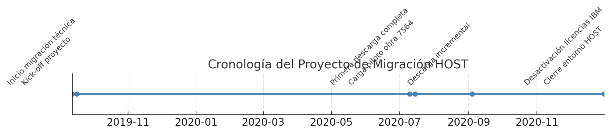

<!--
---
source: EstadoActualPlataformaBBD_V27_3_42.md
doc_source: EstadoActualPlataformaBBD_V27_3_42.docx
inserted: 2025-06-18T23:01:28.032372
---
-->

source: EstadoActualPlataformaBBD_V27_3_42.md | doc: EstadoActualPlataformaBBD_V27_3_42.docx | inserted: 2025-06-18T23:01:28.032372

# Fechas clave:

- Fin de migración técnica: **15 de julio de 2020**.

- Cierre del entorno HOST: **31 de diciembre de 2020**.

- Desactivación de IBM y licencias: **Q4 2020**.

1.  Interfaces SSIS en
    entorno HOST consolidado (AWD/ALHD)

En el marco del proyecto de migración del entorno HOST, se definieron y
desplegaron múltiples paquetes SSIS bajo la codificación
INTERFACES_AWD_ALHD_SSIS. Estos paquetes están orientados a la
integración y consolidación de datos técnicos, documentos y órdenes
asociadas a los sistemas heredados, facilitando la automatización de
tareas críticas.

### Funciones de los Paquetes SSIS

Los paquetes SSIS permiten la automatización de las siguientes tareas
críticas:

- **Extracción y limpieza de datos:** Utilizando paquetes como
  /_AtributosConfig.dtsx y /_LimpiarLogs.dtsx, se asegura la integridad
  y calidad de los datos extraídos.

- **Actualización de estados en tablas funcionales:** El paquete
  /_StatusDeleted.dtsx gestiona la actualización de estados, asegurando
  que las tablas reflejen el estado actual de los registros.

- **Consolidación de documentos técnicos:** Paquetes como
  Documentos_tecnicos/_/*.dtsx consolidan documentos técnicos,
  garantizando que toda la información relevante esté centralizada y
  accesible.

- **Gestión documental completa:** Los paquetes
  Gestion_Documental/_/*.dtsx abarcan revisiones, anexos, secciones y
  ficheros, proporcionando una gestión integral de los documentos.

- **Interfaces con MEL y materiales:** Los paquetes MEL_LME/_/*.dtsx
  facilitan la integración con sistemas de materiales, asegurando que
  los datos estén alineados con los requerimientos técnicos.

- **Interfaces con el entorno EEA5:** Paquetes como EEA5.dtsx y
  EEA5_DB2.dtsx permiten la comunicación y sincronización con el entorno
  EEA5, asegurando que los datos sean consistentes y actualizados.

### Características Técnicas

Los scripts SSIS incluyen lógica avanzada para:

- **Detección de registros huérfanos:** Identificación y manejo de
  registros que no tienen correspondencia en otras tablas, asegurando la
  integridad referencial.

- **Actualizaciones incrementales:** Implementación de actualizaciones
  que solo afectan a los registros modificados, optimizando el
  rendimiento y reduciendo la carga del sistema.

- **Verificación de consistencia:** Uso de checksum para asegurar que
  los campos clave mantienen su consistencia, evitando discrepancias en
  los datos.

- **Limpieza de registros obsoletos:** Eliminación de registros con
  estado status = 'DELETED', asegurando que la base de datos no acumule
  información innecesaria.

Además, se emplea el objeto UpdateNotice como mecanismo de auditoría de
ejecución para los procesos de carga diarios, proporcionando un registro
detallado de las operaciones realizadas y facilitando el seguimiento y
control de las mismas.

1.  MASQL20142/SQL20142 –
    (MASQL20222)

Instancia **SQL Server 2014 SP3** que sostiene el núcleo histórico de
*Necor@NC*. Aunque se planificó su retirada junto con el resto de
plataformas *legacy*, continúa en producción porque varios módulos de
ingeniería siguen dependiendo de esquemas y rutinas específicas que aún
no se han portado a versiones superiores.

1.  Características
    generales

**Rol:** Plataforma Necor@NC (entorno legado).  
**Versión:** SQL Server 2014 SP3.  
**Bases de datos:** Necor@NC.  
**Conexiones entrantes:** ECADAT, SAP (vía interfaces HojasCatálogo).  
**Conexiones salientes:** HOSTDB2 y NECORANET para consolidación.  
**Parámetros relevantes:** Puerto dinámico, sin integración AD,
collation por defecto.  
**Cambios recientes:** — Información no disponible.

2.  Contexto y
    dependencias

La instancia alberga exclusivamente la base de datos Necor@NC, empleada
por los módulos de ingeniería y aplicaciones internas como ECADAT. Su
integración con SAP se limita a las operaciones de catálogo de
materiales mediante HojasCatálogo. Los enlaces externos son reducidos;
la transferencia principal se dirige a **NECORANET** para consolidación
de datos.

Pese a su carácter legacy, la plataforma continúa operativa mientras
persistan las dependencias funcionales de los módulos de ingeniería. Su
retirada definitiva está condicionada a la migración completa de dichos
esquemas y rutinas a versiones superiores de SQL Server.

2.  MASQL20142/NECORANET
    – (MASQL20222)

Instancia SQL Server 2017 CU22 que funciona como plataforma funcional
AWD y capa de informes para el ecosistema Necor@AWD. Su diseño soporta
tanto la gestión documental como los flujos técnicos y la explotación de
datos, con un modelo de trabajo dual que facilita la gestión interna y
la distribución internacional de información.

1.  Características
    generales

