<!--
---
source: NAVANTIA-Interfaces_AWD_ALHD.md
doc_source: NAVANTIA-Interfaces_AWD_ALHD.docx
inserted: 2025-06-19T08:08:00.017064
---
-->

source: NAVANTIA-Interfaces_AWD_ALHD.md | doc: NAVANTIA-Interfaces_AWD_ALHD.docx | inserted: 2025-06-19T08:08:00.017064

# PAQUETES 2005 - INTERFACES_AWD_ALHD_SSIS

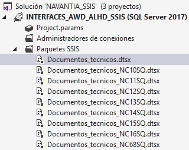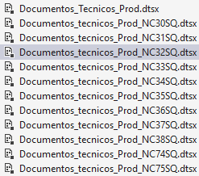

## Paquetes comunes

### /_AtributosConfig.dtsx

Llama a /_LimpiarCamposBO.dtsx

### /_CompAtributosConfig.dtsx

<table>
<colgroup>
<col style="width: 100%" />
</colgroup>
<thead>
<tr>
<th style="text-align: left;">User::V_SQL_ATRIB -&gt; User::V_RESULT
&gt; ForEachLoop &gt; User::V_SQL -&gt; User::V_CONTADOR</th>
</tr>
</thead>
<tbody>
<tr>
<td style="text-align: left;">
<strong>-- contador de estado a
fin</strong>

<strong>select count(*) from _ejecucion</strong>

<strong>where codobra =(select _codobra from _obras</strong>

<strong>where id = (select max(id) from _obras</strong>

<strong>where _proyecto = User::GLOBAL_PROYECTO ))</strong>

<strong>AND TABLA = 'TABLAS' AND ESTADO = 'FIN'</strong>
</td>
</tr>
<tr>
<td style="text-align: left;">
UPDATE UpdateNotice set Finish_Date =
getdate() where Id = (select max(id) from UpdateNotice )

Disable si @[User::V_ESCRIBR_LOG] == TRUE
</td>
</tr>
</tbody>
</table>

### /_LimpiarLogs.dtsx

| Borra todos los /*.log y los LOGERROR//.txt |
|---------------------------------------------|

### /_LimpiarLogs_EEA5.dtsx

| Boora todos los @/[User::GLOBAL_PATH_LOG/]//.log |
|--------------------------------------------------|

### /_StatusDeleted.dtsx

<table>
<colgroup>
<col style="width: 100%" />
</colgroup>
<thead>
<tr>
<th>User::V_Update_NC08SQ</th>
</tr>
</thead>
<tbody>
<tr>
<td>
update nc08sq

set _tstamp = getdate(),

_status = 'DELETED'

from nc08sq a

where _status &lt;&gt; 'DELETED'

And not exists (

select * from interfacesDWH.dbo.copic_referencia b

where a.copic = b.copic

and a.referencia = b.referencia

)
</td>
</tr>
<tr>
<td>
update nc13sq

set _tstamp = getdate(),

_status = 'DELETED'

from NC13SQ R

WHERE _STATUS &lt;&gt; 'DELETED'

AND NOT EXISTS

(SELECT * FROM NC11SQ RV

WHERE RV.ESTABL=R.ESTABL AND RV.CODOBRA=R.CODOBRA

AND RV.PLANO=R.PLANO AND RV.REVISION=R.REVISION

AND RV._STATUS &lt;&gt; 'DELETED')
</td>
</tr>
<tr>
<td>
update nc13sq

set _tstamp = getdate(),

_status = 'DELETED'

from NC13SQ R

WHERE _STATUS &lt;&gt; 'DELETED'

AND NOT EXISTS

(SELECT * FROM NC11SQ RV

WHERE RV.ESTABL=R.ESTABL AND RV.CODOBRA=R.CODOBRA

AND RV.PLANO=R.PLANO AND RV.REVISION=R.REVISION

AND RV._STATUS &lt;&gt; 'DELETED')
</td>
</tr>
<tr>
<td>
update NC14SQ

set _tstamp = getdate(),

_status = 'DELETED'

from nc14sq n14

where n14._status &lt;&gt; 'DELETED'

and not exists

(select * from nc13sq n13

where n13.ESTABL = n14.ESTABL

and n13.CODOBRA = n14.CODOBRA

and n13.PLANO = n14.PLANO

AND n13.TIPOREF = n14.TIPOREF

and n13.NUMREF = n14.NUMREF

and n13._status &lt;&gt; 'DELETED')
</td>
</tr>
<tr>
<td>
update NC14SQ

set _STATUS='DELETED',

_tstamp = getdate()

WHERE _ID IN (

SELECT R._ID

FROM NC14SQ R

INNER JOIN NC13SQ R2

ON R.ESTABL=R2.ESTABL AND R.CODOBRA=R2.CODOBRA

AND R.PLANO=R2.PLANO AND R.TIPOREF=R2.TIPOREF

AND R.NUMREF=R2.NUMREF

LEFT JOIN NC12SQ LM

ON LM.ESTABL=R.ESTABL AND LM.CODOBRA=R.CODOBRA

AND LM.PLANO=R.PLANO AND LM.LINEA=R.LINEIN

WHERE (R.TIPOREF='B' OR R.TIPOREF='S')

AND (R2.TIPIND='OB' OR R2.TIPIND='NG' OR (R2.TIPIND='' AND
R.LINEFI=R.LINEIN))

AND (R._STATUS&lt;&gt;'DELETED')

AND (LM._STATUS='DELETED' OR LM._STATUS IS NULL))
</td>
</tr>
<tr>
<td>
update NC33SQ

set _tstamp = getdate (),

_status = 'DELETED'

from nc33sq n33

where not exists

(select * from nc34sq n34

where n33.establ = n34.establ

and n33.codobra = n34.codobra

and n33.plano = n34.plano

and n33.numref = n34.numref

and n33.tiporef = n34.tiporef

and n34._status &lt;&gt; 'DELETED')

and n33._status &lt;&gt; 'DELETED'
</td>
</tr>
<tr>
<td>
update DBO.INCopic_HojasCatalogoAplicabilidadCopics

set _tstamp = getdate(), _status = 'DELETED'

where DBO.INCopic_HojasCatalogoAplicabilidadCopics.copic

not in

(select distinct n8.copic collate Modern_Spanish_CI_AS

from nc08sq n8

where n8._status &lt;&gt;'DELETED' )

and DBO.INCopic_HojasCatalogoAplicabilidadCopics._status &lt;&gt;
'DELETED'
</td>
</tr>
<tr>
<td>
update DBO.INCopic_HojasCatalogoAplicabilidadCopics

set _tstamp = getdate(), _status = 'DELETED'

from DBO.INCopic_HojasCatalogoAplicabilidadCopics a

where not exists

(select * from dbo.INCopic_HojasCatalogo b

where a.codigohoja = b.codigohoja

and b._status &lt;&gt; 'DELETED')

and a._status &lt;&gt; 'DELETED'
</td>
</tr>
<tr>
<td>User::V_Update_tcCodigos</td>
</tr>
<tr>
<td>
update tchojascatalogo_documentos

set _status = 'DELETED',

_tstamp = getdate()

where _status &lt;&gt; 'DELETED'

and cdgentidad not in

(select codigohoja from INCopic_HojasCatalogoAplicabilidadObras

where _status &lt;&gt; 'Deleted' )
</td>
</tr>
<tr>
<td>User::V_Update_SeccionesDocumento con parámetros 0 y 1 =
User::GLOBAL_PROYECTO y User::GLOBAL_PROYECTO</td>
</tr>
<tr>
<td>User::V_Update_Documentos con entradas User::GLOBAL_PROYECTO y
System::VersionMinor</td>
</tr>
<tr>
<td>User::V_Update_trRevisionDocRevisionSec con User::GLOBAL_PROYECTO y
User::GLOBAL_PROYECTO</td>
</tr>
<tr>
<td>
update trRevisionDocRevisionSec

set _Status = 'DELETED', _Tstamp = getdate()

FROM trRevisionDocRevisionSec A

WHERE A.cdgDocumento is not null

AND A.RevisionDoc is not null

AND A._Status &lt;&gt; 'DELETED'

AND Not EXISTS

(SELECT * FROM RevisionesDocumento B

WHERE A.cdgDocumento = B.cdgDocumento

AND A.RevisionDoc = B.RevisionDoc

AND B._Status &lt;&gt; 'DELETED')

and A.Revisionsec &gt;

coalesce ( (select max( C.Revisionsec)

FROM trRevisionDocRevisionSec C

WHERE C.cdgDocumento is not null

AND C.RevisionDoc is not null

AND A.cdgdocumento = C.cdgDocumento

AND A.REVISIONDOC = C.REVISIONDOC

AND A.CDGSECCION = C.CDGSECCION

AND C._Status &lt;&gt; 'DELETED'

AND EXISTS

(SELECT * FROM RevisionesDocumento D

WHERE C.cdgDocumento = D.cdgDocumento

AND C.RevisionDoc = D.RevisionDoc

AND D._Status &lt;&gt; 'DELETED')

) , ' ')

Con User::GLOBAL_PROYECTO y User::GLOBAL_PROYECTO
</td>
</tr>
<tr>
<td>
Update trrevisiondocrevisionsec

set trrevisiondocrevisionsec._STATUS = 'DELETED',

trrevisiondocrevisionsec._TSTAMP = getdate()

where not exists

(select * from fesrv014.controldoc.dbo.trrevisiondocrevisionsec
t14

where trrevisiondocrevisionsec.cdgdocumento = t14.cdgdocumento
collate Modern_Spanish_CI_AS

and trrevisiondocrevisionsec.Revisiondoc = t14.revisiondoc collate
Modern_Spanish_CI_AS

and trrevisiondocrevisionsec.Revisionsec = t14.revisionsec collate
Modern_Spanish_CI_AS

and trrevisiondocrevisionsec.cdgseccion = t14.cdgseccion collate
Modern_Spanish_CI_AS)

and trrevisiondocrevisionsec._status &lt;&gt; 'DELETED'
</td>
</tr>
<tr>
<td>User::V_Update_SeccionesDocumento con User::GLOBAL_PROYECTO y
User::GLOBAL_PROYECTO</td>
</tr>
<tr>
<td>
Update RevisionesSeccion

set RevisionesSeccion._STATUS = 'DELETED',

RevisionesSeccion._TSTAMP = getdate()

where RevisionesSeccion._STATUS &lt;&gt; 'DELETED'

and (RevisionesSeccion.cdgSeccion not in

(select SeccionesDocumento.cdgSeccion

from SeccionesDocumento

where SeccionesDocumento._STATUS &lt;&gt; 'DELETED'

)

or not exists

(select * from trRevisiondocrevisionsec tr

where RevisionesSeccion.cdgseccion = tr.cdgseccion

and RevisionesSeccion.revisionSec = tr.revisionSec

and RevisionesSeccion._STATUS &lt;&gt; 'DELETED'

))
</td>
</tr>
<tr>
<td>
Update trRevisionSecFichero

set trRevisionSecFichero._STATUS = 'DELETED',

trRevisionSecFichero._TSTAMP = getdate()

from trRevisionSecFichero tr

where tr._STATUS &lt;&gt; 'DELETED'

and not exists

(select *

from RevisionesSeccion r

where r._STATUS &lt;&gt; 'DELETED'

and r.cdgseccion = tr.cdgseccion

and r.revisionsec = tr.revisionsec

)
</td>
</tr>
<tr>
<td>
Update trRevisionSecFichero

set trRevisionSecFichero._STATUS = 'DELETED',

trRevisionSecFichero._TSTAMP = getdate()

where trRevisionSecFichero._STATUS &lt;&gt; 'DELETED'

and (trRevisionSecFichero.cdgSeccion not in

(select SeccionesDocumento.cdgSeccion

from SeccionesDocumento

where SeccionesDocumento._STATUS &lt;&gt; 'DELETED'

)

)
</td>
</tr>
<tr>
<td>
Update trRevisionSecFichero

set trRevisionSecFichero._STATUS = 'DELETED',

trRevisionSecFichero._TSTAMP = getdate()

where not exists

(select * from fesrv014.controldoc.dbo.trrevisionsecfichero t14

where trrevisionSEcfichero.cdgseccion = t14.cdgseccion collate
Modern_Spanish_CI_AS

and trrevisionSEcfichero.Revisionsec = t14.revisionsec collate
Modern_Spanish_CI_AS

and trrevisionSEcfichero.cdgfichero = t14.cdgfichero collate
Modern_Spanish_CI_AS)

and trrevisionSEcfichero._status &lt;&gt; 'DELETED'
</td>
</tr>
<tr>
<td>User::V_Update_trRevisionDocFichero con User::GLOBAL_PROYECTO</td>
</tr>
<tr>
<td>
Update trRevisionDocFichero

set trRevisionDocFichero._STATUS = 'DELETED',

trRevisionDocFichero._TSTAMP = getdate()

where trRevisionDocFichero._STATUS &lt;&gt; 'DELETED'

and not exists

(select *

from fesrv014.controldoc.dbo.trrevisiondocfichero t14

where trrevisiondocfichero.cdgdocumento = t14.cdgdocumento collate
Modern_Spanish_CI_AS

and trrevisiondocfichero.revisiondoc = t14.revisiondoc collate
Modern_Spanish_CI_AS

and trrevisiondocfichero.cdgfichero = t14.cdgfichero collate
Modern_Spanish_CI_AS)
</td>
</tr>
<tr>
<td>User::V_Update_ficheros</td>
</tr>
<tr>
<td>User::V_Update_ficheros_tr</td>
</tr>
<tr>
<td>
Update Ubicaciones

set Ubicaciones._STATUS = 'DELETED',

Ubicaciones._TSTAMP = getdate()

where Ubicaciones._STATUS &lt;&gt; 'DELETED'

and Ubicaciones.cdgUbicacion not in

(select ficheros.cdgUbicacion

from ficheros

where ficheros._STATUS &lt;&gt; 'DELETED'

)
</td>
</tr>
<tr>
<td>
update situacionesRevisionDocumento

set _status = 'DELETED'

from SituacionesRevisionDocumento a

WHERE a.cdgdocumento not in

(select T.cdgDocumento

from (

(Select DISTINCT tcDocsOT_Documentos.cdgDocumento as
cdgDocumento,

tcDocsOT_Documentos.RevisionDoc as RevisionDoc,

tcDocsOT_Documentos.Establecimiento as Establecimiento,

tcDocsOT_Documentos.Obra as Obra,

tcDocsOT_Documentos._STATUS COLLATE Modern_Spanish_CI_AS as
STATUS

FROM tcDocsOT_Documentos)

UNION

(Select DISTINCT tcOOTT_Documentos.cdgDocumento as cdgDocumento,

tcOOTT_Documentos.RevisionDoc as RevisionDoc,

tcOOTT_Documentos.Establecimiento as Establecimiento,

tcOOTT_Documentos.Obra as Obra,

tcOOTT_Documentos._STATUS COLLATE Modern_Spanish_CI_AS as STATUS

FROM tcOOTT_Documentos)

UNION

(Select DISTINCT tcAvisosRevision_Documentos.cdgDocumento

COLLATE Modern_Spanish_CI_AS as cdgDocumento,

tcAvisosRevision_Documentos.RevisionDoc

COLLATE Modern_Spanish_CI_AS as RevisionDoc,

tcAvisosRevision_Documentos.Establecimiento

COLLATE Modern_Spanish_CI_AS as Establecimiento,

tcAvisosRevision_Documentos.Obra

COLLATE Modern_Spanish_CI_AS as Obra,

tcAvisosRevision_Documentos._STATUS

COLLATE Modern_Spanish_CI_AS as STATUS

FROM tcAvisosRevision_Documentos)

UNION

(Select DISTINCT tcHojasCatalogo_Documentos.cdgDocumento

COLLATE Modern_Spanish_CI_AS as cdgDocumento,

tcHojasCatalogo_Documentos.RevisionDoc COLLATE Modern_Spanish_CI_AS
as RevisionDoc,

INCopic_HojasCatalogoAplicabilidadObras.establecimiento

COLLATE Modern_Spanish_CI_AS as Establecimiento,

INCopic_HojasCatalogoAplicabilidadObras.obra COLLATE
Modern_Spanish_CI_AS as Obra,

tcHojasCatalogo_Documentos._STATUS COLLATE Modern_Spanish_CI_AS as
STATUS

FROM tcHojasCatalogo_Documentos

left join INCopic_HojasCatalogoAplicabilidadObras

on INCopic_HojasCatalogoAplicabilidadObras.codigohoja

COLLATE Modern_Spanish_CI_AS =
tcHojasCatalogo_Documentos.cdgentidad)

UNION

(Select tcCodigos_Documentos.cdgDocumento COLLATE
Modern_Spanish_CI_AS as cdgDocumento,

tcCodigos_Documentos.RevisionDoc

COLLATE Modern_Spanish_CI_AS as RevisionDoc,

NC32.Establ COLLATE Modern_Spanish_CI_AS as Establecimiento,

NC32.Codobra COLLATE Modern_Spanish_CI_AS as Obra,

tcCodigos_Documentos._STATUS COLLATE Modern_Spanish_CI_AS as
STATUS

From tcCodigos_Documentos

left join NC12SQ as NC32

on nc32.planoo COLLATE Modern_Spanish_CI_AS =
tcCodigos_Documentos.cdgEntidad )

) as T

where T.cdgDocumento = a.cdgDocumento

and T.STATUS &lt;&gt; 'DELETED')
</td>
</tr>
<tr>
<td>
update situacionesRevisionDocumento

set _status = 'DELETED'

from SituacionesRevisionDocumento a

WHERE a._status &lt;&gt; 'DELETED'

and NOT EXISTS(

select * from FESRV014.CONTROLDOC.DBO.SituacionesRevisionDocumento
S

where S.cdgdocumento = a.cdgdocumento collate
Modern_Spanish_CI_AS

and S.RevisionDoc = a.RevisionDoc collate Modern_Spanish_CI_AS

and S.cdgTipoSitDoc = a.cdgTipoSitDoc collate
Modern_Spanish_CI_AS)
</td>
</tr>
<tr>
<td>
update situacionesRevisionSeccion

set _status = 'DELETED'

from SituacionesRevisionSeccion a

WHERE a._status &lt;&gt; 'DELETED'

and NOT EXISTS(

select * from FESRV014.CONTROLDOC.DBO.SituacionesRevisionSeccion
S

where S.cdgSeccion = a.cdgSeccion collate Modern_Spanish_CI_AS

and S.RevisionSec = a.RevisionSec collate Modern_Spanish_CI_AS

and S.cdgTipoSitSec = a.cdgTipoSitSec collate
Modern_Spanish_CI_AS)
</td>
</tr>
<tr>
<td>
update situacionesRevisionSeccion

set _status = 'DELETED',

_tstamp = getdate()

from situacionesRevisionSeccion s

where not exists

(select * from dbo.revisionesSeccion r

where s.cdgseccion = r.cdgseccion

and s.revisionsec = r.revisionsec

and r._status &lt;&gt; 'DELETED')

and s._status &lt;&gt; 'DELETED'
</td>
</tr>
<tr>
<td>
update situacionesRevisionSeccion

set _status = 'DELETED',

_tstamp = getdate()

from situacionesRevisionSeccion s

where not exists

(select * from dbo.revisionesSeccion r

where s.cdgseccion = r.cdgseccion

and s.revisionsec = r.revisionsec

and r._status &lt;&gt; 'DELETED')

and s._status &lt;&gt; 'DELETED'
</td>
</tr>
<tr>
<td>User::V_Update_Cora223</td>
</tr>
<tr>
<td>User::V_Update_Cora225</td>
</tr>
<tr>
<td>
Update trRevisionSecFichero

set trRevisionSecFichero._STATUS = 'DELETED',

trRevisionSecFichero._TSTAMP = getdate()

where trRevisionSecFichero._STATUS &lt;&gt; 'DELETED'

and (trRevisionSecFichero.cdgFichero not in

(select Ficheros.cdgFichero

from Ficheros

where Ficheros._STATUS &lt;&gt; 'DELETED'

)

)
</td>
</tr>
</tbody>
</table>

## Anexos

### Anexos.dtsx

<table>
<colgroup>
<col style="width: 100%" />
</colgroup>
<thead>
<tr>
<th>
<strong>--EXTRACT PREVIO a NC17SQ_ANEXOS</strong>

<strong>(SELECT ESTABL AS ESTABL, CODOBRA AS CODOBRA, DOCUREV as
docurev, 'ANEXO01' as numero, cast(BZNC.NCUDF06('NC06FV', 'NC17SQ'
,SECUE06, 'ANEXO01' ,'INGLES') as varchar(4000)) as anexo FROM
NEC.NC17SQ WHERE ESTABL = 'A' AND CODOBRA = 'AWD1' AND ANEXOS = 'SI')
UNION (SELECT ESTABL AS ESTABL, CODOBRA AS CODOBRA, DOCUREV as docurev,
'ANEXO02' as numero , cast(BZNC.NCUDF06('NC06FV', 'NC17SQ' ,SECUE06,
'ANEXO02' ,'INGLES') as varchar(4000)) as anexo FROM NEC.NC17SQ WHERE
ESTABL = 'A' AND CODOBRA = 'AWD1' AND ANEXOS = 'SI')</strong>
</th>
</tr>
</thead>
<tbody>
<tr>
<td>
<strong>delete nc17sq_anexos</strong>

<strong>from NC17SQ_anexos DWH</strong>

<strong>WHERE dwh.anexo = ''</strong>

<strong>or docurev not in</strong>

<strong>(select docurev from nc17sq)</strong>
</td>
</tr>
<tr>
<td>
select distinct docurev from dbo.nc17sq_anexos where numeroanexo
&gt; 'anexo01'

- &gt;User::OBJECT_DOCUREV y un bucle por cada docurev
</td>
</tr>
<tr>
<td>
Bucle mientras @V_CONT_ANEXOS &lt; 99 &amp;&amp; @V_ANEXO != ""
ejecuta

{User::V_CONSULTAANEXOS -&gt; User::V_ANEXO (resultado) y
User::V_INSERT_ANEXOS}
</td>
</tr>
<tr>
<td></td>
</tr>
</tbody>
</table>

## Avisos

### Avisos_Rev_BO18SQ.dtsx

<table>
<colgroup>
<col style="width: 100%" />
</colgroup>
<thead>
<tr>
<th>
<strong>SELECT ESTABL ,CODOBRA ,ORDEN ,REVISION ,DOCUREV ,FEREVIS
,SITREVIS</strong>

<strong>,CTRPREV ,CTRAVISO ,CTRAEJEC ,DNIREV ,DNIAPR ,TIPDOCU
,SECUE06</strong>

<strong>,REVPLA ,FEAPR,</strong>

<strong>CAST(BZNC.NCUDF06('BO06FV ','BO18SQ'
,SECUE06,'DESREV','INGLES') AS CHAR(100)) AS DESCR</strong>

<strong>FROM NEC.BO18SQ WHERE establ= ? and codobra =?</strong>

<strong>(Lee de Db2 y carga en BO18SQ)</strong>
</th>
</tr>
</thead>
<tbody>
</tbody>
</table>

### Avisos_Rev_NC17SQ.dtsx

<table>
<colgroup>
<col style="width: 100%" />
</colgroup>
<thead>
<tr>
<th>
<strong>SELECT</strong>

<strong>ESTABL,CODOBRA,DOCUREV,DOCUREF,FECDOCU,FEFINAL,</strong>

<strong>NOTAS,ANEXOS,DNIRDOC,TIPDOCU,SECUE06,CENTEMI,ORIGIN,GDEFECT,DECISION,CDEFECT,CAUSAPR,FECHRESO,GIMPORT,IMPACTOE,TRANSARM,IMPRVING,IMPRVMAT,IMPRVPRO,IMPRVVAR,IMPREING,IMPREMAT,IMPREPRO,IMPREVAR,IMPRRING,IMPRRMAT,IMPRRPRO,IMPRRVAR,MONEDA,
SITING,SITAPROV,SITPRO,SITGESCAL,SITOTROS,DNISITING,DNISITAPRO,DNISITPRO,DNISITCAL,DNISITOTR,GRUCOSTE,BLOQUE,FECSITING,FECSITAPRO,FECSITPRO,FECSITCAL,FECSITOTR,MARFUNC,</strong>

<strong>cast(BZNC.NCUDF06('NC06FV ','NC17SQ'
,SECUE06,'DESDOC','INGLES') as varchar(8000)) AS DESCR</strong>

<strong>FROM NEC.NC17SQ</strong>

<strong>WHERE CODOBRA=? AND ESTABL=?</strong>
</th>
</tr>
</thead>
<tbody>
</tbody>
</table>

### Avisos_Rev_NC18SQ.dtsx

<table>
<colgroup>
<col style="width: 100%" />
</colgroup>
<thead>
<tr>
<th style="text-align: left;">
<strong>SELECT</strong>

<strong>ESTABL,CODOBRA,PLANO,REVISION,DOCUREV,FEREVIS,SITREVIS,CTRPREV,CTRAVISO,CTRAEJEC,DNIREV,DNIAPR,TIPDOCU,SECUE06,REVPLA,FEAPR,</strong>

<strong>cast(BZNC.NCUDF06('NC06FV ','NC18SQ'
,SECUE06,'DESREV','INGLES') as varchar(4000)) AS DESCR</strong>

<strong>FROM NEC.NC18SQ WHERE CODOBRA=? AND
ESTABL=?</strong>
</th>
</tr>
</thead>
<tbody>
</tbody>
</table>

### AWD1.TareasNuevosCOPIC.dtsx

<table>
<colgroup>
<col style="width: 100%" />
</colgroup>
<thead>
<tr>
<th>
Con la conexion InterfacesADW, crea fichero AWD001.txt

<strong>SELECT DISTINCT NC08SQ.COPIC,
Convert(Char(14),NC08SQ.REFERENCIA) REFERENCIA, Convert(Char(82),
replace(NC08SQ.VALOR,'</strong>

<strong>',' ')) VALOR, NC08SQ._TSTAMP AS fecha</strong>

<strong>FROM NC08SQ</strong>

<strong>inner join NC12SQ</strong>

<strong>on NC08SQ.COPIC = nc12SQ.PLANOO</strong>

<strong>and nc12sq.codobra = 'AWD1'</strong>

<strong>WHERE (NC08SQ._STATUS = 'NEW')</strong>

<strong>and (NC08SQ.REFERENCIA = 'INGLES') AND (NC08SQ._TSTAMP
BETWEEN GETDATE() - 2 AND GETDATE());</strong>
</th>
</tr>
</thead>
<tbody>
<tr>
<td>
Executable

@[User::GLOBAL_PATH_LOGPLAN] + @[User::GLOBAL_PROYECTO] +
"/Asuntos_Y_Tareas/Carga.exe"

WorkingDirectory

@[User::GLOBAL_PATH_LOGPLAN] + @[User::GLOBAL_PROYECTO] +
"/Asuntos_Y_Tareas"

Argumentos

"A _ AWD0000001 " + @[User::GLOBAL_PATH_LOG] + "AWD001.txt " +
@[User::GLOBAL_PATH_LOG] + "AsuntosYTareas.exe.log"
</td>
</tr>
</tbody>
</table>

### Deshabilitar_Index.dtsx

<table>
<colgroup>
<col style="width: 100%" />
</colgroup>
<thead>
<tr>
<th style="text-align: left;">
<strong>SELECT NAME FROM SYSOBJECTS
WHERE XTYPE = 'U' AND CATEGORY &lt;&gt; 2</strong>

<strong>Con User::GLOBAL_CATEGORY. Los guarda en User::Tabla_object y
recorre cada objeto del bucle User::GLOBAL_CATEGORY para hacer
User::V_Alter</strong>
</th>
</tr>
</thead>
<tbody>
</tbody>
</table>

## Documentos_tecnicos

### Documentos_tecnicos_NC10SQ.dtsx

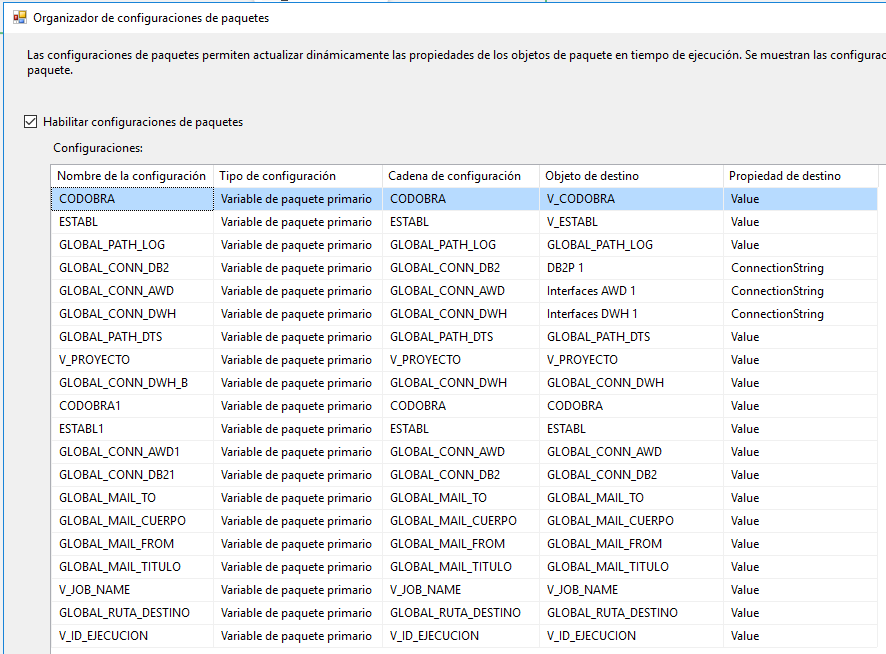

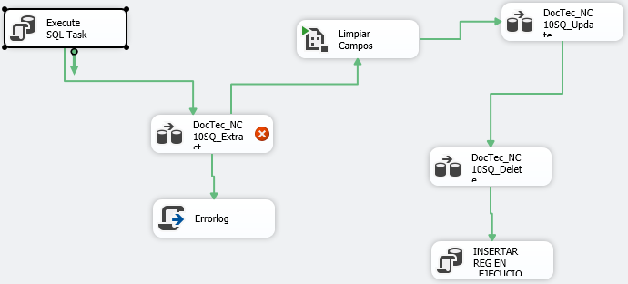

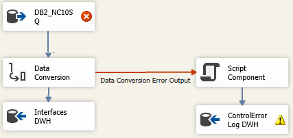

<table>
<colgroup>
<col style="width: 100%" />
</colgroup>
<thead>
<tr>
<th style="text-align: left;">TRUNCATE TABLE DBO.NC10SQ</th>
</tr>
</thead>
<tbody>
<tr>
<td
style="text-align: left;">
<strong>--DocTec_NC10SQ_Extract</strong>

<strong>SELECT
N10.ESTABL,N10.CODOBRA,N10.PLANO,N10.TIPOPLA,N10.TAREA,N10.CENDESA,N10.CENCOST,</strong>

<strong>N10.ZONA,N10.BLOQUE,N10.MODULO,N10.SECCION,N10.GRUCOSTE,N10.PRODINT,N11.SITOFTEC,</strong>

<strong>N10.SITINPRO,N10.SITAPROV,N10.SITCONFI,N10.SITINTEG,N10.SITLOGIS,N10.URREALZ,</strong>

<strong>N10.URAPROB,N10.URCIRCU,N10.URINPRO,N10.URINTEG,N10.URAPROV,N10.URCONFI,</strong>

<strong>N10.AVISOREV,N10.DNI,N10.CLASIFI,N10.SECUE06,N10.FECREAC,</strong>

<strong>cast(BZNC.NCUDF06('NC06FV ','NC10SQ'
,N10.SECUE06,'DESPLAC','INGLES') as char(100)) AS DESPLAC,</strong>

<strong>cast(BZNC.NCUDF06('NC06FV ','NC10SQ'
,N10.SECUE06,'DESPLAL','INGLES') as char(100)) AS DESPLAL</strong>

<strong>FROM NEC.NC10SQ N10</strong>

<strong>INNER JOIN NEC.NC11SQ N11</strong>

<strong>ON N10.ESTABL = N11.ESTABL</strong>

<strong>AND N10.CODOBRA = N11.CODOBRA</strong>

<strong>AND N10.PLANO = N11.PLANO</strong>

<strong>AND N11.REVISION = (SELECT MAX(N11A.REVISION)</strong>

<strong>FROM NEC.NC11SQ N11A</strong>

<strong>WHERE N11A.ESTABL = N10.ESTABL</strong>

<strong>AND N11A.CODOBRA = N10.CODOBRA</strong>

<strong>AND N11A.PLANO = N10.PLANO)</strong>

<strong>WHERE</strong>

<strong>(N10.SITLOGIS = 'A' OR N10.SITLOGIS = 'I') AND N10.CODOBRA=?
AND N10.ESTABL=?</strong>
</td>
</tr>
</tbody>
</table>

Donde las variables son

| V_BARRA | // |  |
|----|----|----|
| V_CODOBRA | STNA |  |
| V_CONTADOR | 0 |  |
| V_ESTABL | A |  |
| V_ID_EJECUCION | 0 |  |
| V_INSERT_ERROR | INSERT INTO /[dbo/]./[/_EJECUCION/] (/[Tabla/],/[Estado/],/[Codobra/],/[Proyecto/]) VALUES ('NC10SQ','ERROR','STNA', 'AWD') | "INSERT INTO /[dbo/]./[/_EJECUCION/] (/[Tabla/],/[Estado/],/[Codobra/],/[Proyecto/]) VALUES ('NC10SQ','ERROR','" + @V_CODOBRA + "','" + @V_PROYECTO + "')" |
| V_JOB_NAME |  |  |
| V_PROYECTO | AWD |  |
| V_RUTA_ERRORLOG | LOGERROR// | @GLOBAL_PATH_LOG + @V_SUBCARPETA |
| V_STOP_JOB | exec msdb.dbo.sp_stop_job '' | "exec msdb.dbo.sp_stop_job '" + @V_JOB_NAME + "'" |
| V_SUBCARPETA | LOGERROR// |  |
| V_TABLA | NC10SQ |  |
| VLINEASERROR |  |  |

### Documentos_tecnicos_NC11SQ.dtsx

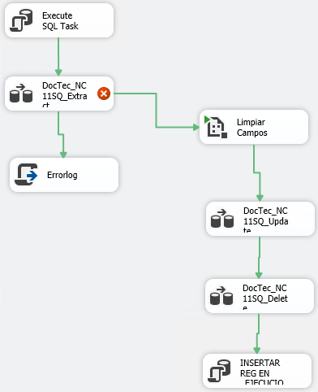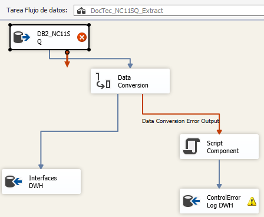

<table>
<colgroup>
<col style="width: 100%" />
</colgroup>
<thead>
<tr>
<th style="text-align: left;">
<strong>SELECT
ESTABL,CODOBRA,PLANO,REVISION,DNIDIB,DNICOM,DNIAPR,</strong>

<strong>FEINREA,FEAPROB,FEFIREA,FEENARM,FEINPRE,FEFIPRE,FEENPRO,</strong>

<strong>FEPRPRE,FEPRREA,FEINSPE,FECLASI,CENDESA,CENCOST,SECINPRO,</strong>

<strong>SITOFTEC,SITINPRO,SECOFTEC,FECINPRO,HORINPRO,DOCUREV,</strong>

<strong>CODENVIO,DOCLIC,REVDIB,DOCCLI,REVLIC,REVCLI,PADRE,SECUE06,CAST(BZNC.NCUDF06('NC06FV
','NC11SQ' ,SECUE06,'DESPLAC','INGLES') AS CHAR(100)) AS DESPLAC
,</strong>

<strong>CAST(BZNC.NCUDF06('NC06FV ','NC11SQ'
,SECUE06,'DESPLAL','INGLES') AS CHAR(100)) AS DESPLAL</strong>

<strong>FROM NEC.NC11SQ A</strong>

<strong>WHERE A.CODOBRA=? AND A.ESTABL=? AND EXISTS</strong>

<strong>(SELECT * FROM NEC.NC10SQ B WHERE A.ESTABL= B.ESTABL AND
A.CODOBRA = B.CODOBRA AND A.PLANO = B.PLANO AND (B.SITLOGIS='A' OR
B.SITLOGIS='I'))</strong>

<strong>--Convierte los campos a STR y los carga en dbo.NC11SQ en
FESRV053.InterfacesDWH</strong>
</th>
</tr>
</thead>
<tbody>
</tbody>
</table>

### Documentos_tecnicos_NC12SQ.dtsx

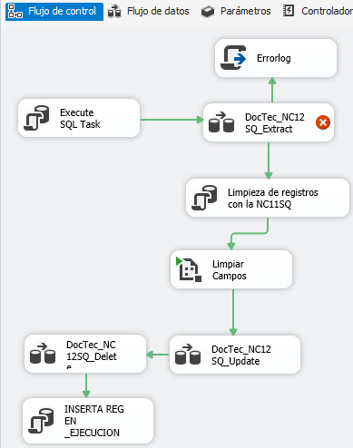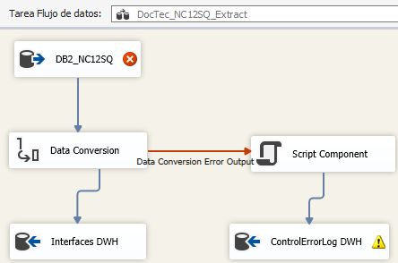

<table>
<colgroup>
<col style="width: 100%" />
</colgroup>
<thead>
<tr>
<th style="text-align: left;">
<strong>SELECT
ESTABL,CODOBRA,PLANO,LINEA,TIPOACO,REVISION,GRUCOSTE,</strong>

<strong>PLANOO,LINEAO,CANCONT,UNIDCON,CANPROD,UNIDPRO,PESO,CANDEMN,</strong>

<strong>NORMAD,DIMENS,TANOMI,ACABADO,NORMAC,PARTIC,RESIST,INSPEC,</strong>

<strong>PRESION,MARPLAN,NUMELE,DESGMAR,BLOQUE,DESGBLO,SOLACO,DESGACO,</strong>

<strong>MODULO,DESGMOD,LOCAL,DESGLOC,DETALLE,NOTAS,MODDEMN,SNREF,</strong>

<strong>PROCESS,DNI,OBSERV,SECUE06,</strong>

<strong>CAST(BZNC.NCUDF06('NC06FV ','NC12SQ'
,SECUE06,'DESLINE','INGLES') AS CHAR(100)) AS DESCR</strong>

<strong>FROM NEC.NC12SQ A</strong>

<strong>WHERE A.CODOBRA=? AND A.ESTABL=? AND EXISTS</strong>

<strong>(SELECT * FROM NEC.NC10SQ B WHERE A.ESTABL= B.ESTABL AND
A.CODOBRA = B.CODOBRA AND A.PLANO = B.PLANO AND (B.SITLOGIS='A' OR
B.SITLOGIS='I'))</strong>
</th>
</tr>
</thead>
<tbody>
</tbody>
</table>

### Documentos_tecnicos_NC13SQ.dtsx

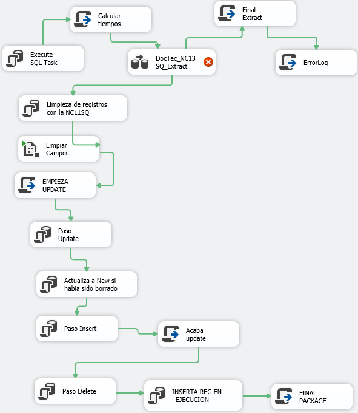

<table>
<colgroup>
<col style="width: 100%" />
</colgroup>
<thead>
<tr>
<th style="text-align: left;">TRUNCATE TABLE DBO.NC13SQ</th>
</tr>
</thead>
<tbody>
<tr>
<td style="text-align: left;">Dts.TaskResult =
(int)ScriptResults.Success;</td>
</tr>
<tr>
<td style="text-align: left;">
<strong>SELECT
ESTABL,CODOBRA,PLANO,TIPOREF,NUMREF,TIPIND,INDREF,</strong>

<strong>FEREFER,SECUE06,REVISION,CAST(BZNC.NCUDF06('NC06FV ','NC13SQ'
,SECUE06,'DESREF','INGLES') AS VARCHAR(7000)) AS DESCR</strong>

<strong>FROM NEC.NC13SQ A</strong>

<strong>WHERE A.CODOBRA=? AND A.ESTABL=? AND EXISTS</strong>

<strong>(SELECT * FROM NEC.NC10SQ B WHERE A.ESTABL= B.ESTABL AND
A.CODOBRA = B.CODOBRA AND A.PLANO = B.PLANO AND (B.SITLOGIS='A' OR
B.SITLOGIS='I'))</strong>

--Luego DESCR lo pasa a DT_TEXT. Resto a DT_STR. Concatenar salto de
linea en DESCR (en un script). Y los carga en dbo.NC13SQ en
FESRV053.InterfacesDWH
</td>
</tr>
<tr>
<td style="text-align: left;">
delete nc13sq

from nc13sq n13

where not exists

(select * from nc11sq n11

where n13.establ = n11.establ collate Modern_Spanish_CI_AS

and n13.codobra = n11.codobra collate Modern_Spanish_CI_AS

and n13.plano = n11.plano collate Modern_Spanish_CI_AS

and n13.revision = n11.revision collate
Modern_Spanish_CI_AS)
</td>
</tr>
<tr>
<td style="text-align: left;">Lanza _AtributosConfig.dtsx</td>
</tr>
<tr>
<td style="text-align: left;">Dts.TaskResult =
(int)ScriptResults.Success;</td>
</tr>
<tr>
<td style="text-align: left;">
UPDATE [dbo].[NC13SQ]

SET TIPIND = DWH.TIPIND

,INDREF = DWH.INDREF

,FEREFER = DWH.FEREFER

,SECUE06 = DWH.SECUE06

,REVISION = DWH.REVISION

,DESCR = DWH.DESCR

,_TSTAMP = getdate()

,_CHECKSUM = checksum(DWH.ESTABL, DWH.CODOBRA, DWH.PLANO,
DWH.TIPOREF,

DWH.NUMREF, DWH.TIPIND, DWH.INDREF, DWH.FEREFER,

DWH.SECUE06, DWH.REVISION, DWH.DESCR)

,_STATUS = 'UPDATED'

FROM [dbo].[NC13SQ] AWD

INNER JOIN INTERFACESDWH.dbo.NC13SQ DWH

ON AWD.ESTABL = DWH.ESTABL

AND AWD.CODOBRA = DWH.CODOBRA

AND AWD.PLANO = DWH.PLANO

AND AWD.TIPOREF = DWH.TIPOREF

AND AWD.NUMREF = DWH.NUMREF

WHERE checksum(DWH.ESTABL, DWH.CODOBRA, DWH.PLANO, DWH.TIPOREF,

DWH.NUMREF, DWH.TIPIND, DWH.INDREF, DWH.FEREFER,

DWH.SECUE06, DWH.REVISION, DWH.DESCR) &lt;&gt; AWD._CHECKSUM

and AWD.establ = ? and AWD.Codobra = ?
</td>
</tr>
<tr>
<td style="text-align: left;">
UPDATE NC13SQ

SET _STATUS='NEW',

_TSTAMP=GETDATE()

FROM NC13SQ AWD

INNER JOIN INTERFACESDWH.DBO.NC13SQ DWH

ON DWH.ESTABL = AWD.ESTABL

AND DWH.CODOBRA = AWD.CODOBRA

AND DWH.PLANO = AWD.PLANO

AND DWH.TIPOREF = AWD.TIPOREF

AND DWH.NUMREF = AWD.NUMREF

WHERE CHECKSUM(DWH.ESTABL, DWH.CODOBRA, DWH.PLANO, DWH.TIPOREF,

DWH.NUMREF, DWH.TIPIND, DWH.INDREF, DWH.FEREFER,

DWH.SECUE06, DWH.REVISION, DWH.DESCR) = AWD._CHECKSUM

AND AWD._STATUS = 'DELETED'

and AWD.establ = ? and AWD.Codobra = ?
</td>
</tr>
<tr>
<td style="text-align: left;">
INSERT INTO [dbo].[NC13SQ]

(ESTABL ,CODOBRA ,PLANO ,TIPOREF ,NUMREF ,TIPIND ,INDREF ,FEREFER
,SECUE06

,REVISION ,DESCR ,_TSTAMP ,_CHECKSUM ,_STATUS)

select ESTABL, CODOBRA, PLANO, TIPOREF, NUMREF, TIPIND, INDREF,
FEREFER, SECUE06,

REVISION, DESCR, getdate() as_TSTAMP,

checksum (DWH.ESTABL, DWH.CODOBRA, DWH.PLANO, DWH.TIPOREF,

DWH.NUMREF, DWH.TIPIND, DWH.INDREF, DWH.FEREFER,

DWH.SECUE06, DWH.REVISION, DWH.DESCR) as _CHECKSUM,

'NEW' as _STATUS

FROM INTERFACESDWH.DBO.NC13SQ DWH

WHERE NOT EXISTS

(SELECT *

FROM NC13SQ AWD

WHERE DWH.ESTABL = AWD.ESTABL

AND DWH.CODOBRA = AWD.CODOBRA

AND DWH.PLANO = AWD.PLANO

AND DWH.TIPOREF = AWD.TIPOREF

AND DWH.NUMREF = AWD.NUMREF)
</td>
</tr>
<tr>
<td style="text-align: left;">Dts.TaskResult =
(int)ScriptResults.Success;</td>
</tr>
<tr>
<td style="text-align: left;">
UPDATE NC13SQ

SET _STATUS='DELETED',

_TSTAMP=GETDATE()

from nc13sq AWD

WHERE AWD._STATUS &lt;&gt; 'DELETED'

AND AWD.ESTABL = ? AND AWD.CODOBRA = ?

AND NOT EXISTS

(SELECT DWH.*

FROM INTERFACESDWH.DBO.NC13SQ DWH

WHERE DWH.ESTABL = AWD.ESTABL

AND DWH.CODOBRA = AWD.CODOBRA

AND DWH.PLANO = AWD.PLANO

AND DWH.TIPOREF = AWD.TIPOREF

AND DWH.NUMREF = AWD.NUMREF

)
</td>
</tr>
<tr>
<td style="text-align: left;">
INSERT INTO [_EJECUCION]

([Tabla]

,[Estado]

,[Codobra]

,[Proyecto])

VALUES

('NC13SQ'

,'FIN'

,?

,?)
</td>
</tr>
<tr>
<td style="text-align: left;">Dts.TaskResult =
(int)ScriptResults.Success;</td>
</tr>
</tbody>
</table>

### Documentos_tecnicos_NC14SQ.dtsx (origen es FESRV030)

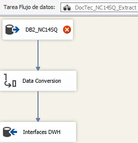

<table>
<colgroup>
<col style="width: 100%" />
</colgroup>
<thead>
<tr>
<th style="text-align: left;">
<strong>SELECT * FROM NEC.NC14SQ
A</strong>

<strong>WHERE A.CODOBRA=? AND A.ESTABL=? AND EXISTS</strong>

<strong>(SELECT * FROM NEC.NC10SQ B WHERE A.ESTABL= B.ESTABL AND
A.CODOBRA = B.CODOBRA AND A.PLANO = B.PLANO AND (B.SITLOGIS='A' OR
B.SITLOGIS='I'))</strong>
</th>
</tr>
</thead>
<tbody>
</tbody>
</table>

### Documentos_tecnicos_NC15SQ.dtsx

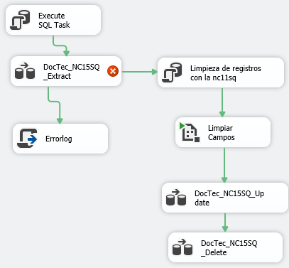
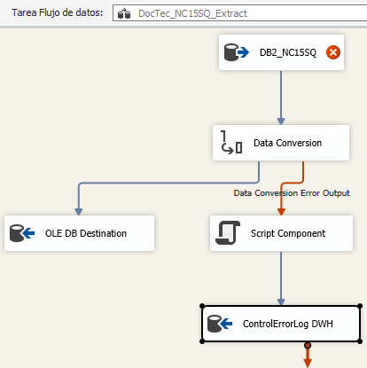

<table>
<colgroup>
<col style="width: 100%" />
</colgroup>
<thead>
<tr>
<th style="text-align: left;">
<strong>SELECT
ESTABL,CODOBRA,PLANO,LINEA,CANPROD,UNIDPRO,CANRESE,PESO,NORMAD,NORMAC,DIMENS,TANOMI,ACABADO,PARTIC,OBSERV,MAREQUI,MARFUNC,DNI,PROCESS,MARBORR,REVISION,SECUE06,CAST(BZNC.NCUDF06('NC06FV
','NC15SQ' ,SECUE06,'DESLINE','INGLES') AS CHAR(100)) AS
DESCR</strong>

<strong>FROM NEC.NC15SQ A</strong>

<strong>WHERE A.CODOBRA=? AND A.ESTABL=? AND EXISTS</strong>

<strong>(SELECT * FROM NEC.NC10SQ B WHERE A.ESTABL= B.ESTABL AND
A.CODOBRA = B.CODOBRA AND A.PLANO = B.PLANO AND (B.SITLOGIS='A' OR
B.SITLOGIS='I'))</strong>
</th>
</tr>
</thead>
<tbody>
</tbody>
</table>

### Documentos_tecnicos_NC16SQ.dtsx

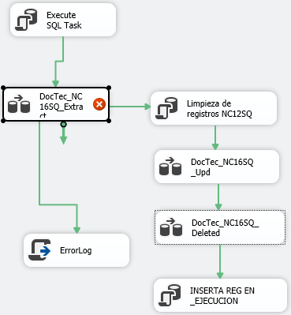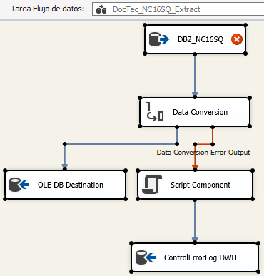

<table>
<colgroup>
<col style="width: 100%" />
</colgroup>
<thead>
<tr>
<th style="text-align: left;">
<strong>SELECT A.ESTABL, A.CODOBRA,
A.PLANO, A.LINEA, A.TIPODES, A.ELEMEN, A.CANPROD, B.UNIDPRO, A.CANCONT,
B.UNIDCON, A.NUMELE</strong>

<strong>FROM NEC.NC16SQ A</strong>

<strong>INNER JOIN NEC.NC12SQ B</strong>

<strong>ON A.ESTABL = B.ESTABL</strong>

<strong>AND A.CODOBRA = B.CODOBRA</strong>

<strong>AND A.PLANO = B.PLANO</strong>

<strong>AND A.LINEA = B.LINEA</strong>

<strong>WHERE (A.CODOBRA =?) AND (A.ESTABL =?) AND
EXISTS</strong>

<strong>(SELECT ESTABL, CODOBRA, PLANO, TIPOPLA, TAREA, CENDESA,
CENCOST, ZONA, BLOQUE, MODULO, SECCION, GRUCOSTE, PRODINT,</strong>

<strong>SITOFTEC, SITINPRO, SITAPROV, SITCONFI, SITINTEG, SITLOGIS,
URREALZ, URAPROB, URCIRCU, URINPRO, URINTEG, URAPROV,</strong>

<strong>URCONFI, AVISOREV, DNI, CLASIFI, SECUE06,
FECREAC</strong>

<strong>FROM NEC.NC10SQ B</strong>

<strong>WHERE (A.ESTABL = ESTABL) AND (A.CODOBRA = CODOBRA) AND
(A.PLANO = PLANO) AND (SITLOGIS = 'A' OR SITLOGIS =
'I'))</strong>
</th>
</tr>
</thead>
<tbody>
</tbody>
</table>

### Documentos_tecnicos_NC68SQ.dtsx (apunta a FESRV030)

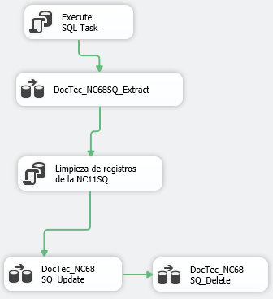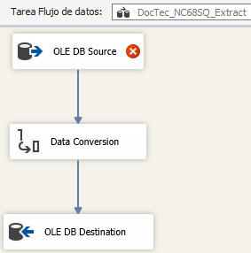

<table>
<colgroup>
<col style="width: 100%" />
</colgroup>
<thead>
<tr>
<th style="text-align: left;">
<strong>SELECT * FROM NEC.NC68SQ
A</strong>

<strong>WHERE A.CODOBRA=? AND A.ESTABL=? AND EXISTS</strong>

<strong>(SELECT * FROM NEC.NC10SQ B WHERE A.ESTABL= B.ESTABL AND
A.CODOBRA = B.CODOBRA AND A.PLANO = B.PLANO AND (B.SITLOGIS='A' OR
B.SITLOGIS='I'))</strong>
</th>
</tr>
</thead>
<tbody>
</tbody>
</table>

## Documentos_tecnicos_Prod

### Documentos_tecnicos_Prod_NC30SQ.dtsx

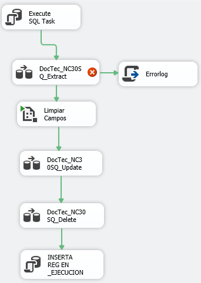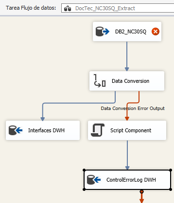

<table>
<colgroup>
<col style="width: 100%" />
</colgroup>
<thead>
<tr>
<th style="text-align: left;">
<strong>SELECT</strong>

<strong>N30.ESTABL, N30.CODOBRA, N30.PLANO, N30.TIPOPLA,
N30.TAREA,</strong>

<strong>N30.CENDESA, N30.CENCOST, N30.ZONA, N30.BLOQUE, N30.MODULO,
N30.SECCION,</strong>

<strong>N30.GRUCOSTE, N30.PRODINT, N31.SITOFTEC, N30.SITINPRO,
N30.SITCONFI,</strong>

<strong>N30.SITAPROV, N30.SITINTEG, N30.SITLOGIS, N30.SITAMAT,
N30.URREALZ,</strong>

<strong>N30.URAPROB, N30.URCIRCU, N30.URINPRO, N30.URINTEG,
N30.URAPROV,</strong>

<strong>N30.URCONFI, N30.AVISOREV, N30.DNI, N30.CLASIFI, N30.SECUE36,
N30.FECREAC,</strong>

<strong>CAST(BZNC.NCUDF06('NC36FV ','NC30SQ'
,N30.SECUE36,'DESPLAC','INGLES') AS CHAR(30)) AS DESPLAC,</strong>

<strong>CAST(BZNC.NCUDF06('NC36FV ','NC30SQ'
,N30.SECUE36,'DESPLAL','INGLES') AS CHAR(100)) AS DESPLAL</strong>

<strong>FROM NEC.NC30SQ N30</strong>

<strong>INNER JOIN NEC.NC31SQ N31</strong>

<strong>ON N30.ESTABL = N31.ESTABL</strong>

<strong>AND N30.CODOBRA = N31.CODOBRA</strong>

<strong>AND N30.PLANO = N31.PLANO</strong>

<strong>AND N31.REVISION = (SELECT MAX(N31A.REVISION)</strong>

<strong>FROM NEC.NC31SQ N31A</strong>

<strong>WHERE N31A.ESTABL = N30.ESTABL</strong>

<strong>AND N31A.CODOBRA = N30.CODOBRA</strong>

<strong>AND N31A.PLANO = N30.PLANO)</strong>

<strong>WHERE N30.CODOBRA =? AND N30.ESTABL = ? AND (N30.SITLOGIS =
'A' OR N30.SITLOGIS = 'I');</strong>
</th>
</tr>
</thead>
<tbody>
</tbody>
</table>

### Documentos_tecnicos_Prod_NC31SQ.dtsx

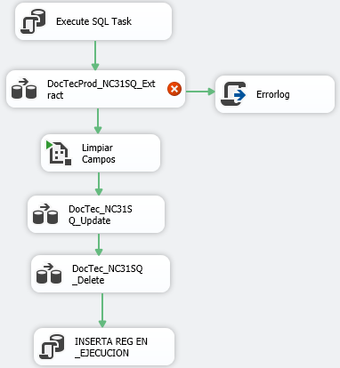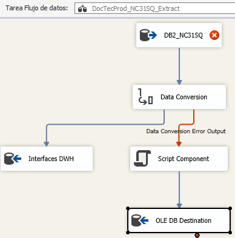

<table>
<colgroup>
<col style="width: 100%" />
</colgroup>
<thead>
<tr>
<th style="text-align: left;">
<strong>SELECT</strong>

<strong>ESTABL,CODOBRA,PLANO,REVISION,DNIDIB,DNICOM,</strong>

<strong>DNIAPR,FEINPRE,FEFIPRE,FEINREA,FEAPROB,FEFIREA,</strong>

<strong>FEENARM,FEENPRO,FEPRPRE,FEPRREA,FEINSPE,</strong>

<strong>FECLASI,CENDESA,CENCOST,SECOFTEC,SECINPRO,</strong>

<strong>SITOFTEC,SITINPRO,FECINPRO,HORINPRO,SITAMAT,</strong>

<strong>DOCUREV,CODENVIO,DOCLIC,DOCCLI,REVDIB,REVLIC,</strong>

<strong>REVCLI,PADRE,SECUE36,</strong>

<strong>cast(BZNC.NCUDF06('NC36FV ','NC31SQ'
,SECUE36,'OBSAR01','INGLES') as char(100)) AS OBSAR01,</strong>

<strong>cast(BZNC.NCUDF06('NC36FV ','NC31SQ'
,SECUE36,'OBSAR02','INGLES') as char(100)) AS OBSAR02</strong>

<strong>FROM NEC.NC31SQ A</strong>

<strong>WHERE A.CODOBRA=? AND A.ESTABL=? AND EXISTS</strong>

<strong>(SELECT * FROM NEC.NC30SQ B WHERE A.ESTABL= B.ESTABL AND
A.CODOBRA = B.CODOBRA AND A.PLANO = B.PLANO AND (B.SITLOGIS='A' OR
B.SITLOGIS='I'))</strong>
</th>
</tr>
</thead>
<tbody>
</tbody>
</table>

### Documentos_tecnicos_Prod_NC32SQ.dtsx

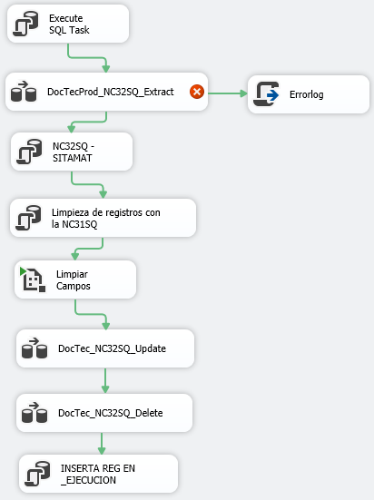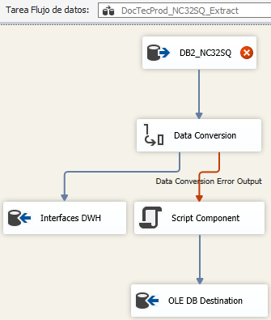

<table>
<colgroup>
<col style="width: 100%" />
</colgroup>
<thead>
<tr>
<th style="text-align: left;">
<strong>SELECT
ACABADO,BLOQUE,CANCONT,CANDEMN,CANPROD,</strong>

<strong>CODOBRA, DESGACO,DESGBLO,DESGLOC,DESGMAR,</strong>

<strong>DESGMOD,DETALLE,DIMENS,DNI,ESTABL,GRUCOSTE,INSPEC,</strong>

<strong>LINEA,LINEAO,LOCAL,MARPLAN,MODDEMN,MODULO,NORMAC,</strong>

<strong>NORMAD,NOTAS,NUMELE,OBSERV,PARTIC,PESO,PLANO,</strong>

<strong>PLANOO,PRESION,PROCESS,RESIST,REVISION,SECUE36,</strong>

<strong>SITAMAT,SNREF,SOLACO,TANOMI,TIPOACO,UNIDCON,UNIDPRO,</strong>

<strong>cast(BZNC.NCUDF06('NC36FV','NC32SQ',SECUE36,'DESLINE','INGLES')
as char(100)) AS DESCR</strong>

<strong>FROM NEC.NC32SQ A</strong>

<strong>WHERE A.CODOBRA=? AND A.ESTABL=? AND EXISTS</strong>

<strong>(SELECT * FROM NEC.NC30SQ B WHERE A.ESTABL= B.ESTABL AND
A.CODOBRA = B.CODOBRA AND A.PLANO = B.PLANO AND (B.SITLOGIS='A' OR
B.SITLOGIS='I'))</strong>
</th>
</tr>
</thead>
<tbody>
</tbody>
</table>

### Documentos_tecnicos_Prod_NC33SQ.dtsx

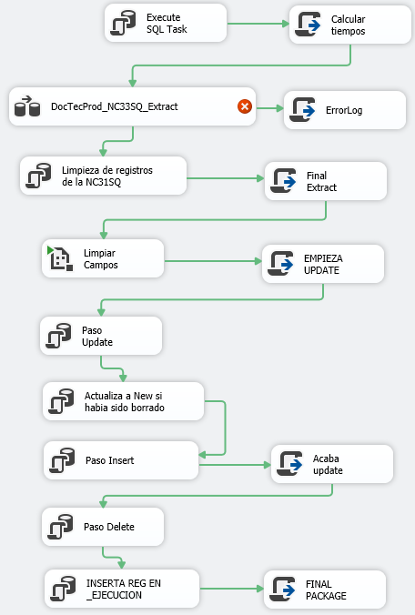

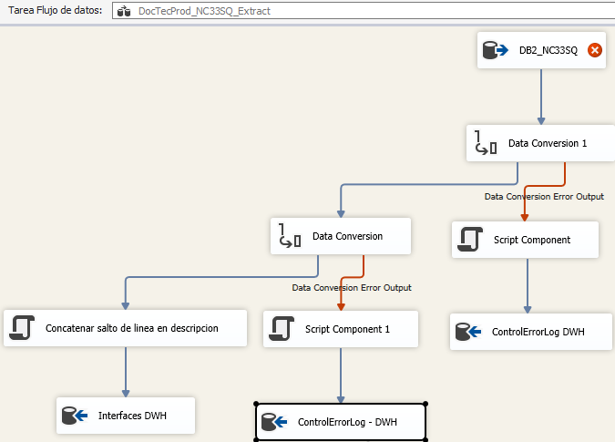

<table>
<colgroup>
<col style="width: 100%" />
</colgroup>
<thead>
<tr>
<th style="text-align: left;">
<strong>SELECT ESTABL, CODOBRA, PLANO,
TIPOREF, NUMREF,</strong>

<strong>TIPIND, INDREF, FEREFER, SECUE36, REVISION,</strong>

<strong>cast(BZNC.NCUDF06('NC36FV','NC33SQ',SECUE36,'DESREF','INGLES')
as VARCHAR(7000)) AS DESCR</strong>

<strong>FROM NEC.NC33SQ A</strong>

<strong>WHERE A.CODOBRA=? AND A.ESTABL=? AND EXISTS</strong>

<strong>(SELECT * FROM NEC.NC30SQ B WHERE A.ESTABL= B.ESTABL AND
A.CODOBRA = B.CODOBRA AND A.PLANO = B.PLANO AND (B.SITLOGIS='A' OR
B.SITLOGIS='I'))</strong>
</th>
</tr>
</thead>
<tbody>
</tbody>
</table>

### Documentos_tecnicos_Prod_NC34SQ.dtsx

(desde FESRV030, ¿a InterfacesAWD o a
InterfacesAWD_DES?)

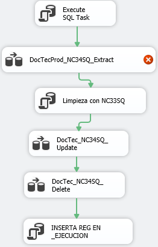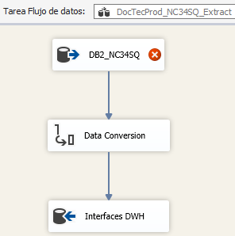

<table>
<colgroup>
<col style="width: 100%" />
</colgroup>
<thead>
<tr>
<th style="text-align: left;">
<strong>SELECT A.ESTABL, A.CODOBRA,
A.PLANO, A.TIPOREF, A.NUMREF, A.LINEIN, A.LINEFI</strong>

<strong>FROM NEC.NC34SQ A</strong>

<strong>WHERE A.CODOBRA=? AND A.ESTABL=? AND EXISTS</strong>

<strong>(SELECT * FROM NEC.NC10SQ B WHERE A.ESTABL= B.ESTABL AND
A.CODOBRA = B.CODOBRA AND A.PLANO = B.PLANO AND (B.SITLOGIS='A' OR
B.SITLOGIS='I'))</strong>
</th>
</tr>
</thead>
<tbody>
</tbody>
</table>

### Documentos_tecnicos_Prod_NC35SQ.dtsx

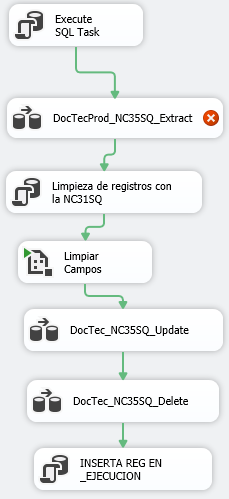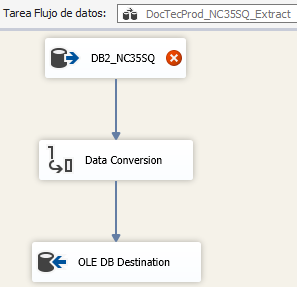

<table>
<colgroup>
<col style="width: 100%" />
</colgroup>
<thead>
<tr>
<th style="text-align: left;">
<strong>SELECT ESTABL, CODOBRA, PLANO,
LINEA, CANPROD,</strong>

<strong>UNIDPRO, CANRESE, PESO, NORMAD, NORMAC, DIMENS,</strong>

<strong>TANOMI, ACABADO, PARTIC, OBSERV, MAREQUI,
MARFUNC,</strong>

<strong>DNI, PROCESS, MARBORR, REVISION, SECUE36,</strong>

<strong>cast(BZNC.NCUDF06('NC36FV','NC35SQ',SECUE36,'DESLINE','INGLES')
AS CHAR(100)) AS DESCR</strong>

<strong>FROM NEC.NC35SQ A</strong>

<strong>WHERE A.CODOBRA=? AND A.ESTABL=? AND EXISTS</strong>

<strong>(SELECT * FROM NEC.NC30SQ B WHERE A.ESTABL= B.ESTABL AND
A.CODOBRA = B.CODOBRA AND A.PLANO = B.PLANO AND (B.SITLOGIS='A' OR
B.SITLOGIS='I'))</strong>
</th>
</tr>
</thead>
<tbody>
</tbody>
</table>

### Documentos_tecnicos_Prod_NC36SQ.dtsx

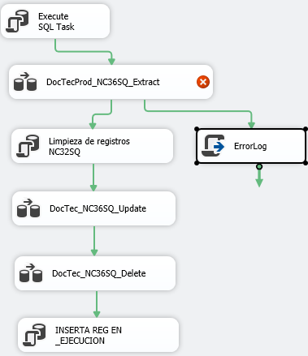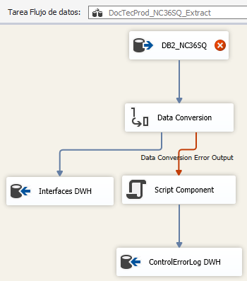

<table>
<colgroup>
<col style="width: 100%" />
</colgroup>
<thead>
<tr>
<th style="text-align: left;">
<strong>SELECT A.ESTABL, A.CODOBRA,
A.PLANO, A.LINEA, A.TIPODES,</strong>

<strong>A.ELEMEN, A.CANPROD, B.UNIDPRO, A.CANCONT, B.UNIDCON,
A.NUMELE</strong>

<strong>FROM NEC.NC36SQ A</strong>

<strong>INNER JOIN NEC.NC32SQ B</strong>

<strong>ON A.ESTABL = B.ESTABL</strong>

<strong>AND A.CODOBRA = B.CODOBRA</strong>

<strong>AND A.PLANO = B.PLANO</strong>

<strong>AND A.LINEA = B.LINEA</strong>

<strong>WHERE A.CODOBRA=? AND A.ESTABL=? AND EXISTS</strong>

<strong>(SELECT * FROM NEC.NC30SQ B WHERE A.ESTABL= B.ESTABL AND
A.CODOBRA = B.CODOBRA</strong>

<strong>AND A.PLANO = B.PLANO AND (B.SITLOGIS='A' OR
B.SITLOGIS='I'))</strong>
</th>
</tr>
</thead>
<tbody>
</tbody>
</table>

### Documentos_tecnicos_Prod_NC37SQ.dtsx

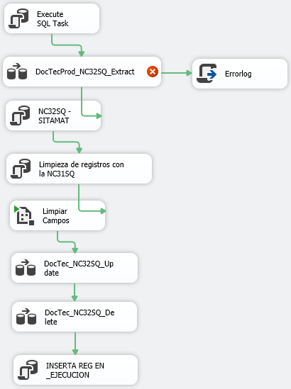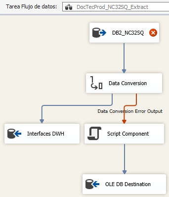

<table>
<colgroup>
<col style="width: 100%" />
</colgroup>
<thead>
<tr>
<th style="text-align: left;">
<strong>SELECT ESTABL, CODOBRA,
DOCUREV, DOCUREF,</strong>

<strong>FECDOCU, FEFINAL, NOTAS, DNIRDOC, TIPDOCU,
SECUE36,cast(</strong>

<strong>BZNC.NCUDF06('NC36FV','NC32SQ',SECUE36,'DESDOC','INGLES') as
varchar(4000)) AS DESCR</strong>

<strong>FROM NEC.NC37SQ A</strong>

<strong>WHERE A.CODOBRA=? AND A.ESTABL=? AND EXISTS</strong>

<strong>(SELECT * FROM NEC.NC38SQ B WHERE A.ESTABL= B.ESTABL AND
A.CODOBRA = B.CODOBRA AND A.DOCUREV = B.DOCUREV)</strong>
</th>
</tr>
</thead>
<tbody>
</tbody>
</table>

### Documentos_tecnicos_Prod_NC38SQ.dtsx

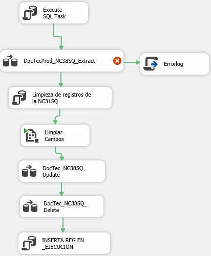

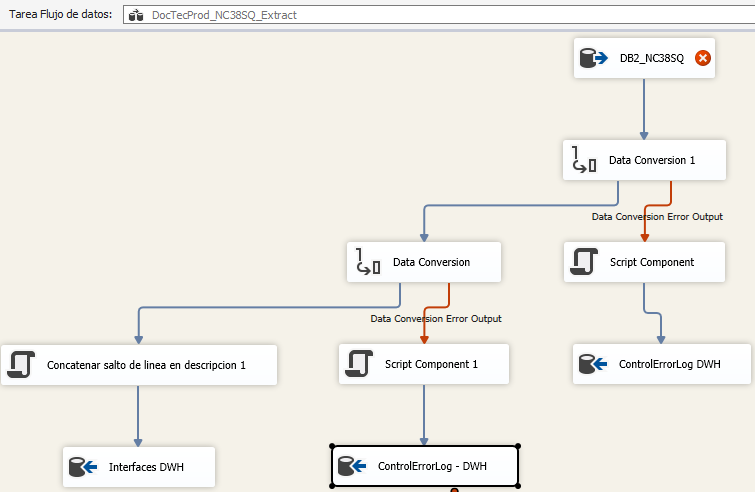

<table>
<colgroup>
<col style="width: 100%" />
</colgroup>
<thead>
<tr>
<th style="text-align: left;">
<strong>SELECT ESTABL, CODOBRA, PLANO,
REVISION,</strong>

<strong>DOCUREV, FEREVIS, SITREVIS, CTRPREV, CTRAEJEC,</strong>

<strong>CTRAVISO, DNIREV, DNIAPR, TIPDOCU, SECUE36,</strong>

<strong>REVPLA,</strong>

<strong>cast(BZNC.NCUDF06('NC36FV','NC38SQ',SECUE36,'DESREV','INGLES')
AS VARCHAR(4000)) AS DESCR</strong>

<strong>FROM NEC.NC38SQ A</strong>

<strong>WHERE A.CODOBRA=? AND A.ESTABL=? AND EXISTS</strong>

<strong>(SELECT * FROM NEC.NC30SQ B WHERE A.ESTABL= B.ESTABL AND
A.CODOBRA = B.CODOBRA AND A.PLANO = B.PLANO AND (B.SITLOGIS='A' OR
B.SITLOGIS='I'))</strong>
</th>
</tr>
</thead>
<tbody>
</tbody>
</table>

### Documentos_tecnicos_Prod_NC74SQ.dtsx

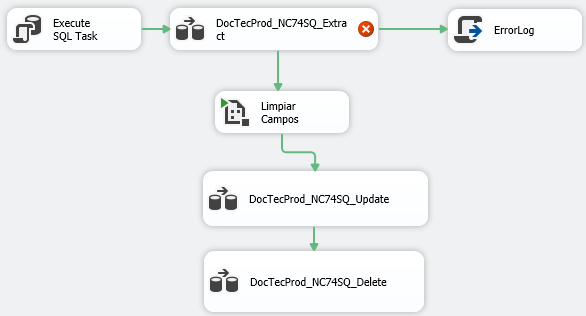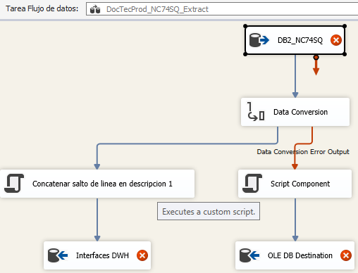

<table>
<colgroup>
<col style="width: 100%" />
</colgroup>
<thead>
<tr>
<th style="text-align: left;">
<strong>SELECT</strong>

<strong>NC.ESTABL, NC.CODOBRA, NC.PLANO, NC.LINEA,NC.
REVISION,</strong>

<strong>NC.HOJAINI, NC.HOJAFIN, NC.NUMHOJAS, NC.SECUE06,</strong>

<strong>cast(TT.descri as char(100)) AS DESCRIPCION</strong>

<strong>FROM nec.nc74sq as NC</strong>

<strong>LEFT JOIN NEC.ttextos AS TT</strong>

<strong>ON NC.secue06 = TT.secue</strong>

<strong>AND TT.tablfich = 'NC74SQ' AND
TT.IDIOMA='INGLES'</strong>

<strong>WHERE CODOBRA =? AND ESTABL= ? and exists (SELECT * FROM
NEC.NC10SQ B WHERE NC.ESTABL= B.ESTABL AND NC.CODOBRA = B.CODOBRA AND
NC.PLANO = B.PLANO AND (B.SITLOGIS='A' OR
B.SITLOGIS='I'))</strong>
</th>
</tr>
</thead>
<tbody>
</tbody>
</table>

### Documentos_tecnicos_Prod_NC75SQ.dtsx

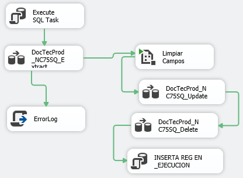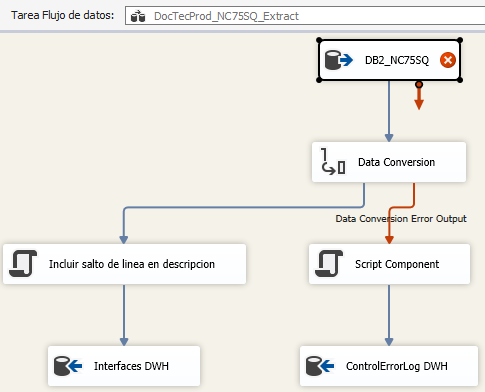

<table>
<colgroup>
<col style="width: 100%" />
</colgroup>
<thead>
<tr>
<th style="text-align: left;">
<strong>SELECT</strong>

<strong>NC.ESTABL, NC.CODOBRA, NC.PLANO, NC.LINEA,NC.
REVISION,</strong>

<strong>NC.HOJAINI, NC.HOJAFIN, NC.NUMHOJAS, NC.SECUE06,</strong>

<strong>cast(TT.descri as char(100)) AS DESCRIPCION</strong>

<strong>FROM nec.nc75sq as NC</strong>

<strong>LEFT JOIN NEC.ttextos AS TT</strong>

<strong>ON NC.secue06 = TT.secue AND TT.IDIOMA='INGLES'</strong>

<strong>AND TT.tablfich = 'NC75SQ'</strong>

<strong>WHERE CODOBRA=? AND ESTABL=? and exists (SELECT * FROM
NEC.NC30SQ B WHERE NC.ESTABL= B.ESTABL</strong>

<strong>AND NC.CODOBRA = B.CODOBRA AND NC.PLANO = B.PLANO AND
(B.SITLOGIS='A' OR B.SITLOGIS='I'))</strong>
</th>
</tr>
</thead>
<tbody>
</tbody>
</table>

## Paquetes E

### EEA5.dtsx

<table>
<colgroup>
<col style="width: 100%" />
</colgroup>
<thead>
<tr>
<th style="text-align: left;">Dias Ejecutados (Script)</th>
</tr>
</thead>
<tbody>
<tr>
<td style="text-align: left;">
Ejecuta estos paquetes

T_DB_C_E_CabAdd

T_DB_C_E_CabDel

T_DB_C_E_Cables

T_DB_C_E_Connections

T_DB_C_E_Notes

T_DB_C_E_Equipment

T_DB_C_SC_CabAdd

T_DB_C_SC_CabDel

T_DB_C_SC_Cables

T_DB_C_SC_Connections

T_DB_C_SC_Equipment

T_DB_C_SC_Notes

T_DB_R_E_CabAdd

T_DB_R_E_CabDel

T_DB_R_E_Cables

T_DB_R_E_Equipment

T_DB_R_E_Route

T_DB_R_E_ROUTEBLOCK

T_DB_R_SC_CabAdd

T_DB_R_SC_CabDel

T_DB_R_SC_Cables

T_DB_R_SC_Equipment

T_DB_R_SC_Route

T_DB_R_SC_ROUTEBLOCK

T_DBCatal

T_DBDesign

T_DBLme

T_DBPcontrol

T_DBLocal
</td>
</tr>
<tr>
<td style="text-align: left;">Fecha maxiima de UpdateNotice con
User::Select_MasUnDia</td>
</tr>
</tbody>
</table>

### EEA5_DB2.dtsx

<table>
<colgroup>
<col style="width: 100%" />
</colgroup>
<thead>
<tr>
<th style="text-align: left;">
Ejecuta los paquetes

EEA5_NC30SQ.dtsx

EEA5_NC68SQ.dtsx
</th>
</tr>
</thead>
<tbody>
</tbody>
</table>

### Eliminar_deleted.dtsx

|     |
|-----|

### EXTRACT_ARBOL_MARCAS.dtsx

<table>
<colgroup>
<col style="width: 100%" />
</colgroup>
<thead>
<tr>
<th style="text-align: left;">
<strong>select ma.marcah, ma.marcap,
ma.repere, dg.codenat as mpmi</strong>

<strong>from coral.marca ma</strong>

<strong>left outer join coral.cora200a as dg</strong>

<strong>on ma.buque = dg.buque</strong>

<strong>and ma.marcah = dg.marca200</strong>

<strong>where ma.buque = ?</strong>
</th>
</tr>
</thead>
<tbody>
</tbody>
</table>

### EXTRACT_CI_MF.dtsx

<table>
<colgroup>
<col style="width: 100%" />
</colgroup>
<thead>
<tr>
<th style="text-align: left;">
<strong>select c201.buque, c221.pedirp
as CI, c201.marca200, mf.repere, C201.TIPAGR, c201.pedido,
c201.nseq</strong>

<strong>from coral.cora201 c201</strong>

<strong>inner join coral.cora221 c221</strong>

<strong>on c221.buque = c201.buque</strong>

<strong>and c221.pedido = c201.pedido</strong>

<strong>and c221.nseq = c201.nseq</strong>

<strong>inner join coral.marca mf on</strong>

<strong>c201.buque = mf.buque and</strong>

<strong>c201.marca200 = mf.marcah</strong>

<strong>where c201.buque = ?</strong>

<strong>and c221.pedirp &lt;&gt; '' and
c201.tipagr='A';</strong>
</th>
</tr>
</thead>
<tbody>
</tbody>
</table>

### FinUpdatenotice.dtsx

| UPDATE UpdateNotice set Finish_Date = getdate() where Id = (select max(id) from UpdateNotice ) |
|----|

## Gestion_Documental

### Gestion_Documental_Documentos.dtsx

<table>
<colgroup>
<col style="width: 100%" />
</colgroup>
<thead>
<tr>
<th style="text-align: left;">TRUNCATE TABLE Documentos</th>
</tr>
</thead>
<tbody>
<tr>
<td style="text-align: left;">
<strong>--GD_Documentos_Extract
1</strong>

<strong>SELECT DISTINCT</strong>

<strong>Documentos.cdgDocumento,</strong>

<strong>Documentos.cdgTipoDoc,</strong>

<strong>Documentos.DescripcionDoc,</strong>

<strong>Documentos.Establecimiento,</strong>

<strong>Documentos.Division,</strong>

<strong>Documentos.cdgOrigen,</strong>

<strong>Documentos.ReferenciaOrigen,</strong>

<strong>Documentos.Obsoleto,</strong>

<strong>Documentos.fchObsoleto,</strong>

<strong>Documentos.horaObsoleto,</strong>

<strong>Documentos.AutorObsoleto,</strong>

<strong>Documentos.NotasObsoleto,</strong>

<strong>Documentos.cdgTipoEntidad</strong>

<strong>FROM Documentos</strong>

<strong>Where Documentos.cdgDocumento in</strong>

<strong>(select cdgDocumento from
tcCodigos_Documentos)</strong>
</td>
</tr>
<tr>
<td style="text-align: left;">
--GD_Documentos_Extract

<strong>SELECT DISTINCT Documentos.cdgDocumento,
Documentos.cdgTipoDoc, Documentos.DescripcionDoc,
Documentos.Establecimiento, Documentos.Division, Documentos.cdgOrigen,
Documentos.ReferenciaOrigen, Documentos.Obsoleto,
Documentos.fchObsoleto, Documentos.horaObsoleto,
Documentos.AutorObsoleto, Documentos.NotasObsoleto,
Documentos.cdgTipoEntidad FROM Documentos INNER JOIN ((Select DISTINCT
tcDocsOT_Documentos.cdgDocumento as cdgDocumento,
tcDocsOT_Documentos.Establecimiento as Establecimiento,
tcDocsOT_Documentos.Obra as Obra FROM tcDocsOT_Documentos) UNION (Select
DISTINCT tcOOTT_Documentos.cdgDocumento as cdgDocumento,
tcOOTT_Documentos.Establecimiento as Establecimiento,
tcOOTT_Documentos.Obra as Obra FROM tcOOTT_Documentos where 'ALHD' =
'AWD') UNION (Select DISTINCT tcAvisosRevision_Documentos.cdgDocumento
COLLATE Modern_Spanish_CI_AS as cdgDocumento,
tcAvisosRevision_Documentos.Establecimiento COLLATE Modern_Spanish_CI_AS
as Establecimiento, tcAvisosRevision_Documentos.Obra COLLATE
Modern_Spanish_CI_AS as Obra FROM tcAvisosRevision_Documentos) UNION
(Select DISTINCT tcHojasCatalogo_Documentos.cdgdocumento COLLATE
Modern_Spanish_CI_AS as cdgdocumento,
Vista_Necora@INCopic_HojasCatalogoAplicabilidadObras.establecimiento
COLLATE Modern_Spanish_CI_AS as Establecimiento,
Vista_Necora@INCopic_HojasCatalogoAplicabilidadObras.obra COLLATE
Modern_Spanish_CI_AS as Obra FROM tcHojasCatalogo_Documentos left join
Vista_Necora@INCopic_HojasCatalogoAplicabilidadObras on
Vista_Necora@INCopic_HojasCatalogoAplicabilidadObras.codigohoja =
tcHojasCatalogo_Documentos.cdgentidad) ) as T ON T.cdgDocumento =
Documentos.cdgDocumento WHERE T.Establecimiento ='A' And T.Obra
='AWD1'</strong>
</td>
</tr>
<tr>
<td style="text-align: left;">VARIABLE LIMPIEZA (script)</td>
</tr>
<tr>
<td style="text-align: left;">
--Limpieza GD

User::V_SQL_LIMPIEZA con User::V_OBRA y User::V_ESTABL
</td>
</tr>
<tr>
<td style="text-align: left;">GD_Documentos_Update
(GD_Documentos_Delete, deshabilitado)</td>
</tr>
</tbody>
</table>

### Gestion_Documental_Ficheros.dtsx

<table>
<colgroup>
<col style="width: 100%" />
</colgroup>
<thead>
<tr>
<th style="text-align: left;">
--En GD, Extracto Previo 1

<strong>SELECT DISTINCT</strong>

<strong>dbo.Ficheros.cdgFichero,</strong>

<strong>dbo.Ficheros.cdgTipoFichero,</strong>

<strong>dbo.Ficheros.DescripcionFichero,</strong>

<strong>dbo.Ficheros.AutorRegistro,</strong>

<strong>dbo.Ficheros.NombreAutorRegistro,</strong>

<strong>dbo.Ficheros.fchRegistro,</strong>

<strong>dbo.Ficheros.cdgOrigenFichero,</strong>

<strong>dbo.Ficheros.AutorFicheroOrig,</strong>

<strong>dbo.Ficheros.UbicacionFicheroOrig,</strong>

<strong>dbo.Ficheros.NombreFicheroOrig,</strong>

<strong>dbo.Ficheros.Extensionfichero,</strong>

<strong>dbo.Ficheros.fchFicheroOrig,</strong>

<strong>'R' + substring(</strong>

<strong>dbo.Ficheros.cdgUbicacion,2,7</strong>

<strong>) as cdgUbicacion,</strong>

<strong>dbo.Ficheros.SubCarpeta,</strong>

<strong>dbo.Ficheros.cdgIdioma,</strong>

<strong>dbo.Ficheros.Centro,</strong>

<strong>dbo.Ficheros.NumEquipo,</strong>

<strong>dbo.Ficheros.NivelConfidencial,</strong>

<strong>dbo.Ficheros.Protegido,</strong>

<strong>dbo.Ficheros.TamañoKb,</strong>

<strong>dbo.Ficheros.TamañoMB,</strong>

<strong>dbo.Ficheros.Procesado,</strong>

<strong>dbo.Ficheros.fch</strong>

<strong>FROM Ficheros</strong>

<strong>LEFT JOIN trRevisionDocFichero</strong>

<strong>on Ficheros.cdgFichero =
trRevisionDocFichero.cdgFichero</strong>

<strong>where trRevisionDocFichero.cdgDocumento in</strong>

<strong>(select cdgDocumento from
tcCodigos_documentos)</strong>
</th>
</tr>
</thead>
<tbody>
<tr>
<td style="text-align: left;">
--En GD, Extracto Previo 2

<strong>SELECT DISTINCT</strong>

<strong>dbo.Ficheros.cdgFichero,</strong>

<strong>dbo.Ficheros.cdgTipoFichero,</strong>

<strong>dbo.Ficheros.DescripcionFichero,</strong>

<strong>dbo.Ficheros.AutorRegistro,</strong>

<strong>dbo.Ficheros.NombreAutorRegistro,</strong>

<strong>dbo.Ficheros.fchRegistro,</strong>

<strong>dbo.Ficheros.cdgOrigenFichero,</strong>

<strong>dbo.Ficheros.AutorFicheroOrig,</strong>

<strong>dbo.Ficheros.UbicacionFicheroOrig,</strong>

<strong>dbo.Ficheros.NombreFicheroOrig,</strong>

<strong>dbo.Ficheros.Extensionfichero,</strong>

<strong>dbo.Ficheros.fchFicheroOrig,</strong>

<strong>'R' + substring(</strong>

<strong>dbo.Ficheros.cdgUbicacion,2,7</strong>

<strong>) as cdgUbicacion,</strong>

<strong>dbo.Ficheros.SubCarpeta,</strong>

<strong>dbo.Ficheros.cdgIdioma,</strong>

<strong>dbo.Ficheros.Centro,</strong>

<strong>dbo.Ficheros.NumEquipo,</strong>

<strong>dbo.Ficheros.NivelConfidencial,</strong>

<strong>dbo.Ficheros.Protegido,</strong>

<strong>dbo.Ficheros.TamañoKb,</strong>

<strong>dbo.Ficheros.TamañoMB,</strong>

<strong>dbo.Ficheros.Procesado,</strong>

<strong>dbo.Ficheros.fch</strong>

<strong>FROM Ficheros</strong>

<strong>LEFT JOIN trRevisionSecFichero</strong>

<strong>on Ficheros.cdgFichero =
trRevisionSecFichero.cdgFichero</strong>

<strong>LEFT JOIN SeccionesDocumento</strong>

<strong>on SeccionesDocumento.cdgSeccion =
trRevisionSecFichero.cdgSeccion</strong>

<strong>WHERE SeccionesDocumento.cdgDocumento in</strong>

(select cdgDocumento from tcCodigos_documentos)
</td>
</tr>
<tr>
<td
style="text-align: left;">
--GD_Ficheros_Extract_trRevisionDocFichero

--User::V_EXTRACT_FICH_TR

<strong>SELECT DISTINCT dbo.Ficheros.cdgFichero,
dbo.Ficheros.cdgTipoFichero, dbo.Ficheros.DescripcionFichero,
dbo.Ficheros.AutorRegistro, dbo.Ficheros.NombreAutorRegistro,
dbo.Ficheros.fchRegistro, dbo.Ficheros.cdgOrigenFichero,
dbo.Ficheros.AutorFicheroOrig, dbo.Ficheros.UbicacionFicheroOrig,
dbo.Ficheros.NombreFicheroOrig, dbo.Ficheros.Extensionfichero,
dbo.Ficheros.fchFicheroOrig, 'R' +
substring(dbo.Ficheros.cdgUbicacion,2,7) as cdgUbicacion,
dbo.Ficheros.SubCarpeta, dbo.Ficheros.cdgIdioma, dbo.Ficheros.Centro,
dbo.Ficheros.NumEquipo, dbo.Ficheros.NivelConfidencial,
dbo.Ficheros.Protegido, dbo.Ficheros.TamañoKb, dbo.Ficheros.TamañoMB,
dbo.Ficheros.Procesado, dbo.Ficheros.fch FROM Ficheros LEFT JOIN
trRevisionDocFichero on Ficheros.cdgFichero =
trRevisionDocFichero.cdgFichero INNER JOIN ((Select DISTINCT
tcDocsOT_Documentos.cdgDocumento as cdgDocumento,
tcDocsOT_Documentos.RevisionDoc as RevisionDoc,
tcDocsOT_Documentos.Establecimiento as Establecimiento,
tcDocsOT_Documentos.Obra as Obra FROM tcDocsOT_Documentos) UNION (Select
DISTINCT tcOOTT_Documentos.cdgDocumento as cdgDocumento,
tcOOTT_Documentos.RevisionDoc as RevisionDoc,
tcOOTT_Documentos.Establecimiento as Establecimiento,
tcOOTT_Documentos.Obra as Obra FROM tcOOTT_Documentos WHERE 'ALHD' =
'ALHD' ) UNION (Select DISTINCT tcAvisosRevision_Documentos.cdgDocumento
COLLATE Modern_Spanish_CI_AS as cdgDocumento,
tcAvisosRevision_Documentos.RevisionDoc as RevisionDoc,
tcAvisosRevision_Documentos.Establecimiento COLLATE Modern_Spanish_CI_AS
as Establecimiento, tcAvisosRevision_Documentos.Obra COLLATE
Modern_Spanish_CI_AS as Obra FROM tcAvisosRevision_Documentos) UNION
(Select DISTINCT tcHojasCatalogo_Documentos.cdgdocumento COLLATE
Modern_Spanish_CI_AS as cdgdocumento,
tcHojasCatalogo_Documentos.RevisionDoc as
RevisionDoc,Vista_Necora@INCopic_HojasCatalogoAplicabilidadObras.establecimiento
COLLATE Modern_Spanish_CI_AS as Establecimiento,
Vista_Necora@INCopic_HojasCatalogoAplicabilidadObras.obra COLLATE
Modern_Spanish_CI_AS as Obra FROM tcHojasCatalogo_Documentos left join
Vista_Necora@INCopic_HojasCatalogoAplicabilidadObras on
Vista_Necora@INCopic_HojasCatalogoAplicabilidadObras.codigohoja =
tcHojasCatalogo_Documentos.cdgentidad) ) as T ON T.cdgDocumento =
trRevisionDocFichero.cdgDocumento and T.RevisionDoc &gt;=
trRevisionDocFichero.RevisionDoc where T.Establecimiento = '.' And
T.Obra = '....'</strong>
</td>
</tr>
<tr>
<td style="text-align: left;">
-­-GD_Ficheros_Extract_Secciones

--User::V_EXTRACT_FICH_SEC

<strong>SELECT DISTINCT dbo.Ficheros.cdgFichero,
dbo.Ficheros.cdgTipoFichero, dbo.Ficheros.DescripcionFichero,
dbo.Ficheros.AutorRegistro, dbo.Ficheros.NombreAutorRegistro,
dbo.Ficheros.fchRegistro, dbo.Ficheros.cdgOrigenFichero,
dbo.Ficheros.AutorFicheroOrig, dbo.Ficheros.UbicacionFicheroOrig,
dbo.Ficheros.NombreFicheroOrig, dbo.Ficheros.Extensionfichero,
dbo.Ficheros.fchFicheroOrig, 'R' +
substring(dbo.Ficheros.cdgUbicacion,2,7) as cdgUbicacion,
dbo.Ficheros.SubCarpeta, dbo.Ficheros.cdgIdioma, dbo.Ficheros.Centro,
dbo.Ficheros.NumEquipo, dbo.Ficheros.NivelConfidencial,
dbo.Ficheros.Protegido, dbo.Ficheros.TamañoKb, dbo.Ficheros.TamañoMB,
dbo.Ficheros.Procesado, dbo.Ficheros.fch FROM Ficheros LEFT JOIN
trRevisionSecFichero on Ficheros.cdgFichero =
trRevisionSecFichero.cdgFichero LEFT JOIN SeccionesDocumento on
SeccionesDocumento.cdgSeccion = trRevisionSecFichero.cdgSeccion INNER
JOIN ((Select DISTINCT tcDocsOT_Documentos.cdgDocumento as cdgDocumento,
tcDocsOT_Documentos.Establecimiento as Establecimiento,
tcDocsOT_Documentos.Obra as Obra FROM tcDocsOT_Documentos) UNION (Select
DISTINCT tcOOTT_Documentos.cdgDocumento as cdgDocumento,
tcOOTT_Documentos.Establecimiento as Establecimiento,
tcOOTT_Documentos.Obra as Obra FROM tcOOTT_Documentos where 'ALHD' =
'ALHD') union (Select DISTINCT tcAvisosRevision_Documentos.cdgDocumento
as cdgDocumento, tcAvisosRevision_Documentos.Establecimiento as
Establecimiento, tcAvisosRevision_Documentos.Obra as Obra FROM
tcAvisosRevision_Documentos) UNION (Select DISTINCT
tcHojasCatalogo_Documentos.cdgdocumento COLLATE Modern_Spanish_CI_AS as
cdgdocumento,
Vista_Necora@INCopic_HojasCatalogoAplicabilidadObras.establecimiento
COLLATE Modern_Spanish_CI_AS as Establecimiento,
Vista_Necora@INCopic_HojasCatalogoAplicabilidadObras.obra COLLATE
Modern_Spanish_CI_AS as Obra FROM tcHojasCatalogo_Documentos left join
Vista_Necora@INCopic_HojasCatalogoAplicabilidadObras on
Vista_Necora@INCopic_HojasCatalogoAplicabilidadObras.codigohoja =
tcHojasCatalogo_Documentos.cdgentidad) ) as T ON T.cdgDocumento =
SeccionesDocumento.cdgDocumento where T.Establecimiento = '.' And T.Obra
= '....'</strong>
</td>
</tr>
<tr>
<td style="text-align: left;">
--Limpieza huérfanos

<strong>delete from ficheros where ficheros.cdgfichero not
in</strong>

<strong>(select P.cdgfichero from</strong>

<strong>((select tr.cdgfichero</strong>

<strong>from trrevisiondocfichero tr</strong>

<strong>inner join RevisionesDocumento Rd</strong>

<strong>on tr.cdgDocumento = rd.cdgDocumento and tr.revisionDoc =
rd.revisionDoc)</strong>

<strong>UNION (select SEC.cdgfichero</strong>

<strong>from trrevisionsecfichero SEC inner join (select
RVSEC.*</strong>

<strong>from RevisionesSeccion RVSEC</strong>

<strong>inner join Trrevisiondocrevisionsec DocSec</strong>

<strong>on RVSEC.cdgseccion = DocSec.cdgseccion</strong>

<strong>) as c</strong>

<strong>on SEC.cdgseccion = c.cdgseccion</strong>

<strong>and SEC.revisionSec = c.revisionSec)) P</strong>

<strong>where P.cdgfichero = cdgfichero)</strong>
</td>
</tr>
<tr>
<td style="text-align: left;">
--Limpieza de campos

Ejecuta paquete _AtributosConfig.dtsx
</td>
</tr>
<tr>
<td style="text-align: left;">
--Paso Updated

UPDATE FICHEROS

SET cdgTipoFichero = DWH.cdgTipoFichero

,DescripcionFichero = DWH.DescripcionFichero

,AutorRegistro = DWH.AutorRegistro

,NombreAutorRegistro = DWH.NombreAutorRegistro

,fchRegistro = DWH.fchRegistro

,cdgOrigenFichero = DWH.cdgOrigenFichero

,AutorFicheroOrig = DWH.AutorFicheroOrig

,UbicacionFicheroOrig = DWH.UbicacionFicheroOrig

,NombreFicheroOrig = DWH.NombreFicheroOrig

,Extensionfichero = DWH.Extensionfichero

,fchFicheroOrig = DWH.fchFicheroOrig

,cdgUbicacion = DWH.cdgUbicacion

,SubCarpeta = DWH.SubCarpeta

,cdgIdioma = DWH.cdgIdioma

,Centro = DWH.Centro

,NumEquipo = DWH.NumEquipo

,NivelConfidencial = DWH.NivelConfidencial

,Protegido = DWH.Protegido

,TamañoKb = DWH.TamañoKb

,TamañoMB = DWH.TamañoMB

,Procesado = DWH.Procesado

,fch = DWH.fch

,_TSTAMP = getdate()

,_CHECKSUM = CHECKSUM

(DWH.cdgFichero ,DWH.cdgTipoFichero ,DWH.DescripcionFichero

,DWH.AutorRegistro ,DWH.NombreAutorRegistro ,DWH.fchRegistro

,DWH.cdgOrigenFichero ,DWH.AutorFicheroOrig
,DWH.UbicacionFicheroOrig

,DWH.NombreFicheroOrig ,DWH.Extensionfichero ,DWH.fchFicheroOrig

,DWH.cdgUbicacion ,DWH.SubCarpeta ,DWH.cdgIdioma

,DWH.Centro ,DWH.NumEquipo ,DWH.NivelConfidencial

,DWH.Protegido ,DWH.TamañoKb ,DWH.TamañoMB

,DWH.Procesado ,DWH.fch)

,_STATUS = 'UPDATED'

FROM FICHEROS AWD

INNER JOIN INTERFACESDWH.DBO.FICHEROS DWH

ON DWH.CDGFICHERO = AWD.CDGFICHERO

WHERE AWD._CHECKSUM &lt;&gt; CHECKSUM

(DWH.cdgFichero ,DWH.cdgTipoFichero ,DWH.DescripcionFichero

,DWH.AutorRegistro ,DWH.NombreAutorRegistro ,DWH.fchRegistro

,DWH.cdgOrigenFichero ,DWH.AutorFicheroOrig
,DWH.UbicacionFicheroOrig

,DWH.NombreFicheroOrig ,DWH.Extensionfichero ,DWH.fchFicheroOrig

,DWH.cdgUbicacion ,DWH.SubCarpeta ,DWH.cdgIdioma

,DWH.Centro ,DWH.NumEquipo ,DWH.NivelConfidencial

,DWH.Protegido ,DWH.TamañoKb ,DWH.TamañoMB

,DWH.Procesado ,DWH.fch)
</td>
</tr>
<tr>
<td style="text-align: left;">
--Actualiza estado a NEW

UPDATE FICHEROS

SET _STATUS = 'NEW'

, _TSTAMP = GETDATE()

FROM FICHEROS AWD

INNER JOIN INTERFACESDWH.DBO.FICHEROS DWH

ON DWH.CDGFICHERO = AWD.CDGFICHERO

WHERE AWD._STATUS = 'DELETED'
</td>
</tr>
<tr>
<td style="text-align: left;">
--Inserta nuevos

INSERT INTO FICHEROS

(cdgFichero ,cdgTipoFichero ,DescripcionFichero

,AutorRegistro ,NombreAutorRegistro ,fchRegistro

,cdgOrigenFichero ,AutorFicheroOrig ,UbicacionFicheroOrig

,NombreFicheroOrig ,Extensionfichero ,fchFicheroOrig

,cdgUbicacion ,SubCarpeta ,cdgIdioma

,Centro ,NumEquipo ,NivelConfidencial

,Protegido ,TamañoKb ,TamañoMB

,Procesado ,fch ,_TSTAMP

,_CHECKSUM ,_STATUS)

SELECT DWH.cdgFichero ,DWH.cdgTipoFichero ,DWH.DescripcionFichero

,DWH.AutorRegistro ,DWH.NombreAutorRegistro ,DWH.fchRegistro

,DWH.cdgOrigenFichero ,DWH.AutorFicheroOrig
,DWH.UbicacionFicheroOrig

,DWH.NombreFicheroOrig ,DWH.Extensionfichero ,DWH.fchFicheroOrig

,DWH.cdgUbicacion ,DWH.SubCarpeta ,DWH.cdgIdioma

,DWH.Centro ,DWH.NumEquipo ,DWH.NivelConfidencial

,DWH.Protegido ,DWH.TamañoKb ,DWH.TamañoMB

,DWH.Procesado ,DWH.fch ,GETDATE() AS _TSTAMP

,CHECKSUM

(DWH.cdgFichero ,DWH.cdgTipoFichero ,DWH.DescripcionFichero

,DWH.AutorRegistro ,DWH.NombreAutorRegistro ,DWH.fchRegistro

,DWH.cdgOrigenFichero ,DWH.AutorFicheroOrig
,DWH.UbicacionFicheroOrig

,DWH.NombreFicheroOrig ,DWH.Extensionfichero ,DWH.fchFicheroOrig

,DWH.cdgUbicacion ,DWH.SubCarpeta ,DWH.cdgIdioma

,DWH.Centro ,DWH.NumEquipo ,DWH.NivelConfidencial

,DWH.Protegido ,DWH.TamañoKb ,DWH.TamañoMB

,DWH.Procesado ,DWH.fch) AS _CHECKSUM

,'NEW' AS _STATUS

FROM INTERFACESDWH.DBO.FICHEROS DWH

WHERE NOT EXISTS

(SELECT AWD.* FROM FICHEROS AWD WHERE AWD.CDGFICHERO =
DWH.CDGFICHERO)
</td>
</tr>
</tbody>
</table>

### Gestion_Documental_RevisionesDocumento.dtsx

<table>
<colgroup>
<col style="width: 100%" />
</colgroup>
<thead>
<tr>
<th>TRUNCATE TABLE RevisionesDocumento</th>
</tr>
</thead>
<tbody>
<tr>
<td>
--GD_RevDocumento_Extract

--User::V_SQL_EXTRACT_REVDOC

<strong>select distinct * from((SELECT distinct RevisionesDocumento.*
FROM RevisionesDocumento INNER JOIN ((Select DISTINCT
tcDocsOT_Documentos.cdgDocumento as cdgDocumento,
tcDocsOT_Documentos.RevisionDoc as RevisionDoc,
tcDocsOT_Documentos.Establecimiento as Establecimiento,
tcDocsOT_Documentos.Obra as Obra FROM tcDocsOT_Documentos) UNION (Select
DISTINCT tcOOTT_Documentos.cdgDocumento as cdgDocumento,
tcOOTT_Documentos.RevisionDoc as RevisionDoc,
tcOOTT_Documentos.Establecimiento as Establecimiento,
tcOOTT_Documentos.Obra as Obra FROM tcOOTT_Documentos where 'ALHD' =
'AWD') UNION (Select DISTINCT tcAvisosRevision_Documentos.cdgDocumento
COLLATE Modern_Spanish_CI_AS as cdgDocumento,
tcAvisosRevision_Documentos.RevisionDoc as RevisionDoc,
tcAvisosRevision_Documentos.Establecimiento COLLATE Modern_Spanish_CI_AS
as Establecimiento, tcAvisosRevision_Documentos.Obra COLLATE
Modern_Spanish_CI_AS as Obra FROM tcAvisosRevision_Documentos) UNION
(Select DISTINCT tcHojasCatalogo_Documentos.cdgdocumento COLLATE
Modern_Spanish_CI_AS as cdgdocumento,
tcHojasCatalogo_Documentos.RevisionDoc as RevisionDoc,
Vista_Necora@INCopic_HojasCatalogoAplicabilidadObras.establecimiento
COLLATE Modern_Spanish_CI_AS as Establecimiento,
Vista_Necora@INCopic_HojasCatalogoAplicabilidadObras.obra COLLATE
Modern_Spanish_CI_AS as Obra FROM tcHojasCatalogo_Documentos left join
Vista_Necora@INCopic_HojasCatalogoAplicabilidadObras on
Vista_Necora@INCopic_HojasCatalogoAplicabilidadObras.codigohoja =
tcHojasCatalogo_Documentos.cdgentidad) ) as T on T.cdgDocumento =
RevisionesDocumento.cdgDocumento and Revisionesdocumento.RevisionDoc
&lt;= T.RevisionDoc WHERE T.Establecimiento ='A' and T.Obra = 'AWD1')
union (SELECT RD.* from RevisionesDocumento RD inner join
tcCodigos_documentos tc on tc.cdgdocumento = RD.cdgdocumento collate
Modern_Spanish_CI_AS and RD.revisiondoc &lt;= tc.revisiondoc collate
Modern_Spanish_CI_AS) ) REV</strong>
</td>
</tr>
<tr>
<td>
--Limpieza

<strong>DELETE RevisionesDocumento</strong>

<strong>FROM RevisionesDocumento</strong>

<strong>LEFT JOIN tcDocsOT_Documentos</strong>

<strong>on tcDocsOT_Documentos.cdgDocumento =
RevisionesDocumento.cdgDocumento</strong>

<strong>and tcDocsOT_Documentos.RevisionDoc &gt;=
RevisionesDocumento.RevisionDoc</strong>

<strong>LEFT JOIN tcOOTT_Documentos</strong>

<strong>on tcOOTT_Documentos .cdgDocumento =
RevisionesDocumento.cdgDocumento</strong>

<strong>and tcOOTT_Documentos.RevisionDoc &gt;=
RevisionesDocumento.RevisionDoc</strong>

<strong>LEFT JOIN tcAvisosRevision_Documentos</strong>

<strong>ON tcAvisosRevision_Documentos.cdgDocumento COLLATE
Modern_Spanish_CI_AS = RevisionesDocumento.cdgDocumento</strong>

<strong>and tcAvisosRevision_Documentos.RevisionDoc COLLATE
Modern_Spanish_CI_AS &gt;= RevisionesDocumento.RevisionDoc</strong>

<strong>LEFT JOIN tcCodigos_Documentos</strong>

<strong>on tcCodigos_Documentos.cdgDocumento COLLATE
Modern_Spanish_CI_AS = RevisionesDocumento.cdgDocumento</strong>

<strong>and tcCodigos_Documentos.RevisionDoc COLLATE
Modern_Spanish_CI_AS &gt;= RevisionesDocumento.RevisionDoc</strong>

<strong>LEFT JOIN tcHojasCatalogo_Documentos</strong>

<strong>ON tcHojasCatalogo_Documentos.cdgDocumento COLLATE
Modern_Spanish_CI_AS = RevisionesDocumento.cdgDocumento</strong>

<strong>and tcHojasCatalogo_Documentos.RevisionDoc COLLATE
Modern_Spanish_CI_AS &gt;= RevisionesDocumento.RevisionDoc</strong>

<strong>WHERE tcDocsOT_Documentos.cdgDocumento IS NULL</strong>

<strong>AND tcOOTT_Documentos.cdgDocumento IS NULL</strong>

<strong>AND tcAvisosRevision_Documentos.cdgDocumento IS
NULL</strong>

<strong>AND tcCodigos_Documentos.cdgDocumento IS NULL</strong>

<strong>AND tcHojasCatalogo_Documentos.cdgDocumento IS
NULL</strong>
</td>
</tr>
<tr>
<td>GD_Documentos_Update (GD_RevDocumento_Delete deshabilitada)</td>
</tr>
</tbody>
</table>

### Gestion_Documental_RevisionesSeccion.dtsx

<table>
<colgroup>
<col style="width: 100%" />
</colgroup>
<thead>
<tr>
<th>TRUNCATE TABLE RevisionesSeccion</th>
</tr>
</thead>
<tbody>
<tr>
<td>
--GD_RevisionesSeccion_Extract 1

<strong>SELECT DISTINCT RevisionesSeccion.cdgSeccion,</strong>

<strong>RevisionesSeccion.DescripcionRevisionSec,</strong>

<strong>RevisionesSeccion.RevisionOrigen,</strong>

<strong>RevisionesSeccion.RevisionSec</strong>

<strong>FROM RevisionesSeccion WITH(NOLOCK)</strong>

<strong>INNER JOIN SeccionesDocumento WITH(NOLOCK)</strong>

<strong>ON RevisionesSeccion.cdgSeccion =
SeccionesDocumento.cdgSeccion</strong>

<strong>Where SeccionesDocumento.cdgDocumento in</strong>

<strong>(select cdgDocumento from tcCodigos_Documentos WITH(NOLOCK)
)</strong>
</td>
</tr>
<tr>
<td>
--GD_RevisionesSeccion_Extract

----User::V_SQL_EXTRACT_REVSECC

<strong>SELECT DISTINCT RevisionesSeccion.cdgSeccion,
RevisionesSeccion.DescripcionRevisionSec,
RevisionesSeccion.RevisionOrigen, RevisionesSeccion.RevisionSec FROM
RevisionesSeccion WITH(NOLOCK) INNER JOIN SeccionesDocumento
WITH(NOLOCK)</strong>

<strong>ON RevisionesSeccion.cdgSeccion =
SeccionesDocumento.cdgSeccion INNER JOIN ((Select DISTINCT
tcDocsOT_Documentos.cdgDocumento as cdgDocumento,
tcDocsOT_Documentos.Establecimiento as Establecimiento,
tcDocsOT_Documentos.Obra as Obra FROM tcDocsOT_Documentos WITH(NOLOCK) )
UNION (Select DISTINCT tcOOTT_Documentos.cdgDocumento as cdgDocumento,
tcOOTT_Documentos.Establecimiento as Establecimiento,
tcOOTT_Documentos.Obra as Obra FROM tcOOTT_Documentos WITH(NOLOCK) where
'ALHD' = 'AWD') UNION (Select DISTINCT
tcAvisosRevision_Documentos.cdgDocumento COLLATE Modern_Spanish_CI_AS as
cdgDocumento, tcAvisosRevision_Documentos.Establecimiento COLLATE
Modern_Spanish_CI_AS as Establecimiento,
tcAvisosRevision_Documentos.Obra COLLATE Modern_Spanish_CI_AS as Obra
FROM tcAvisosRevision_Documentos WITH(NOLOCK) ) UNION (Select DISTINCT
tcHojasCatalogo_Documentos.cdgdocumento COLLATE Modern_Spanish_CI_AS as
cdgdocumento,
Vista_Necora@INCopic_HojasCatalogoAplicabilidadObras.establecimiento
COLLATE Modern_Spanish_CI_AS as Establecimiento,
Vista_Necora@INCopic_HojasCatalogoAplicabilidadObras.obra COLLATE
Modern_Spanish_CI_AS as Obra</strong>

<strong>FROM tcHojasCatalogo_Documentos WITH(NOLOCK) left join
Vista_Necora@INCopic_HojasCatalogoAplicabilidadObras
WITH(NOLOCK)</strong>

<strong>on
Vista_Necora@INCopic_HojasCatalogoAplicabilidadObras.codigohoja =
tcHojasCatalogo_Documentos.cdgentidad) ) as T ON
SeccionesDocumento.cdgDocumento = T.cdgDocumento WHERE T.Establecimiento
= 'A' And T.Obra = 'AWD1'</strong>
</td>
</tr>
<tr>
<td>
--Limpieza GD

delete RevisionesSeccion

FROM RevisionesSeccion

left JOIN SeccionesDocumento

ON RevisionesSeccion.cdgSeccion = SeccionesDocumento.cdgSeccion

left join TrRevisionDocRevisionSec tr

on RevisionesSeccion.cdgseccion = tr.cdgseccion

WHERE SeccionesDocumento.cdgSeccion IS NULL

OR tr.cdgseccion IS NULL
</td>
</tr>
<tr>
<td>GD_RevisionesSeccion_Update</td>
</tr>
</tbody>
</table>

### Gestion_Documental_SeccionesDocumento.dtsx

<table>
<colgroup>
<col style="width: 100%" />
</colgroup>
<thead>
<tr>
<th>TRUNCATE TABLE SeccionesDocumento</th>
</tr>
</thead>
<tbody>
<tr>
<td>
--Extract previo

<strong>SELECT DISTINCT</strong>

<strong>dbo.SeccionesDocumento.cdgSeccion,</strong>

<strong>dbo.SeccionesDocumento.cdgTipoSec,</strong>

<strong>dbo.SeccionesDocumento.DescripcionSec,</strong>

<strong>dbo.SeccionesDocumento.cdgDocumento,</strong>

<strong>dbo.SeccionesDocumento.ReferenciaOrigenSec</strong>

<strong>FROM SeccionesDocumento</strong>

<strong>LEFT JOIN trRevisionDocFichero</strong>

<strong>on SeccionesDocumento.cdgDocumento =
trRevisionDocFichero.cdgDocumento</strong>

<strong>where trRevisionDocFichero.cdgDocumento in</strong>

<strong>(select cdgDocumento from
tcCodigos_Documentos)</strong>
</td>
</tr>
<tr>
<td>
--GD_SeccionesDocumento_Extract

--User::V_EXTRACT_SECC_DOC

<strong>SELECT DISTINCT SeccionesDocumento.* FROM SeccionesDocumento
INNER JOIN ((Select DISTINCT tcDocsOT_Documentos.cdgDocumento as
cdgDocumento, tcDocsOT_Documentos.Establecimiento as Establecimiento,
tcDocsOT_Documentos.Obra as Obra FROM tcDocsOT_Documentos) UNION (Select
DISTINCT tcOOTT_Documentos.cdgDocumento as cdgDocumento,
tcOOTT_Documentos.Establecimiento as Establecimiento,
tcOOTT_Documentos.Obra as Obra FROM tcOOTT_Documentos WHERE 'ALHD' =
'AWD') UNION (Select DISTINCT tcAvisosRevision_Documentos.cdgDocumento
COLLATE Modern_Spanish_CI_AS as cdgDocumento,
tcAvisosRevision_Documentos.Establecimiento COLLATE Modern_Spanish_CI_AS
as Establecimiento, tcAvisosRevision_Documentos.Obra COLLATE
Modern_Spanish_CI_AS as Obra FROM tcAvisosRevision_Documentos) UNION
(Select DISTINCT tcHojasCatalogo_Documentos.cdgdocumento COLLATE
Modern_Spanish_CI_AS as cdgdocumento,
Vista_Necora@INCopic_HojasCatalogoAplicabilidadObras.establecimiento
COLLATE Modern_Spanish_CI_AS as Establecimiento,
Vista_Necora@INCopic_HojasCatalogoAplicabilidadObras.obra COLLATE
Modern_Spanish_CI_AS as Obra FROM tcHojasCatalogo_Documentos left join
Vista_Necora@INCopic_HojasCatalogoAplicabilidadObras on
Vista_Necora@INCopic_HojasCatalogoAplicabilidadObras.codigohoja =
tcHojasCatalogo_Documentos.cdgentidad) ) as T ON T.cdgDocumento =
SeccionesDocumento.cdgDocumento WHERE T.Establecimiento ='A' And T.Obra
= 'AWD1'</strong>
</td>
</tr>
<tr>
<td>
--Limpieza

User::V_SQL_LIMPIEZA
</td>
</tr>
<tr>
<td>GD_SeccionesDocumento_Update</td>
</tr>
</tbody>
</table>

### Gestion_Documental_tcAvisosRevision_Documentos.dtsx

<table>
<colgroup>
<col style="width: 100%" />
</colgroup>
<thead>
<tr>
<th>TRUNCATE TABLE tcAvisosRevision_Documentos</th>
</tr>
</thead>
<tbody>
<tr>
<td>
--GD_AvisosRevision_Extract

<strong>SELECT *</strong>

<strong>FROM tcAvisosRevision_Documentos</strong>

<strong>WHERE (Establecimiento = ? AND Obra = ?)</strong>
</td>
</tr>
<tr>
<td>
--Limpieza GD

DELETE tcAvisosRevision_Documentos

FROM tcAvisosRevision_Documentos

WHERE Establecimiento = ? AND Obra = ?

AND not exists

(SELECT * FROM NC17SQ B WHERE
tcAvisosRevision_Documentos.ESTABLECIMIENTO= B.ESTABL AND
tcAvisosRevision_Documentos.OBRA = B.CODOBRA AND
tcAvisosRevision_Documentos.CDGENTIDAD = B.DOCUREV)
</td>
</tr>
<tr>
<td>GD_AvisosRevision_Update y GD_AvisosRevision_Delete</td>
</tr>
</tbody>
</table>

### Gestion_Documental_tcCodigos_Documentos.dtsx

<table>
<colgroup>
<col style="width: 100%" />
</colgroup>
<thead>
<tr>
<th>TRUNCATE TABLE tcCodigos_Documentos</th>
</tr>
</thead>
<tbody>
<tr>
<td>
-- GD_tcCodigos_Documentos Extract

<strong>De GD.dbo.tcCodigosDocumentos 🡪
InterfacesDWH.dbo.tcCodigosDocumentos</strong>
</td>
</tr>
<tr>
<td>
--LimpiezaGD

User::V_LIMPIEZA
</td>
</tr>
<tr>
<td>--Limpiear campos: llama al paquete _AtributosConfig.dtsx</td>
</tr>
<tr>
<td>GD_tcCodigos_Documentos Update y GD_tcCodigos_Documentos Delete</td>
</tr>
</tbody>
</table>

### Gestion_Documental_tcDocsOT_Documentos.dtsx

<table>
<colgroup>
<col style="width: 100%" />
</colgroup>
<thead>
<tr>
<th>TRUNCATE TABLE tcDocsOT_Documentos</th>
</tr>
</thead>
<tbody>
<tr>
<td>
--­ GD_tcDocsOT_Documentos_Extract

<strong>SELECT Establecimiento, Obra, cdgEntidad,
RevisionEntidad,</strong>

<strong>cdgDocumento, RevisionDoc, Pertenencia, Ultima, Usuario,
fchAsoc,</strong>

<strong>horaAsoc, Centro, NumEquipo, SitEntidad,
Aplicable</strong>

<strong>FROM tcDocsOT_Documentos WITH(NOLOCK)</strong>

<strong>WHERE (Establecimiento = ? AND Obra = ?)</strong>
</td>
</tr>
<tr>
<td>
--Limpieza GD

<strong>DELETE tcDocsOT_Documentos</strong>

<strong>FROM tcDocsOT_Documentos tc</strong>

<strong>WHERE tc.Establecimiento = ? AND tc.Obra = ?</strong>

<strong>and not exists</strong>

<strong>(select nc.establ, nc.codobra, nc.plano, nc.revision from
nc31sq nc</strong>

<strong>where tc.obra = nc.codobra</strong>

<strong>and tc.cdgentidad = nc.plano</strong>

<strong>and tc.revisionentidad = nc.revision</strong>

<strong>)</strong>
</td>
</tr>
<tr>
<td>GD_tcDocsOT_Documentos_Update y GD_tcDocsOT_Documentos_Delete</td>
</tr>
</tbody>
</table>

### Gestion_Documental_tcOOTT_Documentos.dtsx

<table>
<colgroup>
<col style="width: 100%" />
</colgroup>
<thead>
<tr>
<th>truncate table tcOOTT_Documentos</th>
</tr>
</thead>
<tbody>
<tr>
<td>
--extract tcOOTT_Documentos

<strong>SELECT Establecimiento, Obra, cdgEntidad,
RevisionEntidad,</strong>

<strong>cdgDocumento, RevisionDoc, Pertenencia, Ultima, Usuario,
fchAsoc,</strong>

<strong>horaAsoc, Centro, NumEquipo, SitEntidad,
Aplicable</strong>

<strong>FROM tcOOTT_Documentos</strong>

<strong>WHERE (Establecimiento = ? AND Obra = ?)</strong>
</td>
</tr>
<tr>
<td>
--limpieza de proveedores que no son BAE

<strong>delete TCOOTT_DOCUMENTOS</strong>

<strong>from tcoott_documentos A</strong>

<strong>WHERE A.ESTABLECIMIENTO = ?</strong>

<strong>AND A.OBRA = ?</strong>

<strong>AND NOT EXISTS</strong>

<strong>(select * FROM BO11SQ B</strong>

<strong>INNER JOIN BO10SQ C</strong>

<strong>ON B.ESTABL = C.ESTABL COLLATE
Modern_Spanish_CI_AS</strong>

<strong>AND B.CODOBRA = C.CODOBRA COLLATE
Modern_Spanish_CI_AS</strong>

<strong>AND B.ORDEN = C.ORDEN COLLATE
Modern_Spanish_CI_AS</strong>

<strong>WHERE C.COPROV = '118Q'</strong>

<strong>AND B.ESTABL = A.ESTABLECIMIENTO COLLATE
Modern_Spanish_CI_AS</strong>

<strong>AND B.CODOBRA = A.OBRA COLLATE
Modern_Spanish_CI_AS</strong>

<strong>AND B.ORDEN = A.CDGENTIDAD COLLATE
Modern_Spanish_CI_AS</strong>

<strong>AND B.REVISION = A.REVISIONENTIDAD COLLATE
Modern_Spanish_CI_AS )</strong>
</td>
</tr>
<tr>
<td>--Limpieza de campos que llama al paquete _AtributosConfig.dtsx</td>
</tr>
<tr>
<td>Update tcOOTT_Documentos y Delete tcOOTT_Documentos</td>
</tr>
</tbody>
</table>

### Gestion_Documental_trRevisionDocFichero.dtsx

<table>
<colgroup>
<col style="width: 100%" />
</colgroup>
<thead>
<tr>
<th>TRUNCATE TABLE trRevisionDocFichero</th>
</tr>
</thead>
<tbody>
<tr>
<td>
--GD_trRevisionDocFichero_Extract

--User::V_EXTRACT

<strong>(SELECT DISTINCT trRevisionDocFichero.cdgDocumento,
trRevisionDocFichero.cdgFichero, trRevisionDocFichero.Pertenencia,
trRevisionDocFichero.RevisionDoc FROM trRevisionDocFichero INNER JOIN
((Select DISTINCT tcDocsOT_Documentos.cdgDocumento as cdgDocumento,
tcDocsOT_Documentos.RevisionDoc as RevisionDoc,
tcDocsOT_Documentos.Establecimiento as Establecimiento,
tcDocsOT_Documentos.Obra as Obra FROM tcDocsOT_Documentos) UNION (Select
DISTINCT tcOOTT_Documentos.cdgDocumento as cdgDocumento,
tcOOTT_Documentos.RevisionDoc as RevisionDoc,
tcOOTT_Documentos.Establecimiento as Establecimiento,
tcOOTT_Documentos.Obra as Obra FROM tcOOTT_Documentos where 'ALHD' =
'AWD') UNION (Select DISTINCT tcAvisosRevision_Documentos.cdgDocumento
COLLATE Modern_Spanish_CI_AS as cdgDocumento,
tcAvisosRevision_Documentos.RevisionDoc as RevisionDoc,
tcAvisosRevision_Documentos.Establecimiento COLLATE Modern_Spanish_CI_AS
as Establecimiento, tcAvisosRevision_Documentos.Obra COLLATE
Modern_Spanish_CI_AS as Obra FROM tcAvisosRevision_Documentos) UNION
(Select DISTINCT tcHojasCatalogo_Documentos.cdgdocumento COLLATE
Modern_Spanish_CI_AS as cdgdocumento,
tcHojasCatalogo_Documentos.RevisionDoc as RevisionDoc,
Vista_Necora@INCopic_HojasCatalogoAplicabilidadObras.establecimiento
COLLATE Modern_Spanish_CI_AS as Establecimiento,
Vista_Necora@INCopic_HojasCatalogoAplicabilidadObras.obra COLLATE
Modern_Spanish_CI_AS as Obra FROM tcHojasCatalogo_Documentos left join
Vista_Necora@INCopic_HojasCatalogoAplicabilidadObras on
Vista_Necora@INCopic_HojasCatalogoAplicabilidadObras.codigohoja =
tcHojasCatalogo_Documentos.cdgentidad)) as T ON T.cdgDocumento =
trRevisionDocFichero.cdgDocumento and trRevisionDocFichero.revisionDoc
&lt;= T.RevisionDoc WHERE T.Establecimiento = 'A' And T.Obra = 'AWD1')
UNION (SELECT DISTINCT dbo.trRevisionDocFichero.cdgDocumento,
dbo.trRevisionDocFichero.cdgFichero,
dbo.trRevisionDocFichero.Pertenencia,
dbo.trRevisionDocFichero.RevisionDoc FROM trRevisionDocFichero inner
join tcCodigos_Documentos on trRevisionDocFichero.cdgDocumento =
tcCodigos_Documentos.cdgDocumento COLLATE Modern_Spanish_CI_AS and
trRevisionDocFichero.RevisionDoc = tcCodigos_Documentos.RevisionDoc
COLLATE Modern_Spanish_CI_AS)</strong>
</td>
</tr>
<tr>
<td>
--Limpieza

User::V_SQL_LIMPIEZA
</td>
</tr>
<tr>
<td>GD_trRevisionDocFichero_Update</td>
</tr>
</tbody>
</table>

### Gestion_Documental_trRevisionDocRevisionSec.dtsx

<table>
<colgroup>
<col style="width: 100%" />
</colgroup>
<thead>
<tr>
<th>TRUNCATE TABLE trRevisionDocRevisionSec</th>
</tr>
</thead>
<tbody>
<tr>
<td>
--­GD_RevDocRevSec_Extract

--User::V_EXTRAC

(<strong>SELECT distinct trRevisionDocRevisionSec.* FROM
trRevisionDocRevisionSec WITH(NOLOCK) INNER JOIN ((Select DISTINCT
tcDocsOT_Documentos.cdgDocumento as cdgDocumento,
tcDocsOT_Documentos.Establecimiento as Establecimiento,
tcDocsOT_Documentos.Obra as Obra FROM tcDocsOT_Documentos WITH(NOLOCK) )
UNION (Select DISTINCT tcOOTT_Documentos.cdgDocumento as cdgDocumento,
tcOOTT_Documentos.Establecimiento as Establecimiento,
tcOOTT_Documentos.Obra as Obra</strong>

<strong>FROM tcOOTT_Documentos WITH(NOLOCK) where 'ALHD' = 'AWD')
UNION (Select DISTINCT tcAvisosRevision_Documentos.cdgDocumento COLLATE
Modern_Spanish_CI_AS as cdgDocumento,
tcAvisosRevision_Documentos.Establecimiento COLLATE Modern_Spanish_CI_AS
as Establecimiento, tcAvisosRevision_Documentos.Obra COLLATE
Modern_Spanish_CI_AS as Obra</strong>

<strong>FROM tcAvisosRevision_Documentos WITH(NOLOCK) ) UNION (Select
DISTINCT tcHojasCatalogo_Documentos.cdgdocumento COLLATE
Modern_Spanish_CI_AS as cdgdocumento,
Vista_Necora@INCopic_HojasCatalogoAplicabilidadObras.establecimiento
COLLATE Modern_Spanish_CI_AS as Establecimiento,
Vista_Necora@INCopic_HojasCatalogoAplicabilidadObras.obra COLLATE
Modern_Spanish_CI_AS as Obra FROM tcHojasCatalogo_Documentos
WITH(NOLOCK) left join
Vista_Necora@INCopic_HojasCatalogoAplicabilidadObras
WITH(NOLOCK)</strong>

<strong>on
Vista_Necora@INCopic_HojasCatalogoAplicabilidadObras.codigohoja =
tcHojasCatalogo_Documentos.cdgentidad)) as T on T.cdgDocumento =
trRevisionDocRevisionSec.cdgDocumento WHERE T.Establecimiento = 'A' and
T.Obra ='AWD1') UNION (SELECT DISTINCT
dbo.trRevisionDocRevisionSec.cdgDocumento,
dbo.trRevisionDocRevisionSec.RevisionDoc,
dbo.trRevisionDocRevisionSec.cdgSeccion,
dbo.trRevisionDocRevisionSec.RevisionSec,
dbo.trRevisionDocRevisionSec.Pertenencia</strong>

<strong>FROM trRevisionDocRevisionSec WITH(NOLOCK) left JOIN (select
distinct trRevisionDocFichero.cdgDocumento,
trRevisionDocFichero.RevisionDoc,
trRevisionDocFichero.Pertenencia</strong>

<strong>from trRevisionDocFichero WITH(NOLOCK) inner join
tcCodigos_Documentos WITH(NOLOCK) on trRevisionDocFichero.cdgDocumento =
tcCodigos_Documentos.cdgDocumento COLLATE Modern_Spanish_CI_AS and
trRevisionDocFichero.RevisionDoc = tcCodigos_Documentos.RevisionDoc
COLLATE Modern_Spanish_CI_AS ) as T on
trRevisionDocRevisionSec.cdgDocumento = T.cdgDocumento and
trRevisionDocRevisionSec.RevisionDoc = T.RevisionDoc)</strong>
</td>
</tr>
<tr>
<td>
--DELETE REVISIONESDOCUMENTO

<strong>delete trRevisionDocRevisionSec</strong>

<strong>FROM trRevisionDocRevisionSec A</strong>

<strong>WHERE A.cdgDocumento is not null</strong>

<strong>AND A.RevisionDoc is not null</strong>

<strong>AND Not EXISTS</strong>

<strong>(SELECT * FROM RevisionesDocumento B</strong>

<strong>WHERE A.cdgDocumento = B.cdgDocumento</strong>

<strong>AND A.RevisionDoc = B.RevisionDoc)</strong>

<strong>and A.Revisionsec &gt;</strong>

<strong>coalesce ( (select max( C.Revisionsec)</strong>

<strong>FROM trRevisionDocRevisionSec C</strong>

<strong>WHERE C.cdgDocumento is not null</strong>

<strong>AND C.RevisionDoc is not null</strong>

<strong>AND A.cdgdocumento = C.cdgDocumento</strong>

<strong>AND A.REVISIONDOC = C.REVISIONDOC</strong>

<strong>AND A.CDGSECCION = C.CDGSECCION</strong>

<strong>AND EXISTS</strong>

<strong>(SELECT * FROM RevisionesDocumento D</strong>

<strong>WHERE C.cdgDocumento = D.cdgDocumento</strong>

<strong>AND C.RevisionDoc = D.RevisionDoc)</strong>

<strong>) , ' ')</strong>
</td>
</tr>
<tr>
<td>GD_RevDocRevSec_Update</td>
</tr>
</tbody>
</table>

### Gestion_Documental_trRevisionSecFichero.dtsx

<table>
<colgroup>
<col style="width: 100%" />
</colgroup>
<thead>
<tr>
<th>TRUNCATE TABLE trRevisionSecFichero</th>
</tr>
</thead>
<tbody>
<tr>
<td>
--GD_trRevisionSecFichero_Extract 1

<strong>SELECT DISTINCT trRevisionSecFichero.cdgFichero,</strong>

<strong>trRevisionSecFichero.cdgSeccion,
trRevisionSecFichero.Pertenencia,</strong>

<strong>trRevisionSecFichero.RevisionSec</strong>

<strong>FROM trRevisionSecFichero WITH(NOLOCK)</strong>

<strong>INNER JOIN SeccionesDocumento WITH(NOLOCK)</strong>

<strong>ON trRevisionSecFichero.cdgSeccion =
SeccionesDocumento.cdgSeccion</strong>

<strong>Where SeccionesDocumento.cdgDocumento in</strong>

<strong>(select cdgDocumento from tcCodigos_Documentos WITH(NOLOCK)
)</strong>
</td>
</tr>
<tr>
<td>
--GD_trRevisionSecFichero_Extract1

<strong>SELECT DISTINCT trRevisionSecFichero.cdgFichero,</strong>

<strong>trRevisionSecFichero.cdgSeccion,
trRevisionSecFichero.Pertenencia,</strong>

<strong>trRevisionSecFichero.RevisionSec</strong>

<strong>FROM trRevisionSecFichero WITH(NOLOCK)</strong>

<strong>INNER JOIN SeccionesDocumento WITH(NOLOCK)</strong>

<strong>ON trRevisionSecFichero.cdgSeccion =
SeccionesDocumento.cdgSeccion</strong>

<strong>Where SeccionesDocumento.cdgDocumento in</strong>

<strong>(select cdgDocumento from tcCodigos_Documentos WITH(NOLOCK)
)</strong>
</td>
</tr>
<tr>
<td>
--GD_trRevisionSecFichero_Extract

--User::V_EXTRACT_SECFICHERO

<strong>SELECT DISTINCT trRevisionSecFichero.cdgFichero,
trRevisionSecFichero.cdgSeccion, trRevisionSecFichero.Pertenencia,
trRevisionSecFichero.RevisionSec FROM trRevisionSecFichero WITH(NOLOCK)
INNER JOIN SeccionesDocumento WITH(NOLOCK)</strong>

<strong>ON trRevisionSecFichero.cdgSeccion =
SeccionesDocumento.cdgSeccion INNER JOIN ((Select DISTINCT
tcDocsOT_Documentos.cdgDocumento as cdgDocumento,
tcDocsOT_Documentos.Establecimiento as Establecimiento,
tcDocsOT_Documentos.Obra as Obra FROM tcDocsOT_Documentos WITH(NOLOCK) )
UNION (Select DISTINCT tcOOTT_Documentos.cdgDocumento as cdgDocumento,
tcOOTT_Documentos.Establecimiento as Establecimiento,
tcOOTT_Documentos.Obra as Obra FROM tcOOTT_Documentos WITH(NOLOCK) WHERE
'ALHD' = 'AWD') UNION (Select DISTINCT
tcAvisosRevision_Documentos.cdgDocumento COLLATE Modern_Spanish_CI_AS as
cdgDocumento, tcAvisosRevision_Documentos.Establecimiento COLLATE
Modern_Spanish_CI_AS as Establecimiento,
tcAvisosRevision_Documentos.Obra COLLATE Modern_Spanish_CI_AS as Obra
FROM tcAvisosRevision_Documentos WITH(NOLOCK) ) UNION (Select DISTINCT
tcHojasCatalogo_Documentos.cdgdocumento COLLATE Modern_Spanish_CI_AS as
cdgdocumento,
Vista_Necora@INCopic_HojasCatalogoAplicabilidadObras.establecimiento
COLLATE Modern_Spanish_CI_AS as Establecimiento,
Vista_Necora@INCopic_HojasCatalogoAplicabilidadObras.obra COLLATE
Modern_Spanish_CI_AS as Obra FROM tcHojasCatalogo_Documentos
WITH(NOLOCK) left join
Vista_Necora@INCopic_HojasCatalogoAplicabilidadObras WITH(NOLOCK) on
Vista_Necora@INCopic_HojasCatalogoAplicabilidadObras.codigohoja =
tcHojasCatalogo_Documentos.cdgentidad) ) as T ON
SeccionesDocumento.cdgDocumento = T.cdgDocumento WHERE T.Establecimiento
= 'A' And T.Obra = 'AWD1'</strong>
</td>
</tr>
<tr>
<td>
--Limpieza contra RevisionesSeccion

<strong>delete trRevisionSecFichero</strong>

<strong>FROM trRevisionSecFichero A</strong>

<strong>WHERE A.cdgSeccion is not null</strong>

<strong>AND A.RevisionSec is not null</strong>

<strong>AND Not EXISTS</strong>

<strong>(SELECT * FROM RevisionesSeccion B</strong>

<strong>WHERE A.cdgSeccion = B.cdgSeccion AND A.RevisionSec =
B.RevisionSec)</strong>
</td>
</tr>
<tr>
<td>GD_trRevisionSecFichero_Update</td>
</tr>
</tbody>
</table>

### Gestion_Documental_Ubicaciones.dtsx

<table>
<colgroup>
<col style="width: 100%" />
</colgroup>
<thead>
<tr>
<th>TRUNCATE TABLE Ubicaciones</th>
</tr>
</thead>
<tbody>
<tr>
<td>
--Extract previo

<strong>SELECT DISTINCT</strong>

<strong>dbo.Ubicaciones.cdgUbicacion,</strong>

<strong>dbo.Ubicaciones.Tipo,</strong>

<strong>dbo.Ubicaciones.Servidor,</strong>

<strong>dbo.Ubicaciones.Recurso,</strong>

<strong>dbo.Ubicaciones.ruta,</strong>

<strong>dbo.Ubicaciones.UltimaScarpeta</strong>

<strong>FROM Ubicaciones</strong>

<strong>LEFT JOIN trRevisionDocFichero</strong>

<strong>on Ubicaciones.cdgUbicacion =
trRevisionDocFichero.cdgDocumento</strong>

<strong>WHERE trRevisionDocFichero.cdgDocumento in</strong>

<strong>(select cdgDocumento from
tcCodigos_Documentos)</strong>
</td>
</tr>
<tr>
<td>
--GD_Ubicaciones_Extract

--User::V_EXTRACT_UBIC

<strong>SELECT DISTINCT Ubicaciones.cdgUbicacion, Ubicaciones.Tipo,
Ubicaciones.Servidor, Ubicaciones.Recurso, Ubicaciones.ruta,
Ubicaciones.UltimaScarpeta FROM ubicaciones INNER JOIN Ficheros ON
Ubicaciones.cdgUbicacion = 'R'+substring(Ficheros.cdgUbicacion,2,7)
INNER JOIN trRevisionDocFichero ON Ficheros.cdgFichero =
trRevisionDocFichero.cdgFichero INNER JOIN ((Select DISTINCT
tcDocsOT_Documentos.cdgDocumento as cdgDocumento,
tcDocsOT_Documentos.Establecimiento as Establecimiento,
tcDocsOT_Documentos.Obra as Obra FROM tcDocsOT_Documentos) UNION (Select
DISTINCT tcOOTT_Documentos.cdgDocumento as cdgDocumento,
tcOOTT_Documentos.Establecimiento as Establecimiento,
tcOOTT_Documentos.Obra as Obra FROM tcOOTT_Documentos WHERE 'ALHD' =
'AWD') UNION (Select DISTINCT tcAvisosRevision_Documentos.cdgDocumento
COLLATE Modern_Spanish_CI_AS as cdgDocumento,
tcAvisosRevision_Documentos.Establecimiento COLLATE Modern_Spanish_CI_AS
as Establecimiento, tcAvisosRevision_Documentos.Obra COLLATE
Modern_Spanish_CI_AS as Obra FROM tcAvisosRevision_Documentos) UNION
(Select DISTINCT tcHojasCatalogo_Documentos.cdgentidad COLLATE
Modern_Spanish_CI_AS as cdgentidad,
Vista_Necora@INCopic_HojasCatalogoAplicabilidadObras.establecimiento
COLLATE Modern_Spanish_CI_AS as Establecimiento,
Vista_Necora@INCopic_HojasCatalogoAplicabilidadObras.obra COLLATE
Modern_Spanish_CI_AS as Obra FROM tcHojasCatalogo_Documentos left join
Vista_Necora@INCopic_HojasCatalogoAplicabilidadObras on
Vista_Necora@INCopic_HojasCatalogoAplicabilidadObras.codigohoja =
tcHojasCatalogo_Documentos.cdgentidad) ) as T ON T.cdgDocumento =
trRevisionDocFichero.cdgDocumento WHERE T.Establecimiento = '' And
T.Obra = ''</strong>
</td>
</tr>
<tr>
<td>
--Limpieza

delete Ubicaciones

where not exists (select * from Ficheros where

Ubicaciones.cdgUbicacion COLLATE Modern_Spanish_CI_AS =
Ficheros.cdgUbicacion)
</td>
</tr>
<tr>
<td>GD_Ubicaciones_Update</td>
</tr>
</tbody>
</table>

### GestionDocumental_SituacionesRevisionDocumento.dtsx

<table>
<colgroup>
<col style="width: 100%" />
</colgroup>
<thead>
<tr>
<th>TRUNCATE TABLE SituacionesRevisionDocumento</th>
</tr>
</thead>
<tbody>
<tr>
<td>
-- Extract SituacionesRevisionDocumento

--User::V_SQL_EXTARCT_GD

<strong>select distinct a.* from dbo.situacionesRevisionDocumento a
inner join ((SELECT distinct RevisionesDocumento.* FROM
RevisionesDocumento inner join((Select DISTINCT
tcDocsOT_Documentos.cdgDocumento as cdgDocumento,
tcDocsOT_Documentos.Establecimiento as Establecimiento,
tcDocsOT_Documentos.Obra as Obra FROM tcDocsOT_Documentos) UNION (Select
DISTINCT tcOOTT_Documentos.cdgDocumento as cdgDocumento,
tcOOTT_Documentos.Establecimiento as Establecimiento,
tcOOTT_Documentos.Obra as Obra FROM tcOOTT_Documentos ) UNION (Select
DISTINCT tcAvisosRevision_Documentos.cdgDocumento COLLATE
Modern_Spanish_CI_AS as cdgDocumento,
tcAvisosRevision_Documentos.Establecimiento COLLATE Modern_Spanish_CI_AS
as Establecimiento, tcAvisosRevision_Documentos.Obra COLLATE
Modern_Spanish_CI_AS as Obra FROM tcAvisosRevision_Documentos)
UNION</strong>

<strong>(Select DISTINCT tcHojasCatalogo_Documentos.cdgdocumento
COLLATE Modern_Spanish_CI_AS as cdgdocumento,</strong>

<strong>Vista_Necora@INCopic_HojasCatalogoAplicabilidadOBras.establecimiento
COLLATE Modern_Spanish_CI_AS as Establecimiento,
Vista_Necora@INCopic_HojasCatalogoAplicabilidadObras.obra COLLATE
Modern_Spanish_CI_AS as Obra FROM tcHojasCatalogo_Documentos left join
Vista_Necora@INCopic_HojasCatalogoAplicabilidadObras on
Vista_Necora@INCopic_HojasCatalogoAplicabilidadObras.codigohoja =
tcHojasCatalogo_Documentos.cdgentidad)) as T on T.cdgDocumento =
RevisionesDocumento.cdgDocumento WHERE T.Establecimiento ='' and T.Obra
= '' ) UNION (SELECT distinct RD.* FROM RevisionesDocumento RD inner
join tcCodigos_Documentos tc on RD.cdgdocumento = tc.cdgdocumento and
RD.revisiondoc = tc.revisiondoc)) as p on p.cdgdocumento =
a.cdgdocumento collate Modern_Spanish_CI_AS and p.revisiondoc =
a.revisiondoc collate Modern_Spanish_CI_AS</strong>
</td>
</tr>
<tr>
<td>
-- Limpieza de registros situacionesRevisionDocumento

<strong>delete
interfacesDWH.dbo.SituacionesRevisionDocumento</strong>

<strong>from dbo.SituacionesRevisionDocumento Srd</strong>

<strong>where not exists</strong>

<strong>(select * from Dbo.RevisionesDocumento Rd</strong>

<strong>where Rd.cdgdocumento = Srd.cdgdocumento</strong>

<strong>and Rd.revisionDoc = Srd.revisionDoc)</strong>
</td>
</tr>
<tr>
<td>Update SituacionesRevisionDocumento</td>
</tr>
</tbody>
</table>

### GestionDocumental_SituacionesRevisionSeccion.dtsx

<table>
<colgroup>
<col style="width: 100%" />
</colgroup>
<thead>
<tr>
<th>Truncate table SituacionesRevisionSeccion</th>
</tr>
</thead>
<tbody>
<tr>
<td>
--Extract previo

<strong>select SrS.* from dbo.SituacionesRevisionSeccion
SrS</strong>

<strong>inner join</strong>

<strong>(SELECT DISTINCT RevisionesSeccion.cdgSeccion,</strong>

<strong>RevisionesSeccion.DescripcionRevisionSec,</strong>

<strong>RevisionesSeccion.RevisionOrigen,</strong>

<strong>RevisionesSeccion.RevisionSec</strong>

<strong>FROM RevisionesSeccion</strong>

<strong>INNER JOIN SeccionesDocumento</strong>

<strong>ON RevisionesSeccion.cdgSeccion =
SeccionesDocumento.cdgSeccion</strong>

<strong>Where SeccionesDocumento.cdgDocumento in</strong>

<strong>(select cdgDocumento collate Modern_Spanish_CI_AS from
tcCodigos_Documentos)) as T1</strong>

<strong>on T1.cdgseccion = SrS.cdgSeccion</strong>

<strong>and T1.revisionSec = SrS.revisionSec</strong>
</td>
</tr>
<tr>
<td>
-- Extract SituacionesRevisionSeccion

--User::V_EXTRACT_GD

<strong>select a.* from situacionesRevisionSeccion a inner join
(SELECT DISTINCT RevisionesSeccion.cdgSeccion,
RevisionesSeccion.DescripcionRevisionSec,
RevisionesSeccion.RevisionOrigen, RevisionesSeccion.RevisionSec FROM
RevisionesSeccion INNER JOIN SeccionesDocumento ON
RevisionesSeccion.cdgSeccion = SeccionesDocumento.cdgSeccion INNER JOIN
((Select DISTINCT tcDocsOT_Documentos.cdgDocumento as cdgDocumento,
tcDocsOT_Documentos.Establecimiento as Establecimiento,
tcDocsOT_Documentos.Obra as Obra FROM tcDocsOT_Documentos) UNION (Select
DISTINCT tcOOTT_Documentos.cdgDocumento as cdgDocumento,
tcOOTT_Documentos.Establecimiento as Establecimiento,
tcOOTT_Documentos.Obra as Obra FROM tcOOTT_Documentos) UNION (Select
DISTINCT tcAvisosRevision_Documentos.cdgDocumento COLLATE
Modern_Spanish_CI_AS as cdgDocumento,
tcAvisosRevision_Documentos.Establecimiento COLLATE Modern_Spanish_CI_AS
as Establecimiento, tcAvisosRevision_Documentos.Obra COLLATE
Modern_Spanish_CI_AS as Obra FROM tcAvisosRevision_Documentos) UNION
(Select DISTINCT tcHojasCatalogo_Documentos.cdgdocumento COLLATE
Modern_Spanish_CI_AS as cdgdocumento,
Vista_Necora@INCopic_HojasCatalogoAplicabilidadObras.establecimiento
COLLATE Modern_Spanish_CI_AS as Establecimiento,
Vista_Necora@INCopic_HojasCatalogoAplicabilidadObras.obra COLLATE
Modern_Spanish_CI_AS as Obra FROM tcHojasCatalogo_Documentos left join
Vista_Necora@INCopic_HojasCatalogoAplicabilidadObras on
Vista_Necora@INCopic_HojasCatalogoAplicabilidadObras.codigohoja =
tcHojasCatalogo_Documentos.cdgentidad) ) as T ON
SeccionesDocumento.cdgDocumento = T.cdgDocumento WHERE T.Establecimiento
= '' And T.Obra = '') as p on p.revisionSec = a.revisionSec collate
Modern_Spanish_CI_AS and p.cdgseccion = a.cdgseccion collate
Modern_Spanish_CI_AS</strong>
</td>
</tr>
<tr>
<td>
-- Limpieza de Campos SituacionesRevisionSeccion

<strong>delete SituacionesRevisionseccion</strong>

<strong>from SituacionesRevisionseccion Srs</strong>

<strong>where not exists</strong>

<strong>(select * from Dbo.RevisionesSeccion Rs</strong>

<strong>where Rs.cdgseccion = Srs.cdgseccion</strong>

<strong>and Rs.RevisionSec = Srs.RevisionSec)</strong>
</td>
</tr>
<tr>
<td>Update SituacionsRevisionSeccion</td>
</tr>
</tbody>
</table>

### GestionDocumental_tcHojasCatalogo_Documentos.dtsx

<table>
<colgroup>
<col style="width: 100%" />
</colgroup>
<thead>
<tr>
<th>TRUNCATE TABLE DBO.tcHojasCatalogo_Documentos</th>
</tr>
</thead>
<tbody>
<tr>
<td>
-- Materiales_INCopic_HojasCatalogo_Extract

--User::V_EXTRACT

<strong>select * from tcHojasCatalogo_Documentos tc inner join
Vista_Necora@INCopic_HojasCatalogoAplicabilidadObras vis on
Vis.codigohoja = tc.cdgentidad and vis.establecimiento = 'A' and
vis.obra ='AWD1'</strong>
</td>
</tr>
<tr>
<td>
-- Limpieza INCopic_HojasCatalogo

<strong>delete</strong>

<strong>from tcHojasCatalogo_Documentos</strong>

<strong>where tcHojasCatalogo_Documentos .cdgentidad not
in</strong>

<strong>(select codigohoja</strong>

<strong>from INCopic_HojasCatalogo)</strong>
</td>
</tr>
<tr>
<td>-- Limpiar Campos que ejecuta paquete _AtributosConfig.dtsx</td>
</tr>
<tr>
<td>Materiales_INCopic_HojasCatalogo_Update y
Mat_CatalogueShee_Delete</td>
</tr>
</tbody>
</table>

### Habilitar_Index.dtsx

<table>
<colgroup>
<col style="width: 100%" />
</colgroup>
<thead>
<tr>
<th>Delete _FK_FALLIDOS where proyecto = ? con
User::GLOBAL_PROYECTO</th>
</tr>
</thead>
<tbody>
<tr>
<td>
SELECT NAME FROM SYSOBJECTS WHERE XTYPE = 'U' AND CATEGORY
&lt;&gt; 2

con User::GLOBAL_CATEGORY, dentro de User::tabla_object. Para usar en
el bucle
</td>
</tr>
<tr>
<td>
Bucle de tablas (cada una en User::tabla_object desde
User::tabla_object)

Saca sus FK

select Constraint_name, constraint_type from
INFORMATION_SCHEMA.TABLE_CONSTRAINTS

where constraint_type in ('FOREIGN KEY', 'CHECK')

and table_name = ?

con User::V_Nombre_Tabla y deja resultado en
User::V_foreign_key_OBJ
</td>
</tr>
<tr>
<td>
Bucle de Foreign key (usa User::V_Foreign_key y
User::V_TIPO_CONST desde User::V_foreign_key_OBJ)

RAMA1: {

Bucle de campos relacionados con User::V_TOrigen, User::V_COrigen,
User::V_TDestino, User::V_CDestino, User::V_TipoO desde
User::V_Campos_OBJ

Insertar tabla FALLIDOS con User::V_SQL_INSERT

Ejecutar Select Existe con User::V_Existe

Valor de V_Alter (script)

Habilitar INDEX con User::V_ALTER

}

RAMA2: {

CREA SELECT Y CONTADOR DE REGISTROS

Insertar tabla FALLIDOS_CHECK con User::V_INSERT_CHK

Ejecutar Select Existe CHECK con User::V_EXIST_CHK

Valor de V_Alter CHECK (script)

HABILITAR CHECK con User::V_ALTER_CHK

}
</td>
</tr>
</tbody>
</table>

### InicioUpdatenotice.dtsx

<table>
<colgroup>
<col style="width: 100%" />
</colgroup>
<thead>
<tr>
<th>
--insert inicio updatenotice

Declare @v_id int

set @v_id = (select isnull(max(id),0)+1 from UpdateNotice)

Insert into UpdateNotice (Id,Start_Date, Finish_Date)

Values(@v_id,getdate(),null)
</th>
</tr>
</thead>
<tbody>
<tr>
<td>TRUNCATE TABLE COPIC_REFERENCIA</td>
</tr>
</tbody>
</table>

### INTERFACES_PRINCIPAL_EEA5.dtsx

<table>
<colgroup>
<col style="width: 100%" />
</colgroup>
<thead>
<tr>
<th>
--Limpieza Updatenotice

delete updatenotice

where CONVERT(VARCHAR(10), Start_date, 120) = CONVERT(VARCHAR(10),
GETDATE(), 120)
</th>
</tr>
</thead>
<tbody>
<tr>
<td>
--Actualiza Fecha Inicial UpdateNotice

Declare @v_id int

set @v_id = (select isnull(max(id),0)+1 from UpdateNotice)

Insert into UpdateNotice (Id,Start_Date, Finish_Date)

Values(@v_id,getdate(),null)
</td>
</tr>
<tr>
<td>
EEA5_DB2 ejecuta el paquete EEA5_DB2.dtsx

Ejecuta los paquetes

EEA5_NC30SQ.dtsx

EEA5_NC68SQ.dtsx
</td>
</tr>
<tr>
<td>
EEA5 ejecuta el paquete EEA5.dtsx - Ejecuta estos paquetes

T_DB_C_E_CabAdd

T_DB_C_E_CabDel

T_DB_C_E_Cables

T_DB_C_E_Connections

T_DB_C_E_Notes

T_DB_C_E_Equipment

T_DB_C_SC_CabAdd

T_DB_C_SC_CabDel

T_DB_C_SC_Cables

T_DB_C_SC_Connections

T_DB_C_SC_Equipment

T_DB_C_SC_Notes

T_DB_R_E_CabAdd

T_DB_R_E_CabDel

T_DB_R_E_Cables

T_DB_R_E_Equipment

T_DB_R_E_Route

T_DB_R_E_ROUTEBLOCK

T_DB_R_SC_CabAdd

T_DB_R_SC_CabDel

T_DB_R_SC_Cables

T_DB_R_SC_Equipment

T_DB_R_SC_Route

T_DB_R_SC_ROUTEBLOCK

T_DBCatal

T_DBDesign

T_DBLme

T_DBPcontrol

T_DBLocal
</td>
</tr>
<tr>
<td>
-- Actualiza Fecha Final UpdateNotice

UPDATE UpdateNotice set Finish_Date = getdate() where Id = (select
max(id) from UpdateNotice )
</td>
</tr>
</tbody>
</table>

## Interfaces MEL

### MEL_LME_CATALOGO.dtsx

<table>
<colgroup>
<col style="width: 100%" />
</colgroup>
<thead>
<tr>
<th>TRUNCATE TABLE LME_CATALOGO</th>
</tr>
</thead>
<tbody>
<tr>
<td>
--MEL LME_CATALOGO Extract

<strong>Desde BAE Select * from eea213.LME_CATALOGO</strong>
</td>
</tr>
<tr>
<td>Limpieza de campos, que ejecuta _AtributosConfig.dtsx</td>
</tr>
<tr>
<td>MEL LME_CATALOGO Update y MEL LME_CATALOGO Delete</td>
</tr>
</tbody>
</table>

MEL_LME_ELECTRICA.dtsx

<table>
<colgroup>
<col style="width: 100%" />
</colgroup>
<thead>
<tr>
<th>TRUNCATE TABLE LME_ELECTRICA</th>
</tr>
</thead>
<tbody>
<tr>
<td>
--MEL LME_ELECTRICA Extract

<strong>Desde BAE, select * from
eea213.LME_ELECTRICA</strong>
</td>
</tr>
<tr>
<td>
Limpieza LME_ELECTRICA

DELETE FROM LME_ELECTRICA

WHERE PARENTID NOT IN

(SELECT ID

FROM LME_PIEZAS)
</td>
</tr>
<tr>
<td>Limpieza de campos, que ejecuta _AtributosConfig.dtsx</td>
</tr>
<tr>
<td>MEL LME_ELECTRICA Update y MEL LME_ELECTRICA Delete</td>
</tr>
</tbody>
</table>

### MEL_LME_EQUIPO_ELECTRICO.dtsx

<table>
<colgroup>
<col style="width: 100%" />
</colgroup>
<thead>
<tr>
<th>TRUNCATE TABLE LME_EQUIPO_ELECTRICO</th>
</tr>
</thead>
<tbody>
<tr>
<td>
--MEL LME_EQUIPO_ELECTRICO Extract

<strong>Desde BAE, select * from
[eea213].[LME_EQUIPO_ELECTRICO]</strong>
</td>
</tr>
<tr>
<td>
-- Limpieza LME_EQUIPO_ELECTRICO

DELETE FROM LME_EQUIPO_ELECTRICO

WHERE PARENTID NOT IN

(SELECT ID

FROM LME_ELECTRICA)
</td>
</tr>
<tr>
<td>Limpieza de campos, que ejecuta _AtributosConfig.dtsx</td>
</tr>
<tr>
<td>MEL LME_EQUIPO_ELECTRICO Update y MEL LME_EQUIPO_ELECTRICO
Delete</td>
</tr>
</tbody>
</table>

### MEL_LME_IDENTIFICADORES.dtsx

<table>
<colgroup>
<col style="width: 100%" />
</colgroup>
<thead>
<tr>
<th>TRUNCATE TABLE LME_IDENTIFICADORES</th>
</tr>
</thead>
<tbody>
<tr>
<td>
-- MEL LME_IDENTIFICADORES Extract

<strong>Desde BAE, select * from
[eea213].[LME_IDENTIFICADORES]</strong>
</td>
</tr>
<tr>
<td>
-- Limpieza LME_IDENTIFICADORES

DELETE FROM LME_IDENTIFICADORES

WHERE OWNERID NOT IN

(SELECT ID

FROM LME_PIEZAS)
</td>
</tr>
<tr>
<td>Limpieza de campos, que ejecuta _AtributosConfig.dtsx</td>
</tr>
<tr>
<td>MEL LME_IDENTIFICADORES Update y MEL LME_IDENTIFICADORES Delete</td>
</tr>
</tbody>
</table>

### MEL_LME_LOCALES.dtsx

<table>
<colgroup>
<col style="width: 100%" />
</colgroup>
<thead>
<tr>
<th>TRUNCATE TABLE LME_LOCALES</th>
</tr>
</thead>
<tbody>
<tr>
<td><strong>Desde BAE, select * from
[eea213].[LME_LOCALES]</strong></td>
</tr>
<tr>
<td>
-- Limpieza LME_LOCALES

DELETE FROM LME_LOCALES

WHERE ID NOT IN

(SELECT ID_LOCAL

FROM LME_UBICACIONES)
</td>
</tr>
<tr>
<td>MEL LME_LOCALES Update y MEL LME_LOCALES Delete</td>
</tr>
</tbody>
</table>

### MEL_LME_PIEZAS.dtsx

<table>
<colgroup>
<col style="width: 100%" />
</colgroup>
<thead>
<tr>
<th>TRUNCATE TABLE LME_PIEZAS</th>
</tr>
</thead>
<tbody>
<tr>
<td>
-- MEL LME_PIEZAS Extract

<strong>SELECT distinct id, systemid, gdc, tipo, copic, descripcion,
documento,</strong>

<strong>etc_demanda, soporte_polin, plano_situacion,
choque,</strong>

<strong>ownerid, observaciones</strong>

<strong>FROM LME_PIEZAS</strong>
</td>
</tr>
<tr>
<td>
-- Limpieza LME_PIEZAS

DELETE FROM LME_PIEZAS

WHERE COPIC NOT IN

(SELECT COPIC

FROM LME_CATALOGO)
</td>
</tr>
<tr>
<td>Limpieza de campos, que ejecuta _AtributosConfig.dtsx</td>
</tr>
<tr>
<td>MEL LME_PIEZAS Update y MEL LME_PIEZAS Delete</td>
</tr>
</tbody>
</table>

### MEL_LME_UBICACIONES.dtsx

<table>
<colgroup>
<col style="width: 100%" />
</colgroup>
<thead>
<tr>
<th>TRUNCATE TABLE LME_UBICACIONES</th>
</tr>
</thead>
<tbody>
<tr>
<td>
-- MEL LME_UBICACIONES Extract

<strong>Desde BAE, select * from
[eea213].[LME_UBICACIONES]</strong>
</td>
</tr>
<tr>
<td>
--Limpieza LME_UBICACIONES

DELETE FROM LME_UBICACIONES

WHERE OWNERID NOT IN

(SELECT ID

FROM LME_PIEZAS)
</td>
</tr>
<tr>
<td>Limpieza de campos, que ejecuta _AtributosConfig.dtsx</td>
</tr>
<tr>
<td>MEL LME_UBICACIONES Update y MEL LME_UBICACIONES Delete</td>
</tr>
</tbody>
</table>

## Notas

### Notas.dtsx

<table>
<colgroup>
<col style="width: 100%" />
</colgroup>
<thead>
<tr>
<th>truncate table nc17sq_notes</th>
</tr>
</thead>
<tbody>
<tr>
<td>
-- Extract previo

-- User::V_EXTRACT_PREVIO

<strong>(SELECT ESTABL AS ESTABL, CODOBRA AS CODOBRA, DOCUREV as
docurev, 'NOTA01' as numero, cast(BZNC.NCUDF06('NC06FV', 'NC17SQ'
,SECUE06, 'NOTA01' ,'INGLES') as varchar(4000)) as NOTA FROM NEC.NC17SQ
WHERE ESTABL = '2' AND CODOBRA = '0213' AND NOTAS = 'SI') UNION (SELECT
ESTABL AS ESTABL, CODOBRA AS CODOBRA, DOCUREV as docurev, 'NOTA02' as
numero , cast(BZNC.NCUDF06('NC06FV', 'NC17SQ' ,SECUE06, 'NOTA02'
,'INGLES') as varchar(4000)) as NOTA FROM NEC.NC17SQ WHERE ESTABL = '2'
AND CODOBRA = '0213' AND NOTAS = 'SI')</strong>
</td>
</tr>
<tr>
<td>
-- limpieza de notas

delete nc17sq_notes

from NC17SQ_notes DWH

WHERE dwh.nota = ''

or docurev not in

(select docurev from nc17sq )
</td>
</tr>
<tr>
<td>
-- Obtener Docurev de NC17SQ

<strong>select distinct docurev from dbo.nc17sq_notes where
numeronota &gt; 'nota01'</strong>

<strong>en User::OBJECT_DOCUREV, para usar en el
bucle</strong>
</td>
</tr>
<tr>
<td>
Bucle ‘Notas por cada docurev ‘ usando cada User::OBJECT_DOCUREV
desde User::OBJECT_DOCUREV {

INICIALIZA V_CONT_NOTAS (script)

Bucle ‘Consulta d enotas’ evaluando @V_CONT_NOTAS &lt; 99 &amp;&amp;
@V_NOTA != ""

{ NOTA CONSULTA (script)

Consulta la nota con User::V_CONSULTANOTAS y vuelca a
User::V_NOTA

Concatenar salto de línea (script)

insertar en NC17SQ_NOTES con User::V_INSERT_NOTA

Contador de notas (script)

}

}
</td>
</tr>
<tr>
<td>Update NOTAS y Delete NOTAS</td>
</tr>
</tbody>
</table>

## Ordenes

### Ordenes_BO10SQ.dtsx

<table>
<colgroup>
<col style="width: 100%" />
</colgroup>
<thead>
<tr>
<th>Truncate table dbo.BO10SQ</th>
</tr>
</thead>
<tbody>
<tr>
<td>
--Ordenes_BO10SQ_Extract

<strong>SELECT a.ESTABL, a.CODOBRA, a.ORDEN, a.TIPORDN,</strong>

<strong>a.TAREA, a.FASE, a.CENDESA, a.CENTREM, a.CENTREJ,
a.ZONA,</strong>

<strong>a.BLOQUE, a.MODULO, a.SECCION, a.GRUCOSTE,
a.PRODINT,</strong>

<strong>a.ETAPA, a.AREAWK , a.GREMIO, a.AVANCE, a.SITUAIPA,
a.SITUAPRO,</strong>

<strong>a.SITUAMAT, a.SITCONFI, a.PLANOORI, a.URREALZ,
a.URAPROB,</strong>

<strong>a.URLANZA, a.URCONFI, a.AVISOREV, a.DNI,
a.CTACARGO,</strong>

<strong>a.PARTIDA, a.SECUE06, a.GHSPROB, a.GHSPREV,
a.GHSLANZ,</strong>

<strong>a.GHSCONS, a.GHSIMPU, a.HORASINV,</strong>

<strong>case a.COPROV</strong>

<strong>when '118Q' then '118Q'</strong>

<strong>else</strong>

<strong>case coalesce ( b.coprov, '' )</strong>

<strong>when '118Q' then '118Q'</strong>

<strong>else ''</strong>

<strong>end</strong>

<strong>end as Coprov,</strong>

<strong>a.GESTMAT, a.GESTCOM,</strong>

<strong>a.ACTIVIDAD, a.FECREAC, a.AVAPROB, a.GHSPROBSUB,</strong>

<strong>cast(BZNC.NCUDF06('BO06FV ','BO10SQ'
,a.SECUE06,'DESORDC','INGLES') as char(100)) AS DESORDC ,</strong>

<strong>cast(BZNC.NCUDF06('BO06FV ','BO10SQ'
,a.SECUE06,'DESORDL','INGLES') as char(100)) AS DESORDL</strong>

<strong>FROM NEC.BO10SQ a</strong>

<strong>left join</strong>

<strong>(Select distinct establ , codobra, orden, coprov from
nec.bo41sq b</strong>

<strong>where coprov = '118Q'</strong>

<strong>) b</strong>

<strong>on b.establ = a.establ</strong>

<strong>and b.codobra = a.codobra</strong>

<strong>and b.orden = a.orden</strong>

<strong>WHERE (a.CODOBRA =? AND a.ESTABL=?)</strong>

<strong>Or a.orden in</strong>

<strong>(select b.orden</strong>

<strong>from nec.bo41sq b</strong>

<strong>where b.establ = ?</strong>

<strong>and a.establ = b.establ</strong>

<strong>and b.codobra = ?</strong>

<strong>and a.codobra = b.codobra</strong>

<strong>and a.orden = b.orden</strong>

<strong>and b.coprov = '118Q')</strong>
</td>
</tr>
<tr>
<td>
--update

update bo10sq

set coprov = ''

where tarea = 'CT'
</td>
</tr>
<tr>
<td>Grupo de limpiza No Proceed (script)</td>
</tr>
<tr>
<td>Limpieza_Campos No Proceed que ejecuta paquete
_LimpiarCamposBO.dtsx</td>
</tr>
<tr>
<td>Grupo de limpieza IIAA</td>
</tr>
<tr>
<td>Limpieza_Campos IIAA que ejecuta paquete _LimpiarCamposBO.dtsx</td>
</tr>
<tr>
<td>Grupo de limpieza Navantia</td>
</tr>
<tr>
<td>Limpieza_Campos Navantia que ejecuta paquete
_LimpiarCamposBO.dtsx</td>
</tr>
<tr>
<td>Ordenes_BO10SQ_Update y Ordenes_BO10SQ_Delete y INSERTA REG EN
_EJECUCION (script)</td>
</tr>
</tbody>
</table>

### Ordenes_BO11SQ.dtsx

<table>
<colgroup>
<col style="width: 100%" />
</colgroup>
<thead>
<tr>
<th>TRUNCATE TABLE BO11SQ</th>
</tr>
</thead>
<tbody>
<tr>
<td>
-- Ordenes_BO11SQ_Extract

--User::V_SQL

<strong>SELECT a.*,</strong>

<strong>cast(BZNC.NCUDF06('BO06FV ','BO10SQ'
,b.SECUE06,'DESORDC','INGLES') as char(100)) AS DESORDC ,</strong>

<strong>cast(BZNC.NCUDF06('BO06FV ','BO10SQ'
,b.SECUE06,'DESORDL','INGLES') as char(100)) AS DESORDL</strong>

<strong>FROM NEC.BO11SQ a</strong>

<strong>inner join nec.bo10sq b</strong>

<strong>on a.establ = b.establ</strong>

<strong>and a.codobra = b.codobra</strong>

<strong>and a.orden = b.orden</strong>

<strong>WHERE a.establ= '2' and b.codobra = '0213'</strong>
</td>
</tr>
<tr>
<td>Grupo de limpiza No Proceed y Limpieza_Campos No Proceed (Paquete
_LimpiarCamposBO.dtsx)</td>
</tr>
<tr>
<td>Grupo de limpieza IIAA (script) y Limpieza_Campos IIAA
(_LimpiarCamposBO.dtsx)</td>
</tr>
<tr>
<td>Grupo de limpieza Navantia (script) y Limpieza_Campos Navantia
(_LimpiarCamposBO.dtsx)</td>
</tr>
<tr>
<td>Ordenes_BO11SQ_Update y Ordenes_BO11SQ_Delete y INSERTA REG EN
_EJECUCION (Script)</td>
</tr>
</tbody>
</table>

### Ordenes_BO12SQ.dtsx

<table>
<colgroup>
<col style="width: 100%" />
</colgroup>
<thead>
<tr>
<th>Truncate table dbo.BO12SQ</th>
</tr>
</thead>
<tbody>
<tr>
<td>
--Ordenes_BO12SQ_Extract

-- User::V_SQL

<strong>SELECT establ, codobra, orden, linea, tipoaco, revision,
grucoste, acopio, lineao, cantnec, cantres, cantsol, cantdes, unidcon,
cantnep, unidpro, peso, candemn, normad, normac, dimens, tanomi,
acabado, partic, resist, inspec, presion, marplan, numele, desgmar,
bloque, desgblo, solaco, desgaco, modulo, desgmod, local, desgloc,
situamat, snref, detalle, notas, observ, dni, process, ctacargo,
partida, secue06, entorno, cast(BZNC.NCUDF06('BO06FV ','BO12SQ'
,SECUE06,'DESLINE','INGLES') as char(100)) AS DESCR FROM NEC.BO12SQ nc12
WHERE establ= '2' and codobra = '0213' AND (establ= '2' and EXISTS
(select 1 from nec.bo10sq a left join nec.bo41sq b on b.establ =
a.establ and b.codobra = a.codobra and b.orden = a.orden where a.establ
= nc12.establ and a.codobra = nc12.codobra and a.orden = nc12.orden and
a.tarea &lt;&gt; 'CT' and (a.coprov = '118Q' ) ) or establ =
'T')</strong>
</td>
</tr>
<tr>
<td>Limpieza de Registros que ejecuta _LimpiezaRegistros.dtsx</td>
</tr>
<tr>
<td>Grupo de limpiza No Proceed y Limpieza_Campos No Proceed (Paquete
_LimpiarCamposBO.dtsx)</td>
</tr>
<tr>
<td>Grupo de limpieza IIAA (script) y Limpieza_Campos IIAA
(_LimpiarCamposBO.dtsx)</td>
</tr>
<tr>
<td>Grupo de limpieza Navantia (script) y Limpieza_Campos Navantia
(_LimpiarCamposBO.dtsx)</td>
</tr>
<tr>
<td>Ordenes_BO12SQ_Update y Ordenes_BO12SQ_Delete y INSERTA REG EN
_EJECUCION (Script)</td>
</tr>
</tbody>
</table>

### Ordenes_BO13SQ.dtsx

<table>
<colgroup>
<col style="width: 100%" />
</colgroup>
<thead>
<tr>
<th>TRUNCATE TABLE BO13SQ</th>
</tr>
</thead>
<tbody>
<tr>
<td>
--Ordenes_BO13SQ_Extract

-- User::V_SQL

<strong>SELECT establ, codobra, orden, tiporef, numref, tipind,
indref, ferefer, secue06, revision, cast(BZNC.NCUDF06('BO06FV ','BO13SQ'
,SECUE06,'DESREF','INGLES') AS VARCHAR(8000)) AS DESCR FROM NEC.BO13SQ
WHERE establ= 'T' and codobra = '9999'</strong>
</td>
</tr>
<tr>
<td>Limpieza de Registros que ejecuta _LimpiezaRegistros.dtsx</td>
</tr>
<tr>
<td>Grupo de limpiza No Proceed y Limpieza_Campos No Proceed (Paquete
_LimpiarCamposBO.dtsx)</td>
</tr>
<tr>
<td>Grupo de limpieza IIAA (script) y Limpieza_Campos IIAA
(_LimpiarCamposBO.dtsx)</td>
</tr>
<tr>
<td>Grupo de limpieza Navantia (script) y Limpieza_Campos Navantia
(_LimpiarCamposBO.dtsx)</td>
</tr>
<tr>
<td>Ordenes_BO12SQ_Update y Ordenes_BO12SQ_Delete y INSERTA REG EN
_EJECUCION (Script)</td>
</tr>
</tbody>
</table>

### Ordenes_BO14SQ.dtsx

<table>
<colgroup>
<col style="width: 100%" />
</colgroup>
<thead>
<tr>
<th>TRUNCATE TABLE BO14SQ</th>
</tr>
</thead>
<tbody>
<tr>
<td>
--Ordenes_BO14SQ_Extract

-- User::V_SQL

SELECT * FROM NEC.BO14SQ WHERE establ= '2' and codobra =
'0213'
</td>
</tr>
<tr>
<td>
--borra lo que no existe en BO13SQ

delete bo14sq

from bo14sq b14

where not exists

( select * from bo13sq b13

where b14.establ = b13.establ

and b14.codobra = b13.codobra

and b14.orden = b13.orden

and b14.tiporef = b13.tiporef

and b14.numref = b13.numref

)
</td>
</tr>
<tr>
<td>Ordenes_BO14SQ_Update y Ordenes_BO14SQ_Delete y Insertar REG en
_EJECUCION (script)</td>
</tr>
</tbody>
</table>

### Ordenes_BO15SQ.dtsx

<table>
<colgroup>
<col style="width: 100%" />
</colgroup>
<thead>
<tr>
<th>TRUNCATE TABLE BO15SQ</th>
</tr>
</thead>
<tbody>
<tr>
<td>
--Ordenes_BO15SQ_Extract

-- User::V_SQL

<strong>select establ, codobra, orden, linea, cantnep, unidpro,
cantres, cantela, cantdes, cantsol, unidcon, peso, normad, normac,
dimens, tanomi, acabado, partic, observ, marequi, marfunc, dni, process,
marborr, revision, secue06, tipoco, tipprod, tipproc, arbol, entorno,
cast(BZNC.NCUDF06('BO06FV ','BO15SQ' ,SECUE06,'DESLINE','INGLES') as
char(100)) AS DESCR from nec.bo15sq B15 where b15.establ='2' and
b15.codobra='0213' and (establ = '2' and ((( not exists (Select 1 from
nec.bo40sq b40 where B15.establ= b40.establ and B15.codobra= b40.codobra
and B15.orden= b40.orden and clavalor &lt;&gt; '20' and clavalor
&lt;&gt; '23' and establ='2' and codobra='0213' ) and exists (select 1
from nec.bo61sq b61 inner join nec.bo41sq b41 on b41.establ = b61.establ
and b41.codobra = b61.codobra and b41.orden = b61.orden and b41.linea =
b61.lineaope and b41.sublinea = b61.subliope where b61.establ =
b15.establ and b61.codobra = b15.codobra and b61.orden = b15.orden and
b61.lineacom = b15.linea and b41.coprov = '118Q' and b41.establ='2' and
b41.codobra='0213' ) ) or exists (select 1 from (select b40.establ,
b40.codobra, b40.orden, count(*) as num40 from nec.bo40sq b40 inner join
nec.bo41sq b41 on b40.establ = b41.establ and b40.codobra = b41.codobra
and b40.orden = b41.orden and b40.linea = b41.linea inner join
nec.bo10sq b10 on b10.establ = b10.establ and b10.codobra = b40.codobra
and b10.orden = b40.orden where b40.establ='2' and b40.codobra='0213'
and (b41.coprov = '118Q' or (b41.coprov = ' ' and b10.coprov = '118Q'))
group by b40.establ, b40.codobra, b40.orden) as b40 left join (select
b40.establ, b40.codobra, b40.orden, count(*) as num20 from nec.bo40sq
b40 inner join nec.bo41sq b41 on b40.establ = b41.establ and b40.codobra
= b41.codobra and b40.orden = b41.orden and b40.linea = b41.linea inner
join nec.bo10sq b10 on b10.establ = b10.establ and b10.codobra =
b40.codobra and b10.orden = b40.orden where (b40.clavalor = '20' or
b40.clavalor = '23') and b40.establ='2' and b40.codobra='0213' and
(b41.coprov = '118Q'or (b41.coprov = ' ' and b10.coprov = '118Q')) group
by b40.establ, b40.codobra, b40.orden) as b4020 on b40.establ =
b4020.establ and b40.codobra = b4020.codobra and b40.orden = b4020.orden
where b40.establ = b15.establ and b40.codobra = b15.codobra and
b40.orden = b15.orden and b40.num40 = coalesce(b4020.num20, 0) ))) or
establ = 'T')</strong>
</td>
</tr>
<tr>
<td>Limpieza de Registros que ejecuta _LimpiezaRegistros.dtsx</td>
</tr>
<tr>
<td>Grupo de limpiza No Proceed y Limpieza_Campos No Proceed (Paquete
_LimpiarCamposBO.dtsx)</td>
</tr>
<tr>
<td>Grupo de limpieza IIAA (script) y Limpieza_Campos IIAA
(_LimpiarCamposBO.dtsx)</td>
</tr>
<tr>
<td>Grupo de limpieza Navantia (script) y Limpieza_Campos Navantia
(_LimpiarCamposBO.dtsx)</td>
</tr>
<tr>
<td>Ordenes_BO15SQ_Update y Ordenes_BO15SQ_Delete y INSERTA REG EN
_EJECUCION (Script)</td>
</tr>
</tbody>
</table>

### Ordenes_BO16SQ.dtsx

<table>
<colgroup>
<col style="width: 100%" />
</colgroup>
<thead>
<tr>
<th>TRUNCATE TABLE BO16SQ</th>
</tr>
</thead>
<tbody>
<tr>
<td>
--Ordenes_BO16SQ_Extract

-- User::V_SQL

<strong>SELECT * FROM NEC.BO16SQ WHERE establ= '2' and codobra =
'9999'</strong>
</td>
</tr>
<tr>
<td>limpieza de REGISTROS que ejecuta _LimpiezaRegistros.dtsx</td>
</tr>
<tr>
<td>Ordenes_BO16SQ_Update y Ordenes_BO16SQ_Delete y Insertar REG en
_ejecucion</td>
</tr>
</tbody>
</table>

### Ordenes_BO40SQ.dtsx

(lo llama el paquete Ordenes_BO41SQ.dtsx)

<table>
<colgroup>
<col style="width: 100%" />
</colgroup>
<thead>
<tr>
<th>TRUNCATE TABLE BO40SQ</th>
</tr>
</thead>
<tbody>
<tr>
<td>
--Ordenes_BO40SQ_Extract

-- User::V_SQL

<strong>SELECT NEC.BO40SQ.*,cast(NEC.BO49SQ.DESCRI as varchar(8000))
as DESCR FROM NEC.BO40SQ LEFT JOIN NEC.BO49SQ on tablfich = 'BO40SQ' and
clavfich= concat(concat(concat(concat(establ , codobra) , orden) ,
linea) , sublinea) and nomcamp = 'DESLINE' and idioma = 'INGLES' WHERE
establ= 'T' and codobra = '9999'</strong>
</td>
</tr>
<tr>
<td>
--borrar no existe en bo41sq

delete bo40sq

from bo40sq b40

where not exists

( select * from bo41sq b41

where b40.establ = b41.establ

and b40.codobra = b41.codobra

and b40.orden = b41.orden

and b40.linea = b41.linea

and b40.sublinea = b41.sublinea

)
</td>
</tr>
<tr>
<td>Limpieza de Registros que ejecuta _LimpiezaRegistros.dtsx</td>
</tr>
<tr>
<td>Grupo de limpiza No Proceed y Limpieza_Campos No Proceed (Paquete
_LimpiarCamposBO.dtsx)</td>
</tr>
<tr>
<td>Grupo de limpieza IIAA (script) y Limpieza_Campos IIAA
(_LimpiarCamposBO.dtsx)</td>
</tr>
<tr>
<td>Grupo de limpieza Navantia (script) y Limpieza_Campos Navantia
(_LimpiarCamposBO.dtsx)</td>
</tr>
<tr>
<td>Ordenes_BO40SQ_Update y Ordenes_BO40SQ_Delete y INSERTA REG EN
_EJECUCION (Script)</td>
</tr>
</tbody>
</table>

### Ordenes_BO41SQ.dtsx

<table>
<colgroup>
<col style="width: 100%" />
</colgroup>
<thead>
<tr>
<th>TRUNCATE TABLE BO41SQ</th>
</tr>
</thead>
<tbody>
<tr>
<td>
--Ordenes_BO41SQ_Extract

-- User::V_SQL

<strong>SELECT NEC.BO41SQ.*,cast(NEC.BO49SQ.DESCRI as varchar(8000))
as DESCR FROM NEC.BO41SQ LEFT JOIN NEC.BO49SQ on tablfich = 'BO41SQ' and
clavfich= concat(concat(concat(concat(establ , codobra) , orden) ,
linea) , sublinea) and nomcamp = 'DESLINE' and idioma = 'INGLES' WHERE
establ= 'T' and codobra = '9999'</strong>
</td>
</tr>
<tr>
<td><strong>Llamada al package bo40sq que llama al paquete
‘Ordenes_BO40SQ.dtsx’</strong></td>
</tr>
<tr>
<td>
-- Borra lo que no exista en bo40sq

<strong>delete bo41sq</strong>

<strong>from bo41sq b41</strong>

<strong>where not exists</strong>

<strong>( select * from bo40sq b40</strong>

<strong>where b40.establ = b41.establ</strong>

<strong>and b40.codobra = b41.codobra</strong>

<strong>and b40.orden = b41.orden</strong>

<strong>and b40.linea = b41.linea</strong>

<strong>and b40.sublinea = b41.sublinea</strong>

<strong>)</strong>
</td>
</tr>
<tr>
<td>Grupo de limpiza No Proceed y Limpieza_Campos No Proceed (Paquete
_LimpiarCamposBO.dtsx)</td>
</tr>
<tr>
<td>Grupo de limpieza IIAA (script) y Limpieza_Campos IIAA
(_LimpiarCamposBO.dtsx)</td>
</tr>
<tr>
<td>Grupo de limpieza Navantia (script) y Limpieza_Campos Navantia
(_LimpiarCamposBO.dtsx)</td>
</tr>
<tr>
<td>Ordenes_BO41SQ_Update y Ordenes_BO41SQ_Delete y INSERTA REG EN
_EJECUCION (Script)</td>
</tr>
</tbody>
</table>

### Ordenes_BO42SQ.dtsx

<table>
<colgroup>
<col style="width: 100%" />
</colgroup>
<thead>
<tr>
<th>TRUNCATE TABLE BO42SQ</th>
</tr>
</thead>
<tbody>
<tr>
<td>
--Ordenes_BO42SQ_Extract

-- User::V_SQL

<strong>select b42.*, cast(b49.DESCRI as varchar(8000)) as
DESCR</strong>

<strong>from</strong>

<strong>(</strong>

<strong>SELECT distinct b42.establ, b42.centro, b42.taller,
b42.maquina, b42.unidpr, b42.cantcon, b42.ghsesti, b42.fecreac,
b42.usucrea, b42.notas, b42.observ, b42.unimed</strong>

<strong>FROM NEC.BO42SQ b42</strong>

<strong>INNER JOIN NEC.BO41SQ b41</strong>

<strong>ON b42.establ = b41.establ</strong>

<strong>AND b42.centro = b41.cenejec</strong>

<strong>AND b42.taller = b41.taller</strong>

<strong>AND b42.maquina = b41.maquina</strong>

<strong>WHERE b41.establ= '2' and b41.codobra = '0210' and '0210' =
'0210'</strong>

<strong>) as b42</strong>

<strong>LEFT JOIN NEC.BO49SQ B49 on B49.tablfich = 'BO42SQ' and
B49.clavfich= concat(concat(concat(concat(b42.establ , b42.centro) ,
b42.taller) , b42.maquina) , b42.unidpr) and b49.nomcamp = 'DESLINE' and
b49.idioma = 'INGLES'</strong>
</td>
</tr>
<tr>
<td>Ordenes_BO42SQ_Update y Ordenes_BO42SQ_Delete</td>
</tr>
</tbody>
</table>

### Ordenes_BO43SQ.dtsx

<table>
<colgroup>
<col style="width: 100%" />
</colgroup>
<thead>
<tr>
<th>TRUNCATE TABLE BO43SQ</th>
</tr>
</thead>
<tbody>
<tr>
<td>
--Ordenes_BO43SQ_Extract

-- User::V_SQL

<strong>SELECT NEC.BO43SQ.* ,cast(NEC.BO49SQ.DESCRI as varchar(8000))
as DESCR FROM NEC.BO43SQ LEFT JOIN NEC.BO49SQ on tablfich = 'BO4SQ' and
clavfich= concat(concat(concat(concat(concat(establ , codobra) , orden)
, linea) , sublinea) , numtasac) and nomcamp = 'DESLINE' and idioma =
'INGLES' WHERE establ= 'T' and codobra = '9999' and '9999' =
'9999'</strong>
</td>
</tr>
<tr>
<td>Ordenes_BO43SQ_Update y Ordenes_BO43SQ_Delete</td>
</tr>
</tbody>
</table>

### Ordenes_BO47SQ.dtsx

<table>
<colgroup>
<col style="width: 100%" />
</colgroup>
<thead>
<tr>
<th>TRUNCATE TABLE BO47SQ</th>
</tr>
</thead>
<tbody>
<tr>
<td>
--Ordenes_BO47SQ_Extract

<strong>SELECT * FROM NEC.BO47SQ WHERE establ= 'T' and codobra =
'9999'</strong>
</td>
</tr>
<tr>
<td>
--borra lo que no exista en BO40sq

<strong>delete bo47sq</strong>

<strong>from bo47sq b47</strong>

<strong>where not exists</strong>

<strong>( select * from bo40sq b40</strong>

<strong>where b47.establ = b40.establ</strong>

<strong>and b47.codobra = b40.codobra</strong>

<strong>and b47.orden = b40.orden</strong>

<strong>and b47.linea = b40.linea</strong>

<strong>and b47.sublinea = b40.sublinea</strong>

<strong>)</strong>
</td>
</tr>
<tr>
<td>Grupo de limpiza No Proceed y Limpieza_Campos No Proceed (Paquete
_LimpiarCamposBO.dtsx)</td>
</tr>
<tr>
<td>Grupo de limpieza IIAA (script) y Limpieza_Campos IIAA
(_LimpiarCamposBO.dtsx)</td>
</tr>
<tr>
<td>Grupo de limpieza Navantia (script) y Limpieza_Campos Navantia
(_LimpiarCamposBO.dtsx)</td>
</tr>
<tr>
<td>Ordenes_BO47SQ_Update y Ordenes_BO47SQ_Delete</td>
</tr>
</tbody>
</table>

### Ordenes_BO59SQ.dtsx

<table>
<colgroup>
<col style="width: 100%" />
</colgroup>
<thead>
<tr>
<th>TRUNCATE TABLE BO59SQ</th>
</tr>
</thead>
<tbody>
<tr>
<td>
--Ordenes_BO59SQ_Extract

<strong>SELECT * FROM NEC.BO59SQ WHERE establ= 'T' and codobra =
'9999'</strong>
</td>
</tr>
<tr>
<td>Ordenes_BO59SQ_Update y Ordenes_BO59SQ_Delete y INSERTA REG EN
_EJECUCION (Script)</td>
</tr>
</tbody>
</table>

### Ordenes_BO61SQ.dtsx

<table>
<colgroup>
<col style="width: 100%" />
</colgroup>
<thead>
<tr>
<th>TRUNCATE TABLE BO61SQ</th>
</tr>
</thead>
<tbody>
<tr>
<td>
--Ordenes_BO61SQ_Extract

<strong>SELECT * FROM NEC.BO61SQ WHERE establ= 'T' and codobra =
'9999'</strong>
</td>
</tr>
<tr>
<td>
-- borra lo que no existe en bo41sq

<strong>delete bo61sq</strong>

<strong>from bo61sq b61</strong>

<strong>where not exists</strong>

<strong>(select * from bo41sq b41</strong>

<strong>where b61.establ = b41.establ collate
Modern_Spanish_CI_AS</strong>

<strong>and b61.codobra = b41.codobra collate
Modern_Spanish_CI_AS</strong>

<strong>and b61.orden = b41.orden collate
Modern_Spanish_CI_AS</strong>

<strong>and b61.lineaope = b41.linea collate
Modern_Spanish_CI_AS</strong>

<strong>)</strong>
</td>
</tr>
<tr>
<td>Grupo de limpiza No Proceed y Limpieza_Campos No Proceed (Paquete
_LimpiarCamposBO.dtsx)</td>
</tr>
<tr>
<td>Grupo de limpieza IIAA (script) y Limpieza_Campos IIAA
(_LimpiarCamposBO.dtsx)</td>
</tr>
<tr>
<td>Grupo de limpieza Navantia (script) y Limpieza_Campos Navantia
(_LimpiarCamposBO.dtsx)</td>
</tr>
<tr>
<td>Ordenes_BO61SQ_Update y Ordenes_BO61SQ_Delete</td>
</tr>
</tbody>
</table>

### Ordenes_BO67SQ.dtsx

<table>
<colgroup>
<col style="width: 100%" />
</colgroup>
<thead>
<tr>
<th>TRUNCATE TABLE BO67SQ</th>
</tr>
</thead>
<tbody>
<tr>
<td>
--Ordenes_BO67SQ_Extract

<strong>SELECT * FROM NEC.BO67SQ WHERE establ= 'T' and codobra =
'9999'</strong>
</td>
</tr>
<tr>
<td>Ordenes_BO67SQ_Update y Ordenes_BO67SQ_Delete</td>
</tr>
</tbody>
</table>

## Tablas_Apoyo

### Tablas_Apoyo_NC20SQ.dtsx

<table>
<colgroup>
<col style="width: 100%" />
</colgroup>
<thead>
<tr>
<th>TRUNCATE TABLE NC20SQ</th>
</tr>
</thead>
<tbody>
<tr>
<td>
-- Tablas_Apoyo_NC20SQ_Extract

SELECT CODTAB, CODELE,SECUE06,

cast(BZNC.NCUDF06('NC06FV ','NC20R' CONCAT CODTAB,SECUE06,'DESCR2 ','
') as char(100)) AS DESCRI,

cast(BZNC.NCUDF06('NC06FV ','NC20R' CONCAT CODTAB,SECUE06,'DESCR2
','INGLES') as char(100)) AS DESCRI2,

FORMATO

FROM NEC.NC20SQ

WHERE NOT (codtab='900' AND SECUE06=0)
</td>
</tr>
<tr>
<td>
-- Paso Updated

UPDATE NC20SQ

SET DESCRI = DWH.DESCRI

,SECUE06 = DWH.SECUE06

,DESCRI2 = DWH.DESCRI2

,FORMATO = DWH.FORMATO

,_TSTAMP = getdate()

,_CHECKSUM =
CHECKSUM(DWH.CODTAB,DWH.CODELE,DWH.DESCRI,DWH.SECUE06,DWH.DESCRI2,DWH.FORMATO)

,_STATUS = 'UPDATED'

FROM NC20SQ AWD

INNER JOIN INTERFACESDWH.DBO.NC20SQ DWH

ON DWH.CODTAB = AWD.CODTAB

AND DWH.CODELE = AWD.CODELE

WHERE
CHECKSUM(DWH.CODTAB,DWH.CODELE,DWH.DESCRI,DWH.SECUE06,DWH.DESCRI2,DWH.FORMATO)
&lt;&gt; AWD._CHECKSUM
</td>
</tr>
<tr>
<td>
-- Actualiza estado a NEW si habia sido borrado

UPDATE NC20SQ SET _STATUS='NEW', _TSTAMP=GETDATE()

FROM NC20SQ AWD

INNER JOIN

INTERFACESDWH.DBO.NC20SQ DWH

ON DWH.CODTAB = AWD.CODTAB

AND DWH.CODELE = AWD.CODELE

WHERE
CHECKSUM(DWH.CODTAB,DWH.CODELE,DWH.DESCRI,DWH.SECUE06,DWH.DESCRI2,DWH.FORMATO)
= AWD._CHECKSUM

AND AWD._STATUS = 'DELETED'
</td>
</tr>
<tr>
<td>
-- Paso_insert

INSERT INTO NC20SQ

(CODTAB,CODELE,DESCRI,SECUE06,DESCRI2,_TSTAMP,_CHECKSUM,_STATUS,FORMATO)

SELECT CODTAB, CODELE, DESCRI, SECUE06, DESCRI2, GETDATE()AS
_TSTAMP,

CHECKSUM(CODTAB,CODELE,DESCRI,SECUE06,DESCRI2,FORMATO) AS
_CHECKSUM,

'NEW' AS _STATUS , FORMATO

FROM INTERFACESDWH.DBO.NC20SQ DWH

WHERE NOT EXISTS

(SELECT *

FROM NC20SQ AWD

WHERE DWH.CODTAB = AWD.CODTAB

AND DWH.CODELE = AWD.CODELE)
</td>
</tr>
<tr>
<td>
-- Paso_deleted

UPDATE NC20SQ

SET _STATUS='DELETED',

_TSTAMP=GETDATE()

from nc20sq AWD

WHERE AWD._STATUS &lt;&gt; 'DELETED'

AND NOT EXISTS

(SELECT DWH.*

FROM INTERFACESDWH.DBO.NC20SQ DWH

WHERE DWH.CODTAB = AWD.CODTAB

AND DWH.CODELE = AWD.CODELE

)
</td>
</tr>
<tr>
<td>
-- INSERTA REG EN _EJECUCION

User::V_INSERT_FIN
</td>
</tr>
</tbody>
</table>

### Tablas_Apoyo_NC20SQA.dtsx

<table>
<colgroup>
<col style="width: 100%" />
</colgroup>
<thead>
<tr>
<th>TRUNCATE TABLE dbo.NC20SQA</th>
</tr>
</thead>
<tbody>
<tr>
<td>
-- Tablas_Apoyo_NC20SQA_Extract

<strong>SELECT Codigo, Tamano, Descripcion</strong>

<strong>FROM NEC.NC20SQA</strong>

<strong>WHERE Idioma = 'INGLES'</strong>
</td>
</tr>
<tr>
<td>Tablas_Apoyo_N20SQA_Update y Tablas_Apoyo_N20SQA_Delete</td>
</tr>
</tbody>
</table>

### Tablas_Apoyo_Tactividad.dtsx

<table>
<colgroup>
<col style="width: 100%" />
</colgroup>
<thead>
<tr>
<th>Truncate table dbo.Tactividad</th>
</tr>
</thead>
<tbody>
<tr>
<td>
-- Tablas_Apoyo_Tactividad_Extract

<strong>SELECT
ESTABL,CODOBRA,TIPOPLA,TIPOFUN,ACTIVIDAD,TAREA,FASE,CENTREJ,ZONA,BLOQUE,MODULO,GRUCOSTE,PRODINT,ETAPA,AREAWK,FEINPRE,FEFINPRE,FEINLIM,FEFINLIM,SITING,SITAPROV,SITPRO,SITGESCAL,SITOTROS,DNISITING,DNISITAPRO,DNISITPRO,DNISITCAL,DNISITOTR,FECSITING,FECSITAPRO,FECSITPRO,FECSITCAL,FECSITOTR,SECUE</strong>

<strong>FROM NEC.TACTIVIDAD</strong>

<strong>WHERE CODOBRA=? AND ESTABL=?</strong>
</td>
</tr>
<tr>
<td>Tablas_Apoyo_Tactividad_Update y Tablas_Apoyo_Tactividad_Delete</td>
</tr>
</tbody>
</table>

### Tablas_Apoyo_taIdiomas.dtsx

<table>
<colgroup>
<col style="width: 100%" />
</colgroup>
<thead>
<tr>
<th>TRUNCATE TABLE DBO.taIdiomas</th>
</tr>
</thead>
<tbody>
<tr>
<td>
--Tablas_Apoyo_taIdiomas_Extract

<strong>Select * from [dbo].[taIdiomas]</strong>
</td>
</tr>
<tr>
<td>Tablas_Apoyo_taIdiomas_Update y Tablas_Apoyo_taIdiomas_Delete</td>
</tr>
</tbody>
</table>

### Tablas_Apoyo_taOrigenes.dtsx

<table>
<colgroup>
<col style="width: 100%" />
</colgroup>
<thead>
<tr>
<th>TRUNCATE TABLE DBO.taOrigenes</th>
</tr>
</thead>
<tbody>
<tr>
<td>
--Tablas_Apoyo_taOrigenes_Extract

<strong>Select * from [dbo].[taOrigenes]</strong>
</td>
</tr>
<tr>
<td>Tablas_Apoyo_taOrigenes_Update y Tablas_Apoyo_taOrigenes_Delete</td>
</tr>
</tbody>
</table>

### Tablas_Apoyo_taTiposDocumento.dtsx

<table>
<colgroup>
<col style="width: 100%" />
</colgroup>
<thead>
<tr>
<th>TRUNCATE TABLE taTiposDocumento</th>
</tr>
</thead>
<tbody>
<tr>
<td>
--Tablas_Apoyo_taTiposDocumentos_Extract

<strong>Select * from [dbo].[taTiposDocumento]</strong>
</td>
</tr>
<tr>
<td>Limpiar Campos ejecuta el paquete _AtributosConfig.dtsx</td>
</tr>
<tr>
<td>Tablas_Apoyo_taTiposDocumentos_Update y
Tablas_Apoyo_taTiposDocumentos_Delete</td>
</tr>
</tbody>
</table>

### Tablas_Apoyo_taTiposEntidad.dtsx

<table>
<colgroup>
<col style="width: 100%" />
</colgroup>
<thead>
<tr>
<th>TRUNCATE TABLE taTiposEntidad</th>
</tr>
</thead>
<tbody>
<tr>
<td>
--Tablas_Apoyo_taTiposEntidad_Extract

<strong>Select * from [dbo].[taTiposEntidad]</strong>
</td>
</tr>
<tr>
<td>Tablas_Apoyo_taTiposEntidad_Update y
Tablas_Apoyo_taTiposEntidad_Delete</td>
</tr>
</tbody>
</table>

### Tablas_Apoyo_taTiposSeccion.dtsx

<table>
<colgroup>
<col style="width: 100%" />
</colgroup>
<thead>
<tr>
<th>TRUNCATE TABLE taTiposSeccion</th>
</tr>
</thead>
<tbody>
<tr>
<td>
-- Tablas_Apoyo_taTiposSeccion_Extract

<strong>Select * from [dbo].[taTiposSeccion]</strong>
</td>
</tr>
<tr>
<td>Tablas_Apoyo_taTiposSeccion_Update y
Tablas_Apoyo_taTiposSeccion_Delete</td>
</tr>
</tbody>
</table>

### Tablas_Apoyo_TDESPRO.dtsx

<table>
<colgroup>
<col style="width: 100%" />
</colgroup>
<thead>
<tr>
<th>TRUNCATE TABLE tdespro</th>
</tr>
</thead>
<tbody>
<tr>
<td>
-- Ejecutar TDESPRO Extract

<strong>SELECT *</strong>

<strong>FROM NEC.TDESPRO</strong>
</td>
</tr>
<tr>
<td>Limpiar campos ejecuta el paquete _AtributosConfig.dtsx</td>
</tr>
<tr>
<td>Ejecutar TDESPRO Update y Ejecutar TDESPRO Delete</td>
</tr>
</tbody>
</table>

### Tablas_Apoyo_Tobras.dtsx

<table>
<colgroup>
<col style="width: 100%" />
</colgroup>
<thead>
<tr>
<th>Truncate table dbo.TObras</th>
</tr>
</thead>
<tbody>
<tr>
<td>
-- Tablas_Apoyo_Tobras_Extract

<strong>SELECT CODOBRA, DIVISION, ESTABL, PROYECTO, TIPOPROD,
TIPOCONS, LINEACT,</strong>

<strong>DESTINO, TITAREA, RESPONS, SITUACO, FEINDES, FEFIDES,
FEINCON, FEFICON,</strong>

<strong>TICARGO, CTAALMC, PAGOROY, COTECNO, COCLIEN, PEDICLI,
FEPECLI, COSTADO,</strong>

<strong>CANON, DNI, SECUE06, SOCISAP, DIVISSAP, OBRASAP,</strong>

<strong>cast(BZNC.NCUDF06('NC06FV ','TOBRAS ',SECUE06,'NOMOBRA ',' ')
as char(100)) AS DESCRI,</strong>

<strong>cast(BZNC.NCUDF06('NC06FV ','TOBRAS ',SECUE06,'NOMOBRA
','INGLES') as char(100)) AS DESCRI2</strong>

<strong>FROM NEC.TOBRAS WHERE CODOBRA=? AND
ESTABL=?</strong>
</td>
</tr>
<tr>
<td>Limpiar campos ejecuta el paquete _AtributosConfig.dtsx</td>
</tr>
<tr>
<td>Tablas_Apoyo_Tobras_Update y Tablas_Apoyo_Tobras_Delete</td>
</tr>
</tbody>
</table>

## TBL

### TBL_B1_CONFIGURATION_ITEM.dtsx

<table>
<colgroup>
<col style="width: 100%" />
</colgroup>
<thead>
<tr>
<th>Truncate table TBL_B1_CONFIGURATION_ITEM</th>
</tr>
</thead>
<tbody>
<tr>
<td>
-- Extract B1_CONFIGURATION_ITEM

<strong>select</strong>

<strong>case rtrim(psa.pedirp) when '' then NULL else psa.pedirp END
AS CI_NO,</strong>

<strong>CASE coalesce(RTRIM(psa.titulop),'') WHEN '' THEN 'NK' ELSE
psa.titulop END AS GENERIC_CI_DESCRIPTION,</strong>

<strong>CASE ltrim(RTRIM(psa.tipda)) WHEN '' THEN NULL ELSE
LEFT(psa.tipda, 3) END AS RI_CATEGORY,</strong>

<strong>CASE coalesce(RTRIM(psa.modefb),'') WHEN '' THEN 'NK' ELSE
psa.modefb END AS CONFIG_STATE_ID,</strong>

<strong>CASE coalesce(RTRIM(amf.marca200),'') WHEN '' THEN 'NK' ELSE
amf.marca200 END as SSI, '' AS STOCKCODE,</strong>

<strong>CASE RTRIM(left(ltrim(psa.obsdto), 2)) WHEN '' THEN NULL ELSE
left(ltrim(psa.obsdto), 2) END AS CI_TYPE,</strong>

<strong>psa.aplael AS AID_NO , psa.pedido, pida.buque,
psa.nseq</strong>

<strong>from coral.cora220 as pida</strong>

<strong>inner join coral.cora221 as psa on</strong>

<strong>pida.buque = psa.buque and</strong>

<strong>pida.pedido = psa.pedido</strong>

<strong>inner join (select buque, pedido, nseq, min(marca200) as
marca200</strong>

<strong>from coral.cora201 where tipagr='A'</strong>

<strong>group by buque, pedido, nseq) as amf on</strong>

<strong>psa.buque = amf.buque and</strong>

<strong>psa.pedido = amf.pedido and</strong>

<strong>psa.nseq = amf.nseq</strong>

<strong>inner join coral.cora200a as dgmf on</strong>

<strong>amf.buque = dgmf.buque and</strong>

<strong>amf.marca200 = dgmf.marca200</strong>

<strong>where pida.buque= ? and psa.pedirp &lt;&gt;
'';</strong>
</td>
</tr>
<tr>
<td>Update B1_CONFIGURATION_ITEM y Delete B1_CONFIGURATION_ITEM</td>
</tr>
</tbody>
</table>

### TBL_B2_CI_CI.dtsx

<table>
<colgroup>
<col style="width: 100%" />
</colgroup>
<thead>
<tr>
<th>
Truncate table TBL_B2_CI_CI

Truncate table TBL_B2_CI_CI_INTERM
</th>
</tr>
</thead>
<tbody>
<tr>
<td>
-- Extract TBL_B2_CI_CI_INTERM

<strong>select</strong>

<strong>case rtrim(psa.pedirp) when '' then NULL else psa.pedirp END
AS CI_NO,</strong>

<strong>'0000' AS FIND_NO,</strong>

<strong>CASE LENGth(ltrim(rtrim(mf.repere))) when 1 then
'CI89000'</strong>

<strong>else</strong>

<strong>case rtrim(mf.REPERE) when '' then 'CI89000' else mf.REPERE
END</strong>

<strong>end AS PARENT_CI_NO,</strong>

<strong>psa.cant as CI_QTY,</strong>

<strong>case when psa.cant &gt; 1 and coalesce (nmf.num, 0) = 1 then
'Y' else 'N' end AS FMMS_QUANTITY,</strong>

<strong>CASE RTRIM(left(ltrim(psa.caracte), 2)) WHEN '' THEN NULL
ELSE left(ltrim(psa.caracte), 2) END AS FACILITY_LEVEL,</strong>

<strong>CASE RTRIM(substr(ltrim(psa.caracte), 6, 2)) WHEN '' THEN
NULL ELSE substr(ltrim(psa.caracte), 6, 2) END AS
FACILITY_STATUS,</strong>

<strong>pida.buque, psa.pedido, psa.nseq</strong>

<strong>from coral.cora220 as pida</strong>

<strong>left join coral.cora221 as psa on</strong>

<strong>pida.buque = psa.buque and</strong>

<strong>pida.pedido = psa.pedido</strong>

<strong>inner join coral.cora201 as mfci on</strong>

<strong>psa.buque = mfci.buque and</strong>

<strong>psa.pedido = mfci.pedido and</strong>

<strong>psa.nseq = mfci.nseq and</strong>

<strong>mfci.tipagr = 'A'</strong>

<strong>inner join coral.marca as mf on</strong>

<strong>mfci.buque = mf.buque and</strong>

<strong>mfci.marca200 = mf.marcah</strong>

<strong>left join (</strong>

<strong>select amf.buque, amf.pedido, amf.nseq, count(*) as
num</strong>

<strong>from coral.cora201 as amf</strong>

<strong>where amf.tipagr = 'A'</strong>

<strong>group by amf.buque, amf.pedido, amf.nseq) as nmf
on</strong>

<strong>psa.buque = nmf .buque and</strong>

<strong>psa.pedido = nmf .pedido and</strong>

<strong>psa.nseq = nmf .nseq</strong>

<strong>where pida.buque = ? and psa.pedirp &lt;&gt;
'';</strong>
</td>
</tr>
<tr>
<td>
-- Actualiza PARENT_CI_NO

UPDATE dbo.TBL_B2_CI_CI_INTERM

SET [PARENT_CI_NO] = (SELECT
DBO.ObtenerCMCBigrama([PARENT_CI_NO],'CI'))

where parent_ci_no &lt;&gt; 'CI89000'
</td>
</tr>
<tr>
<td>
-- EXTRACT B2_CI_CI (desde InterfacesDWH)

SELECT F.buque, f.ci_no, f.find_no, F.PARENT_CI_NO,

MAX(F.CI_QTY) AS CI_QTY, MAX(F.FMMS_QUANTITY) AS FMMS_QUANTITY,

MAX(F.FACILITY_LEVEL) AS FACILITY_LEVEL, MAX(F.FACILITY_STATUS) AS
FACILITY_STATUS

FROM dbo.TBL_B2_CI_CI_INTERM F

GROUP BY F.buque, f.ci_no, f.find_no, F.PARENT_CI_NO
</td>
</tr>
<tr>
<td>Update TBL_B2_CI_CI y Delete TBL_B2_CI_CI</td>
</tr>
</tbody>
</table>

### TBL_B3_CI_CI_APPLICABLITY.dtsx

<table>
<colgroup>
<col style="width: 100%" />
</colgroup>
<thead>
<tr>
<th>
Truncate table TBL_B3_CI_CI_APPLICABLITY

Truncate table TBL_B3_CI_CI_APPLICABLITY_INTERM
</th>
</tr>
</thead>
<tbody>
<tr>
<td>
-- Extract B3_CI_CI_APPLICABLITY_INTERM

<strong>select distinct</strong>

<strong>case rtrim(psa.pedirp) when '' then NULL else psa.pedirp END
AS CI_NO,</strong>

<strong>'0000' AS FIND_NO,</strong>

<strong>CASE LENGth(ltrim(rtrim(mf.repere))) when 1 then
'CI89000'</strong>

<strong>else</strong>

<strong>case rtrim(mf.REPERE) when '' then 'CI89000' else mf.REPERE
END</strong>

<strong>end AS PARENT_CI_NO,</strong>

<strong>pida1.buque AS APPLICABILITY,</strong>

<strong>psa.pedido, pida.buque</strong>

<strong>from coral.cora220 as pida</strong>

<strong>inner join coral.cora221 as psa on</strong>

<strong>pida.buque = psa.buque and</strong>

<strong>pida.pedido = psa.pedido</strong>

<strong>inner join coral.cora201 as mfci on</strong>

<strong>psa.buque = mfci.buque and</strong>

<strong>psa.pedido = mfci.pedido and</strong>

<strong>psa.nseq = mfci.nseq and</strong>

<strong>mfci.tipagr = 'A'</strong>

<strong>inner join coral.marca as mf on</strong>

<strong>mfci.buque = mf.buque and</strong>

<strong>mfci.marca200 = mf.marcah</strong>

<strong>left join coral.cora220 as pida1</strong>

<strong>on pida1.pedido = pida.pedido</strong>

<strong>and pida1.buque in ('4516', '4517','4518','4519', '4520',
'4521', '4522', '4523', '4524', '4525', '4526', '4527')</strong>

<strong>where pida.buque = ? and psa.pedirp &lt;&gt;
''</strong>
</td>
</tr>
<tr>
<td>
-- Actualiza PARENT_CI_NO

UPDATE dbo.TBL_B3_CI_CI_APPLICABLITY_INTERM

SET [PARENT_CI_NO] = (SELECT
DBO.ObtenerCMCBigrama([PARENT_CI_NO],'CI'))

where parent_ci_no &lt;&gt; 'CI89000'
</td>
</tr>
<tr>
<td>
-- Extract B3_CI_CI_APPLICABLITY (desde InterfacesDWH)

SELECT F.BUQUE, F.CI_NO, F.FIND_NO, F.PARENT_CI_NO,
F.APPLICABILITY

FROM dbo.TBL_B3_CI_CI_APPLICABLITY_INTERM F

GROUP BY F.BUQUE, F.CI_NO, F.FIND_NO, F.PARENT_CI_NO,
F.APPLICABILITY
</td>
</tr>
<tr>
<td>Update B3_CI_CI_APPLICABLITY y Delete B3_CI_CI_APPLICABLITY</td>
</tr>
</tbody>
</table>

### TBL_B4_CI_COMPONENT.dtsx

<table>
<colgroup>
<col style="width: 100%" />
</colgroup>
<thead>
<tr>
<th>
Truncate table TBL_B4_CI_COMPONENT_INTERM

Truncate table TBL_B4_CI_COMPONENT
</th>
</tr>
</thead>
<tbody>
<tr>
<td>
-- Extract B4_CI_COMPONENT ITERMEDIO

<strong>select case rtrim(dgmf.marca200) when '' then NULL else
dgmf.marca200 END AS CI_NO,</strong>

<strong>'0000' AS FIND_NO,</strong>

<strong>case when coalesce(dgmf.nstock, '') = '' then</strong>

<strong>CASE RTRIM(dgmf.partfb) WHEN '' THEN NULL ELSE dgmf.partfb
END</strong>

<strong>else</strong>

<strong>CASE RTRIM(dgmf.nstock) WHEN '' THEN NULL ELSE dgmf.nstock
END</strong>

<strong>end AS COMPONENT_ID,</strong>

<strong>CASE RTRIM(left(dgmf.aplael, 1)) WHEN '' THEN '' ELSE
left(dgmf.aplael, 1) END as COMPONENT_CLASS,</strong>

<strong>dgmf.cant AS QTY_COMPONENTS,</strong>

<strong>case when dgmf.codenat = 'MPMI' then dgmf.cant else 0 end AS
QTY_HRM_ITEM,</strong>

<strong>mf.buque, mf.marcah</strong>

<strong>from coral.marca mf</strong>

<strong>left outer join coral.cora200a dgmf on</strong>

<strong>mf.buque = dgmf.buque and</strong>

<strong>mf.marcah = dgmf.marca200</strong>

<strong>where mf.buque = ? and dgmf.codenat in
('MPMI','COMPONENT');</strong>
</td>
</tr>
<tr>
<td>
-- obtengo CI_NO

update dbo.TBL_B4_CI_COMPONENT_interm

set ci_no = (select dbo.ObtenerB4_CI_NO(ci_no))
</td>
</tr>
<tr>
<td>
-- borrar CI_NO vacios

delete TBL_B4_CI_COMPONENT_interm

where CI_NO = ''
</td>
</tr>
<tr>
<td>
--­ Extract DWH

select F.buque, f.ci_no, f.find_no, f.component_id,
f.component_class, MAX(TAB.QTY_COMPONENTS) as component,
MAX(TAB.QTY_HRM_ITEM) as hrm

FROM dbo.TBL_B4_CI_COMPONENT_INTERM F

INNER JOIN (

select A.buque, A.ci_no,

sum(QTY_COMPONENTS) as QTY_COMPONENTS, sum(QTY_HRM_ITEM) as
QTY_HRM_ITEM

FROM dbo.TBL_B4_CI_COMPONENT_INTERM A

group by A.buque, A.ci_no) AS TAB

ON TAB.BUQUE = F.BUQUE

AND TAB.CI_NO = F.CI_NO

GROUP BY F.buque, f.ci_no, f.find_no, f.component_id,
f.component_class
</td>
</tr>
<tr>
<td>Update B4_CI_COMPONENTT y Delete B4_CI_COMPONENT</td>
</tr>
</tbody>
</table>

### TBL_B5_CI_DOCUMENT.dtsx

<table>
<colgroup>
<col style="width: 100%" />
</colgroup>
<thead>
<tr>
<th>Truncate table TBL_B5_CI_DOCUMENT</th>
</tr>
</thead>
<tbody>
<tr>
<td>
--Extract B5_CI_DOCUMENT

<strong>select distinct</strong>

<strong>case rtrim(psa.pedirp) when '' THEN NULL ELSE PSA.PEDIRP END
AS CI_NO,</strong>

<strong>CASE mfdt.docno WHEN '' THEN NULL ELSE mfdt.docno END AS
FULL_DOCUMENT_NO,</strong>

<strong>case when n11.revision = '' then ' ' else n11.revision end as
REVISION_DOCUMENT,</strong>

<strong>psa.pedido, psa.nseq, pida.buque</strong>

<strong>from coral.cora220 as pida</strong>

<strong>inner join coral.cora221 as psa on</strong>

<strong>pida.buque = psa.buque and</strong>

<strong>pida.pedido = psa.pedido</strong>

<strong>inner join coral.cora201 as mfci on</strong>

<strong>psa.buque = mfci.buque and</strong>

<strong>psa.pedido = mfci.pedido and</strong>

<strong>psa.nseq = mfci.nseq</strong>

<strong>inner join coral.cora210 as mfdt on</strong>

<strong>mfci.buque = mfdt.buque and</strong>

<strong>mfci.marca200 = mfdt.marca200 and</strong>

<strong>mfci.tipagr = 'A'</strong>

<strong>inner join nec.nc10sq n10 on</strong>

<strong>n10.plano = mfdt.docno</strong>

<strong>inner join</strong>

<strong>(</strong>

<strong>select establ, codobra, plano, max(revision) as revision from
nec.nc11sq</strong>

<strong>where establ=? and codobra=? and sitoftec in ('V', 'E', 'S',
'L')</strong>

<strong>group by establ, codobra, plano</strong>

<strong>) as n11 on</strong>

<strong>n10.establ = n11.establ and</strong>

<strong>n10.codobra = n11.codobra and</strong>

<strong>n10.plano = n11.plano</strong>

<strong>where pida.buque = ? and n10.establ = ? and n10.codobra =
?</strong>

<strong>and n10.tipopla in ('C', 'H', 'K', 'N', 'R', 'S',
'T')</strong>

<strong>and psa.pedirp &lt;&gt; '';</strong>
</td>
</tr>
<tr>
<td>Update B5_CI_DOCUMENT y Delete B5_CI_DOCUMENT</td>
</tr>
</tbody>
</table>

### TBL_B6_CI_SA_SCHEDULED_AT.dtsx

<table>
<colgroup>
<col style="width: 100%" />
</colgroup>
<thead>
<tr>
<th>Truncate table TBL_B6_CI_SA_SCHEDULED_AT</th>
</tr>
</thead>
<tbody>
<tr>
<td>
-- Extract B6_CI_SA_SCHEDULED_AT (Excel Source)

--User::V_B6_SQL

<strong>select '' as BUQUE</strong>

<strong>,LTRIM(RTRIM([F1])) AS SCHEDULED_AT</strong>

<strong>,'0000' AS FIND_NO</strong>

<strong>,LTRIM(RTRIM([F3])) AS STANDARD_ACT</strong>

<strong>,LTRIM(RTRIM([F4])) AS REVISION_SA</strong>

<strong>,LTRIM(RTRIM([F5])) AS APPLICABILITY</strong>

<strong>,[F6] AS JOB_PRIORI</strong>

<strong>,LTRIM(RTRIM([F7])) AS WORK_CENTRE</strong>

<strong>,LTRIM(RTRIM([F8])) AS TRIGGER</strong>

<strong>FROM [Table B6$]</strong>

<strong>where [F5] not like 'APPLICA%'</strong>

<strong>or [F1] not like '%SCHED%'</strong>

<strong>OR [F8] NOT LIKE '%TRIGG%'</strong>
</td>
</tr>
<tr>
<td>Update B6_CI_SA_SCHEDULED_AT y Deleted B6_CI_SA_SCHEDULED_AT</td>
</tr>
</tbody>
</table>

### TBL_B7_CI_COURSE.dtsx

<table>
<colgroup>
<col style="width: 100%" />
</colgroup>
<thead>
<tr>
<th>Truncate table TBL_B7_CI_COURSE</th>
</tr>
</thead>
<tbody>
<tr>
<td>
--Extract B7_CI_COURSE

<strong>select</strong>

<strong>CASE RTRIM(PSA.PEDIRP) WHEN '' THEN NULL ELSE PSA.PEDIRP END
AS CI_NO,</strong>

<strong>CASE mfdt.docno WHEN '' THEN NULL ELSE mfdt.docno END AS
COURSE_NO,</strong>

<strong>case when n11.revision = '' then '0' else n11.revision end as
REVISION_COURSE,</strong>

<strong>psa.buque, psa.pedido, psa.nseq</strong>

<strong>from coral.cora220 as pida</strong>

<strong>inner join coral.cora221 as psa on</strong>

<strong>pida.buque = psa.buque and</strong>

<strong>pida.pedido = psa.pedido</strong>

<strong>inner join coral.cora201 as mfci on</strong>

<strong>psa.buque = mfci.buque and</strong>

<strong>psa.pedido = mfci.pedido and</strong>

<strong>psa.nseq = mfci.nseq</strong>

<strong>inner join coral.cora210 as mfdt on</strong>

<strong>mfci.buque = mfdt.buque and</strong>

<strong>mfci.marca200 = mfdt.marca200 and</strong>

<strong>mfci.tipagr = 'A'</strong>

<strong>inner join nec.nc10sq n10 on</strong>

<strong>n10.plano = mfdt.docno</strong>

<strong>inner join</strong>

<strong>(</strong>

<strong>select establ, codobra, plano, max(revision) as revision from
nec.nc11sq</strong>

<strong>where establ= ? and codobra= ? and sitoftec in ('V', 'E',
'S', 'L')</strong>

<strong>group by establ, codobra, plano</strong>

<strong>) as n11 on</strong>

<strong>n10.establ = n11.establ and</strong>

<strong>n10.codobra = n11.codobra and</strong>

<strong>n10.plano = n11.plano</strong>

<strong>where pida.buque = ? and n10.establ = ? and n10.codobra =
?</strong>

<strong>and n10.tipopla = 'X' and psa.pedirp &lt;&gt;
''</strong>
</td>
</tr>
<tr>
<td>Update B7_CI_COURSE y Delete B7_CI_COURSE</td>
</tr>
</tbody>
</table>

### TBL_B8_CI_OCCURRENCE.dtsx

<table>
<colgroup>
<col style="width: 100%" />
</colgroup>
<thead>
<tr>
<th>TRUNCATE TABLE dbo.TBL_B8_CI_OCCURRENCE</th>
</tr>
</thead>
<tbody>
<tr>
<td>
--EXTRACT B8

--User::V_SQL

<strong>select case rtrim(psa.pedirp) when '' then NULL else
psa.pedirp END AS CI_NO, '0000' AS FIND_NO, ROW_NUMBER() over(partition
by psa.pedirp order by mfci.marca200) AS OCC_NO, case rtrim(mf.repere)
when '' then 'NK' ELSE mf.repere END as OCC_CMC,</strong>

<strong>CASE LENGth(ltrim(rtrim(mf.repere))) when 1 then 'CI89000'
else case rtrim(psa.pedirp) when '' then NULL else psa.pedirp END end AS
PARENT_CI_NO, CASE coalesce(mfci.marca200,'') WHEN '' THEN 'NK' ELSE
mfci.marca200 END AS PARENT_OCC_CMC,</strong>

<strong>mf.titulo AS OCC_DESCRIPTION, CASE RTRIM(dgmf.local) WHEN ''
THEN NULL ELSE dgmf.local END AS COMPARTMENT_CODE, left (mfci.marca200,
3) AS TSC, dgmf.sernfb AS SERIAL_NO, dlmf.obsmel AS BARCODE, dgmf.codlog
AS HRI,</strong>

<strong>'' AS SPECIAL_PLANT, PSA.PEDIDO, PSA.NSEQ, PSA.BUQUE from
coral.cora220 as pida inner join coral.cora221 as psa on pida.buque =
psa.buque and pida.pedido = psa.pedido inner join (select buque, pedido,
nseq, marca200 as marca200 from coral.cora201 where tipagr = 'A') as
mfci on</strong>

<strong>psa.buque = mfci.buque and psa.pedido = mfci.pedido and
psa.nseq = mfci.nseq inner join coral.marca as mf on mfci.buque =
mf.buque and mfci.marca200 = mf.marcah inner join coral.cora200a as dgmf
on mfci.buque = dgmf.buque and mfci.marca200 =
dgmf.marca200</strong>

<strong>left join coral.cora200l as dlmf on mfci.buque = dlmf.buque
and mfci.marca200 = dlmf.marca200 where pida.buque &gt;= '4516' and
pida.buque &lt;= '4527' and psa.pedirp &lt;&gt; '' WITH
UR</strong>
</td>
</tr>
<tr>
<td>
ACTUALIZA CAMPOS TBL_B8_CI

select ci_no, OCC_CMC from dbo.TBL_B8_CI_OCCURRENCE

where occ_cmc &lt;&gt; 'NK' -&gt; y lo deja en
User::CI_NO_OBJ
</td>
</tr>
<tr>
<td>Bucle RECORRE CI_NO usando User::CI_no y User::OCC_CMC desde
User::CI_NO_OBJ y ejecuta User::UPD</td>
</tr>
<tr>
<td>Update B8_CI_OCCURRENSE y Delete B8_CI_OCCURRENSE</td>
</tr>
</tbody>
</table>

### TBL_B11_SERIAL_NO_DOCUMENT.dtsx

<table>
<colgroup>
<col style="width: 100%" />
</colgroup>
<thead>
<tr>
<th>Truncate table TBL_B11_CI_SERIAL_NO_DOCUMENT</th>
</tr>
</thead>
<tbody>
<tr>
<td>
--Extract B11_CI_SERIAL_NO_DOCUMENT

<strong>select distinct</strong>

<strong>case rtrim(dgmf.sernfb) when '' then NULL ELSE dgmf.sernfb
END AS SERIAL_NO,</strong>

<strong>CASE RTRIM(dgmf.fscm) WHEN '' THEN NULL ELSE dgmf.fscm END AS
CAGE,</strong>

<strong>CASE RTRIM(mfdt.docno) WHEN '' THEN NULL ELSE mfdt.docno END
AS FULL_DOCUMENT_NO,</strong>

<strong>n11.revision as REVISION_DOCUMENT,</strong>

<strong>pida.buque</strong>

<strong>from coral.cora220 as pida</strong>

<strong>inner join coral.cora221 as psa on</strong>

<strong>pida.buque = psa.buque and</strong>

<strong>pida.pedido = psa.pedido</strong>

<strong>inner join coral.cora201 as mfci on</strong>

<strong>psa.buque = mfci.buque and</strong>

<strong>psa.pedido = mfci.pedido and</strong>

<strong>psa.nseq = mfci.nseq</strong>

<strong>inner join coral.marca as mf on</strong>

<strong>mfci.buque = mf.buque and</strong>

<strong>mfci.marca200 = mf.marcah</strong>

<strong>inner join coral.cora200a as dgmf on</strong>

<strong>mfci.buque = dgmf.buque and</strong>

<strong>mfci.marca200 = dgmf.marca200</strong>

<strong>inner join coral.cora210 as mfdt on</strong>

<strong>mfci.buque = mfdt.buque and</strong>

<strong>mfci.marca200 = mfdt.marca200 and</strong>

<strong>mfci.tipagr = 'A'</strong>

<strong>inner join nec.nc10sq n10 on</strong>

<strong>n10.plano = mfdt.docno</strong>

<strong>inner join</strong>

<strong>(</strong>

<strong>select establ, codobra, plano, max(revision) as revision from
nec.nc11sq</strong>

<strong>where establ= ? and codobra between '0516' and '0527' and
sitoftec in ('V', 'E', 'S', 'L')</strong>

<strong>group by establ, codobra, plano</strong>

<strong>) as n11 on</strong>

<strong>n10.establ = n11.establ and</strong>

<strong>n10.codobra = n11.codobra and</strong>

<strong>n10.plano = n11.plano</strong>

<strong>where pida.buque = ? and pida.pedido &gt;=
'89000'</strong>

<strong>and n10.establ = ? and n10.codobra between '0516' and
'0527'</strong>

<strong>and dgmf.sernfb &lt;&gt; '';</strong>
</td>
</tr>
<tr>
<td>Update B11_SERIAL_NO_DOCUMENT y Delete B11_SERIAL_NO_DOCUMENT</td>
</tr>
</tbody>
</table>

### TBL_C1_COMPONENT.dtsx

<table>
<colgroup>
<col style="width: 100%" />
</colgroup>
<thead>
<tr>
<th>Truncate table TBL_C1_COMPONENT</th>
</tr>
</thead>
<tbody>
<tr>
<td>
--Extract C1_COMPONENT

<strong>select</strong>

<strong>case when coalesce(dgmf.nstock, '') = '' then</strong>

<strong>CASE RTRIM(dgmf.partfb) WHEN '' THEN NULL ELSE dgmf.partfb
END</strong>

<strong>else</strong>

<strong>CASE RTRIM(dgmf.nstock) WHEN '' THEN NULL ELSE dgmf.nstock
END</strong>

<strong>end AS COMPONENT_ID,</strong>

<strong>CASE RTRIM(left(dgmf.aplael, 1)) WHEN '' THEN NULL ELSE
left(dgmf.aplael, 1) END as COMPONENT_CLASS,</strong>

<strong>max(case when dgmf.codenat = 'MPMI' and
ltrim(coalesce(mf.repere, '')) &lt;&gt; '' then substr (mf.repere, 6,
1)</strong>

<strong>else 'N' end) AS COMPONENT_TYPE,</strong>

<strong>max(mf.titulo) AS DESCRIPTION_COMPONENT,</strong>

<strong>'' AS SHELF_LIFE,</strong>

<strong>'' AS HMC, '' AS SPEC_PROMPT, '' AS SPEC_DATA,</strong>

<strong>0 AS UNIT_PRICE,</strong>

<strong>max(CASE RTRIM(dgmf.fscm) WHEN '' THEN NULL ELSE dgmf.fscm
END) AS CAGE, MAX(MF.BUQUE) AS BUQUE</strong>

<strong>from coral.marca mf</strong>

<strong>left outer join coral.cora200a dgmf on</strong>

<strong>mf.buque = dgmf.buque and</strong>

<strong>mf.marcah = dgmf.marca200</strong>

<strong>where mf.buque = ? and dgmf.codenat in
('MPMI','COMPONENT')</strong>

<strong>group by case when coalesce(dgmf.nstock, '') = ''
then</strong>

<strong>CASE RTRIM(dgmf.partfb) WHEN '' THEN NULL ELSE dgmf.partfb
END</strong>

<strong>else</strong>

<strong>CASE RTRIM(dgmf.nstock) WHEN '' THEN NULL ELSE dgmf.nstock
END</strong>

<strong>end,</strong>

<strong>CASE RTRIM(left(dgmf.aplael, 1)) WHEN '' THEN NULL ELSE
left(dgmf.aplael, 1) END</strong>
</td>
</tr>
<tr>
<td>Update C1_COMPONENT y Delete C1_COMPONENT</td>
</tr>
</tbody>
</table>

### TBL_C4_PART_NUMBER.dtsx

<table>
<colgroup>
<col style="width: 100%" />
</colgroup>
<thead>
<tr>
<th>Truncate table TBL_C4_PART_NUMBER</th>
</tr>
</thead>
<tbody>
<tr>
<td>
--Extract C4_PART_NUMBER

<strong>select distinct</strong>

<strong>CASE RTRIM(dgmf.partfb) WHEN '' THEN NULL ELSE dgmf.partfb
END AS PART_NO,</strong>

<strong>CASE RTRIM(dgmf.fscm) WHEN '' THEN NULL ELSE dgmf.fscm END AS
CAGE,</strong>

<strong>max(mf.titulo) AS DESCRIPTION_COMPONENT,</strong>

<strong>max(dgmf.modefb) AS CONFIG_STATE_ID,</strong>

<strong>MAX(mf.buque) AS BUQUE</strong>

<strong>from coral.marca mf</strong>

<strong>left outer join coral.cora200a dgmf on</strong>

<strong>mf.buque = dgmf.buque and</strong>

<strong>mf.marcah = dgmf.marca200</strong>

<strong>where mf.buque = ? and dgmf.codenat in
('MPMI','COMPONENT')</strong>

<strong>group by CASE RTRIM(dgmf.partfb) WHEN '' THEN NULL ELSE
dgmf.partfb END,</strong>

<strong>CASE RTRIM(dgmf.fscm) WHEN '' THEN NULL ELSE dgmf.fscm
END</strong>
</td>
</tr>
<tr>
<td>Update C4_PART_NUMBER y Delete C4_PART_NUMBER</td>
</tr>
</tbody>
</table>

### TBL_C5_COMPONENT_PART_NUMBER.dtsx

<table>
<colgroup>
<col style="width: 100%" />
</colgroup>
<thead>
<tr>
<th>Truncate table TBL_C5_COMPONENT_PART_NUMBER</th>
</tr>
</thead>
<tbody>
<tr>
<td>
--Extract C5_COMPONENT_PART_NUMBER

<strong>select distinct case when coalesce(dgmf.nstock, '') = ''
then</strong>

<strong>case rtrim(dgmf.partfb) when '' then null else dgmf.partfb
end</strong>

<strong>else</strong>

<strong>case rtrim(dgmf.nstock) when '' then null else dgmf.nstock
end</strong>

<strong>end AS COMPONENT_ID,</strong>

<strong>case rtrim(left(dgmf.aplael, 1)) when '' then null else
left(dgmf.aplael, 1) end as COMPONENT_CLASS,</strong>

<strong>case rtrim(dgmf.partfb) when '' then null else dgmf.partfb
end AS PART_NO,</strong>

<strong>case rtrim(dgmf.fscm) when '' then null else dgmf.fscm end AS
CAGE,</strong>

<strong>mf.buque</strong>

<strong>from coral.marca mf</strong>

<strong>left outer join coral.cora200a dgmf on</strong>

<strong>mf.buque = dgmf.buque and</strong>

<strong>mf.marcah = dgmf.marca200</strong>

<strong>where mf.buque = ? and dgmf.codenat in
('MPMI','COMPONENT');</strong>
</td>
</tr>
<tr>
<td>Update C5_COMPONENT_PART_NUMBER y Delete
C5_COMPONENT_PART_NUMBER</td>
</tr>
</tbody>
</table>

### TBL_C8_HRMI_TD.dtsx

<table>
<colgroup>
<col style="width: 100%" />
</colgroup>
<thead>
<tr>
<th>Truncate table TBL_C8_HRMI_TD</th>
</tr>
</thead>
<tbody>
<tr>
<td>
--Extract C8_HRMI_TD

<strong>select</strong>

<strong>case rtrim(mf.repere) when '' then null else mf.repere end AS
UNIQUE_ITEM_ID,</strong>

<strong>CASE coalesce(RTRIM(dgmf.sernfb),'') WHEN '' THEN 'NK' ELSE
dgmf.sernfb END AS SERIAL_NO,</strong>

<strong>CASE RTRIM(dlmf.ffabri) WHEN '' THEN NULL ELSE dlmf.ffabri
END AS DATE_OF_MANUFACTURE,</strong>

<strong>CASE RTRIM(dlmf.finsta) WHEN '' THEN NULL ELSE dlmf.finsta
END AS TEST_DATE,</strong>

<strong>CASE coalesce(RTRIM(mfdt.doctec),'') WHEN '' THEN 'NK' ELSE
mfdt.doctec END AS TEST_CERTIFICATE_NO,</strong>

<strong>'LHDSPO' AS TEST_CERTIFICATE_LOCATION,</strong>

<strong>CASE coalesce(RTRIM(dlmf.aal),'') WHEN '' THEN 'NK' ELSE
dlmf.aal END AS TAGGED,</strong>

<strong>'' AS RIGGING_WARRANT,</strong>

<strong>'' AS SPECIAL_PLANT,</strong>

<strong>dgmf.codlog AS HRI,</strong>

<strong>mf.buque, mf.marcah</strong>

<strong>from coral.marca mf</strong>

<strong>left outer join coral.cora200a dgmf on</strong>

<strong>mf.buque = dgmf.buque and</strong>

<strong>mf.marcah = dgmf.marca200</strong>

<strong>left outer join coral.cora200l dlmf on</strong>

<strong>mf.buque = dlmf.buque and</strong>

<strong>mf.marcah = dlmf.marca200</strong>

<strong>left outer join (select distinct mfdt.buque, mfdt.marca200,
max(mfdt.docno) as doctec</strong>

<strong>from coral.cora210 as mfdt</strong>

<strong>inner join nec.nc10sq n10 on</strong>

<strong>n10.plano = mfdt.docno</strong>

<strong>where mfdt.buque = ? and n10.establ = ? and n10.codobra =
?</strong>

<strong>and n10.tipopla = '8'</strong>

<strong>group by mfdt.buque, mfdt.marca200</strong>

<strong>) as mfdt on</strong>

<strong>mf.buque = mfdt.buque and</strong>

<strong>mf.marcah = mfdt.marca200</strong>

<strong>where mf.buque = ? and dgmf.codenat = 'MPMI' and mf.repere
&lt;&gt; ''</strong>
</td>
</tr>
<tr>
<td>Update C8_HRMI_TD Y Delete C8_HRMI_TD</td>
</tr>
</tbody>
</table>

### TBL_C9_HRMI_OCCURRENCE_CBD.dtsx

<table>
<colgroup>
<col style="width: 100%" />
</colgroup>
<thead>
<tr>
<th>
Truncate table TBL_C9_HRMI_OCCURRENCE_CBD

Truncate table TBL_C9_HRMI_OCCURRENCE_CBD_INTERM
</th>
</tr>
</thead>
<tbody>
<tr>
<td>
--Extract C9_HRMI_OCCURRENCE_CBD

--User::V_SQL

<strong>select distinct case rtrim(mf.marcah) when '' then NULL else
mf.marcah END AS CI_NO, '0000' AS FIND_NO, case when
coalesce(dgmf.nstock, '') = '' then case rtrim(dgmf.partfb) when '' then
null else dgmf.partfb end else case rtrim(dgmf.nstock) when '' then null
else dgmf.nstock end</strong>

<strong>end AS COMPONENT_ID, case rtrim(left(dgmf.aplael, 1)) when ''
then null else left(dgmf.aplael, 1) end as COMPONENT_CLASS, CASE
RTRIM(mf.repere) WHEN '' THEN NULL ELSE mf.repere END AS UNIQUE_ITEM_ID,
case coalesce(rtrim(concat(concat(concat(concat(ntl.nt1, ' '), ntl.nt2),
' '), ntl.nt3)),'') when '' then 'NK' else
concat(concat(concat(concat(ntl.nt1, ' '), ntl.nt2), ' '), ntl.nt3) end
AS UNIQUE_ITEM_DESCRIPTION, CASE RTRIM(ntg.NT1) WHEN '' THEN NULL ELSE
rtrim(ntg.NT1) END AS COMPONENT_SUB_TYPE,</strong>

<strong>CASE coalesce(RTRIM(dlmf.obsmel),'') WHEN '' THEN 'NK' ELSE
dlmf.obsmel END AS BARCODE, case coalesce(rtrim(mf.marcah),'') when ''
then 'NK' else mf.marcah end AS SBR_NUMBER, CASE
coalesce(RTRIM(dtmf.poten),'') WHEN '' THEN 'NK' ELSE dtmf.poten END AS
TEST_PARAMETER, dtmf.amper AS WORKING_PARAMETER, CASE RTRIM(dgmf.local)
WHEN '' THEN NULL ELSE dgmf.local END AS COMPARTMENT_CODE, case when
dgmf.plano &lt;&gt; '' then concat(concat(dgmf.plano, '/'), dgmf.linea)
else '' end AS LOCATION_DRAWING, dgmf.itemdt AS PRID, case
coalesce(rtrim(mf.repere),'') when '' then 'NK' else mf.repere end as
PARENT_OCC_CMC, mf.buque, mf.marcah from coral.marca mf left outer join
coral.cora200a dgmf on mf.buque = dgmf.buque and mf.marcah =
dgmf.marca200 left outer join coral.cora200l dlmf on</strong>

<strong>mf.buque = dlmf.buque and mf.marcah = dlmf.marca200 left
outer join coral.cora200t dtmf on mf.buque = dtmf.buque and mf.marcah =
dtmf.marca200 left outer join coral.cora200n ntg on mf.buque = ntg.buque
and mf.marcah = ntg.marca200 and ntg.organ='BG' left outer join
coral.cora200n ntl on mf.buque = ntl.buque and mf.marcah = ntl.marca200
and ntl.organ='BL' where mf.buque in ('4516', '4517', '4518', '4519',
'4520', '4521', '4522', '4523', '4524', '4525', '4526', '4527') and
dgmf.codenat = 'MPMI';</strong>
</td>
</tr>
<tr>
<td>
--obtengo CI_NO

update TBL_C9_HRMI_OCCURRENCE_CBD_INTERM

set ci_no = (select dbo.ObtenerB4_CI_NO(ci_no))
</td>
</tr>
<tr>
<td>
--borrar CI_NO vacios

delete TBL_C9_HRMI_OCCURRENCE_CBD_INTERM

where CI_NO = ''
</td>
</tr>
<tr>
<td>
--Extract C9 (en Interfaces DWH)

SELECT A.*, I.CONT

FROM TBL_C9_HRMI_OCCURRENCE_CBD_INTERM A

INNER JOIN

(SELECT C.BUQUE, C.CI_NO, C.FIND_NO, C.COMPONENT_ID,
C.COMPONENT_CLASS, C.UNIQUE_ITEM_ID , COUNT(*) AS CONT

FROM TBL_C9_HRMI_OCCURRENCE_CBD_INTERM C

GROUP BY C.BUQUE, C.CI_NO, C.FIND_NO, C.COMPONENT_ID,
C.COMPONENT_CLASS, C.UNIQUE_ITEM_ID) AS I

ON ISNULL(A.BUQUE, '') = ISNULL(I.BUQUE,'')

AND ISNULL(A.CI_NO, '') = ISNULL(I.CI_NO,'')

AND ISNULL(A.FIND_NO, '') = ISNULL(I.FIND_NO, '')

AND ISNULL(A.COMPONENT_ID, '') = ISNULL(I.COMPONENT_ID, '')

AND ISNULL(A.COMPONENT_CLASS, '') = ISNULL(I.COMPONENT_CLASS, '')

AND ISNULL(A.UNIQUE_ITEM_ID, '') = ISNULL(I.UNIQUE_ITEM_ID,
'')
</td>
</tr>
<tr>
<td>
--­BORRADO DE LOS NO MPMI

DELETE FROM [TBL_C9_HRMI_OCCURRENCE_CBD]

WHERE isnull(UNIQUE_ITEM_ID,'') = ''
</td>
</tr>
<tr>
<td>
ACTUALIZA CAMPOS TBL_B9 y lo guarda en User::CI_NO_OBJ para usar
en el bucle

SELECT CI_NO,SBR_NUMBER,PARENT_OCC_CMC FROM
dbo.TBL_C9_HRMI_OCCURRENCE_CBD
</td>
</tr>
<tr>
<td>Bucel RECORRE CI_NO, usando User::CI_NO, User::V_SBR_NUMBER y
User::V_PARENT_OCC_CMC y ejecuta consulta en User::UPD</td>
</tr>
<tr>
<td>Update C9_HRMI_OCCURRENCE_CBD y Delete C9_HRMI_OCCURRENCE_CBD</td>
</tr>
</tbody>
</table>

### TBL_D1_DOCUMENT.dtsx

<table>
<colgroup>
<col style="width: 100%" />
</colgroup>
<thead>
<tr>
<th>Truncate table TBL_D1_DOCUMENT</th>
</tr>
</thead>
<tbody>
<tr>
<td>
-- Extract D1_DOCUMENT

<strong>select</strong>

<strong>case rtrim(n10.plano) when '' then null else n10.plano end as
FULL_DOCUMENT_NO,</strong>

<strong>case when n11.revision = '' then ' ' else n11.revision end as
REVISION_DOCUMENT,</strong>

<strong>case rtrim(n10.tipopla) when '' then null else</strong>

<strong>case when n10.tipopla = 'B' then 'B'</strong>

<strong>when n10.tipopla = 'C' then 'C'</strong>

<strong>when n10.tipopla = 'K' then 'D'</strong>

<strong>when n10.tipopla = 'D' then 'D'</strong>

<strong>when n10.tipopla = 'N' then 'D'</strong>

<strong>when n10.tipopla = 'S' then 'D'</strong>

<strong>when n10.tipopla = 'P' then 'D'</strong>

<strong>when n10.tipopla = 'N' then 'D'</strong>

<strong>when n10.tipopla = 'F' then 'F'</strong>

<strong>when n10.tipopla = 'V' then 'H'</strong>

<strong>when n10.tipopla = 'Y' then 'I'</strong>

<strong>when n10.tipopla = 'L' then 'L'</strong>

<strong>when n10.tipopla = 'U' then 'P'</strong>

<strong>when n10.tipopla = 'R' then 'R'</strong>

<strong>when n10.tipopla = 'T' then 'S'</strong>

<strong>when n10.tipopla = 'H' then 'S'</strong>

<strong>when n10.tipopla = 'I' then 'X'</strong>

<strong>else n10.tipopla end</strong>

<strong>end as DOCUMENT_TYPE,</strong>

<strong>' ' as DOCUMENT_FUNCTION,</strong>

<strong>case</strong>

<strong>coalesce(rtrim(BZNC.NCUDF06('NC06FV','NC10SQ'
,n10.SECUE06,'DESPLAL','INGLES')),'') when '' then 'NK'</strong>

<strong>else BZNC.NCUDF06('NC06FV ','NC10SQ'
,n10.SECUE06,'DESPLAL','INGLES') end as
DESCRIPTION_DOCUMENT,</strong>

<strong>'' as SPONSOR,</strong>

<strong>case coalesce(rtrim(ip.ipval),'') when '' then 'NK' else
ip.ipval end as IP,</strong>

<strong>case n10.clasifi when '60' then 'R' when '70' then 'C' when
'90' then 'S' else 'U' end as SECURITY,</strong>

<strong>'NO' as CERTIFICATION_BASIS_RECORD,</strong>

<strong>'NO' as SHIP_SELECTED_RECORD,</strong>

<strong>n11.doccli as SECONDARY_DOCUMENT_NO,</strong>

<strong>'' as LMS_ID, '' as START_DOC, 'E' as
MEDIA_TYPE,</strong>

<strong>CASE RTRIM(' ') WHEN '' THEN NULL ELSE '' END as
SOURCE_ORG,</strong>

<strong>n10.establ, n10.codobra, n10.plano, n10.tipopla, n11.doccli,
n10.tarea, n10.seccion, n10.cencost</strong>

<strong>from nec.nc10sq n10</strong>

<strong>inner join nec.nc11sq n11</strong>

<strong>on n10.establ = n11.establ</strong>

<strong>and n10.codobra = n11.codobra</strong>

<strong>and n10.plano = n11.plano</strong>

<strong>left join</strong>

<strong>(select establ, codobra, plano, min(indref) as
ipval</strong>

<strong>from nec.nc13sq where establ= ? and codobra= ?</strong>

<strong>and tiporef = 'I' and tipind = 'EB' group by establ, codobra,
plano</strong>

<strong>) as IP</strong>

<strong>on n10.establ = IP.establ</strong>

<strong>and n10.codobra = IP.codobra</strong>

<strong>and n10.plano = IP.plano</strong>

<strong>where n10.establ = ? and n10.codobra = ? and n10.tipopla in
('C', 'H', 'K', 'N', 'R', 'S', 'T')</strong>

<strong>and n11.sitoftec in ('V', 'E', 'S', 'L');</strong>
</td>
</tr>
<tr>
<td>Update D1_DOCUMENT y Delete D1_DOCUMENT</td>
</tr>
</tbody>
</table>

### TBL_D2_DOCUMENT_IMAGES.dtsx

<table>
<colgroup>
<col style="width: 100%" />
</colgroup>
<thead>
<tr>
<th>Truncate table TBL_D2_DOCUMENT_IMAGES</th>
</tr>
</thead>
<tbody>
<tr>
<td>
-- Extract D2_DOCUMENT_IMAGES

<strong>select</strong>

<strong>CASE RTRIM(plmf.docno) WHEN '' THEN NULL ELSE plmf.docno END
as FULL_DOCUMENT_NO,</strong>

<strong>case when n11.revision = '' then ' ' else n11.revision end as
REVISION_DOCUMENT,</strong>

<strong>0 as ITEM_NO,</strong>

<strong>'' as ITEM_REVISION_NO,</strong>

<strong>'' as FILENAME,</strong>

<strong>N10.ESTABL, N10.CODOBRA, N10.PLANO</strong>

<strong>from</strong>

<strong>(select distinct docno from coral.cora210</strong>

<strong>where buque = ?</strong>

<strong>) as plmf</strong>

<strong>inner join nec.nc10sq n10</strong>

<strong>on n10.plano = plmf.docno</strong>

<strong>inner join nec.nc11sq n11</strong>

<strong>on n10.establ = n11.establ</strong>

<strong>and n10.codobra = n11.codobra</strong>

<strong>and n10.plano = n11.plano</strong>

<strong>where n10.establ = ? and n10.codobra = ? and n10.tipopla in
('C', 'H', 'K', 'N', 'R', 'S', 'T')</strong>

<strong>and n11.sitoftec in ('V', 'E', 'S', 'L');</strong>
</td>
</tr>
<tr>
<td>Update D2_DOCUMENT_IMAGES y Delete D2_DOCUMENT_IMAGES</td>
</tr>
</tbody>
</table>

### TBL_D3_TBL_DOCUMENT_APPLICABLITY.dtsx

<table>
<colgroup>
<col style="width: 100%" />
</colgroup>
<thead>
<tr>
<th>Truncate table TBL_D3_DOCUMENT_APPLICABLITY</th>
</tr>
</thead>
<tbody>
<tr>
<td>
-- Extract D3_DOCUMENT_APPLICABLITY

<strong>select</strong>

<strong>CASE RTRIM(plmf.docno) WHEN '' THEN NULL ELSE plmf.docno END
as FULL_DOCUMENT_NO,</strong>

<strong>n11.revision as REVISION_DOCUMENT,</strong>

<strong>case rtrim(n10.tipopla) when '' then null else</strong>

<strong>case when n10.tipopla = 'B' then 'B'</strong>

<strong>when n10.tipopla = 'C' then 'C'</strong>

<strong>when n10.tipopla = 'K' then 'D'</strong>

<strong>when n10.tipopla = 'D' then 'D'</strong>

<strong>when n10.tipopla = 'N' then 'D'</strong>

<strong>when n10.tipopla = 'S' then 'D'</strong>

<strong>when n10.tipopla = 'P' then 'D'</strong>

<strong>when n10.tipopla = 'N' then 'D'</strong>

<strong>when n10.tipopla = 'F' then 'F'</strong>

<strong>when n10.tipopla = 'V' then 'H'</strong>

<strong>when n10.tipopla = 'Y' then 'I'</strong>

<strong>when n10.tipopla = 'L' then 'L'</strong>

<strong>when n10.tipopla = 'U' then 'P'</strong>

<strong>when n10.tipopla = 'R' then 'R'</strong>

<strong>when n10.tipopla = 'T' then 'S'</strong>

<strong>when n10.tipopla = 'H' then 'S'</strong>

<strong>when n10.tipopla = 'I' then 'X'</strong>

<strong>else n10.tipopla end</strong>

<strong>end as DOCUMENT_TYPE,</strong>

<strong>CASE RTRIM(plmf.buq) WHEN '' THEN NULL ELSE plmf.buq END as
APPLICABILITY,</strong>

<strong>plmf.buque, n10.establ, n10.codobra, n10.plano</strong>

<strong>from</strong>

<strong>(select distinct a.buque, a.docno, b.buque as
buq</strong>

<strong>from coral.cora210 a</strong>

<strong>left join coral.cora210 b</strong>

<strong>on a.marca200 = b.marca200</strong>

<strong>and a.tipo = b.tipo</strong>

<strong>and a.docno = b.docno</strong>

<strong>and b.buque in ('4516', '4517', '4518', '4519', '4520',
'4521', '4522', '4523', '4524', '4525', '4526', '4527')</strong>

<strong>where a.buque = ?</strong>

<strong>) as plmf</strong>

<strong>inner join nec.nc10sq n10</strong>

<strong>on n10.plano = plmf.docno</strong>

<strong>inner join nec.nc11sq n11</strong>

<strong>on n10.establ = n11.establ</strong>

<strong>and n10.codobra = n11.codobra</strong>

<strong>and n10.plano = n11.plano</strong>

<strong>where n10.establ = ? and n10.codobra = ? and n10.tipopla in
('C', 'H', 'K', 'N', 'R', 'S', 'T')</strong>

<strong>and n11.sitoftec in ('V', 'E', 'S', 'L');</strong>
</td>
</tr>
<tr>
<td>Update D3_DOCUMENT_APPLICABLITY y Delete
D3_DOCUMENT_APPLICABLITY</td>
</tr>
</tbody>
</table>

### TBL_E1_STANDARD_ACTIVITY.dtsx

<table>
<colgroup>
<col style="width: 100%" />
</colgroup>
<thead>
<tr>
<th>TRUNCATE TABLE TBL_E1_STANDARD_ACTIVITY</th>
</tr>
</thead>
<tbody>
<tr>
<td>
-- Extract E1_STANDARD_ACTIVITY (Excel Source
//Fesrv053/interfaces_logs$/ALCM/CBS-Data-Packet.xls)

--User::V_E1_SQL

select '' AS BUQUE

,LTRIM(RTRIM([F1])) AS STANDARD_ACT

,LTRIM(RTRIM([F2])) AS REVISION_SA

,LTRIM(RTRIM([F3])) AS DESCRIPTION_SA

,LTRIM(RTRIM([F4])) AS PRODUCT_SYSTEM

,LTRIM(RTRIM([F5])) AS ACTIVITY_TYPE

,LTRIM(RTRIM([F6])) AS ACTIVITY_CAUSE

,LTRIM(RTRIM([F7])) AS MRC

,LTRIM(RTRIM([F8])) AS MAINTENANCE_LEVEL

,LEFT(LTRIM(RTRIM([F9])),5) AS ELAPSED_HRS

,LTRIM(RTRIM([F10])) AS SOURCE_ORG

,LTRIM(RTRIM([F11])) AS SPONSOR

FROM [Table E1$]

WHERE [F7] NOT LIKE '%MRC%' AND [F1] NOT LIKE '%STANDARD%'
</td>
</tr>
<tr>
<td>Update E1_STANDARD_ACTIVITY y Delete E1_STANDARD_ACTIVITY</td>
</tr>
</tbody>
</table>

### TBL_E10_SA_INSTRUCTIONS.dtsx

<table>
<colgroup>
<col style="width: 100%" />
</colgroup>
<thead>
<tr>
<th>TRUNCATE TABLE TBL_E10_SA_INSTRUCTIONS</th>
</tr>
</thead>
<tbody>
<tr>
<td>
--EXTRACT TBL_E10_SA_INSTRUCTIONS (Excel source
//FESRV053/interfaces_logs$/ALCM/CBS-Data-Packet.xls)

--User::V_E1_SQL

select '' as BUQUE

,LTRIM(RTRIM([F1])) AS STANDARD_ACT

,LTRIM(RTRIM([F2])) AS REVISION_SA

,LTRIM(RTRIM([F3])) AS INSTRUCT

from [Table E10$]

WHERE [F2] NOT LIKE '%REVD%' AND [F1] NOT LIKE '%INST%'
</td>
</tr>
<tr>
<td>UPDATE TBL_E10_SA_INSTRUCTIONS y DELETE TBL_E10_SA_INSTRUCTIONS</td>
</tr>
</tbody>
</table>

### TBL_E2_SA_APPLICABLITY.dtsx

<table>
<colgroup>
<col style="width: 100%" />
</colgroup>
<thead>
<tr>
<th>TRUNCATE TABLE TBL_E2_SA_APPLICABLITY</th>
</tr>
</thead>
<tbody>
<tr>
<td>
--EXTRACT E2_SA_APPLICABLITY (Excel Source
//FESRV053/interfaces_logs$/ALCM/CBS-Data-Packet.xls)

select '' as BUQUE

,RTRIM(LTRIM([F1])) AS STANDARD_ACT

,RTRIM(LTRIM([F2])) AS REVISION_SA

,RTRIM(LTRIM([F3])) AS APPLICABILITY

from [Table E2$]

WHERE ([F3] NOT LIKE '%APPLIC%' ) AND [F1] NOT LIKE '%TBL_%'
</td>
</tr>
<tr>
<td>
--Limpieza Con E1

DELETE TBL_E2_SA_APPLICABLITY

from dbo.TBL_E2_SA_APPLICABLITY A

where not exists

(select * from dbo.TBL_E1_STANDARD_ACTIVITY B

where A.BUQUE = B.BUQUE

AND A.STANDARD_ACTIVITY_NO = B.STANDARD_ACTIVITY_NO

AND A.REVISION_SA = B.REVISION_SA)
</td>
</tr>
<tr>
<td>UPDATE E2_SA_APLLICABLITY y DELETE E2_SA_APLLICABLITY</td>
</tr>
</tbody>
</table>

### TBL_E3_SA_SA.dtsx

<table>
<colgroup>
<col style="width: 100%" />
</colgroup>
<thead>
<tr>
<th>TRUNCATE TABLE TBL_E3_SA_SA</th>
</tr>
</thead>
<tbody>
<tr>
<td>
--­EXTRACT E3_SA_SA (Excel SOurce
//FESRV053/interfaces_logs$/ALCM/CBS-Data-Packet.xls)

--User::V_E3_SQL

select '' as BUQUE

,LTRIM(RTRIM([F1])) AS STANDARD_ACT

,LTRIM(RTRIM([F2])) AS REVISION_SA

,LTRIM(RTRIM([F3])) AS RELATED_SA

,LTRIM(RTRIM([F4])) AS RELATED_REVISION

from [Table E3$]

WHERE [F2] NOT LIKE '%REV%' AND [F1] NOT LIKE '%SA_SA%'
</td>
</tr>
<tr>
<td>UPDATE E3_SA_SA y DELETE E3_SA_SA</td>
</tr>
</tbody>
</table>

### TBL_E4_SA_CI_AFFECTED.dtsx

<table>
<colgroup>
<col style="width: 100%" />
</colgroup>
<thead>
<tr>
<th>TRUNCATE TABLE TBL_E4_SA_CI_AFFECTED</th>
</tr>
</thead>
<tbody>
<tr>
<td>
--Extract E4_SA_CI_AFFECTED (Excel SOurce
//FESRV053/interfaces_logs$/ALCM/CBS-Data-Packet.xls)

--User::V_E4_SQL

SELECT '' AS BUQUE

,RTRIM(LTRIM([F1])) AS STANDARD_ACT

,RTRIM(LTRIM([F2])) AS REVISION_SA

,RTRIM(LTRIM([F3])) AS AFFECTED

FROM [Table E4$]

WHERE [F2] NOT LIKE '%REV%' AND [F1] NOT LIKE '%AFFEC%'
</td>
</tr>
<tr>
<td>
--­Limpieza Con E1

DELETE dbo.TBL_E4_SA_CI_AFFECTED

from dbo.TBL_E4_SA_CI_AFFECTED A

where not exists

(select * from dbo.TBL_E1_STANDARD_ACTIVITY B

where A.BUQUE = B.BUQUE

AND A.STANDARD_ACTIVITY_NO = B.STANDARD_ACTIVITY_NO

AND A.REVISION_SA = B.REVISION_SA)
</td>
</tr>
<tr>
<td>Update E4_SA_CI_AFFECTED y Delete E4_SA_CI_AFFECTED</td>
</tr>
</tbody>
</table>

### TBL_E5_SA_COMPONENT.dtsx

<table>
<colgroup>
<col style="width: 100%" />
</colgroup>
<thead>
<tr>
<th>TRUNCATE TABLE TBL_E5_SA_COMPONENT</th>
</tr>
</thead>
<tbody>
<tr>
<td>
--EXTRACT E5_SA_COMPONENT (Excel SOurce
//FESRV053/interfaces_logs$/ALCM/CBS-Data-Packet.xls)

--User::V_E5_SQL

SELECT '' as BUQUE

,LTRIM(RTRIM([F1])) AS STANDARD_ACT

,LTRIM(RTRIM([F2])) AS REVISION_SA

,LTRIM(RTRIM([F3])) AS COMPONENT_ID

,LTRIM(RTRIM([F4])) AS COMPONENT_CLASS

,LTRIM(RTRIM([F5])) AS UNIT_OF_USAGE

,0 AS QTY_USAGE

,LTRIM(RTRIM([F6])) AS ITEM

FROM [Table E5$]

where [F2] not like '%REV%' AND [F1] NOT LIKE '%COMP%'
</td>
</tr>
<tr>
<td>
--Limpieza Con E1

DELETE dbo.TBL_E5_SA_COMPONENT

from dbo.TBL_E5_SA_COMPONENT A

where not exists

(select * from dbo.TBL_E1_STANDARD_ACTIVITY B

where A.BUQUE = B.BUQUE

AND A.STANDARD_ACTIVITY_NO = B.STANDARD_ACTIVITY_NO

AND A.REVISION_SA = B.REVISION_SA)
</td>
</tr>
<tr>
<td>UPDATED E5_SA_COMPONENT y DELETED E5_SA_COMPONENT</td>
</tr>
</tbody>
</table>

### TBL_E6_SA_REFERENCE_DOCUMENT.dtsx

<table>
<colgroup>
<col style="width: 100%" />
</colgroup>
<thead>
<tr>
<th>TRUNCATE TABLE TBL_E6_SA_REFERENCE_DOCUMENT</th>
</tr>
</thead>
<tbody>
<tr>
<td>
--EXTRACT E6_SA_REFERENCE_DOCUMENT (Excel Source
//Fesrv053/interfaces_logs$/ALCM/CBS-Data-Packet.xls)

--User::V_E6_SQL

SELECT '' AS BUQUE

,RTRIM(LTRIM([F1])) AS STANDAD_ACT

,RTRIM(LTRIM([F2])) AS REVISION_SA

,RTRIM(LTRIM([F3])) AS FULL_DOCUMENT

,RTRIM(LTRIM([F4])) AS REVISION_DOC

FROM [Table E6$]

where [F2] not like '%REV%' AND [F1] NOT LIKE '%REFER%'
</td>
</tr>
<tr>
<td>UPDATED E6_SA_REFERENCE_DOCUMENT y DELETED
E6_SA_REFERENCE_DOCUMENT</td>
</tr>
</tbody>
</table>

### TBL_E7_SA_CHECKLIST_STATEMENT.dtsx

<table>
<colgroup>
<col style="width: 100%" />
</colgroup>
<thead>
<tr>
<th>TRUNCATE TABLE TBL_E7_SA_CHECKLIST_STATEMENT</th>
</tr>
</thead>
<tbody>
<tr>
<td>
--EXTRACT E7_SA (Excel Source
//Fesrv053/interfaces_logs$/ALCM/CBS-Data-Packet.xls)

--User::V_E7_SQL

select '' as BUQUE

,LTRIM(RTRIM([F1])) AS STANDARD_ACT

,LTRIM(RTRIM([F2])) AS REVISION_SA

,LTRIM(RTRIM([F3])) AS CHECKLIST_STAT

,LTRIM(RTRIM([F4])) AS CHECKLIST_MAND

from [Table E7$]

WHERE [F2] NOT LIKE '%REV%' AND [F1] NOT LIKE '%CHECK%'
</td>
</tr>
<tr>
<td>UPDATE E7_SA y DELETE E7_SA</td>
</tr>
</tbody>
</table>

### TBL_E8_SCHEDULED_MAINTENANCE_TRIGGERS.dtsx

<table>
<colgroup>
<col style="width: 100%" />
</colgroup>
<thead>
<tr>
<th>TRUNCATE TABLE TBL_E8_SCHEDULED_MAINTENANCE_TRIGGERS</th>
</tr>
</thead>
<tbody>
<tr>
<td>
--EXTRACT E8_SCHEDULED_MAINTENANCE_TRIGGERS (Excel Source
//Fesrv053/interfaces_logs$/ALCM/CBS-Data-Packet.xls)

--User::V_E8_SQL

select '' as BUQUE

,LTRIM(RTRIM([F1])) AS SCHEDULE_AT

,LTRIM(RTRIM([F2])) AS FIND_NO

,LTRIM(RTRIM([F3])) AS STANDARD_ACT

,LTRIM(RTRIM([F4])) AS REVISION_SA

,LTRIM(RTRIM([F5])) AS TRIGGER_COD

,LTRIM(RTRIM([F6])) AS INTERVALL

,LEFT(LTRIM(RTRIM([F7])),1) AS PRIMARY_TRIGG

from [Table E8$]

WHERE [F4] NOT LIKE '%REV%' AND [F1] NOT LIKE '%SCHED%'
</td>
</tr>
<tr>
<td>UPDATE E8_SCHEDULED_MAINTENANCE_TRIGGERS y DELETE
E8_SCHEDULED_MAINTENANCE_TRIGGERS</td>
</tr>
</tbody>
</table>

### TBL_E9_SCHEDULED_MAINTENANCE_APPLICABLITY.dtsx

<table>
<colgroup>
<col style="width: 100%" />
</colgroup>
<thead>
<tr>
<th>TRUNCATE TABLE TBL_E9_SCHEDULED_MAINTENANCE_APPLICABLITY</th>
</tr>
</thead>
<tbody>
<tr>
<td>
--EXTRACT E9_SCHEDULED_MAINTENANCE_APPLICABLITY (Excel Source
//Fesrv053/interfaces_logs$/ALCM/CBS-Data-Packet.xls)

--User::V_E9_SQL

select '' as BUQUE

,LTRIM(RTRIM([F1])) AS SCHEDULE_AT

,LTRIM(RTRIM([F2])) AS FIND_NO

,LTRIM(RTRIM([F3])) AS STANDARD_ACT

,LTRIM(RTRIM([F4])) AS APPLICAB

from [Table E9$]

WHERE [F3] NOT LIKE '%STAND%' AND [F1] NOT LIKE '%SCHED%'
</td>
</tr>
<tr>
<td>UPDATE E9_SCHEDULED_MAINTENANCE_APPLICABLITY y DELETE
E9_SCHEDULED_MAINTENANCE_APPLICABLITY</td>
</tr>
</tbody>
</table>

### TBL_F1_COURSE.dtsx

<table>
<colgroup>
<col style="width: 100%" />
</colgroup>
<thead>
<tr>
<th>Truncate table TBL_F1_COURSE</th>
</tr>
</thead>
<tbody>
<tr>
<td>
--Extract F1_COURSE (DB2P)

<strong>select</strong>

<strong>CASE RTRIM(n10.plano) WHEN '' THEN NULL ELSE n10.plano END as
COURSE_NO,</strong>

<strong>case when n11.revision = '' then '0' else n11.revision end as
REVISION_COURSE,</strong>

<strong>CASE coalesce(RTRIM(BZNC.NCUDF06('NC06FV ','NC10SQ'
,n10.SECUE06,'DESPLAL','INGLES')),'') WHEN '' THEN 'NK' ELSE
BZNC.NCUDF06('NC06FV ','NC10SQ' ,n10.SECUE06,'DESPLAL','INGLES')
END</strong>

<strong>as DESCRIPTION_COURSE,</strong>

<strong>'-' as LMS_ID, '' as EDP_NO, '' as SPONSOR,</strong>

<strong>n10.establ, n10.codobra, n10.plano</strong>

<strong>from nec.nc10sq n10</strong>

<strong>inner join nec.nc11sq n11</strong>

<strong>on n10.establ = n11.establ</strong>

<strong>and n10.codobra = n11.codobra</strong>

<strong>and n10.plano = n11.plano</strong>

<strong>where n10.establ = ? and n10.codobra = ? and n10.tipopla in
('X')</strong>

<strong>and n11.sitoftec in ('V', 'E', 'S', 'L');</strong>
</td>
</tr>
<tr>
<td>Update F1_COURSE y Delete F1_COURSE</td>
</tr>
</tbody>
</table>

### TBL_F2_COURSE_COMPONENT.dtsx

<table>
<colgroup>
<col style="width: 100%" />
</colgroup>
<thead>
<tr>
<th>Truncate table TBL_F2_COURSE_COMPONENT</th>
</tr>
</thead>
<tbody>
<tr>
<td>
--Extract F2_COURSE_COMPONENT (DB2P)

<strong>select</strong>

<strong>CASE RTRIM(n10.plano) WHEN '' THEN NULL ELSE n10.plano END as
COURSE_NO,</strong>

<strong>CASE when n11.revision = '' then '0' else n11.revision end as
REVISION_COURSE,</strong>

<strong>case when coalesce(dgmf.nstock, '') = '' then</strong>

<strong>CASE RTRIM(dgmf.partfb) WHEN '' THEN NULL ELSE dgmf.partfb
END</strong>

<strong>else</strong>

<strong>CASE RTRIM(dgmf.nstock) WHEN '' THEN NULL ELSE dgmf.nstock
END</strong>

<strong>end AS COMPONENT_ID,</strong>

<strong>CASE RTRIM(left(dgmf.aplael, 1)) WHEN '' THEN NULL ELSE
left(dgmf.aplael, 1) END as COMPONENT_CLASS,</strong>

<strong>case when n12.unidcon = 'NO' then 'EA'</strong>

<strong>when n12.unidcon= 'M' THEN 'M'</strong>

<strong>when n12.unidcon= 'CM' THEN 'CMS'</strong>

<strong>when n12.unidcon= 'G' THEN 'GR'</strong>

<strong>when n12.unidcon= 'KG' THEN 'KG'</strong>

<strong>when n12.unidcon= 'L' THEN 'L'</strong>

<strong>when n12.unidcon= 'HR' THEN 'HR'</strong>

<strong>else n12.unidcon end as UNIT_OF_USAGE,</strong>

<strong>n12.cancont AS QTY_USAGE,</strong>

<strong>n10.establ, n10.codobra, n10.plano</strong>

<strong>from nec.nc10sq n10</strong>

<strong>inner join</strong>

<strong>(</strong>

<strong>select establ, codobra, plano, max(revision) as revision from
nec.nc11sq</strong>

<strong>where establ = ? and codobra = ? and sitoftec in ('V', 'E',
'S', 'L')</strong>

<strong>group by establ, codobra, plano</strong>

<strong>) as n11 on</strong>

<strong>n10.establ = n11.establ</strong>

<strong>and n10.codobra = n11.codobra</strong>

<strong>and n10.plano = n11.plano</strong>

<strong>inner join nec.nc12sq n12 on</strong>

<strong>n10.establ = n12.establ</strong>

<strong>and n10.codobra = n12.codobra</strong>

<strong>and n10.plano = n12.plano</strong>

<strong>and n12.tipoaco = 'X'</strong>

<strong>inner join nec.nc16sq n16 on</strong>

<strong>n12.establ = n16.establ</strong>

<strong>and n12.codobra = n16.codobra</strong>

<strong>and n12.plano = n16.plano</strong>

<strong>and n12.linea = n16.linea</strong>

<strong>and n16.tipodes = 'MF'</strong>

<strong>left outer join coral.cora200a dgmf on</strong>

<strong>dgmf.buque = ?</strong>

<strong>and dgmf.marca200 = n16.elemen</strong>

<strong>where n10.establ = ? and n10.codobra = ? and n10.tipopla in
('X') ;</strong>
</td>
</tr>
<tr>
<td>Update F2_COURSE_COMPONENT y Delete F2_COURSE_COMPONENT</td>
</tr>
</tbody>
</table>

### TBL_F3_COURSE_DOCUMENT.dtsx

<table>
<colgroup>
<col style="width: 100%" />
</colgroup>
<thead>
<tr>
<th>Truncate table TBL_F3_COURSE_DOCUMENT</th>
</tr>
</thead>
<tbody>
<tr>
<td>
--Extract F3_COURSE_DOCUMENT

<strong>select</strong>

<strong>CASE RTRIM(n10.plano) WHEN '' THEN NULL ELSE n10.plano END as
COURSE_NO,</strong>

<strong>case when n11.revision = '' then '0' else n11.revision end as
REVISION_COURSE,</strong>

<strong>CASE RTRIM(n12.planoo) WHEN '' THEN NULL ELSE n12.planoo END
as FULL_DOCUMENT_NO,</strong>

<strong>case when n11Doc.revision = '' then '0' else n11Doc.revision
end as REVISION_DOCUMENT,</strong>

<strong>case when n12.unidcon = 'NO' then 'EA'</strong>

<strong>when n12.unidcon= 'M' THEN 'M'</strong>

<strong>when n12.unidcon= 'CM' THEN 'CMS'</strong>

<strong>when n12.unidcon= 'G' THEN 'GR'</strong>

<strong>when n12.unidcon= 'KG' THEN 'KG'</strong>

<strong>when n12.unidcon= 'L' THEN 'L'</strong>

<strong>when n12.unidcon= 'HR' THEN 'HR'</strong>

<strong>else n12.unidcon end as UNIT_OF_USAGE,</strong>

<strong>n12.cancont as QTY_USAGE,</strong>

<strong>N10.ESTABL, N10.CODOBRA, N10.PLANO</strong>

<strong>from nec.nc10sq n10</strong>

<strong>inner join</strong>

<strong>(</strong>

<strong>select establ, codobra, plano, max(revision) as revision from
nec.nc11sq</strong>

<strong>where establ =? and codobra =? and sitoftec in ('V', 'E',
'S', 'L')</strong>

<strong>group by establ, codobra, plano</strong>

<strong>) as n11 on</strong>

<strong>n10.establ = n11.establ</strong>

<strong>and n10.codobra = n11.codobra</strong>

<strong>and n10.plano = n11.plano</strong>

<strong>inner join nec.nc12sq n12 on</strong>

<strong>n10.establ = n12.establ</strong>

<strong>and n10.codobra = n12.codobra</strong>

<strong>and n10.plano = n12.plano</strong>

<strong>and n12.tipoaco = 'D'</strong>

<strong>inner join</strong>

<strong>(</strong>

<strong>select establ, codobra, plano, max(revision) as revision from
nec.nc11sq</strong>

<strong>where establ =? and codobra =? and sitoftec in ('V', 'E',
'S', 'L')</strong>

<strong>group by establ, codobra, plano</strong>

<strong>) as n11Doc on</strong>

<strong>n12.establ = n11Doc.establ</strong>

<strong>and n12.codobra = n11Doc.codobra</strong>

<strong>and n12.planoo = n11Doc.plano</strong>

<strong>where n10.establ = ? and n10.codobra =? and n10.tipopla in
('X') ;</strong>
</td>
</tr>
<tr>
<td>Update F3_COURSE_DOCUMENT y Delete F3_COURSE_DOCUMENT</td>
</tr>
</tbody>
</table>

## T_DB

### T_BD_CABADD

<table>
<colgroup>
<col style="width: 100%" />
</colgroup>
<thead>
<tr>
<th style="text-align: left;">truncate table T_BD_CABADD</th>
</tr>
</thead>
<tbody>
<tr>
<td style="text-align: left;">
--Extract T_BD_CABADD (en EEA5)

select isnull(NUM_CABLE, 0) as NUM_CABLE ,NOMBRE_CABLE
,ltrim(isnull(PLANO, '')) as PLANO ,FECHA

,ltrim(isnull(REV, '')) as REV

, ltrim(isnull(DEFINITIVE,'')) as DEFINITIVE

from T_BD_CABADD

where fvolcado = ?
</td>
</tr>
<tr>
<td style="text-align: left;">Update T_BD_CABADD</td>
</tr>
</tbody>
</table>

### T_BD_CABBORR

<table>
<colgroup>
<col style="width: 100%" />
</colgroup>
<thead>
<tr>
<th style="text-align: left;">Truncate table T_BD_CABBORR</th>
</tr>
</thead>
<tbody>
<tr>
<td style="text-align: left;">
--Extract T_BD_CABBORR

select isnull(NUM_CABLE, 0) as NUM_CABLE ,NOMBRE_CABLE
,ltrim(isnull(PLANO, '')) as PLANO ,FECHA

,ltrim(isnull(REV, '')) as REV , ltrim(isnull(DEFINITIVE, '')) as
DEFINITIVE

from t_bd_cabborr

where fvolcado = ?
</td>
</tr>
<tr>
<td style="text-align: left;">--Update T_BD_CABBORR</td>
</tr>
</tbody>
</table>

### T_BD_CABLES

<table>
<colgroup>
<col style="width: 100%" />
</colgroup>
<thead>
<tr>
<th style="text-align: left;">truncate table T_BD_CABLES</th>
</tr>
</thead>
<tbody>
<tr>
<td style="text-align: left;">
--Extract T_BD_CABLES

select NUM_CABLE ,NOMBRE_CABLE ,LONGITUD_CABLE ,NUMERO_CIRCUITOS
,PROCEDENCIA ,DESTINO ,CLASE ,MARGEN_1 ,MARGEN_2 ,TIPO_CABLE ,TACO
,PRENSA ,CONECTOR_A ,TIPO_CONECTOR_A ,TIPO_BACKSHELL_A

,CONECTOR_B ,TIPO_CONECTOR_B ,TIPO_BACKSHELL_B ,ltrim(isnull(PLANO,
'')) as PLANO

,FECHA ,ltrim(isnull(REV, '')) as REV ,ltrim(isnull(DEFINITIVE, ''))
as DEFINITIVE

From T_bd_cables

WHERE FVOLCADO = ?
</td>
</tr>
<tr>
<td style="text-align: left;">Update T_BD_CABLES</td>
</tr>
</tbody>
</table>

### T_BD_CONEXIONADO

<table>
<colgroup>
<col style="width: 100%" />
</colgroup>
<thead>
<tr>
<th style="text-align: left;">truncate table T_BD_CONEXIONADO</th>
</tr>
</thead>
<tbody>
<tr>
<td style="text-align: left;">
--Extract T_BD_CONEXIONADO

select

isnull(NUM_CABLE,0) as NUM_CABLE ,ltrim(isnull(NUM_CONDUCT, '')) as
NUM_CONDUCT

,TERM_A ,TERM_B ,OBSERVACIONES ,MARCA_1 ,MARCA_2 ,ltrim(isnull(PLANO,
'')) as PLANO

,FECHA ,ltrim(isnull(REV, '')) as REV, ltrim(isnull(DEFINITIVE, ''))
as DEFINITIVE

from T_BD_CONEXIONADO

WHERE FVOLCADO = ?
</td>
</tr>
<tr>
<td style="text-align: left;">Update T_BD_CONEXIONADO</td>
</tr>
</tbody>
</table>

### T_BD_EQUIPOS

<table>
<colgroup>
<col style="width: 100%" />
</colgroup>
<thead>
<tr>
<th style="text-align: left;">Truncate table T_BD_EQUIPOS</th>
</tr>
</thead>
<tbody>
<tr>
<td style="text-align: left;">
--Extract T_BD_EQUIPOS

select

ltrim(isnull(CODIGO_LME, '')) as CODIGO_LME ,DESCRIPCION_LME
,DESCRIPCION_CAT

,OBSERV_DESCR ,TYPE_DESIGN ,LEVEL_CODE

,COPIC ,NUM_LOCAL ,DENOMINACION ,BLOQUE

,ZONA ,MARCA ,PLANO_RETIRADA_ALMACEN

,PLANO_DISPOSICION ,T_MASA ,M_MASA ,PESO

,PLANO_POLIN ,PLANTILLA ,ltrim(isnull(PLANO, '')) as PLANO ,FECHA

,ltrim(isnull(REV, '')) as REV ,ltrim(isnull(DEFINITIVE, '')) as
DEFINITIVE

from T_BD_EQUIPOS

WHERE FVOLCADO = ?
</td>
</tr>
<tr>
<td style="text-align: left;">Updated T_BD_EQUIPOS</td>
</tr>
</tbody>
</table>

### T_BD_INDICCAB

<table>
<colgroup>
<col style="width: 100%" />
</colgroup>
<thead>
<tr>
<th style="text-align: left;">Truncate table T_BD_INDICCAB</th>
</tr>
</thead>
<tbody>
<tr>
<td style="text-align: left;">
-- Extract T_BD_INDICCAB

select isnull(NUM_CABLE, 0) as NUM_CABLE ,NOMBRE_CABLE
,INDICADOR_CABLE

,ltrim(isnull(PLANO, '')) as PLANO ,FECHA ,ltrim(isnull(REV, '')) as
REV

,ltrim(isnull(DEFINITIVE, '')) as DEFINITIVE

from T_BD_INDICCAB

WHERE FVOLCADO = ?
</td>
</tr>
<tr>
<td style="text-align: left;">Updated T_BD_INDICCAB</td>
</tr>
</tbody>
</table>

### T_BD_NOTAS_CONEX

<table>
<colgroup>
<col style="width: 100%" />
</colgroup>
<thead>
<tr>
<th style="text-align: left;">Truncate table T_BD_NOTAS_CONEX</th>
</tr>
</thead>
<tbody>
<tr>
<td style="text-align: left;">
Extract T_BD_NOTAS_CONEX

SELECT isnull(NUM_CABLE, 0) as NUM_CABLE ,ltrim(isnull(NOTE_NUMBER,
'')) as NOTE_NUMBER

,ltrim(isnull(LINE_NUMBER, '')) as LINE_NUMBER ,NOTE_TEXT
,ltrim(isnull(PLANO, '')) as PLANO

,FECHA ,ltrim(isnull(REV, '')) as REV ,ltrim(isnull(DEFINITIVE, ''))
as DEFINITIVE

FROM T_BD_NOTAS_CONEX

WHERE FVOLCADO = ?
</td>
</tr>
<tr>
<td style="text-align: left;">Update T_BD_NOTAS_CONEX</td>
</tr>
</tbody>
</table>

### T_BD_PCONTROL

<table>
<colgroup>
<col style="width: 100%" />
</colgroup>
<thead>
<tr>
<th style="text-align: left;">Truncate table T_BD_PCONTROL</th>
</tr>
</thead>
<tbody>
<tr>
<td style="text-align: left;">
Extract T_BD_PCONTROL

SELECT ltrim(isnull(PCONTROL, 0)) as PCONTROL ,BLOQUE_1 ,BLOQUE_2
,ZONA

,COORD_X ,COORD_Y ,COORD_Z

,PLANO_PCONTROL ,LOCALIZACION ,EMC

,ltrim(isnull(PLANO, '')) as PLANO ,FECHA ,ltrim(isnull(REV, '')) as
REV

, ltrim(isnull(DEFINITIVE, '')) as DEFINITIVE

FROM T_BD_PCONTROL

WHERE FVOLCADO = ?
</td>
</tr>
<tr>
<td style="text-align: left;">Update T_BD_PCONTROL</td>
</tr>
</tbody>
</table>

### T_BD_RUTA

<table>
<colgroup>
<col style="width: 100%" />
</colgroup>
<thead>
<tr>
<th style="text-align: left;">Truncate table T_BD_RUTA</th>
</tr>
</thead>
<tbody>
<tr>
<td style="text-align: left;">
Extract T_BD_RUTA

SELECT isnull(NUM_CABLE, 0) as NUM_CABLE

,isnull(NUM_SECUENCIA_PT, 0) as NUM_SECUENCIA_PT

,NUMERO_ORDEN ,BLOQUE_PROC ,BLOQUE_DEST

,ltrim(isnull(PLANO, '')) as PLANO ,FECHA

,ltrim(isnull(REV, '')) as REV ,ltrim(isnull(DEFINITIVE, '')) as
DEFINITIVE

FROM T_BD_RUTA

WHERE FVOLCADO = ?
</td>
</tr>
<tr>
<td style="text-align: left;">Update T_BD_RUTA</td>
</tr>
</tbody>
</table>

### T_BD_RUTBLOQ

<table>
<colgroup>
<col style="width: 100%" />
</colgroup>
<thead>
<tr>
<th style="text-align: left;">Truncate Table T_BD_RUTBLOQ</th>
</tr>
</thead>
<tbody>
<tr>
<td style="text-align: left;">
-- Extract T_BD_RUTBLOQ

SELECT isnull(NUM_CABLE, 0) as NUM_CABLE ,NOMBRE_CABLE
,NUM_TRAMOS

,isnull(ORDEN_TRAMO, 0) as ORDEN_TRAMO ,BLOQUE ,LONGITUD

,ltrim(isnull(PLANO, '')) as PLANO ,FECHA

,ltrim(isnull(REV, '')) as REV ,ltrim(isnull(DEFINITIVE, '')) as
DEFINITIVE

FROM T_BD_RUTBLOQ

WHERE FVOLCADO = ?
</td>
</tr>
<tr>
<td style="text-align: left;">Update T_BD_RUTBLOQ</td>
</tr>
</tbody>
</table>

### T_DB_C_E_CabAdd

<table>
<colgroup>
<col style="width: 100%" />
</colgroup>
<thead>
<tr>
<th style="text-align: left;">truncate table T_DB_C_E_CabAdd</th>
</tr>
</thead>
<tbody>
<tr>
<td style="text-align: left;">
Extract T_DB_C_E_CabAdd

SELECT CIRCUIT_NUMBER

,ISNULL(NUM_CABLE, 0 ) AS NUM_CABLE

,CABLE_TYPE

,LTRIM(ISNULL(DRAWING_NUMBER, '')) AS DRAWING_NUMBER

,LTRIM(ISNULL(DRAWING_REV, '')) AS DRAWING_REV

,LTRIM(ISNULL(DEFINITIVE, '')) AS DEFINITIVE

,CHECK_DATE

FROM [dbo].[T_DB_C_E_CABADD]

WHERE [FVOLCADO] = ?
</td>
</tr>
<tr>
<td style="text-align: left;">Updated T_DB_C_E_CabAdd</td>
</tr>
</tbody>
</table>

### T_DB_C_E_CabDel

<table>
<colgroup>
<col style="width: 100%" />
</colgroup>
<thead>
<tr>
<th style="text-align: left;">TRUNCATE TABLE T_DB_C_E_CabDel</th>
</tr>
</thead>
<tbody>
<tr>
<td style="text-align: left;">
Extract T_DB_C_E_CabDel

SELECT circuit_number

,ISNULL([NUM_CABLE], 0) AS NUM_CABLE

,[cable_type]

,[drawing_descrip]

,LTRIM(isnull(drawing_number, '')) as drawing_number

,LTRIM(isnull(drawing_rev, '' )) as drawing_rev

,LTRIM(isnull(definitive,'')) as definitive

,[check_date]

FROM [dbo].[T_DB_C_E_CabDel]

where FVOLCADO = ?
</td>
</tr>
<tr>
<td style="text-align: left;">Update T_DB_C_E_CabDel</td>
</tr>
</tbody>
</table>

### T_DB_C_E_Cables

<table>
<colgroup>
<col style="width: 100%" />
</colgroup>
<thead>
<tr>
<th style="text-align: left;">TRUNCATE TABLE T_DB_C_E_CABLES</th>
</tr>
</thead>
<tbody>
<tr>
<td style="text-align: left;">
Extract T_DB_C_E_CABLES

SELECT circuit_number

,ISNULL([num_cable], 0) AS num_cable

,[cable_type]

,[unit_a]

,[unit_b]

,[cables_in_parallel]

,[connector_type_a]

,[connector_type_b]

,[conn_rev]

,[sheet]

,[drawing_descrip]

,ltrim(isnull(drawing_number, '' )) as drawing_number

,ltrim(isnull([drawing_rev],'')) as drawing_rev

,ltrim(isnull([definitive], '')) as definitive

,[check_date]

FROM [dbo].[T_DB_C_E_Cables]

WHERE FVOLCADO = ?
</td>
</tr>
<tr>
<td style="text-align: left;">Update T_DB_C_E_CABLES</td>
</tr>
</tbody>
</table>

### T_DB_C_E_Connections

<table>
<colgroup>
<col style="width: 100%" />
</colgroup>
<thead>
<tr>
<th style="text-align: left;">Truncate table T_DB_C_E_Connections</th>
</tr>
</thead>
<tbody>
<tr>
<td style="text-align: left;">
Extract T_DB_C_E_Connections

SELECT [circuit_number]

,ISNULL([NUM_CABLE], 0) AS NUM_CABLE

,ltrim(ISNULL([conductor],'')) AS conductor

,[CONDUCTOR_REV]

,[term_unit_a]

,[term_unit_b]

,[mark]

,[remarks]

,isnull([line_number], ' ') as line_number

,ltrim(ISNULL([drawing_number],'')) AS drawing_number

,ltrim(ISNULL([drawing_rev],'')) AS drawing_rev

,ltrim(ISNULL([definitive], '')) AS definitive

,[check_date]

FROM [dbo].[T_DB_C_E_Connections]

where fvolcado = ?
</td>
</tr>
<tr>
<td style="text-align: left;">Update T_DB_C_E_Connectios</td>
</tr>
</tbody>
</table>

### T_DB_C_E_Equipment

<table>
<colgroup>
<col style="width: 100%" />
</colgroup>
<thead>
<tr>
<th style="text-align: left;">Truncate table T_DB_C_E_Equipment</th>
</tr>
</thead>
<tbody>
<tr>
<td style="text-align: left;">
Extract T_DB_C_E_Equipment

SELECT ltrim(ISNULL([mel_code],'')) AS mel_code

,[mel_description]

,[room_number]

,[room_description]

,ltrim(ISNULL([drawing_number],'')) AS drawing_number

,ltrim(ISNULL([drawing_rev],'')) AS drawing_rev

,ltrim(ISNULL([definitive],'')) AS definitive

,[check_date]

FROM [T_DB_C_E_Equipment]

WHERE FVOLCADO = ?
</td>
</tr>
<tr>
<td style="text-align: left;">Update T_DB_C_E_Equipment</td>
</tr>
</tbody>
</table>

### T_DB_C_E_Notes

<table>
<colgroup>
<col style="width: 100%" />
</colgroup>
<thead>
<tr>
<th style="text-align: left;">truncate table t_db_c_e_notes</th>
</tr>
</thead>
<tbody>
<tr>
<td style="text-align: left;">
Extract T_DB_C_E_Notes

SELECT [circuit_number]

,isnull([NUM_CABLE], 0) AS NUM_CABLE

,ltrim(ISNULL([note_number],'')) AS note_number

,[note_text]

,ltrim(ISNULL([drawing_number],'')) AS drawing_number

,ltrim(ISNULL([drawing_rev],'')) AS drawing_rev

,ltrim(ISNULL([definitive],'')) AS definitive

,[check_date]

FROM [dbo].[T_DB_C_E_Notes]

WHERE FVOLCADO = ?
</td>
</tr>
<tr>
<td style="text-align: left;">Update T_DB_C_E_Notes</td>
</tr>
</tbody>
</table>

### T_DB_C_SC_CabAdd

<table>
<colgroup>
<col style="width: 100%" />
</colgroup>
<thead>
<tr>
<th style="text-align: left;">Truncate table T_DB_C_SC_CabAdd</th>
</tr>
</thead>
<tbody>
<tr>
<td style="text-align: left;">
Extract T_DB_C_SC_CabAdd

SELECT [CIRCUIT_NUMBER]

,ISNULL([NUM_CABLE], 0) AS NUM_CABLE

,[CABLE_NUMBER]

,[CABLE_TYPE]

,ltrim(ISNULL([DRAWING_NUMBER],'')) AS DRAWING_NUMBER

,ltrim(ISNULL([DRAWING_REV],'')) AS DRAWING_REV

,ltrim(ISNULL([DEFINITIVE],'')) AS DEFINITIVE

,[CHECK_DATE]

FROM [dbo].[T_DB_C_SC_CABADD]

where fvolcado = ?
</td>
</tr>
<tr>
<td style="text-align: left;">Update T_DB_C_SC_CabAdd</td>
</tr>
</tbody>
</table>

### T_DB_C_SC_CabDel

<table>
<colgroup>
<col style="width: 100%" />
</colgroup>
<thead>
<tr>
<th style="text-align: left;">truncate table T_DB_C_SC_CabDel</th>
</tr>
</thead>
<tbody>
<tr>
<td style="text-align: left;">
Extract T_DB_C_SC_CabDel

SELECT [CIRCUIT_NUMBER]

,ISNULL([NUM_CABLE], 0) AS NUM_CABLE

,[CABLE_NUMBER]

,[CABLE_TYPE]

,[DRAWING_DESCRIP]

,ltrim(ISNULL([DRAWING_NUMBER],'')) AS DRAWING_NUMBER

,ltrim(ISNULL([DRAWING_REV],'')) AS DRAWING_REV

,ltrim(ISNULL([DEFINITIVE],'')) AS DEFINITIVE

,[CHECK_DATE]

FROM [dbo].[T_DB_C_SC_CABDEL]

where fvolcado = ?
</td>
</tr>
<tr>
<td style="text-align: left;">Update T_DB_C_SC_CabDel</td>
</tr>
</tbody>
</table>

### T_DB_C_SC_Cables

<table>
<colgroup>
<col style="width: 100%" />
</colgroup>
<thead>
<tr>
<th style="text-align: left;">truncate table T_DB_C_SC_Cables</th>
</tr>
</thead>
<tbody>
<tr>
<td style="text-align: left;">
Extract T_DB_C_SC_CABLES

SELECT [CIRCUIT_NUMBER]

,[CABLE_NUMBER]

,[CABLE_TYPE]

,[UNIT_A]

,[UNIT_B]

,[CONNECT_UNIT_A]

,[CONNECT_UNIT_A_EXC]

,[CONNECT_UNIT_A_QTY]

,[CONNECT_TYPE_A]

,[CONNECT_UNIT_B]

,[CONNECT_UNIT_B_EXC]

,[CONNECT_UNIT_B_QTY]

,[CONNECT_TYPE_B]

,[BACKSHELL_UNIT_A]

,[BACKSHELL_UNIT_A_EXC]

,[BACKSHELL_UNIT_A_QTY]

,[BACKSHELL_UNIT_B]

,[BACKSHELL_UNIT_B_EXC]

,[BACKSHELL_UNIT_B_QTY]

,[INCIDENTIAL_EQ_A_1]

,[INCIDENTIAL_EQ_A_1_EXC]

,[INCIDENTIAL_EQ_A_1_QTY]

,[INCIDENTIAL_EQ_A_2]

,[INCIDENTIAL_EQ_A_2_EXC]

,[INCIDENTIAL_EQ_A_2_QTY]

,[INCIDENTIAL_EQ_A_3]

,[INCIDENTIAL_EQ_A_3_EXC]

,[INCIDENTIAL_EQ_A_3_QTY]

,[INCIDENTIAL_EQ_A_4]

,[INCIDENTIAL_EQ_A_4_EXC]

,[INCIDENTIAL_EQ_A_4_QTY]

,[INCIDENTIAL_EQ_B_1]

,[INCIDENTIAL_EQ_B_1_EXC]

,[INCIDENTIAL_EQ_B_1_QTY]

,[INCIDENTIAL_EQ_B_2]

,[INCIDENTIAL_EQ_B_2_EXC]

,[INCIDENTIAL_EQ_B_2_QTY]

,[INCIDENTIAL_EQ_B_3]

,[INCIDENTIAL_EQ_B_3_EXC]

,[INCIDENTIAL_EQ_B_3_QTY]

,[INCIDENTIAL_EQ_B_4]

,[INCIDENTIAL_EQ_B_4_EXC]

,[INCIDENTIAL_EQ_B_4_QTY]

,[INCIDENTIAL_EQ_X_1]

,[INCIDENTIAL_EQ_X_1_EXC]

,[INCIDENTIAL_EQ_X_1_QTY]

,[INCIDENTIAL_EQ_X_2]

,[INCIDENTIAL_EQ_X_2_EXC]

,[INCIDENTIAL_EQ_X_2_QTY]

,[INCIDENTIAL_EQ_X_3]

,[INCIDENTIAL_EQ_X_3_EXC]

,[INCIDENTIAL_EQ_X_3_QTY]

,[INCIDENTIAL_EQ_X_4]

,[INCIDENTIAL_EQ_X_4_EXC]

,[INCIDENTIAL_EQ_X_4_QTY]

,[INCIDENTIAL_EQ_X_5]

,[INCIDENTIAL_EQ_X_5_EXC]

,[INCIDENTIAL_EQ_X_5_QTY]

,[INCIDENTIAL_EQ_X_6]

,[INCIDENTIAL_EQ_X_6_EXC]

,[INCIDENTIAL_EQ_X_6_QTY]

,[ACTIVE_WIRES]

,[SHEET]

,[DRAWING_DESCRIP]

,ltrim(ISNULL([DRAWING_NUMBER],'')) AS DRAWING_NUMBER

,ltrim(ISNULL([DRAWING_REV],'')) AS DRAWING_REV

,ltrim(ISNULL([DEFINITIVE],'')) AS DEFINITIVE

,[CHECK_DATE]

,ISNULL([NUM_CABLE], 0) AS NUM_CABLE

FROM [dbo].[T_DB_C_SC_CABLES]

where fvolcado = ?
</td>
</tr>
<tr>
<td style="text-align: left;">Update T_DB_C_SC_Cables</td>
</tr>
</tbody>
</table>

### T_DB_C_SC_Connections

<table>
<colgroup>
<col style="width: 100%" />
</colgroup>
<thead>
<tr>
<th style="text-align: left;">Truncate table T_DB_C_SC_Connections</th>
</tr>
</thead>
<tbody>
<tr>
<td style="text-align: left;">
Extract T_DB_C_SC_Connections

SELECT [circuit_number]

,ISNULL([NUM_CABLE], 0) AS NUM_CABLE

,[cable_number]

,[cond_group]

,[colour_cond]

,[line_number]

,[line_rev]

,[term_unit_a]

,[term_unit_b]

,[mark_unit_a]

,[mark_unit_b]

,[function]

,ltrim(ISNULL([drawing_number],'')) AS drawing_number

,ltrim(ISNULL([drawing_rev],'')) AS drawing_rev

,ltrim(ISNULL([definitive],'')) AS definitive

,[check_date]

FROM [dbo].[T_DB_C_SC_Connections]

WHERE FVOLCADO = ?
</td>
</tr>
<tr>
<td style="text-align: left;">Update T_DB_C_SC_Connections</td>
</tr>
</tbody>
</table>

### T_DB_C_SC_Equipment

<table>
<colgroup>
<col style="width: 100%" />
</colgroup>
<thead>
<tr>
<th style="text-align: left;">Truncate table T_DB_C_SC_Equipment</th>
</tr>
</thead>
<tbody>
<tr>
<td style="text-align: left;">
Extract T_DB_C_SC_Equipment

SELECT ltrim(ISNULL([MEL_CODE],'')) AS MEL_CODE

,[MEL_DESCRIPTION]

,[TYPE_DESIGN]

,[LEVEL_CODE]

,[ROOM_NUMBER]

,[ROOM_DESCRIPTION]

,ltrim(ISNULL([DRAWING_NUMBER],'')) AS DRAWING_NUMBER

,ltrim(ISNULL([DRAWING_REV],'')) AS DRAWING_REV

,ltrim(ISNULL([DEFINITIVE],'')) AS DEFINITIVE

,[CHECK_DATE]

FROM [dbo].[T_DB_C_SC_EQUIPMENT]

WHERE FVOLCADO = ?
</td>
</tr>
<tr>
<td style="text-align: left;">Update T_DB_C_SC_Equipment</td>
</tr>
</tbody>
</table>

### T_DB_C_SC_Notes

<table>
<colgroup>
<col style="width: 100%" />
</colgroup>
<thead>
<tr>
<th style="text-align: left;">Truncate table T_DB_C_SC_Notes</th>
</tr>
</thead>
<tbody>
<tr>
<td style="text-align: left;">
Extract T_DB_C_SC_Notes

SELECT [CIRCUIT_NUMBER]

,ISNULL([NUM_CABLE], 0) AS NUM_CABLE

,[CABLE_NUMBER]

,ltrim(ISNULL([NOTE_NUMBER],'')) AS NOTE_NUMBER

,ltrim(ISNULL([LINE_NUMBER],'')) AS LINE_NUMBER

,[NOTE_TEXT]

,ltrim(ISNULL([DRAWING_NUMBER],'')) AS DRAWING_NUMBER

,ltrim(ISNULL([DRAWING_REV],'')) AS DRAWING_REV

,ltrim(ISNULL([DEFINITIVE],'')) AS DEFINITIVE

,[CHECK_DATE]

FROM [dbo].[T_DB_C_SC_NOTES]

WHERE FVOLCADO = ?
</td>
</tr>
<tr>
<td style="text-align: left;">Update T_DB_C_SC_Notes</td>
</tr>
</tbody>
</table>

### T_DB_R_E_CabAdd

<table>
<colgroup>
<col style="width: 100%" />
</colgroup>
<thead>
<tr>
<th style="text-align: left;">Truncate table T_DB_R_E_CabAdd</th>
</tr>
</thead>
<tbody>
<tr>
<td style="text-align: left;">
Extract T_DB_R_E_CabAdd

SELECT [circuit_number]

,ISNULL([NUM_CABLE], 0) AS NUM_CABLE

,[cable_type]

,ltrim(ISNULL([drawing_number],'')) AS drawing_number

,ltrim(ISNULL([drawing_rev],'')) AS drawing_rev

,ltrim(ISNULL([definitive],'')) AS definitive

,[check_date]

FROM [dbo].[T_DB_R_E_CabAdd]

Where fvolcado = ?
</td>
</tr>
<tr>
<td style="text-align: left;">Update T_DB_R_E_CabAdd</td>
</tr>
</tbody>
</table>

### T_DB_R_E_CabDel

<table>
<colgroup>
<col style="width: 100%" />
</colgroup>
<thead>
<tr>
<th style="text-align: left;">Truncate table T_DB_R_E_CabDel</th>
</tr>
</thead>
<tbody>
<tr>
<td style="text-align: left;">
Extract T_DB_R_E_CabDel

SELECT [circuit_number]

,ISNULL([num_cable],0) AS NUM_CABLE

,[cable_type]

,[drawing_descrip]

,ltrim(ISNULL([drawing_number],'')) AS drawing_number

,ltrim(ISNULL([drawing_rev],'')) AS drawing_rev

,ltrim(ISNULL([definitive],'')) AS definitive

,[check_date]

FROM [dbo].[T_DB_R_E_CabDel]

where fvolcado = ?
</td>
</tr>
<tr>
<td style="text-align: left;">Update T_DB_R_E_CabDel</td>
</tr>
</tbody>
</table>

### T_DB_R_E_Cables

<table>
<colgroup>
<col style="width: 100%" />
</colgroup>
<thead>
<tr>
<th style="text-align: left;">truncate table T_DB_R_E_Cables</th>
</tr>
</thead>
<tbody>
<tr>
<td style="text-align: left;">
Extract T_DB_R_E_Cables

SELECT [circuit_number]

,ISNULL([num_cable], 0) AS num_cable

,[circuit_rev]

,[from_]

,[to_]

,[cable_length]

,[estim_calc_length]

,[init_length]

,[end_length]

,[cables_in_parallel]

,[acquisition]

,[seg_class]

,[confirmed_cable]

,[cable_type]

,[copic]

,[diameter]

,[mct_block]

,[normal_gland]

,[steel_gland]

,[wazu_gland]

,[screen_gland]

,[stdr_block]

,[emc_block]

,[drawing_descrip]

,ltrim(ISNULL([drawing_number],'')) AS drawing_number

,ltrim(ISNULL([drawing_rev],'')) AS drawing_rev

,ltrim(ISNULL([definitive],'')) AS definitive

,[check_date]

FROM [dbo].[T_DB_R_E_Cables]

where fvolcado = ?
</td>
</tr>
<tr>
<td style="text-align: left;">Update T_DB_R_E_Cables</td>
</tr>
</tbody>
</table>

### T_DB_R_E_Equipment

<table>
<colgroup>
<col style="width: 100%" />
</colgroup>
<thead>
<tr>
<th style="text-align: left;">Truncate table T_DB_R_E_Equipment</th>
</tr>
</thead>
<tbody>
<tr>
<td style="text-align: left;">
Extract T_DB_R_E_Equipment

SELECT ltrim(ISNULL([mel_code],'')) AS mel_code

,[mel_description]

,[room_number]

,[room_description]

,ltrim(ISNULL([drawing_number],'')) AS drawing_number

,ltrim(ISNULL([drawing_rev],'')) AS drawing_rev

,ltrim(ISNULL([definitive],'')) AS definitive

,[check_date]

FROM [dbo].[T_DB_R_E_Equipment]

where fvolcado = ?
</td>
</tr>
<tr>
<td style="text-align: left;">Update T_DB_R_E_Equipment</td>
</tr>
</tbody>
</table>

### T_DB_R_E_Route

<table>
<colgroup>
<col style="width: 100%" />
</colgroup>
<thead>
<tr>
<th style="text-align: left;">Truncate table T_DB_R_E_Route</th>
</tr>
</thead>
<tbody>
<tr>
<td style="text-align: left;">
Extract T_DB_R_E_Route

SELECT [circuit_number]

,ISNULL([NUM_CABLE], 0) AS NUM_CABLE

,ISNULL([sequence_num],0) AS sequence_num

,[check_point]

,[deck]

,[zone]

,[block_1]

,[block_2]

,ltrim(ISNULL([drawing_number],'')) AS drawing_number

,ltrim(ISNULL([drawing_rev],'')) AS drawing_rev

,ltrim(ISNULL([definitive],'')) AS definitive

,[check_date]

FROM [dbo].[T_DB_R_E_Route]

where fvolcado = ?
</td>
</tr>
<tr>
<td style="text-align: left;">Update T_DB_R_E_Route</td>
</tr>
</tbody>
</table>

### T_DB_R_E_ROUTEBLOCK

<table>
<colgroup>
<col style="width: 100%" />
</colgroup>
<thead>
<tr>
<th style="text-align: left;">truncate table T_DB_R_E_ROUTEBLOCK</th>
</tr>
</thead>
<tbody>
<tr>
<td style="text-align: left;">
EXTRACT T_DB_R_E_ROUTEBLOCK

SELECT [circuit_number]

,isnull([num_cable], 0) as num_cable

,[fragment_block]

,isnull([fragment_number], 0) as fragment_number

,[block]

,[cable_fragment_length]

,ltrim(ISNULL([drawing_number],'')) AS drawing_number

,ltrim(ISNULL([drawing_rev],'')) AS drawing_rev

,ltrim(ISNULL([definitive],'')) AS definitive

,[check_date]

,[fvolcado]

FROM [dbo].[T_DB_R_E_ROUTEBLOCK]

where fvolcado = ?
</td>
</tr>
<tr>
<td style="text-align: left;">UPDATE T_DB_R_E_ROUTEBLOCK</td>
</tr>
</tbody>
</table>

### T_DB_R_SC_CabAdd

<table>
<colgroup>
<col style="width: 100%" />
</colgroup>
<thead>
<tr>
<th style="text-align: left;">Truncate table T_DB_R_SC_CabAdd</th>
</tr>
</thead>
<tbody>
<tr>
<td style="text-align: left;">
Extract T_DB_R_SC_CabAdd

SELECT [circuit_number]

,ISNULL([NUM_CABLE], 0) AS NUM_CABLE

,ltrim(ISNULL([cable_type],'')) AS cable_type

,ltrim(ISNULL([drawing_number],'')) AS drawing_number

,ltrim(ISNULL([drawing_rev],'')) AS drawing_rev

,ltrim(ISNULL([definitive],'')) AS definitive

,[check_date]

FROM [dbo].[T_DB_R_SC_CabAdd]

WHERE FVOLCADO = ?
</td>
</tr>
<tr>
<td style="text-align: left;">Update T_DB_R_SC_CabAdd</td>
</tr>
</tbody>
</table>

### T_DB_R_SC_CabDel

<table>
<colgroup>
<col style="width: 100%" />
</colgroup>
<thead>
<tr>
<th style="text-align: left;">Truncate table T_DB_R_SC_CabDel</th>
</tr>
</thead>
<tbody>
<tr>
<td style="text-align: left;">
Extract T_DB_R_SC_CabDel

SELECT [circuit_number]

,ISNULL([NUM_CABLE], 0) AS NUM_CABLE

,[cable_type]

,[drawing_descrip]

,ltrim(ISNULL([drawing_number],'')) AS drawing_number

,ltrim(ISNULL([drawing_rev],'')) AS drawing_rev

,ltrim(ISNULL([definitive],'')) AS definitive

,[check_date]

FROM [dbo].[T_DB_R_SC_CabDel]

where fvolcado = ?
</td>
</tr>
<tr>
<td style="text-align: left;">Updatet T_DB_R_SC_CabDel</td>
</tr>
</tbody>
</table>

### T_DB_R_SC_Cables

<table>
<colgroup>
<col style="width: 100%" />
</colgroup>
<thead>
<tr>
<th style="text-align: left;">Truncate table T_DB_R_SC_Cables</th>
</tr>
</thead>
<tbody>
<tr>
<td style="text-align: left;">
extract T_DB_R_SC_Cables

SELECT [circuit_number]

,isnull([num_cable], 0) as num_cable

,[cable_number]

,[circuit_rev]

,[from_]

,[to_]

,[cable_length]

,[estim_calc_length]

,[init_length]

,[end_length]

,[acquisition]

,[seg_class]

,[cable_indicator]

,[cable_type]

,[copic]

,[diameter]

,[mct_block]

,[nylon_gland]

,[steel_gland]

,[wazu_gland]

,[screen_gland]

,[stdr_block]

,[emc_block]

,[drawing_descrip]

,ltrim(ISNULL([drawing_number],'')) AS drawing_number

,ltrim(ISNULL([drawing_rev],'')) AS drawing_rev

,ltrim(ISNULL([definitive],'')) AS definitive

,[check_date]

FROM [dbo].[T_DB_R_SC_Cables]

where fvolcado = ?
</td>
</tr>
<tr>
<td style="text-align: left;">Update T_DB_R_SC_Cables</td>
</tr>
</tbody>
</table>

### T_DB_R_SC_Equipment

<table>
<colgroup>
<col style="width: 100%" />
</colgroup>
<thead>
<tr>
<th style="text-align: left;">Truncate table T_DB_R_SC_Equipment</th>
</tr>
</thead>
<tbody>
<tr>
<td style="text-align: left;">
Extract T_DB_R_SC_Equipment

SELECT ltrim(ISNULL([mel_code],'')) AS mel_code

,[mel_description]

,[type_design]

,[level_code]

,[room_number]

,[room_description]

,ltrim(ISNULL([drawing_number],'')) AS drawing_number

,ltrim(ISNULL([drawing_rev],'')) AS drawing_rev

,ltrim(ISNULL([definitive],'')) AS definitive

,[check_date]

FROM [dbo].[T_DB_R_SC_Equipment]

where fvolcado = ?
</td>
</tr>
<tr>
<td style="text-align: left;">Update T_DB_R_SC_Equipment</td>
</tr>
</tbody>
</table>

### T_DB_R_SC_Route

<table>
<colgroup>
<col style="width: 100%" />
</colgroup>
<thead>
<tr>
<th style="text-align: left;">Truncate table T_DB_R_SC_Route</th>
</tr>
</thead>
<tbody>
<tr>
<td style="text-align: left;">
Extract T_DB_R_SC_Route

SELECT [circuit_number]

,ISNULL([NUM_CABLE], 0) AS NUM_CABLE

,ISNULL([sequence_num],0) AS sequence_num

,[check_point]

,[deck]

,[zone]

,[block_1]

,[block_2]

,ltrim(ISNULL([drawing_number],'')) AS drawing_number

,ltrim(ISNULL([drawing_rev],'')) AS drawing_rev

,ltrim(ISNULL([definitive],'')) AS definitive

,[check_date]

FROM [dbo].[T_DB_R_SC_Route]

where fvolcado = ?
</td>
</tr>
<tr>
<td style="text-align: left;">Update T_DB_R_SC_Route</td>
</tr>
</tbody>
</table>

### T_DB_R_SC_ROUTEBLOCK

<table>
<colgroup>
<col style="width: 100%" />
</colgroup>
<thead>
<tr>
<th style="text-align: left;">truncate table T_DB_R_SC_ROUTEBLOCK</th>
</tr>
</thead>
<tbody>
<tr>
<td style="text-align: left;">
EXTRACT T_DB_R_SC_ROUTEBLOCK

SELECT [circuit_number]

,isnull([num_cable], 0) as num_cable

,[fragment_block]

,isnull([fragment_number], 0) as fragment_number

,[block]

,[cable_fragment_length]

,ltrim(ISNULL([drawing_number],'')) AS drawing_number

,ltrim(ISNULL([drawing_rev],'')) AS drawing_rev

,ltrim(ISNULL([definitive],'')) AS definitive

,[check_date]

,[fvolcado]

FROM [dbo].[T_DB_R_SC_ROUTEBLOCK]

where fvolcado = ?
</td>
</tr>
<tr>
<td style="text-align: left;">UPDATE T_DB_R_SC_ROUTEBLOCK</td>
</tr>
</tbody>
</table>

### T_DBCatal

<table>
<colgroup>
<col style="width: 100%" />
</colgroup>
<thead>
<tr>
<th style="text-align: left;">Truncate table T_DBCatal</th>
</tr>
</thead>
<tbody>
<tr>
<td style="text-align: left;">
Extract T_DBCatal

SELECT [marca]

,ltrim(ISNULL([codigo],'')) AS codigo

,[unidad]

,[descripcion]

,[peso]

,[plantilla]

,[observ_descr]

,[description]

FROM [T_DBCatal]

where fvolcado = ?
</td>
</tr>
<tr>
<td style="text-align: left;">Update T_DBCatal</td>
</tr>
</tbody>
</table>

### T_DBDesign

<table>
<colgroup>
<col style="width: 100%" />
</colgroup>
<thead>
<tr>
<th style="text-align: left;">Truncate table T_DBDesign</th>
</tr>
</thead>
<tbody>
<tr>
<td style="text-align: left;">
Extract T_DBDesign

SELECT ltrim(ISNULL([design_name],'')) AS design_name

,[plano]

,[descripcion]

FROM [dbo].[T_DBDesign]

where fvolcado = ?
</td>
</tr>
<tr>
<td style="text-align: left;">Update T_DBDesign</td>
</tr>
</tbody>
</table>

### T_DBLme

<table>
<colgroup>
<col style="width: 100%" />
</colgroup>
<thead>
<tr>
<th style="text-align: left;">Truncate table T_DBLme</th>
</tr>
</thead>
<tbody>
<tr>
<td style="text-align: left;">
Extract T_DBLme

SELECT distinct ltrim(ISNULL([codigo_lme],'')) AS codigo_lme

,[descripcion]

,[num_local]

,[bloque]

,[plano_compra]

,[plano_disposicion]

,[copic]

,[gdc]

,[T_masa]

,[m_masa]

,[num_T_masa]

,[Plano_T_masa]

,ltrim(isnull([plano_retirada_almacen], '')) as
plano_retirada_almacen

,[zona]

FROM [T_DBLme]

where fvolcado = ?
</td>
</tr>
<tr>
<td style="text-align: left;">Update T_DBLme</td>
</tr>
</tbody>
</table>

### T_DBLocal

<table>
<colgroup>
<col style="width: 100%" />
</colgroup>
<thead>
<tr>
<th style="text-align: left;">Truncate table T_DBLocal</th>
</tr>
</thead>
<tbody>
<tr>
<td style="text-align: left;">
Extract T_DBLocal

SELECT ltrim(ISNULL([num_local],'')) AS num_local

,[denominacion]

FROM [dbo].[T_DBLocal]

where fvolcado = ?
</td>
</tr>
<tr>
<td style="text-align: left;">Update T_DBLocal</td>
</tr>
</tbody>
</table>

### T_DBPcontrol

<table>
<colgroup>
<col style="width: 100%" />
</colgroup>
<thead>
<tr>
<th style="text-align: left;">Truncate table T_DBPcontrol</th>
</tr>
</thead>
<tbody>
<tr>
<td style="text-align: left;">
Extract T_DBPcontrol

SELECT [buque]

,[cubierta]

,[zona]

,[numero_orden]

,[coord_x]

,[coord_y]

,[coord_z]

,[estanco]

,[tipo_estanq]

,[bastidor]

,[saturacion]

,[long_bandeja]

,[mm_disponibles]

,[subida_bajada]

,[localizacion]

,[principal]

,[Bloque_1]

,[bloque_2]

,[mslink]

,[superf_area_prensa]

,[emc]

FROM [dbo].[T_DBPcontrol]

where fvolcado = ?
</td>
</tr>
<tr>
<td style="text-align: left;">Update T_DBPcontrol</td>
</tr>
</tbody>
</table>
